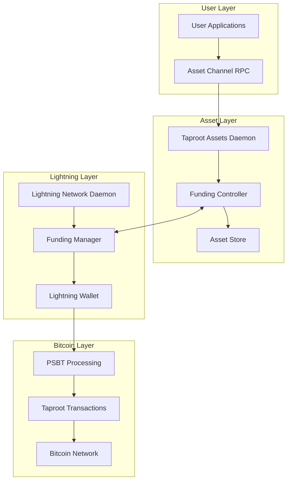
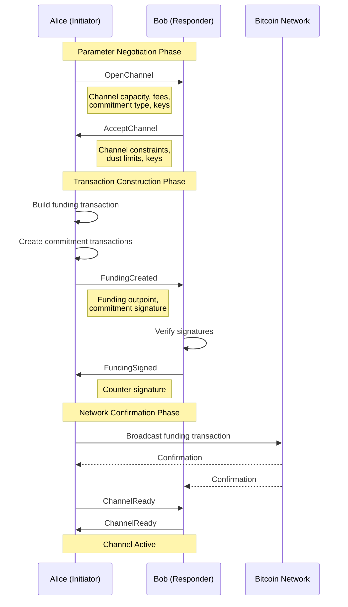
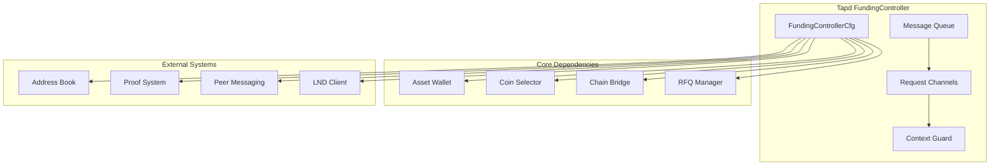
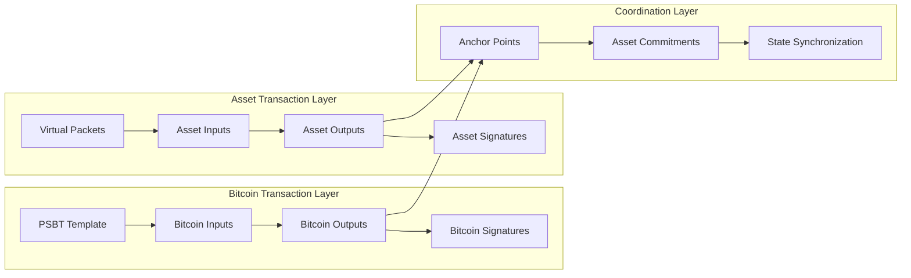
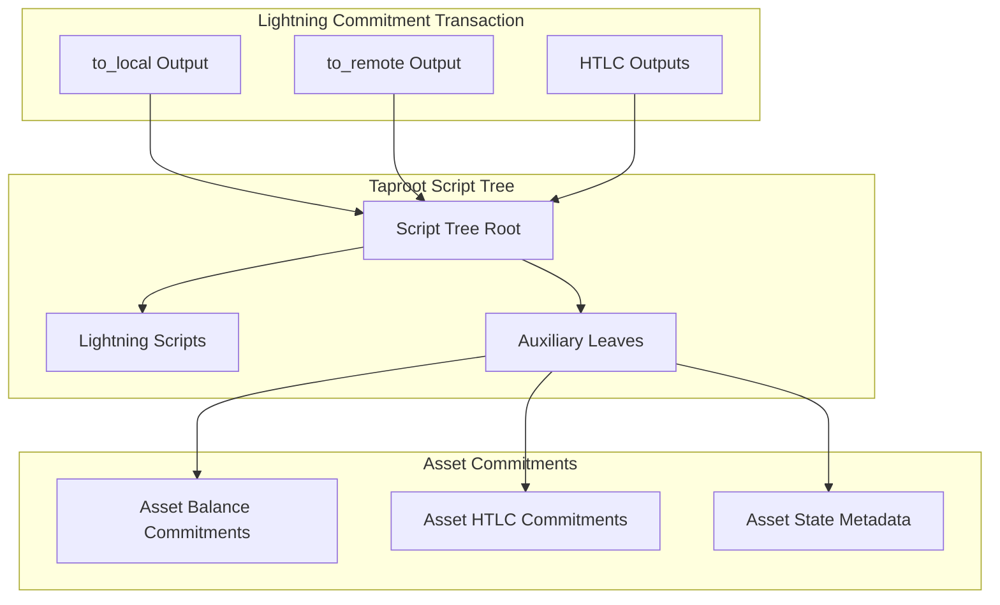
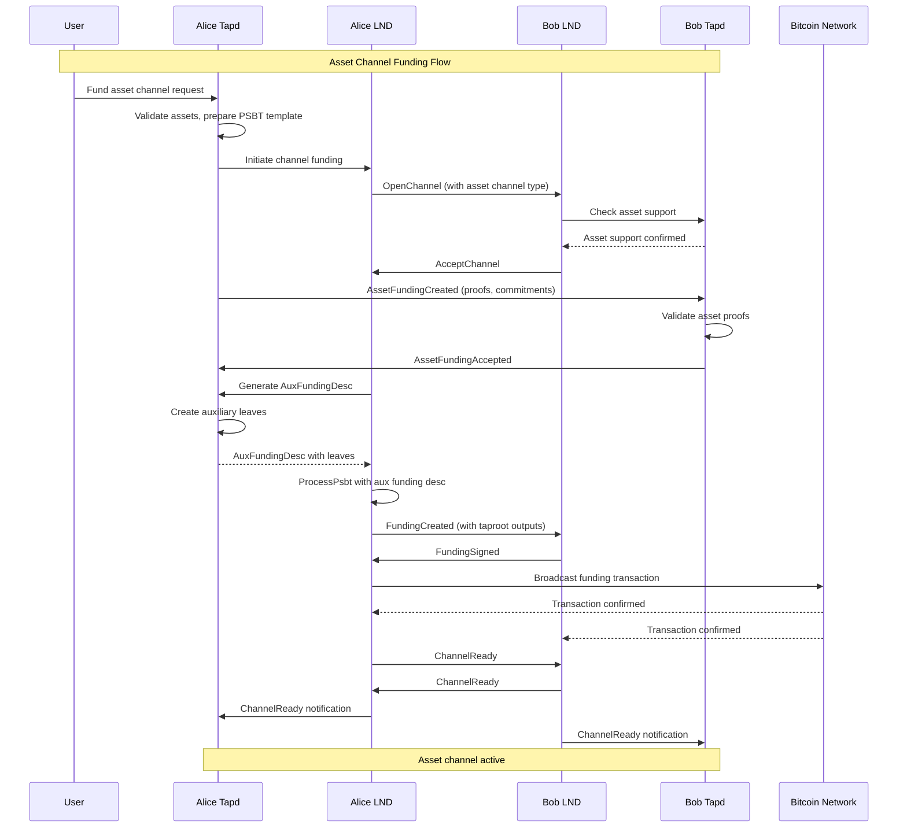
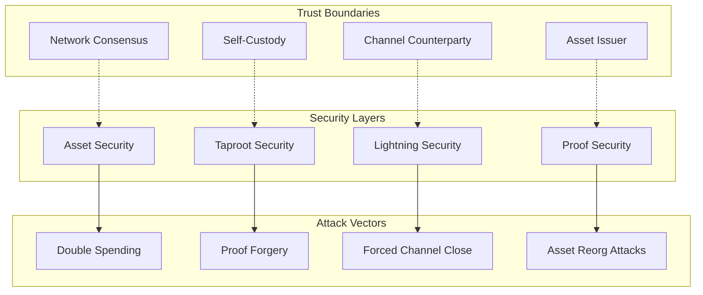

# Taproot Asset Channel Funding Architecture

## Introduction

Taproot asset channels represent a groundbreaking evolution in Lightning Network technology, enabling Lightning channels to carry not just Bitcoin, but any taproot-based asset while maintaining full compatibility with existing Lightning Network protocols. This document provides a comprehensive architectural overview of how asset channel funding works, from the initial funding request through channel establishment and operation.

The system achieves this remarkable capability through a sophisticated extension architecture that builds upon Lightning Network Daemon (LND)'s auxiliary funding controller interface, seamlessly integrating the taproot assets daemon (tapd) with LND's existing funding mechanisms. The result is a system that supports both traditional Bitcoin Lightning channels and complex multi-asset Lightning channels within the same network topology.

## Architectural Foundation

At its core, the taproot asset channel funding system represents an elegant solution to a complex problem: how do you extend Bitcoin's Lightning Network to support arbitrary assets without breaking compatibility with existing nodes and protocols? The answer lies in LND's prescient `AuxFundingController` interface, which provides clean extension points for custom channel types while preserving Lightning Network's security and operational properties.

The architecture follows a layered approach where standard Lightning Network protocols handle the foundational channel establishment, while asset-specific extensions layer on top to handle the additional complexity of multi-asset scenarios. This design ensures that asset channels remain fully compatible with existing Lightning infrastructure while providing powerful new capabilities.



## The AuxFundingController Interface

The `AuxFundingController` interface serves as the primary bridge between LND's standard Bitcoin channel funding and tapd's asset-aware funding capabilities. Defined in LND's funding package, this interface provides a clean contract that allows external systems to extend channel funding behavior without modifying LND's core logic.

The interface is elegantly designed around four key responsibilities: auxiliary funding descriptor generation, tapscript root derivation, and channel lifecycle event handling. Each method serves a specific purpose in the funding flow, allowing tapd to inject asset-specific logic at precisely the right moments in the standard Lightning funding process.

```go
type AuxFundingController interface {
    // Message handling capability
    msgmux.Endpoint
    
    // Generate auxiliary funding descriptors
    DescFromPendingChanID(pid PendingChanID, openChan AuxChanState,
        keyRing lntypes.Dual[CommitmentKeyRing], initiator bool) AuxFundingDescResult
    
    // Provide tapscript roots for MuSig2 sessions
    DeriveTapscriptRoot(PendingChanID) AuxTapscriptResult
    
    // Handle channel lifecycle events
    ChannelReady(openChan AuxChanState) error
    ChannelFinalized(PendingChanID) error
}
```

The interface's embedding of `msgmux.Endpoint` is particularly clever, allowing the funding controller to intercept and handle custom messages during the funding process. This capability enables tapd to implement its own protocol extensions while remaining transparent to LND's core funding logic.

## Standard Lightning Funding Flow

To understand how asset channels extend Lightning Network capabilities, it's essential first to understand the standard Bitcoin channel funding process that serves as the foundation. Lightning channel funding follows a well-choreographed sequence of message exchanges between two Lightning nodes, each step building upon the previous to establish a secure, bi-directional payment channel.

The process begins when one party (the initiator) decides to open a channel with another party (the responder). The initiator sends an `OpenChannel` message containing proposed channel parameters including capacity, fees, and cryptographic commitments. The responder evaluates this proposal and, if acceptable, responds with an `AcceptChannel` message containing their own parameters and constraints.



Once both parties agree on parameters, the initiator constructs the funding transaction and initial commitment transactions. The funding transaction creates the on-chain UTXO that secures the channel, while commitment transactions represent the current state of funds within the channel. These transactions are carefully constructed to ensure that either party can unilaterally close the channel and recover their funds according to the current channel state.

The `FundingCreated` and `FundingSigned` messages exchange the cryptographic signatures necessary to make these transactions valid. Once signatures are exchanged, the funding transaction is broadcast to the Bitcoin network. After sufficient confirmations, both parties send `ChannelReady` messages to indicate the channel is operational.

This standard flow provides the robust foundation upon which asset channel funding builds, maintaining all security properties while extending capabilities to support arbitrary taproot assets.

## Tapd Integration Architecture

The tapd integration represents a masterpiece of software architecture, seamlessly extending LND's capabilities without modifying its core logic. The `FundingController` in tapd implements the `AuxFundingController` interface, providing a sophisticated bridge between the asset world and Lightning Network protocols.

The `FundingController` is designed around a configuration-driven architecture that injects all necessary dependencies through well-defined interfaces. This approach ensures loose coupling between components while providing maximum flexibility for different deployment scenarios. The controller manages multiple concurrent channels for handling different types of requests, enabling efficient parallel processing of funding operations.



The controller's message handling capabilities enable it to process custom asset-specific messages that extend beyond standard Lightning protocol. These messages handle asset ownership proofs, asset commitment negotiations, and proof courier coordination. The system maintains strict separation between Lightning protocol messages (handled by LND) and asset protocol messages (handled by tapd), ensuring clean protocol boundaries.

The asynchronous design of the `FundingController` is particularly noteworthy. Rather than blocking LND's funding process while performing asset operations, the controller uses channel-based communication to handle requests asynchronously. This design ensures that asset processing doesn't introduce delays into the Lightning funding flow, maintaining the network's performance characteristics.

## PSBT and Virtual Packet Architecture

One of the most sophisticated aspects of the asset channel funding system is its dual-layer transaction processing architecture. While Lightning Network traditionally operates on standard Bitcoin transactions, asset channels require coordination between two parallel transaction flows: standard Bitcoin PSBTs (Partially Signed Bitcoin Transactions) and tapd's innovative "virtual packets."

The PSBT layer handles the Bitcoin aspects of channel funding, managing UTXO selection, fee calculation, and signature gathering for the on-chain funding transaction. Meanwhile, the virtual packet layer handles asset-specific operations, tracking asset inputs, outputs, and state transitions. These two layers must remain perfectly synchronized throughout the funding process to ensure transaction validity.



The virtual packet system elegantly parallels Bitcoin's PSBT system while operating on asset state transitions. Each virtual packet represents a complete asset transaction with inputs that consume existing asset commitments and outputs that create new asset commitments. These virtual transactions undergo their own validation, signing, and finalization processes before being "anchored" to corresponding Bitcoin transactions.

The anchoring process represents the critical integration point where asset transactions become commitments within Bitcoin transactions. Asset commitments are embedded in Bitcoin transaction outputs using taproot's script tree functionality, allowing the Bitcoin network to secure asset state transitions without being aware of the asset-specific semantics.

## Auxiliary Leaves and Taproot Integration

The auxiliary leaves system represents perhaps the most innovative aspect of the asset channel architecture. This system enables complex asset commitments to be embedded within Lightning commitment transactions using taproot's script tree capabilities, creating a seamless bridge between asset state and Lightning Network state.

In traditional Lightning channels, commitment transactions contain outputs that represent Bitcoin balances and HTLC (Hash Time Locked Contract) states. Asset channels extend this concept by embedding additional "auxiliary leaves" in the commitment transaction's taproot script tree. These leaves contain cryptographic commitments to asset states, enabling Lightning commitment transactions to simultaneously represent both Bitcoin and asset balances.

The auxiliary leaf system operates through the `FetchLeavesFromView` function, which analyzes the current HTLC view and generates the appropriate asset commitments for inclusion in commitment transactions. This process involves sophisticated allocation algorithms that determine how assets should be distributed across different outputs and commitment states.



The commitment allocation process must handle complex scenarios where assets are split across multiple outputs, merged from multiple inputs, or involved in HTLC operations. The system maintains perfect consistency between Bitcoin-denominated balances (tracked by LND) and asset-denominated balances (tracked by tapd) through sophisticated state synchronization mechanisms.

Custom commitment sorting ensures that transaction outputs maintain the specific ordering required for both Lightning Network protocols and asset validation. This sorting must satisfy Lightning Network's output ordering requirements while also maintaining asset commitment integrity, requiring careful coordination between LND and tapd.

## End-to-End Funding Flow

The complete asset channel funding flow represents a choreographed dance between multiple systems, each playing their part to establish a secure, multi-asset Lightning channel. The process begins when a user requests to open an asset channel and continues through multiple phases of negotiation, validation, and commitment before culminating in an active channel.

During the initiation phase, tapd validates the requested assets, selects appropriate UTXOs, and prepares the foundational PSBT template that will guide the funding process. This preparation includes generating asset ownership proofs, calculating required commitments, and establishing the basic transaction structure that will carry both Bitcoin and asset funds.

The negotiation phase layers asset-specific discussions on top of standard Lightning protocol messages. While LND handles the standard `OpenChannel` and `AcceptChannel` message exchange, tapd simultaneously negotiates asset-specific parameters through custom messages. These negotiations cover asset ownership verification, commitment structures, and proof courier arrangements.



The transaction construction phase represents the most complex part of the process, where asset commitments must be perfectly integrated with Lightning commitment transactions. The `AuxFundingDesc` serves as the coordination mechanism, providing LND with all necessary information to construct transactions that satisfy both Lightning Network requirements and asset commitment needs.

During the commitment phase, both virtual packets (containing asset state transitions) and Bitcoin PSBTs (containing funding transactions) are finalized and signed. The auxiliary leaves generated during this phase embed asset commitments directly into the taproot script trees of Lightning commitment transactions, creating a unified transaction that simultaneously secures both Bitcoin and asset state.

## Security and Trust Model

The security model for asset channel funding builds upon Lightning Network's proven security properties while extending them to cover asset-specific risks and attack vectors. The system maintains Lightning Network's fundamental security guarantee that channel funds remain secure as long as one party can broadcast a commitment transaction, extending this property to asset funds through cryptographic commitments.

Asset ownership is secured through comprehensive proof validation that occurs during the funding process. These proofs demonstrate that the funding party legitimately owns the assets they're contributing to the channel and that the assets haven't been double-spent or compromised. The proof system uses cryptographic techniques that make asset forgery computationally infeasible.

The integration with taproot provides additional security benefits through the script tree structure. Asset commitments embedded in auxiliary leaves inherit taproot's privacy and security properties, ensuring that asset details remain private until revealed and that asset operations maintain the same security level as Bitcoin operations.



The system carefully manages trust boundaries to minimize counterparty risk. While channel counterparties must be trusted not to force-close channels maliciously, they cannot steal or forge assets due to the cryptographic proof requirements. Asset issuers are trusted for asset authenticity, but cannot interfere with channel operations once assets are in circulation.

## Performance and Scalability Considerations

Asset channel funding introduces additional computational and storage overhead compared to standard Lightning channels, but this overhead is carefully managed to maintain Lightning Network's performance characteristics. The most significant impact comes from asset proof validation, which requires cryptographic operations to verify asset ownership and authenticity.

The system employs several optimization strategies to minimize performance impact. Proof validation occurs in parallel with standard Lightning operations wherever possible, preventing asset operations from blocking Lightning Network message processing. Asset state is cached aggressively to avoid repeated computations, and proof data is compressed and chunked for efficient network transmission.

Storage requirements increase due to asset proofs, commitments, and state data, but this increase is manageable for typical use cases. The system uses efficient encoding schemes and prunes unnecessary historical data to minimize storage growth. Database operations are optimized to handle the additional asset state without impacting Lightning Network database performance.

Network overhead is perhaps the most visible performance impact, with asset channels requiring approximately 30-40% additional messages and 2-3x data volume compared to standard Bitcoin channels. However, this overhead is justified by the significantly expanded functionality, and the system includes mechanisms to batch operations and compress data where possible.

## RFQ System Integration

One of the most innovative aspects of asset channel funding is its integration with the Request for Quote (RFQ) system, which enables automated asset liquidity provision. When a channel responder receives an asset channel funding request, the system can automatically generate buy offers for the channel capacity, enabling seamless asset-to-Bitcoin conversions.

This integration transforms asset channel responders into automated market makers, providing liquidity for asset transactions while earning fees. The RFQ system handles price discovery, risk management, and settlement, creating a self-sustaining ecosystem where asset liquidity naturally emerges from the network's structure.

The RFQ integration occurs during the `ChannelReady` phase, where responders can initialize buy offers based on the channel's asset composition. These offers become available immediately upon channel activation, providing instant liquidity for asset transactions. The system carefully manages risk by limiting offer sizes and implementing sophisticated pricing algorithms.

## Protocol Extensions and Message Flow

Asset channel funding extends Lightning Network protocols through carefully designed message extensions that maintain backward compatibility while enabling new functionality. The system introduces several new message types that handle asset-specific negotiations, proof exchanges, and state coordination.

The `AssetFundingCreated` message initiates asset-specific negotiations, containing asset ownership proofs, commitment structures, and proof courier information. This message extends the standard Lightning funding flow without interfering with existing protocol messages. The responder's `AssetFundingAccepted` message completes the asset negotiation, providing acceptance confirmation and any counter-proposals.

Proof delivery messages handle the exchange of detailed asset ownership proofs, which may be too large for single messages. The system implements efficient chunking algorithms that break large proofs into manageable pieces while maintaining cryptographic integrity. These proof exchanges occur in parallel with standard Lightning message flows, minimizing delays.

The message flow carefully coordinates between standard Lightning messages (handled by LND) and asset messages (handled by tapd), ensuring that both systems remain synchronized throughout the funding process. Error handling mechanisms ensure that failures in either system are properly communicated and resolved.

## Future Evolution and Extensions

The asset channel funding architecture provides a robust foundation for future enhancements and extensions. The auxiliary leaves system can support additional asset types, more complex commitment structures, and enhanced privacy features. The modular architecture ensures that new capabilities can be added without disrupting existing functionality.

Potential future extensions include multi-asset HTLCs that involve multiple asset types in single transactions, cross-chain asset integrations that bridge different blockchain networks, and enhanced privacy features that provide additional confidentiality for asset operations. The system's design anticipates these extensions through flexible interfaces and extensible data structures.

The integration with emerging Bitcoin technologies like covenant opcodes and enhanced script capabilities could further expand the system's capabilities, enabling more sophisticated asset operations and improved efficiency. The auxiliary leaves system provides the architectural foundation for incorporating these enhancements as they become available.

## Conclusion

Taproot asset channel funding represents a remarkable achievement in protocol design, seamlessly extending Lightning Network capabilities to support arbitrary taproot assets while maintaining full compatibility with existing infrastructure. The system demonstrates how sophisticated overlay protocols can build upon proven foundations to create entirely new capabilities.

The architecture's success stems from its careful attention to separation of concerns, with each component handling its specific responsibilities while integrating smoothly with other system components. The `AuxFundingController` interface provides the perfect abstraction layer, enabling complex asset operations to integrate with Lightning Network funding without compromising either system's integrity.

The result is a system that preserves Lightning Network's core properties of security, privacy, and performance while enabling revolutionary new capabilities in multi-asset Lightning channels. This achievement opens new possibilities for Lightning Network applications and demonstrates the power of well-designed extension architectures.

For developers working with taproot asset channels, understanding this funding architecture is essential for building applications that leverage the system's full capabilities. The comprehensive integration between LND and tapd provides powerful primitives for asset channel operations while maintaining the simplicity and reliability that makes Lightning Network successful.

The taproot asset channel funding system stands as a testament to the power of careful architectural design, demonstrating how complex new capabilities can be seamlessly integrated with existing systems through thoughtful interface design and implementation. As Lightning Network continues to evolve, this architecture provides a proven model for future protocol extensions and enhancements.

---

## Related Documentation

This document synthesizes findings from several detailed investigation reports:

- **AuxFunding Interface Analysis** (`investigation_reports/auxfunding_interface_analysis.md`): Deep dive into the interface definition and implementation
- **LND Standard Funding Flow** (`investigation_reports/lnd_standard_funding_flow.md`): Comprehensive analysis of baseline Lightning funding
- **Tapd Integration Layer** (`investigation_reports/tapd_integration_layer.md`): Detailed examination of tapd's integration architecture
- **PSBT Processing and Aux Leaves** (`investigation_reports/psbt_processing_and_aux_leaves.md`): Technical analysis of transaction processing
- **Message Flow Trace** (`investigation_reports/message_flow_trace.md`): End-to-end message flow documentation

These reports provide additional technical details and implementation specifics for developers requiring deeper understanding of particular system components.