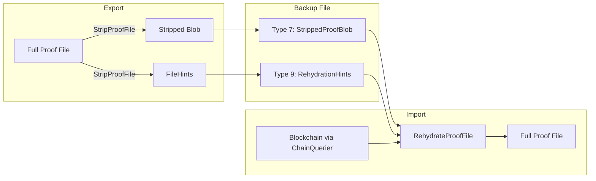
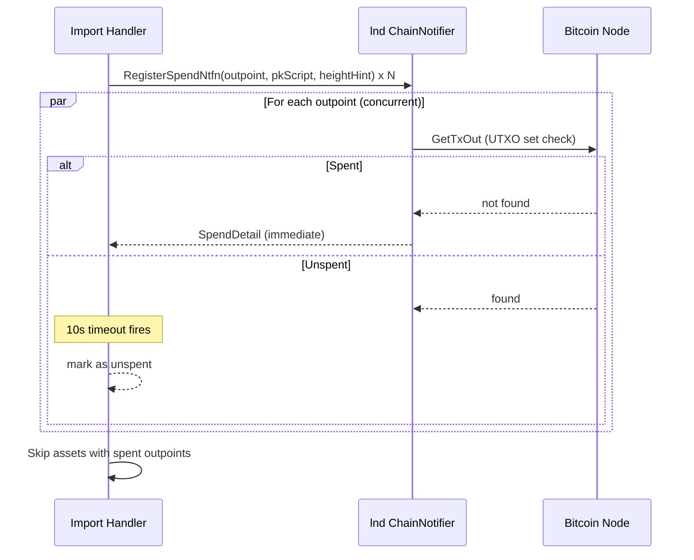
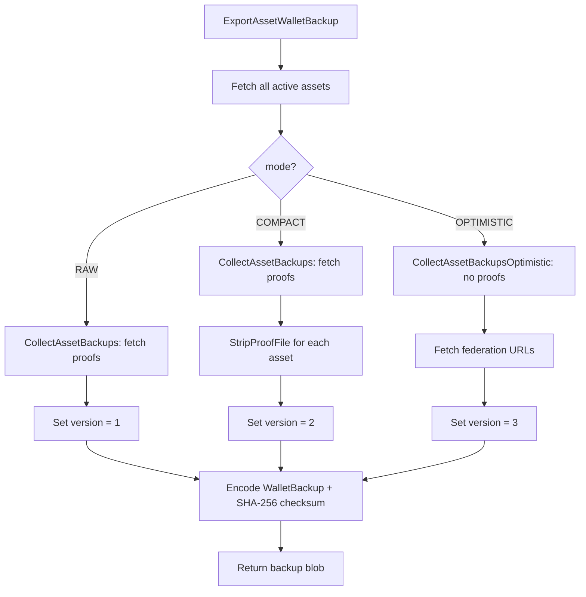
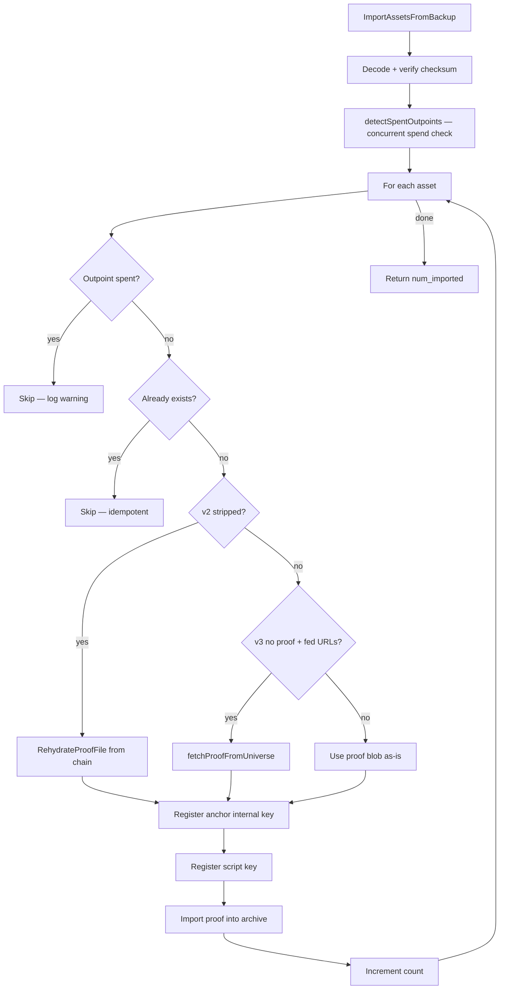

# Taproot Assets Wallet Backup

This document describes the wallet backup system for Taproot Assets (`tapd`),
covering the binary format, the stripping/rehydration mechanism for compact
backups, stale-backup detection, and the RPC interface.

## Overview

A wallet backup captures every active (unspent, non-burned) asset together with
its proof file and key derivation info. On import, the receiving node registers
the keys and ingests the proofs, making the assets spendable.

Three backup versions exist:

| Version | Constant | Description |
|---------|----------|-------------|
| 1 | `BackupVersionOriginal` | Full proof blobs stored as-is |
| 2 | `BackupVersionStripped` | Blockchain-derivable fields stripped; rehydration hints stored instead |
| 3 | `BackupVersionOptimistic` | No proof data; proofs fetched from universe servers on import |

---

## Binary Format

### Top-level layout

```
+-----------------+
| "TAPBAK"        |  Magic bytes (6 bytes, ASCII)
+-----------------+
| version         |  uint32, big-endian (1, 2, or 3)
+-----------------+
| fed_urls        |  Federation URLs (v3 only; see below)
+-----------------+
| num_assets      |  varint (1-9 bytes)
+-----------------+
| asset_0         |  varint length prefix + TLV stream
+-----------------+
| ...             |
+-----------------+
| asset_N         |  varint length prefix + TLV stream
+-----------------+
| checksum        |  SHA-256 over all preceding bytes (32 bytes)
+-----------------+
```

The `fed_urls` block is only present when `version >= 3`:

```
+-----------------+
| num_urls        |  varint
+-----------------+
| url_0_len       |  varint
+-----------------+
| url_0_bytes     |  UTF-8 string
+-----------------+
| ...             |
+-----------------+
| url_N_len       |  varint
+-----------------+
| url_N_bytes     |  UTF-8 string
+-----------------+
```

### Per-asset TLV records

Each asset is a length-prefixed TLV stream. Records **must** appear in
ascending type order. Odd types are safe to skip by decoders that don't
recognize them.

| Type | Name | Required | Description |
|------|------|----------|-------------|
| 0 | Asset | yes | `asset.Asset` encoded blob |
| 1 | AnchorOutpoint | yes | The UTXO where the asset is anchored |
| 2 | AnchorBlockHeight | yes | Confirmation block height (`uint32`) |
| 3 | ScriptKey | no | `ScriptKeyBackup` — tweaked key + derivation info |
| 4 | AnchorInternalKey | no | `KeyDescriptorBackup` — anchor key derivation info |
| 5 | ProofFileBlob | v1 only | Complete proof file (full chain) |
| 6 | AnchorPkScript | no | `pk_script` of the anchor output (for spend detection) |
| 7 | StrippedProofBlob | v2 only | Proof file with blockchain fields removed |
| 9 | RehydrationHints | v2 only | Serialized `FileHints` needed to reconstruct stripped fields |

Types 7 and 9 are odd, so a v1-only decoder will safely skip them.

**v1 record order:** 0, 1, 2, [3], [4], 5, [6]

**v2 record order:** 0, 1, 2, [3], [4], [6], 7, 9

**v3 record order:** 0, 1, 2, [3], [4], [6] (no proof data — types 5, 7, 9 absent)

### ScriptKeyBackup TLV

| Type | Name | Description |
|------|------|-------------|
| 0 | PubKey | Final tweaked script key (33 bytes, compressed) |
| 1 | Family | Key family (`uint32`) |
| 2 | Index | Key index (`uint32`) |
| 3 | RawPubKey | Pre-tweak internal public key (33 bytes) |
| 4 | Tweak | Tweak bytes; absent means BIP-86 |

### KeyDescriptorBackup TLV

| Type | Name | Description |
|------|------|-------------|
| 0 | PubKey | Public key (33 bytes, compressed) |
| 1 | Family | Key family (`uint32`) |
| 2 | Index | Key index (`uint32`) |

### Decode safety limits

| Constant | Value | Purpose |
|----------|-------|---------|
| `maxBackupAssets` | 1,000,000 | Max asset count before OOM rejection |
| `maxTLVSize` | 100 MB | Max single-asset TLV payload size |
| `maxFederationURLs` | 100 | Max federation URL count (v3) |
| `maxFederationURLLen` | 2,048 | Max single federation URL length (v3) |

---

## Compact Backups (v2): Strip and Rehydrate

### Motivation

A full proof file stores the block header, anchor transaction, tx merkle
proof, and block height for every proof transition. These fields are
deterministically derivable from the blockchain and therefore redundant in a
backup — stripping them significantly reduces size.

### Stripped fields

| Proof TLV Type | Field | Typical Size |
|----------------|-------|-------------|
| 4 | BlockHeader | 80 bytes |
| 6 | AnchorTx | ~250-500 bytes |
| 8 | TxMerkleProof | ~200-300 bytes |
| 22 | BlockHeight | 4 bytes |

Everything else (asset leaf, inclusion/exclusion proofs, split root proof,
meta reveal, additional inputs, etc.) is kept.

### Rehydration hints

For each proof transition in the file, a `ProofHint` is stored:

```
ProofHint = [32 bytes AnchorTxHash] [4 bytes BlockHeight BE]
```

The full `FileHints` blob is:

```
[varint num_hints] [hint_0] [hint_1] ... [hint_N]
```

At 36 bytes per hint, this is far smaller than the fields it replaces.

### Strip / Rehydrate flow



**`StripProofFile(proofBlob) -> (strippedBlob, FileHints, error)`**

1. Decode the proof file.
2. For each proof transition, record `{AnchorTxHash, BlockHeight}` as a hint.
3. Re-encode each proof omitting types 4, 6, 8, 22.
4. Return stripped blob + hints.

**`RehydrateProofFile(ctx, strippedBlob, hints, chain) -> (fullBlob, error)`**

1. Decode the stripped proof file.
2. Verify `len(hints) == numProofs`.
3. For each proof transition `i`:
   - Fetch block via `chain.GetBlockByHeight(hint.BlockHeight)`.
   - Set `BlockHeader = block.Header`.
   - Set `BlockHeight = hint.BlockHeight`.
   - Find anchor tx in block by `hint.AnchorTxHash`.
   - Set `AnchorTx` and reconstruct `TxMerkleProof`.
4. Encode the rehydrated file and return.

The `ChainQuerier` interface is:

```go
type ChainQuerier interface {
    GetBlockByHeight(ctx context.Context, blockHeight int64) (*wire.MsgBlock, error)
}
```

Satisfied by `tapgarden.ChainBridge` in production.

---

## Optimistic Backups (v3): Universe Fetch

### Motivation

Compact backups still embed proof data (stripped proofs + rehydration hints),
which dominates backup size. Optimistic backups eliminate proof data entirely,
storing only asset metadata, key derivation info, and a list of federation
server URLs. On import, the full proof chain is fetched from a universe server
via `QueryProof`.

This trades self-containment for an order-of-magnitude size reduction
(~300 bytes/asset vs ~2-10 KB/asset for compact backups).

### Export flow

1. `CollectAssetBackupsOptimistic` gathers asset metadata and key info
   **without** fetching proofs from the local archive.
2. Federation server URLs are fetched via `FederationDB.UniverseServers()`.
   At least one server must be configured; otherwise the export fails.
3. The backup is encoded as version 3 with federation URLs in the header.

### Import flow

For each asset in the backup:

1. Check if the anchor outpoint has been spent (stale detection).
2. Check if the asset already exists locally (idempotent import).
3. Since no proof data is present, `fetchProofFromUniverse` is called:
   - Tries each federation URL in order.
   - Creates a `proof.UniverseRpcCourier` for the URL.
   - Calls `ReceiveProof` which internally uses `FetchProofProvenance`
     to walk the proof chain backwards from tip to genesis via `QueryProof`.
   - Returns the assembled full proof file blob.
4. The fetched proof is imported normally (key registration + proof archive).

### Requirements

- At least one universe server must be configured on the **exporting** node.
- At least one of the embedded universe servers must be reachable and have
  the asset's proofs during **import**.
- If no universe server can provide the proof, the import fails for that asset.

---

## Stale Backup Detection

When importing, the node checks on-chain whether each asset's anchor outpoint
has already been spent. A spent outpoint means the asset has moved (transferred
or re-anchored), making the backup entry stale.



- All outpoints are checked concurrently via goroutines.
- Each goroutine has a per-asset `10s` timeout (`spendCheckTimeout`).
- Spent outpoints resolve near-instantly (lnd checks the UTXO set
  synchronously); only unspent outpoints wait for the timeout.
- Note: `RegisterSpendNtfn` calls and goroutine launches are interleaved
  in a sequential loop, so each goroutine's per-asset timeout starts
  immediately after its registration. For very large wallets (tens of
  thousands of assets) the dispatch loop itself adds latency, and early
  goroutines' timeouts may expire before later registrations complete.

---

## RPC Interface

### `ExportAssetWalletBackup`

Exports all active wallet assets as a backup blob.

```protobuf
rpc ExportAssetWalletBackup(ExportAssetWalletBackupRequest)
    returns (ExportAssetWalletBackupResponse);

enum BackupMode {
    RAW        = 0;  // v1 full backup
    COMPACT    = 1;  // v2 stripped backup
    OPTIMISTIC = 2;  // v3 no proofs, universe fetch on import
}

message ExportAssetWalletBackupRequest {
    BackupMode mode = 1;
}

message ExportAssetWalletBackupResponse {
    bytes backup = 1;  // The binary backup blob
}
```

### `ImportAssetsFromBackup`

Imports assets from a previously exported backup blob.

```protobuf
rpc ImportAssetsFromBackup(ImportAssetsFromBackupRequest)
    returns (ImportAssetsFromBackupResponse);

message ImportAssetsFromBackupRequest {
    bytes backup = 1;  // Backup blob from ExportAssetWalletBackup
}

message ImportAssetsFromBackupResponse {
    uint32 num_imported = 1;  // Number of newly imported assets
}
```

### Export flow



### Import flow



