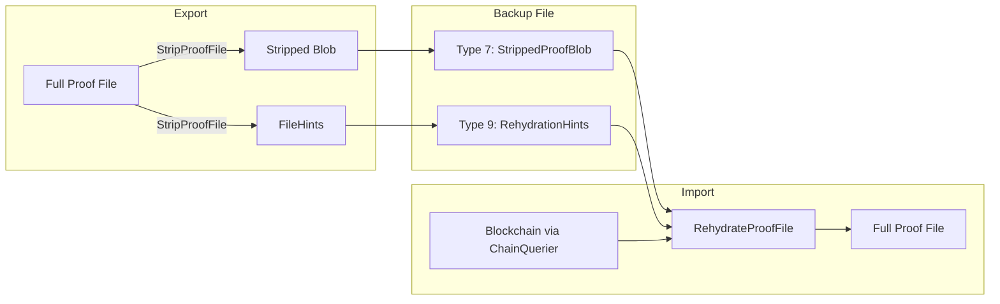
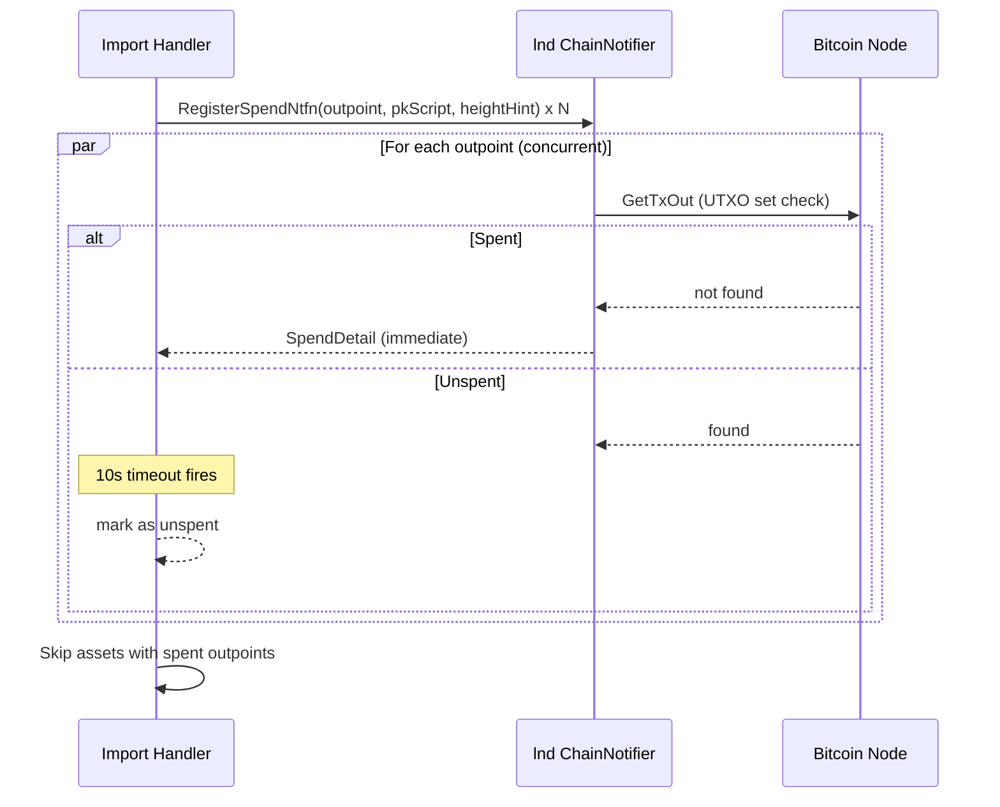
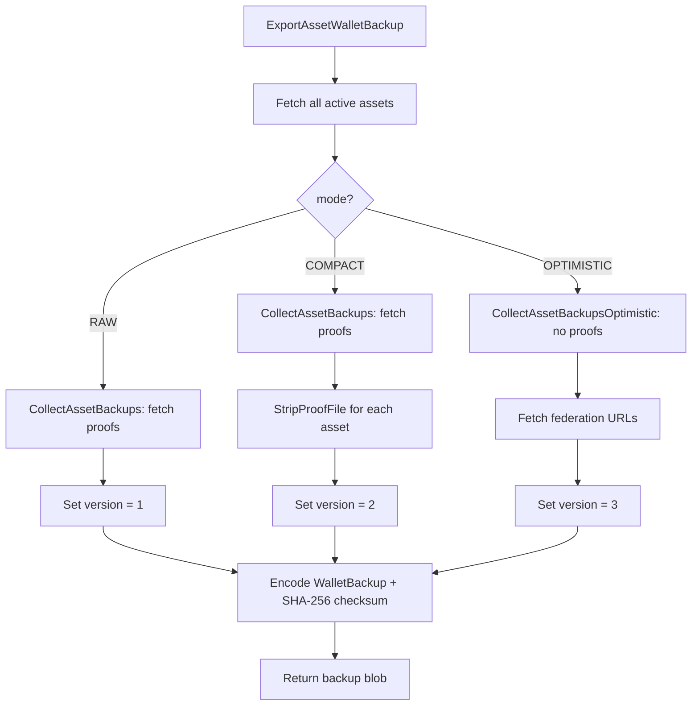
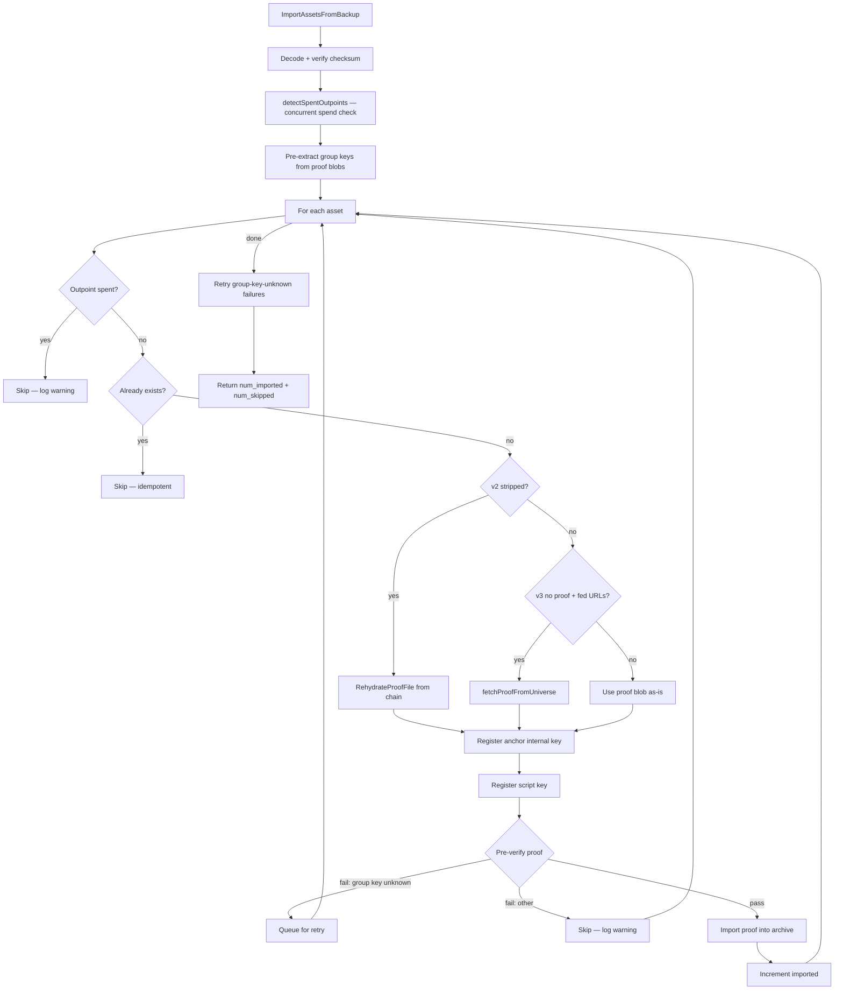

# Taproot Assets Wallet Backup

This document describes the wallet backup system for Taproot Assets (`tapd`),
covering the binary format, the stripping/rehydration mechanism for compact
backups, stale-backup detection, the RPC interface and the encrypted backup
file that `tapd` keeps up to date on disk.

## Overview

A wallet backup captures every active (unspent, non-burned) asset together with
its proof file and key derivation info. On import, the receiving node registers
the keys and ingests the proofs, making the assets spendable.

Three backup versions exist:

| Version | Constant | Description |
|---------|----------|-------------|
| 1 | `BackupVersionOriginal` | Full proof blobs stored as-is |
| 2 | `BackupVersionStripped` | Blockchain-derivable fields stripped; rehydration hints stored instead |
| 3 | `BackupVersionOptimistic` | No proof data; proofs fetched from universe servers on import |

---

## Binary Format

### Top-level layout

```
+-----------------+
| "TAPBAK"        |  Magic bytes (6 bytes, ASCII)
+-----------------+
| version         |  uint32, big-endian (1, 2, or 3)
+-----------------+
| fed_urls        |  Federation URLs (v3 only; see below)
+-----------------+
| num_assets      |  varint (1-9 bytes)
+-----------------+
| asset_0         |  varint length prefix + TLV stream
+-----------------+
| ...             |
+-----------------+
| asset_N         |  varint length prefix + TLV stream
+-----------------+
| checksum        |  SHA-256 over all preceding bytes (32 bytes)
+-----------------+
```

The `fed_urls` block is only present when `version >= 3`:

```
+-----------------+
| num_urls        |  varint
+-----------------+
| url_0_len       |  varint
+-----------------+
| url_0_bytes     |  UTF-8 string
+-----------------+
| ...             |
+-----------------+
| url_N_len       |  varint
+-----------------+
| url_N_bytes     |  UTF-8 string
+-----------------+
```

### Per-asset TLV records

Each asset is a length-prefixed TLV stream. Records **must** appear in
ascending type order. Odd types are safe to skip by decoders that don't
recognize them.

| Type | Name | Required | Description |
|------|------|----------|-------------|
| 0 | Asset | yes | `asset.Asset` encoded blob |
| 1 | AnchorOutpoint | yes | The UTXO where the asset is anchored |
| 2 | AnchorBlockHeight | yes | Confirmation block height (`uint32`) |
| 3 | ScriptKey | no | `ScriptKeyBackup` — tweaked key + derivation info |
| 4 | AnchorInternalKey | no | `KeyDescriptorBackup` — anchor key derivation info |
| 5 | ProofFileBlob | v1 only | Complete proof file (full chain) |
| 6 | AnchorPkScript | no | `pk_script` of the anchor output (for spend detection) |
| 7 | StrippedProofBlob | v2 only | Proof file with blockchain fields removed |
| 9 | RehydrationHints | v2 only | Serialized `FileHints` needed to reconstruct stripped fields |
| 11 | GroupKey | no | `GroupKeyBackup` — the asset group of a grouped leaf, see below |

Types 7, 9 and 11 are odd, so a decoder that does not know them will safely
skip them.

**v1 record order:** 0, 1, 2, [3], [4], 5, [6], [11]

**v2 record order:** 0, 1, 2, [3], [4], [6], 7, 9, [11]

**v3 record order:** 0, 1, 2, [3], [4], [6], [11] (no proof data — types 5, 7,
9 absent)

### ScriptKeyBackup TLV

| Type | Name | Description |
|------|------|-------------|
| 0 | PubKey | Final tweaked script key (33 bytes, compressed) |
| 1 | Family | Key family (`uint32`) |
| 2 | Index | Key index (`uint32`) |
| 3 | RawPubKey | Pre-tweak internal public key (33 bytes) |
| 4 | Tweak | Tweak bytes; absent means BIP-86 |
| 5 | Type | Script key type (`uint8`) as known by the exporting wallet; optional. Without it the importer classifies the key from its material (BIP-86 and unique Pedersen keys by re-derivation, other tweaked keys as external script path) |

### KeyDescriptorBackup TLV

| Type | Name | Description |
|------|------|-------------|
| 0 | PubKey | Public key (33 bytes, compressed) |
| 1 | Family | Key family (`uint32`) |
| 2 | Index | Key index (`uint32`) |

### GroupKeyBackup TLV

Present on entries whose asset carries a group key, if the exporting wallet
knows the group well enough to describe it. It records the group anchor's
genesis and the parameters the tweaked group key is derived from, so the
importer can verify the group key without the anchor's proof.

| Type | Name | Description |
|------|------|-------------|
| 0 | AnchorGenesis | `asset.Genesis` of the asset that created the group |
| 1 | Version | Group key version (`uint8`), 0 or 1 |
| 2 | RawKey | Untweaked internal key of the group (33 bytes, compressed) |
| 3 | TapscriptRoot | Tapscript root committed to by the group key; absent if empty |
| 4 | Witness | Group witness of the anchor's genesis (`wire.TxWitness`) |
| 5 | CustomTapscriptRoot | Custom subtree root of a V1 group (32 bytes); optional |

The importer rebuilds the group key reveal from these fields, derives the
tweaked key with the anchor's asset ID and only accepts the record if the
result equals the group key of the entry's asset.

### Decode safety limits

| Constant | Value | Purpose |
|----------|-------|---------|
| `maxBackupAssets` | 1,000,000 | Max asset count before OOM rejection |
| `maxTLVSize` | 100 MB | Max single-asset TLV payload size |
| `maxFederationURLs` | 100 | Max federation URL count (v3) |
| `maxFederationURLLen` | 2,048 | Max single federation URL length (v3) |

---

## Compact Backups (v2): Strip and Rehydrate

### Motivation

A full proof file stores the block header, anchor transaction, tx merkle
proof, and block height for every proof transition. These fields are
deterministically derivable from the blockchain and therefore redundant in a
backup — stripping them significantly reduces size.

### Stripped fields

| Proof TLV Type | Field | Typical Size |
|----------------|-------|-------------|
| 4 | BlockHeader | 80 bytes |
| 6 | AnchorTx | ~250-500 bytes |
| 8 | TxMerkleProof | ~200-300 bytes |
| 22 | BlockHeight | 4 bytes |

Everything else (asset leaf, inclusion/exclusion proofs, split root proof,
meta reveal, additional inputs, etc.) is kept.

### Rehydration hints

For each proof transition in the file, a `ProofHint` is stored:

```
ProofHint = [32 bytes AnchorTxHash] [4 bytes BlockHeight BE]
```

The full `FileHints` blob is:

```
[varint num_hints] [hint_0] [hint_1] ... [hint_N]
```

At 36 bytes per hint, this is far smaller than the fields it replaces.

### Strip / Rehydrate flow


```mermaid
flowchart LR
    subgraph Export
        A[Full Proof File] -->|StripProofFile| B[Stripped Blob]
        A -->|StripProofFile| C[FileHints]
    end

    subgraph Backup File
        B --> D[Type 7: StrippedProofBlob]
        C --> E[Type 9: RehydrationHints]
    end

    subgraph Import
        D --> F[RehydrateProofFile]
        E --> F
        G[Blockchain via ChainQuerier] --> F
        F --> H[Full Proof File]
    end
```

**`StripProofFile(proofBlob) -> (strippedBlob, FileHints, error)`**

1. Decode the proof file.
2. For each proof transition, record `{AnchorTxHash, BlockHeight}` as a hint.
3. Re-encode each proof omitting types 4, 6, 8, 22.
4. Return stripped blob + hints.

**`RehydrateProofFile(ctx, strippedBlob, hints, chain) -> (fullBlob, error)`**

1. Decode the stripped proof file.
2. Verify `len(hints) == numProofs`.
3. For each proof transition `i`:
   - Fetch block via `chain.GetBlockByHeight(hint.BlockHeight)`.
   - Set `BlockHeader = block.Header`.
   - Set `BlockHeight = hint.BlockHeight`.
   - Find anchor tx in block by `hint.AnchorTxHash`.
   - Set `AnchorTx` and reconstruct `TxMerkleProof`.
4. Encode the rehydrated file and return.

The `ChainQuerier` interface is:

```go
type ChainQuerier interface {
    GetBlockByHeight(ctx context.Context, blockHeight int64) (*wire.MsgBlock, error)
}
```

Satisfied by `tapgarden.ChainBridge` in production.

---

## Optimistic Backups (v3): Universe Fetch

### Motivation

Compact backups still embed proof data (stripped proofs + rehydration hints),
which dominates backup size. Optimistic backups eliminate proof data entirely,
storing only asset metadata, key derivation info, and a list of federation
server URLs. On import, the full proof chain is fetched from a universe server
via `QueryProof`.

This trades self-containment for an order-of-magnitude size reduction
(~300 bytes/asset vs ~2-10 KB/asset for compact backups).

### Export flow

1. `CollectAssetBackupsOptimistic` gathers asset metadata and key info
   **without** fetching proofs from the local archive.
2. Federation server URLs are fetched via `FederationDB.UniverseServers()`.
   At least one server must be configured; otherwise the export fails.
3. The backup is encoded as version 3 with federation URLs in the header.

### Import flow

For each asset in the backup:

1. Check if the anchor outpoint has been spent (stale detection).
2. Check if the asset already exists locally (idempotent import).
3. Since no proof data is present, `fetchProofFromUniverse` is called:
   - Tries each federation URL in order.
   - Creates a `proof.UniverseRpcCourier` for the URL.
   - Calls `ReceiveProof` which internally uses `FetchProofProvenance`
     to walk the proof chain backwards from tip to genesis via `QueryProof`.
   - Returns the assembled full proof file blob.
4. The fetched proof is imported normally (key registration + proof archive).

### Requirements

- At least one universe server must be configured on the **exporting** node.
- At least one of the embedded universe servers must be reachable and have
  the asset's proofs during **import**.
- If no universe server can provide the proof, the import fails for that asset.

---

## Stale Backup Detection

When importing, the node checks on-chain whether each asset's anchor outpoint
has already been spent. A spent outpoint means the asset has moved (transferred
or re-anchored), making the backup entry stale.


```mermaid
sequenceDiagram
    participant Import as Import Handler
    participant LND as lnd ChainNotifier
    participant Chain as Bitcoin Node

    Import->>LND: RegisterSpendNtfn(outpoint, pkScript, heightHint) x N

    par For each outpoint (concurrent)
        LND->>Chain: GetTxOut (UTXO set check)

        alt Spent
            Chain-->>LND: not found
            LND-->>Import: SpendDetail (immediate)
        else Unspent
            Chain-->>LND: found
            Note over Import: 10s timeout fires
            Import-->>Import: mark as unspent
        end
    end

    Import->>Import: Skip assets with spent outpoints
```

- All outpoints are checked concurrently via goroutines.
- Each goroutine has a per-asset `10s` timeout (`spendCheckTimeout`).
- Spent outpoints resolve near-instantly (lnd checks the UTXO set
  synchronously); only unspent outpoints wait for the timeout.
- Note: `RegisterSpendNtfn` calls and goroutine launches are interleaved
  in a sequential loop, so each goroutine's per-asset timeout starts
  immediately after its registration. For very large wallets (tens of
  thousands of assets) the dispatch loop itself adds latency, and early
  goroutines' timeouts may expire before later registrations complete.

---

## Backup File

In addition to the on-demand export RPC, `tapd` keeps an encrypted compact (v2)
backup of the wallet on disk and updates it whenever the wallet state changes.
The operator guide for the file is [backup-file.md](backup-file.md), this
section covers the mechanics.
This mirrors lnd's `channel.backup` file: the goal is that a copy of the file
plus the lnd seed is enough to recover every asset the wallet held at the time
the copy was taken.

### Location and configuration

| Setting | Default | Description |
|---------|---------|-------------|
| `backup.filepath` | `<datadir>/<network>/assets.backup` | Location of the backup file |
| `backup.disable` | `false` | Turn the on-disk backup file off |

The export and import RPCs work regardless of these settings.

### Encryption

The file is encrypted with XChaCha20-Poly1305. The key is derived from the
lnd wallet the same way lnd derives the key for `channel.backup`: the public
key at key family `KeyFamilyBaseEncryption` (8), index 0 is hashed with
SHA-256. Any `tapd` connected to an lnd with the same seed can decrypt the
file. Nothing else can, so the file may be copied to untrusted storage.

The encrypted container is:

```
"TAPENC" (6 bytes) | version (uint32 BE, currently 1) | nonce (24 bytes) | ciphertext
```

The plaintext inside is a regular v2 backup as produced by
`ExportAssetWalletBackup` in `COMPACT` mode, including its checksum.

`ImportAssetsFromBackup` accepts both plaintext exports and encrypted files.
The container header decides which path is taken, so `tapcli assets backup
import --backup_file=assets.backup` works unchanged.

### Update mechanism

The updater holds the current set of backup entries in memory, keyed by
`(asset ID, script key, anchor outpoint)`, and subscribes to three event
sources: the proof import notifications of the asset store (asset received,
transfer confirmed with local outputs, sweep, re-org re-import), the minting
batch state events of the planter (mint confirmed) and the send state events
of the chain porter (a full value send without change or tombstone output
imports no local proof). Notifications only mark the state as changed, the
actual content is always read from the database.

On each notification, after a short debounce (1s) so a single confirmation with
many outputs causes one rewrite:

1. The confirmed, unspent asset set is fetched from the database. Leased
   leaves are included since they are still owned until their spend confirms.
   Unconfirmed leaves are skipped and enter the file once they confirm.
   Leaves that fund asset channels are excluded, they belong to lnd's channel
   state and `channel.backup` and cannot be used by a tapd restored on its
   own.
2. Leaves that disappeared from the set were spent and are dropped. Leaves
   that appeared, or whose anchor block changed, get a fresh compact entry
   built from their proof. An anchor key the wallet does not own, such as
   the aggregated key of a channel funding output, is recorded without a
   locator. Any other failure while building an entry leaves the leaf out
   and it is retried, so a transient database error never produces an entry
   with a wrong derivation path.
3. The existing file is read and decrypted. Entries known to the database
   replace their disk copy and spent leaves are removed. Entries found only
   on disk are checked against the database: a leaf the database knows as
   spent, which happens when the spend confirmed while tapd was down, is
   dropped. A leaf the database does not know at all is retained, it may
   come from a file the operator placed at the path.
4. The result is encoded, encrypted, written to a temporary sibling file,
   synced, and renamed over the main file so a crash can never leave a half
   written backup.

The same reconcile runs right after startup (so the file reflects the
database after a restart or a manual import) and once more on shutdown.
Startup itself only derives the key and checks that an existing file can be
read. Failures to build an entry, for example because a proof is temporarily
unavailable, are retried every 30 seconds, and a change arriving during that
wait is handled after the normal debounce. An existing file that cannot be
decrypted with the wallet key is a startup error, since it most likely
belongs to a different seed and overwriting it could destroy the only copy.
A plaintext export placed at the path is adopted and re-written encrypted,
except an optimistic (v3) export, which carries no proof data and is refused.

### Cost

Every reconcile fetches the full unspent asset set with witnesses from the
database, the same query the export RPC runs, and rewrites the whole file:
read, decrypt, decode, encode, encrypt, write. Proof fetching and stripping
only happens for leaves that are new or re-anchored. The in-memory entry set
holds one compact entry per leaf, 2 to 10 KB each, for the lifetime of the
process. The file grows with the length of the provenance chains, since each
entry carries a stripped proof chain. The debounce of one second keeps a
confirmation with many outputs to a single rewrite.

### Restore

Point a fresh `tapd`, connected to an lnd restored from the same seed, at the
file:

```
tapcli assets backup import --backup_file=/path/to/assets.backup
```

Import is idempotent and skips leaves whose anchor outpoint has been spent, so
a copy of the file that is somewhat out of date is safe to import.

---

## RPC Interface

### `ExportAssetWalletBackup`

Exports all active wallet assets as a backup blob.

```protobuf
rpc ExportAssetWalletBackup(ExportAssetWalletBackupRequest)
    returns (ExportAssetWalletBackupResponse);

enum BackupMode {
    RAW        = 0;  // v1 full backup
    COMPACT    = 1;  // v2 stripped backup
    OPTIMISTIC = 2;  // v3 no proofs, universe fetch on import
}

message ExportAssetWalletBackupRequest {
    BackupMode mode = 1;
}

message ExportAssetWalletBackupResponse {
    bytes backup = 1;  // The binary backup blob
}
```

### `ImportAssetsFromBackup`

Imports assets from a previously exported backup blob.

```protobuf
rpc ImportAssetsFromBackup(ImportAssetsFromBackupRequest)
    returns (ImportAssetsFromBackupResponse);

message ImportAssetsFromBackupRequest {
    bytes backup = 1;  // Backup blob from ExportAssetWalletBackup
}

message ImportAssetsFromBackupResponse {
    uint32 num_imported = 1;  // Number of newly imported assets
    uint32 num_skipped = 2;   // Number skipped due to errors
}
```

#### Group key handling

Assets with group keys require the importing node to know the
group key. Before any proof is verified, the import learns groups
from two sources:

- **The `GroupKeyBackup` record of each grouped entry.** The
  record is verified by re-deriving the tweaked group key from the
  recorded raw key and anchor genesis. Accepted groups are inserted
  into the wallet database with the anchor genesis and witness, the
  same rows a universe sync of the group creates, so the restored
  wallet knows the group from then on and its own backup describes
  the group again.

- **The genesis proof of a group anchor in the backup.** Its
  `GroupKeyReveal` is extracted as before. This is the only source
  for entries written by wallets that predate the group record.

A group key reveal exists only on the genesis proof of the asset
that created the group. Every tranche minted into the group later
carries the group key without a reveal, so a wallet holding only
such reissued leaves depends on the group record. Groups that
neither source describes are logged once at warn level, and their
entries are skipped unless the importing node already knows the
group, typically from universe federation sync.

The exporting wallet can only record a group whose raw key it
knows, which is the case once the group anchor's proof has been
seen (own mint or universe sync). A group learned through a
reissuance proof alone is stored with the tweaked key in place of
the raw key. Such a row is completed in place when the anchor's
reveal is stored later, and the backup updater completes entries
that were written without a group record as soon as the wallet can
describe the group.

#### Error handling

Per-asset verification and data-preparation errors are
non-fatal: the failing asset is skipped (with a server-side
log warning) and import continues with the remaining assets.
DB and infrastructure errors remain fatal and abort the import
immediately.

### Export flow


```mermaid
flowchart TD
    A[ExportAssetWalletBackup] --> B[Fetch all active assets]
    B --> C{mode?}
    C -->|RAW| D1[CollectAssetBackups: fetch proofs]
    D1 --> E1[Set version = 1]
    C -->|COMPACT| D2[CollectAssetBackups: fetch proofs]
    D2 --> E2[StripProofFile for each asset]
    E2 --> E2b[Set version = 2]
    C -->|OPTIMISTIC| D3[CollectAssetBackupsOptimistic: no proofs]
    D3 --> E3[Fetch federation URLs]
    E3 --> E3b[Set version = 3]
    E1 --> F[Encode WalletBackup + SHA-256 checksum]
    E2b --> F
    E3b --> F
    F --> G[Return backup blob]
```

### Import flow


```mermaid
flowchart TD
    A[ImportAssetsFromBackup] --> B[Decode + verify checksum]
    B --> C[detectSpentOutpoints — concurrent spend check]
    C --> X[Pre-extract group keys from proof blobs]
    X --> D[For each asset]
    D --> E{Outpoint spent?}
    E -->|yes| F[Skip — log warning]
    E -->|no| G{Already exists?}
    G -->|yes| H[Skip — idempotent]
    G -->|no| I{v2 stripped?}
    I -->|yes| J[RehydrateProofFile from chain]
    I -->|no| I2{v3 no proof + fed URLs?}
    I2 -->|yes| J2[fetchProofFromUniverse]
    I2 -->|no| K[Use proof blob as-is]
    J --> L[Register anchor internal key]
    J2 --> L
    K --> L
    L --> M[Register script key]
    M --> PV{Pre-verify proof}
    PV -->|fail: group key unknown| RQ[Queue for retry]
    PV -->|fail: other| S[Skip — log warning]
    PV -->|pass| N[Import proof into archive]
    RQ --> D
    S --> D
    N --> O[Increment imported]
    O --> D
    D -->|done| R[Retry group-key-unknown failures]
    R --> P[Return num_imported + num_skipped]
```

