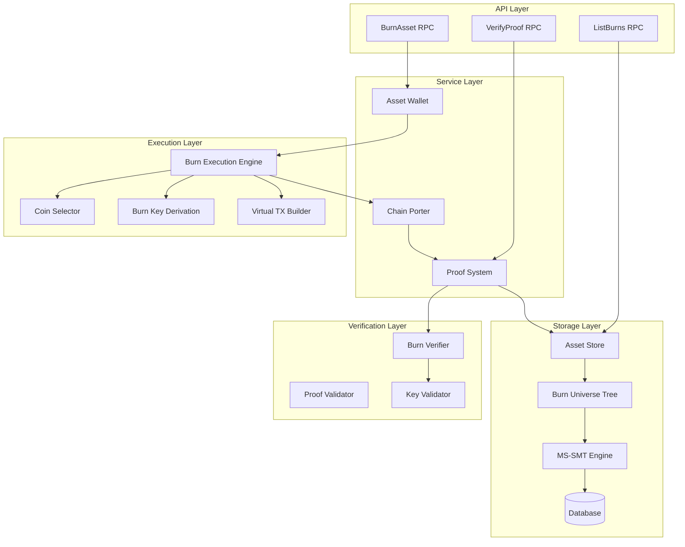
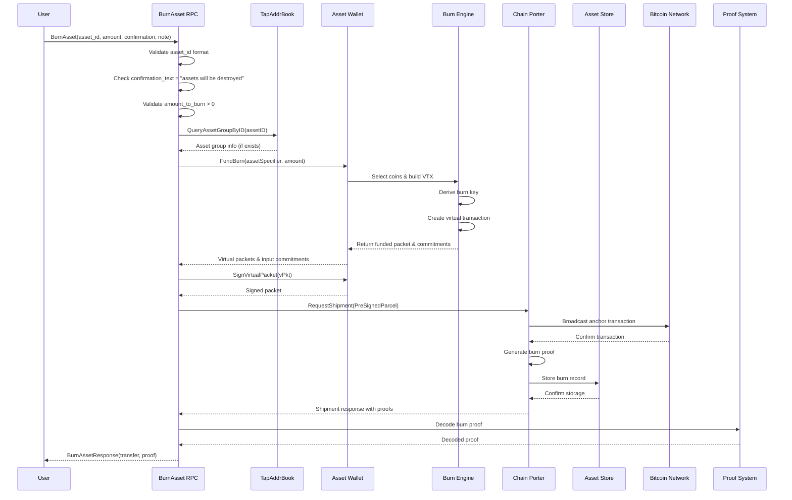
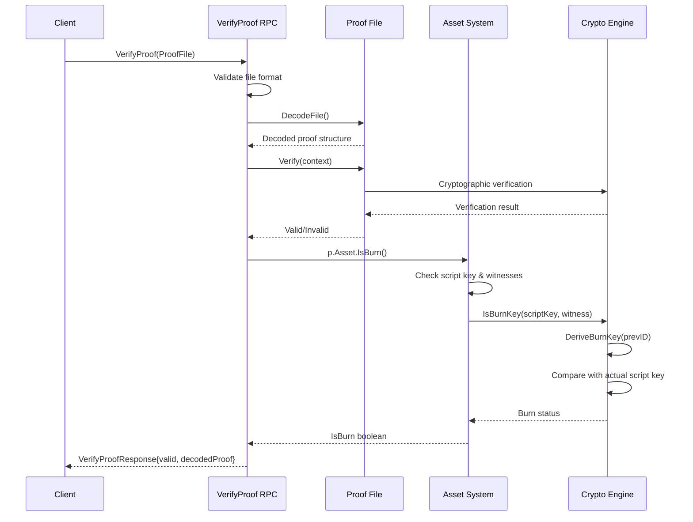
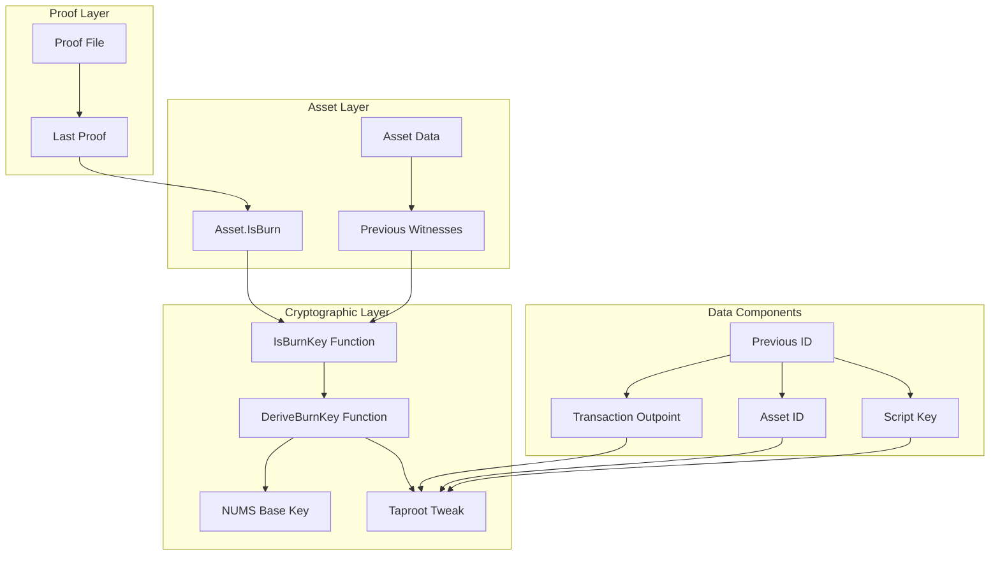
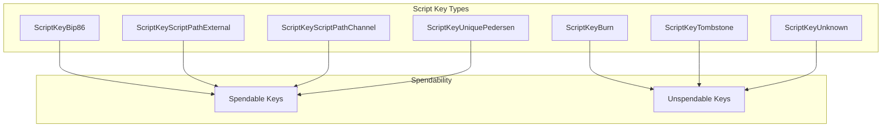
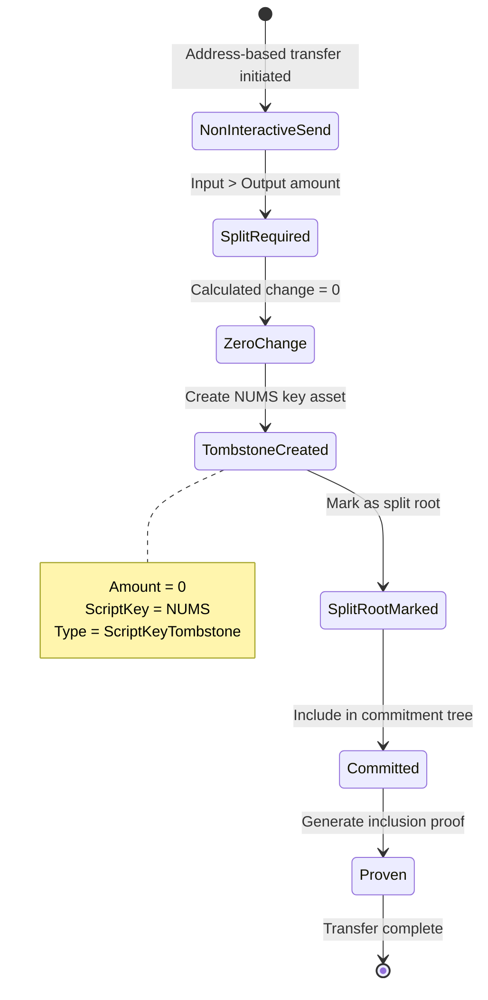
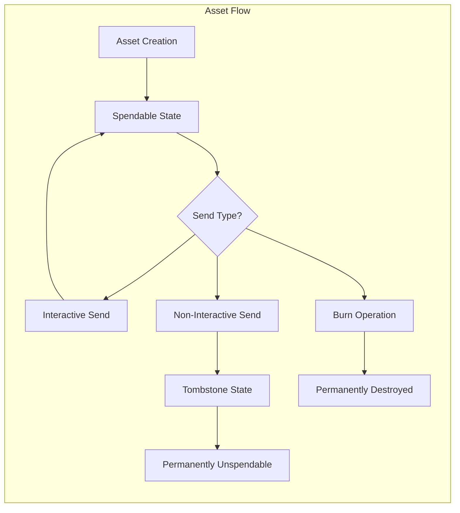
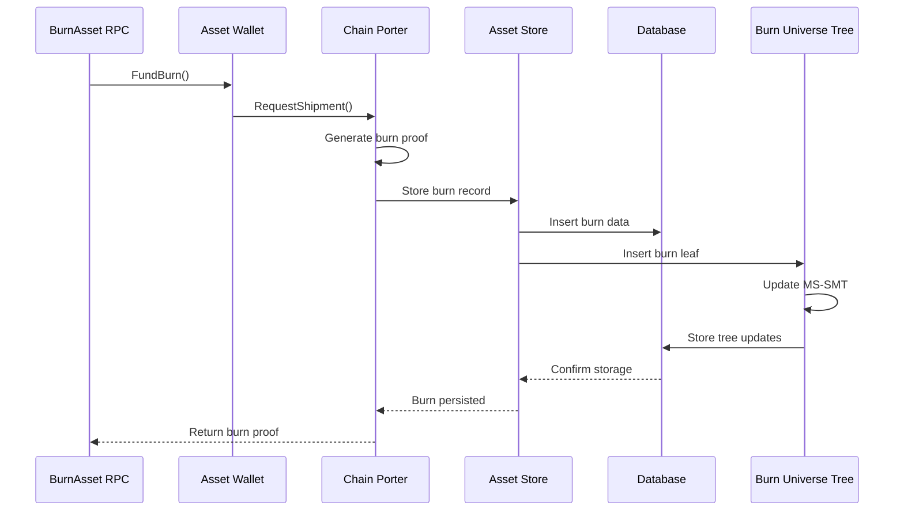
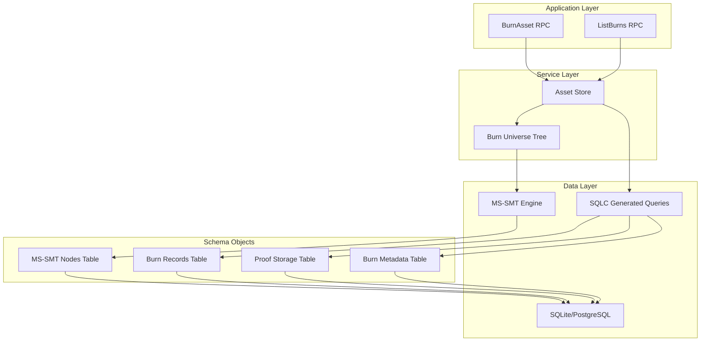

# Burn Architecture Documentation

## Table of Contents

1. [Introduction](#introduction)
2. [Detailed Architecture Analysis](#detailed-architecture-analysis)
   - [RPC Layer: Entry Point and Interface](#rpc-layer-entry-point-and-interface)
   - [Burn Execution Engine: State Transitions and Logic](#burn-execution-engine-state-transitions-and-logic)
   - [Proof Verification System: Cryptographic Foundation](#proof-verification-system-cryptographic-foundation)
   - [Tombstone System: Non-Interactive Send Markers](#tombstone-system-non-interactive-send-markers)
     - [Tombstone vs. Burns: Key Differences](#tombstone-vs-burns-key-differences)
     - [Script Key Type Classification](#script-key-type-classification)
     - [Tombstone Lifecycle](#tombstone-lifecycle)
     - [Asset Lifecycle Management](#asset-lifecycle-management)
   - [Database Persistence: Storage and Query Systems](#database-persistence-storage-and-query-systems)
3. [Current Limitations and Architectural Stop Gaps](#current-limitations-and-architectural-stop-gaps)
   - [Group Operation Limitations](#group-operation-limitations)
   - [Synchronous Processing Constraints](#synchronous-processing-constraints)
   - [Single Asset Type Restriction](#single-asset-type-restriction)
   - [Limited Metadata Support](#limited-metadata-support)
4. [Security Architecture and Validation](#security-architecture-and-validation)
5. [Integration Points and Ecosystem Interactions](#integration-points-and-ecosystem-interactions)

## Introduction

In the Taproot Assets protocol, burning represents the permanent and provable
destruction of digital assets. When an asset is burned, it is sent to a special
unspendable script key that no one can control, effectively removing it from
circulation forever. This operation is cryptographically verifiable, meaning
anyone can independently confirm that assets have been destroyed without relying
on trusted third parties.

Burns in Taproot Assets work by deriving a unique "burn key" for each
transaction using a Nothing-Up-My-Sleeve (NUMS) point combined with
deterministic tweaks based on the transaction context. The resulting public key
has no known private key, making any assets sent to it permanently
unrecoverable. The system distinguishes burns from other unspendable outputs
like tombstones, which serve different purposes in the protocol's commitment
structure.

This document provides a comprehensive technical analysis of the burn
architecture within the Taproot Assets codebase. It examines the complete
implementation from the BurnAsset RPC interface through the execution engine,
proof verification system, and database persistence layers. The analysis covers
both the current capabilities and limitations of the system, providing
developers and operators with a detailed understanding of how asset destruction
works at every level of the stack.

## Detailed Architecture Analysis

The burn system implements a multi-layered architecture where each layer has
specific responsibilities and clear interfaces with adjacent layers. This
separation of concerns enables modular development, testing, and future
enhancements while maintaining system integrity.



### RPC Layer: Entry Point and Interface

The burn system exposes its functionality through the BurnAsset RPC call, which
serves as the primary gateway for all burn operations. 

```go
rpc BurnAsset (BurnAssetRequest) returns (BurnAssetResponse);
```

When a burn request arrives, the system first performs comprehensive input
validation. The implementation supports burning via an asset ID, or group key
providing flexibility for different client implementations. This dual support
reflects a common pattern throughout the codebase where user convenience is
balanced against system requirements.

The most distinctive safety mechanism is the mandatory confirmation text
requirement. Users must provide the exact string "assets will be destroyed" to
proceed with any burn operation. This deliberate friction prevents accidental
burns that could occur through automation errors or user mistakes. The
confirmation text check occurs early in the validation chain, failing fast if
the safety requirement isn't met.

The actual burn funding occurs through the AssetWallet.FundBurn method, which
orchestrates the complex process of selecting appropriate UTXOs, deriving burn
keys, and constructing virtual transactions. This separation of concerns keeps
the RPC layer focused on request handling while delegating the intricate burn
mechanics to specialized components.

Finally, the ChainPorter component handles transaction broadcasting and proof
generation. This abstraction allows the burn system to remain agnostic to the
specific chain submission mechanics while ensuring that all burns generate
appropriate proofs for later verification.

### Burn Execution Engine: State Transitions and Logic

The burn execution engine represents the heart of the burn system, orchestrating
the complete process from initial asset selection through final chain
submission. The primary entry point, FundBurn
(`tapfreighter/wallet.go:698-847`), implements a sophisticated pipeline that
handles the numerous edge cases and constraints inherent in asset burning.

The execution flow begins with asset constraint setup, where the system extracts
the asset specifier and establishes the minimum amount requirements. This
constraint system ensures that only appropriate assets are selected for burning,
preventing scenarios where insufficient funds or incorrect asset types might
lead to failed transactions.

Coin selection follows, utilizing the `PreferMaxAmount` strategy to minimize the
number of inputs required. This optimization reduces both transaction size and
complexity, important considerations given Bitcoin's fee structure and the
computational overhead of managing multiple inputs. The coin selector examines
available UTXOs, selecting those that meet the burn requirements while
maintaining overall wallet efficiency.

```go
selectedCommitments, err := f.cfg.CoinSelector.SelectCoins(
    ctx, constraints, PreferMaxAmount, commitment.TapCommitmentV2,
)
```

Asset version determination ensures compatibility across different asset
versions. The system examines all selected assets, identifying the highest
version present and using that for the burn operation. This forward-compatible
approach allows newer asset versions to coexist with older ones while ensuring
that burns use the most recent features available.

The burn key derivation process represents one of the most critical security
features of the system. The implementation sorts inputs deterministically using
the AssetSortForInputs function, ensuring that the same set of inputs always
produces the same burn key regardless of their initial ordering. The first input
in this sorted list provides the context for burn key derivation:

```go
firstPrevID := pkt.Inputs[0].PrevID
burnKey := asset.NewScriptKey(asset.DeriveBurnKey(firstPrevID))
```

This deterministic approach ensures that burn verification remains possible
without storing additional metadata, as anyone can reconstruct the burn key from
the transaction data alone.

Virtual transaction construction creates the structure that will ultimately be
committed to the Bitcoin blockchain. The virtual packet includes the burn output
with the derived burn key, marking it as permanently unspendable. The
interactive flag is set to true, distinguishing burns from non-interactive
transfers that might create tombstones.

Input commitment allocation represents one of the most complex aspects of the
burn process. The `createFundedPacketWithInputs` function maps selected
commitments to virtual inputs, handles split commitments when partial burns are
required, manages passive assets that aren't being burned but share the same
anchor output, and sets up the witness data necessary for transaction
validation.

The complete execution flow from user request through chain confirmation follows
a carefully orchestrated sequence:



### Proof Verification System: Cryptographic Foundation

The proof verification system provides the cryptographic foundation that makes
burns verifiable and irreversible. This system determines burn status through
sophisticated analysis of asset script keys and witness data, implementing
multiple layers of verification to ensure accuracy.

The VerifyProof RPC call (`rpcserver.go:1832-1874`) serves as the primary
interface for burn verification. When a proof file arrives for verification, the
system first validates its format and size constraints, preventing potential
denial-of-service attacks through oversized or malformed files. The proof file
is then decoded and subjected to comprehensive cryptographic verification.

The core of burn detection lies in the IsBurn method
(`asset/asset.go:1791-1804`), which implements a multi-stage verification
process:

```go
func (a *Asset) IsBurn() bool {
    if a.ScriptKey.PubKey == nil || len(a.PrevWitnesses) == 0 {
        return false
    }
    return IsBurnKey(a.ScriptKey.PubKey, a.PrevWitnesses[0])
}
```

This method first validates that the necessary data exists before proceeding to
the actual burn verification. The IsBurnKey function then performs the
cryptographic comparison, handling both standard witnesses and the more complex
split commitment witnesses that arise from partial burns.

The burn key derivation scheme uses a sophisticated formula that creates
provably unspendable keys:

```
burnKey = NUMSKey + H_tapTweak(NUMSKey || outPoint || assetID || scriptKey) * G
```

This formula combines the Nothing-Up-My-Sleeve (NUMS) base key with a
deterministic tweak derived from the transaction context. The NUMS key serves as
a provably random base point that no one knows the discrete logarithm for, while
the tweak ensures uniqueness for each burn operation. The combination produces a
public key for which no one can know the corresponding private key, making the
assets permanently unspendable.

The verification process handles several edge cases with particular care. Split
commitment witnesses require traversal to the root asset to extract the proper
previous ID for burn key derivation. Missing or malformed witness data results
in immediate verification failure rather than attempting recovery. The system
maintains strict validation throughout to prevent false positives that could
incorrectly identify assets as burned.

The proof verification flow demonstrates the complete sequence from initial
request through burn determination:



The burn detection architecture shows the layered structure of how the system
determines whether an asset represents a burn:



### Tombstone System: Non-Interactive Send Markers

The tombstone system operates in parallel with the burn system but serves a
fundamentally different purpose in the asset lifecycle. Understanding the
distinction between tombstones and burns is crucial for comprehending the
overall architecture.

#### Tombstone vs. Burns: Key Differences

| Aspect | Tombstones | Burns |
|--------|------------|--------|
| **Purpose** | Markers for non-interactive sends | Permanent asset destruction |
| **Amount** | Always zero | User-specified amount > 0 |
| **Script Key** | Fixed NUMS key | Derived burn key (unique per transaction) |
| **Creation** | Automatic during splits | Explicit user action |
| **Intentional** | Side-effect | Deliberate destruction |

Tombstones are zero-value, unspendable assets created as side effects of
non-interactive transfers. When assets are sent to a Taproot Asset address and
the calculated change amount equals zero, the system creates a tombstone to
maintain the validity of the split commitment. These tombstones use a fixed NUMS
key rather than the unique derived keys used for burns:

```go
NUMSBytes, _ = hex.DecodeString(
    "027c79b9b26e463895eef5679d8558942c86c4ad2233adef01bc3e6d540b3653fe",
)
```

This fixed key, generated through a verifiable public process using the phrase
"taproot-assets" and SHA2-256 hashing, provides a universal marker for
tombstones across the entire system. The reuse of this single key for all
tombstones is safe because no spending is ever intended, and the zero amount
ensures they don't affect asset balances.

The creation process for tombstones occurs automatically during non-interactive
sends when specific conditions are met. The system detects when an input amount
exceeds the send amount but the calculated change equals zero. Rather than
creating an invalid commitment or omitting the change output entirely, the
system creates a tombstone that maintains the cryptographic validity of the
split commitment tree.

For collectible assets, tombstones play a particularly important role. Since
collectibles cannot be divided, any non-interactive transfer necessarily creates
a tombstone as the split root, ensuring the transfer remains valid while
preserving the indivisible nature of the collectible.

The tombstone identification logic operates at multiple levels. At the script
key level, the system checks whether a key equals the known NUMS key. At the
asset level, both the script key and zero amount conditions must be satisfied
for tombstone classification. This multi-level verification prevents false
positives and ensures accurate tombstone tracking throughout the system.

#### Script Key Type Classification

The tombstone type fits within the broader script key type system, where it's
classified as an unspendable key type:



#### Tombstone Lifecycle

The creation and lifecycle of tombstones follows a predictable state machine:



#### Asset Lifecycle Management

Tombstones represent one possible end state in the overall asset lifecycle:



### Database Persistence: Storage and Query Systems

The database layer implements specialized storage mechanisms for burn-related
data, utilizing a hierarchical structure built on Burn Universe Trees. This
architecture provides efficient storage and retrieval while maintaining the
cryptographic properties necessary for proof generation and verification.

The Burn Universe Tree structure employs Merkle-Sum Sparse Merkle Trees (MS-SMT)
for organizing burn data:

```go
type BurnUniverseTree struct {
    db BatchedUniverseTree
}
```

This structure provides several key capabilities. Namespace organization groups
burns by asset group and tree type, enabling efficient queries for related
burns. The MS-SMT integration allows for compact inclusion proofs while
maintaining the ability to calculate aggregate burn amounts for supply tracking.
Atomic operations ensure consistency even in the face of system failures or
concurrent access.

The storage process implements comprehensive validation before persisting any
burn data. Each proof undergoes verification to ensure it represents an actual
burn rather than a standard transfer or tombstone. The system then organizes
burns by namespace, derived from group keys when available, and serializes the
proof data for compact storage. The MS-SMT is updated with new burn leaves, and
authentication proofs are generated for later verification needs.

The burn persistence flow demonstrates how burn data moves from the RPC layer
through to permanent storage:



The storage layer architecture shows how different database components interact
to manage burn data:



The query interface provides flexible filtering capabilities that support
various use cases:

```go
func (a *AssetStore) QueryBurns(ctx context.Context,
    filters QueryBurnsFilters) ([]*tapfreighter.AssetBurn, error)
```

Queries can filter by asset ID for tracking specific asset burns, group keys for
analyzing grouped asset operations, anchor transaction IDs for transaction-level
auditing, or combinations of these filters for complex analytical queries. This
flexibility supports both operational queries needed for wallet operations and
analytical queries used for reporting and compliance.

## Current Limitations and Architectural Stop Gaps

The burn system currently implements several architectural limitations that
significantly impact its functionality and user experience. Understanding these
limitations is essential for both users of the system and developers planning
future enhancements.

### Group Operation Limitations

Perhaps the most significant limitation is the lack of support for burning
assets by group key. The system explicitly prevents group-based burns through
validation checks in both the wallet and RPC layers:

```go
// We don't support burning by group key yet, so we only expect a single
// vPacket (which implies a single asset ID is involved).
if len(fundedPkt.VPackets) != 1 {
    return nil, fmt.Errorf("expected a single vPacket, got %d", len(fundedPkt.VPackets))
}
```

This restriction forces users to perform individual burn operations for each
asset within a group, even when burning multiple assets would be more efficient.
Each separate burn requires its own transaction, increasing both fees and
blockchain space usage. For users managing large portfolios of grouped assets,
this limitation creates significant operational overhead and poor user
experience.

The root cause lies in the burn funding logic's assumption of single asset ID
operations. The current implementation lacks the group key expansion mechanisms
necessary to identify and burn multiple assets sharing the same group key.
Adding this capability would require substantial changes to the coin selection
logic, virtual packet construction, and commitment management systems.

### Synchronous Processing Constraints

All burn operations currently process synchronously within the RPC request
context. This architectural choice creates several problems for system
scalability and user experience. During periods of network congestion, burn
operations can take significant time to complete, leaving RPC connections open
and consuming server resources. Users experience long wait times with no
visibility into operation progress, particularly problematic for complex burns
involving multiple inputs or large proofs.

The synchronous nature also prevents the implementation of advanced features
like burn queuing, batch processing, or priority-based execution. Modern
distributed systems typically handle long-running operations asynchronously,
providing job IDs and progress endpoints that allow clients to track operation
status without maintaining persistent connections.

### Single Asset Type Restriction

Each burn operation can only target a single asset ID, a limitation that
compounds the group operation restriction. Users cannot burn different types of
assets in a single transaction, even when this would be more efficient from both
a fee and operational perspective. This restriction increases the likelihood of
partial failures in multi-asset scenarios, as each burn operates independently
without transactional guarantees across multiple operations.

### Limited Metadata Support

The current implementation provides only a basic note field for burn metadata:

```go
// Note is a user provided description for this transfer. This is
// currently only used by asset burn transfers.
Note string
```

This minimal metadata support limits audit trail capabilities and makes
integration with external systems challenging. Organizations requiring detailed
burn records for compliance or accounting purposes must maintain separate
systems to track additional information about burn operations. Structured
metadata support would enable richer audit trails, better integration with
external systems, and improved compliance reporting capabilities.

## Security Architecture and Validation

The burn system implements multiple layers of security to ensure operation
integrity and prevent both accidental and malicious misuse. The mandatory
confirmation text serves as the first line of defense against accidental burns,
while the cryptographic burn key derivation ensures mathematical impossibility
of asset recovery.

The NUMS key foundation provides provable randomness through its public
generation process. No entity knows the discrete logarithm of the NUMS key,
making it impossible to create valid signatures for transactions spending burned
assets. The deterministic tweak applied during burn key derivation ensures each
burn uses a unique key while maintaining verifiability.

Validation occurs at multiple points throughout the burn lifecycle. Input
validation ensures only valid asset IDs and amounts are processed. Cryptographic
validation confirms burn keys are properly derived. Commitment validation
ensures burns maintain the integrity of the commitment tree structure. Chain
validation confirms successful transaction broadcast and inclusion.

## Integration Points and Ecosystem Interactions

The burn system integrates with numerous components within the Taproot Assets
ecosystem. Universe servers synchronize burn proofs across the network, ensuring
global consistency in burn tracking. Supply verifiers use burn data to maintain
accurate total supply calculations, critical for economic modeling and
compliance reporting. Monitoring systems track burn events for operational
alerting and analytics. Wallet applications provide user interfaces for
initiating and tracking burn operations.

Internal integration points include the asset management system for balance
updates and UTXO tracking, the proof generation system for creating verifiable
burn proofs, the chain interface for Bitcoin transaction management, and the
database systems for persistent storage and querying. Each integration point
implements appropriate abstractions to maintain system modularity while ensuring
consistent behavior.
