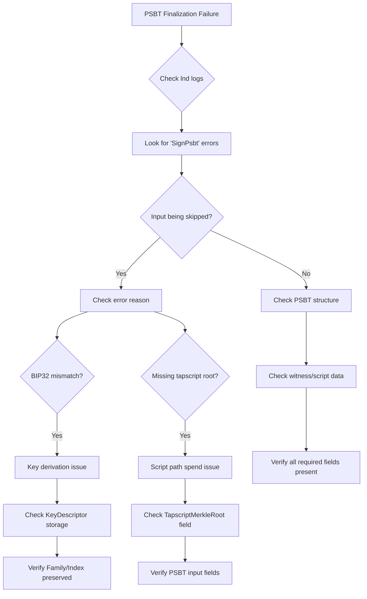

# PSBT Finalization Failures - Debug Handbook

## Quick Identification

**Symptoms:**
- Error message: "PSBT failed to finalize" or similar
- Integration tests fail during supply commitment operations
- Transactions involving taproot outputs fail to broadcast
- Key signing operations silently skip inputs

**Common Error Patterns:**
```
ERR RPCS interceptor.go:279: [/walletrpc.WalletKit/FinalizePsbt]: could not finalize PSBT
WRN BTWL psbt.go:224: SignPsbt: Skipping input X, derived public key XXX does not match bip32 derivation info public key YYY
```

## Debug Flow Chart



## Detailed Debugging Steps

### Step 1: Enable Detailed Logging

First, ensure you have debug-level logging enabled:
```bash
# For lnd
lnd --debuglevel=debug

# For tapd
tapd --debuglevel=debug
```

### Step 2: Identify the Failure Point

Look for these key indicators in the logs:

1. **PSBT Finalization Error**
   ```
   [/walletrpc.WalletKit/FinalizePsbt]: could not finalize PSBT
   ```
   This is the high-level error - dig deeper for root cause.

2. **Input Skipping Warnings**
   ```
   SignPsbt: Skipping input 1, derived public key XXX does not match bip32 derivation info public key YYY
   ```
   This indicates a key derivation mismatch.

3. **Missing Tapscript Root**
   ```
   SignPsbt: Skipping input X, script path spend without tapscript merkle root
   ```
   This indicates missing PSBT fields for taproot script spends.

### Step 3: Diagnose Root Cause

#### A. BIP32 Key Derivation Mismatch

**What's happening:** The wallet cannot derive the correct private key because the derivation path is wrong.

**Common causes:**
1. KeyFamily or KeyIndex not preserved when storing keys
2. Using raw public key bytes instead of full KeyDescriptor
3. Defaulting to Family=0, Index=0 when values should be preserved

**Where to check:**
- Database storage code: Look for `UpsertInternalKey` calls
- Key retrieval code: Look for `parseInternalKey` or similar
- PSBT construction: Look for `Bip32DerivationFromKeyDesc`

**Relevant code locations:**
- tapd: `tapdb/supply_commit.go` - `InsertSignedCommitTx` method
- tapd: `tapdb/assets_common.go` - `parseInternalKey` function
- tapd: `tappsbt/interface.go` - `Bip32DerivationFromKeyDesc` function
- lnd: [`lnwallet/btcwallet/psbt.go`](https://github.com/lightningnetwork/lnd/blob/master/lnwallet/btcwallet/psbt.go#L200-L250)

**Fix pattern:**
```go
// WRONG - loses derivation info
internalKeyID, err := db.UpsertInternalKey(ctx, InternalKey{
    RawKey: internalKey.SerializeCompressed(),
})

// CORRECT - preserves full key info
internalKeyID, err := db.UpsertInternalKey(ctx, InternalKey{
    RawKey:    internalKey.PubKey.SerializeCompressed(),
    KeyFamily: int32(internalKey.Family),
    KeyIndex:  int32(internalKey.Index),
})
```

#### B. Missing Tapscript Merkle Root

**What's happening:** For taproot script path spends, the PSBT needs the merkle root to verify the script.

**Common causes:**
1. Not setting `TaprootMerkleRoot` in PSBT input
2. Incorrect witness construction for taproot spends
3. Missing control block information

**Where to check:**
- PSBT creation code: Look for `psbt.PInput` field assignments
- Taproot output construction: Look for `TapscriptRoot` calculations

**Relevant code locations:**
- btcd: [`btcutil/psbt` package](https://github.com/btcsuite/btcd/tree/master/btcutil/psbt)
- tapd: `universe/supplycommit/transitions.go` - PSBT construction

**Fix pattern:**
```go
// For script path spends, ensure merkle root is set
psbtInput := &psbt.PInput{
    WitnessUtxo:       prevOut,
    TaprootMerkleRoot: merkleRootBytes,  // MUST be set for script spends
    // ... other fields
}
```

### Step 4: Verify the Fix

After implementing fixes, verify:

1. **Check logs for successful signing:**
   ```
   DBG RPCS interceptor.go:775: [/walletrpc.WalletKit/SignPsbt] requested
   # No "Skipping input" warnings should follow
   ```

2. **Run unit tests:**
   ```bash
   go test -v -run "TestSupplyCommit" ./tapdb/...
   ```

3. **Run integration tests:**
   ```bash
   make itest icase=supply_commit
   ```

## Common Pitfalls

### 1. Struct Field Changes
When modifying structs that contain keys, ensure all uses are updated:
```go
// If changing from:
type SupplyCommitTxn struct {
    InternalKey *btcec.PublicKey
}

// To:
type SupplyCommitTxn struct {
    InternalKey keychain.KeyDescriptor
}

// Must update ALL creation sites and test code
```

### 2. Database Migrations
When key storage format changes, consider if existing data needs migration.

### 3. Test Key Generation
Test code often uses simplified key generation - ensure it matches production:
```go
// Test code should use:
internalKey, _ := test.RandKeyDesc(t)  // Full descriptor

// Not:
internalKey := test.RandPubKey(t)  // Just public key
```

## Prevention Strategies

1. **Always use KeyDescriptor** when passing keys that need signing
2. **Preserve all key metadata** through the entire lifecycle
3. **Add validation** to check required PSBT fields before finalization
4. **Use structured logging** to trace key derivation paths
5. **Write tests** that verify PSBT signing works end-to-end

## External References

- [BIP 174 - PSBT Specification](https://github.com/bitcoin/bips/blob/master/bip-0174.mediawiki)
- [BIP 371 - Taproot PSBT Fields](https://github.com/bitcoin/bips/blob/master/bip-0371.mediawiki)
- [lnd PSBT Implementation](https://github.com/lightningnetwork/lnd/blob/master/lnwallet/btcwallet/psbt.go)
- [btcd PSBT Package Docs](https://pkg.go.dev/github.com/btcsuite/btcd/btcutil/psbt)
- [Taproot Asset PSBT Utils](https://github.com/lightninglabs/taproot-assets/tree/main/tappsbt)

## Related Issues

- Supply commitment key storage
- Taproot witness construction
- Multi-signature coordination
- Hardware wallet integration

## Quick Checklist

When debugging PSBT finalization issues:

- [ ] Check lnd debug logs for specific error messages
- [ ] Identify which input(s) are failing
- [ ] Verify BIP32 derivation paths match
- [ ] Check KeyFamily and KeyIndex are preserved
- [ ] Verify tapscript merkle root for script spends
- [ ] Ensure all required PSBT fields are populated
- [ ] Test with simplified single-input transaction first
- [ ] Verify database stores complete key information
- [ ] Check for version mismatches between components

## Example Debug Session

```bash
# 1. See test failure
make itest icase=supply_commit
# Error: PSBT failed to finalize

# 2. Check lnd logs
grep -i "SignPsbt\|Skipping" itest/regtest/*.log
# Found: Skipping input 1, derived public key mismatch

# 3. Check key storage
grep -A5 "UpsertInternalKey" tapdb/supply_commit.go
# Found: Only storing RawKey, not Family/Index

# 4. Fix key storage to preserve full descriptor
# 5. Update struct definitions if needed
# 6. Fix test code to use KeyDescriptor
# 7. Re-run tests to verify fix
```

## Contact & Escalation

If you encounter PSBT issues not covered here:
1. Check recent commits affecting key management
2. Review taproot-assets and lnd release notes
3. Search GitHub issues for similar problems
4. Ask in #taproot-assets Slack channel
5. File detailed bug report with logs and PSBT hex