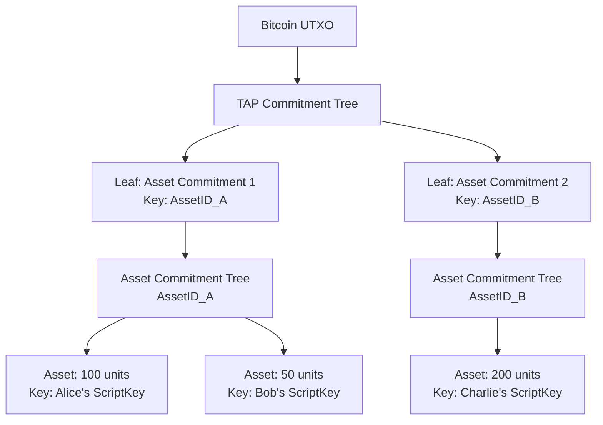
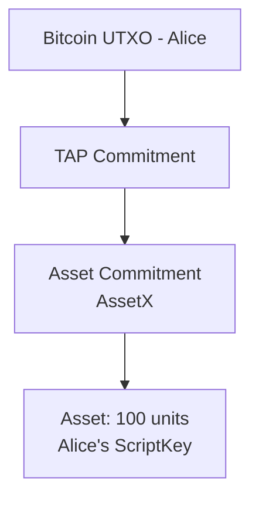
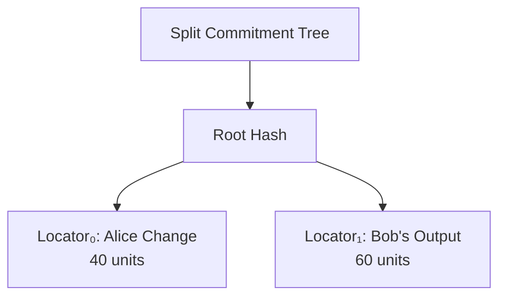
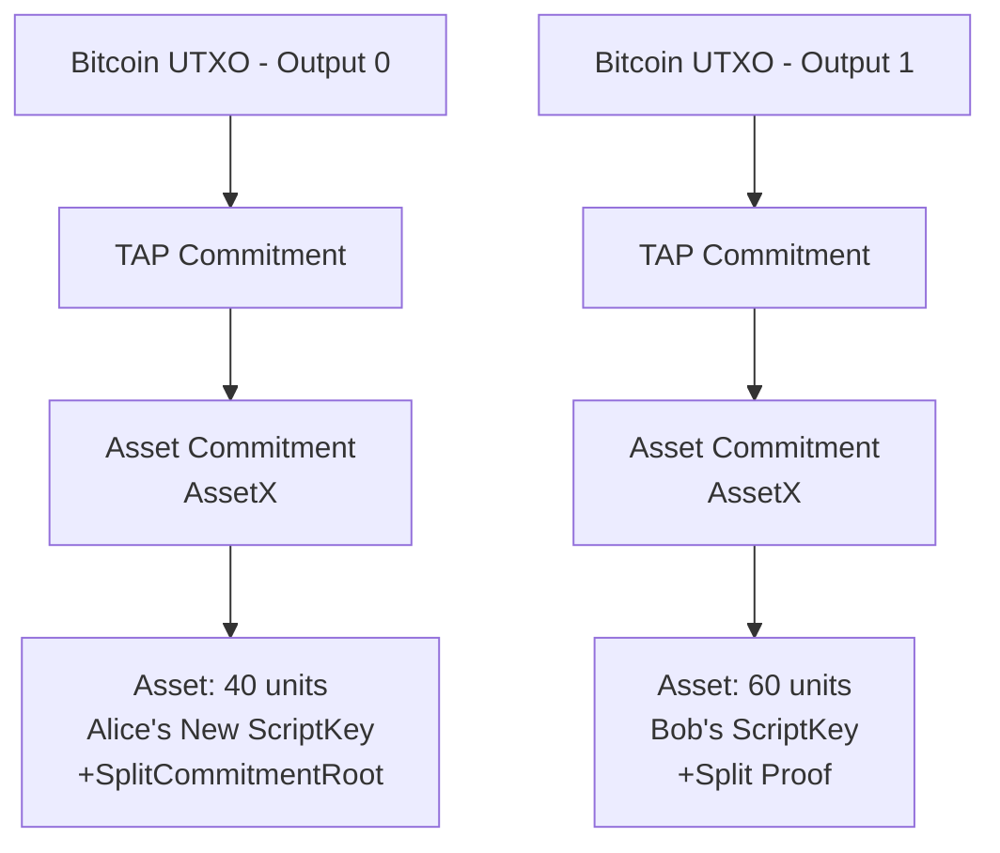

# The Taproot Assets Protocol: A Deep Technical Dive

NOTE: This is a document initially created by an agentic LLM analyzing the code
base and then reviewed and edited by a human.
This document covers broader topics a developer might need or want to know
about when developing apps using Taproot Assets.
Another, [similar document covering the specifics around transaction
flows](./developer-transaction-flow.md) exists as well and there is some overlap
between these two documents. This document's target audience is developers
_using_ and interacting with `tapd`.

All links to code are based on the commit
[`45586345`](https://github.com/lightninglabs/taproot-assets/tree/45586345).

## Introduction

The Taproot Assets Protocol (TAP) is a system that enables the creation,
management, and transfer of digital assets on the Bitcoin blockchain.
Unlike traditional token protocols that rely on separate blockchains or complex
smart contracts, Taproot Assets leverages Bitcoin's native Taproot upgrade to
embed asset commitments directly into Bitcoin transactions. This approach
provides the security and finality of Bitcoin while enabling rich asset
functionality.

At its core, the protocol solves a fundamental challenge: how to represent
arbitrary assets on Bitcoin without modifying the base protocol. The solution
involves sophisticated cryptographic commitments, merkle trees, and a carefully
designed proof system that allows assets to be verified independently while
remaining anchored to Bitcoin's proof-of-work security.

## Understanding the Foundation: MS-SMT Trees

### What is an MS-SMT?

The Merkle Sum Sparse Merkle Tree (MS-SMT) is the fundamental data structure
that powers Taproot Assets. Unlike regular merkle trees that only commit to
data, MS-SMTs also commit to numerical sums at each node. This property is
crucial for preventing asset inflation - a critical security requirement for any
asset protocol.

In the context of Taproot Assets, MS-SMTs serve multiple purposes. They provide
cryptographic commitments to asset ownership, enable efficient proofs of
existence and non-existence, and most importantly, enforce conservation laws
that prevent assets from being created or destroyed outside of authorized
minting operations.

The "sparse" aspect is equally important. Since the tree can theoretically hold
2^256 entries (one for each possible key), but in practice only contains a few
assets, the sparse structure allows efficient storage and proof generation
without needing to materialize the entire tree. As noted in
[`mssmt/tree.go`](https://github.com/lightninglabs/taproot-assets/blob/45586345/mssmt/tree.go),
the implementation uses a compacted representation that only stores non-empty
nodes.

### Why MS-SMT Over Other Structures?

The choice of MS-SMT over simpler structures like regular merkle trees or even
just hash commitments is deliberate and serves several critical purposes:

**Sum Preservation**: The sum property ensures that assets cannot be inflated
during transfers. When an asset is split, the sum of the output amounts must
equal the input amount. This is enforced mathematically by the tree structure
itself, not just by validation rules. This check is implemented in
[`vm/vm.go:433-445`](https://github.com/lightninglabs/taproot-assets/blob/45586345/vm/vm.go#L433-L445):

```go
// Enforce that assets aren't being inflated.
ctxb := context.Background()
treeRoot, err := inputTree.Root(ctxb)
if err != nil {
    return err
}
if treeRoot.NodeSum() !=
    uint64(virtualTx.TxOut[0].Value) {

    return newErrInner(ErrAmountMismatch, fmt.Errorf("expected "+
            "output value=%v, got=%v", treeRoot.NodeSum(),
            virtualTx.TxOut[0].Value))
}
```

**Efficient Proofs**: Sparse merkle trees enable both inclusion proofs (proving
an asset exists) and exclusion proofs (proving an asset doesn't exist). This is
essential for preventing double-spends and ensuring uniqueness of ownership.

**Scalability**: The sparse structure means the tree size grows logarithmically
with the number of assets, not linearly. This makes the protocol viable even
with millions of assets.

## The Tree Hierarchy: A Multi-Level Architecture

Taproot Assets employs a two-level tree architecture.
Understanding this hierarchy is crucial to grasping how the protocol maintains
security while enabling complex asset operations.

### Level 1: The TAP Commitment Tree

The outermost tree is the TAP Commitment, defined in
[`commitment/tap.go:82-85`](https://github.com/lightninglabs/taproot-assets/blob/45586345/commitment/tap.go#L82-L85).
This tree serves as the root anchor for all assets in a Bitcoin UTXO:

```go
// TapCommitment represents the outer MS-SMT within the Taproot Asset protocol
// committing to a set of asset commitments. Asset commitments are
// keyed by their `asset_group_key` or `asset_id` otherwise.
```

This tree's keys are either asset IDs (for unique assets) or group keys (for
fungible assets that can be reissued). Each leaf in this tree is itself a
commitment to another tree - the Asset Commitment.

### Level 2: Asset Commitments

Each leaf in the TAP Commitment tree contains an Asset Commitment
([`commitment/asset.go:55-58`](https://github.com/lightninglabs/taproot-assets/blob/45586345/commitment/asset.go#L55-L58)):

```go
// AssetCommitment represents the inner MS-SMT within the Taproot Asset protocol
// committing to a set of assets under the same ID/group. Assets within this
// tree are keyed by their `asset_script_key`.
```

This inner tree contains the actual assets (asset outputs or asset UTXOs), with
each asset keyed by its script key (the public key that controls spending).

This two-level system allows for easy sum-based checks of how many asset units
are represented in a single commitment.

But because the script key is the uniquely identifying key in the Asset
Commitment tree, this also requires the script keys to be unique within a single
Asset Commitment tree to prevent asset leaf collisions.

This uniqueness constraint is checked by `tapd` to avoid different asset-level
outputs to be clobbered together by accident.

### The Split Commitment Tree: A Special Case

When assets are transferred with change (a split), a temporary third tree type
comes into play - the Split Commitment tree
([`commitment/split.go:108-122`](https://github.com/lightninglabs/taproot-assets/blob/45586345/commitment/split.go#L108-L122)).
This tree is fundamentally different and completely independent of the
persistent TAP and Asset commitment trees:

```go
type SplitCommitment struct {
    // PrevAssets is the set of asset inputs being split.
    PrevAssets InputSet
    
    // RootAsset is the root asset resulting after the creation of split
    // assets containing the SplitCommitmentRoot.
    RootAsset *asset.Asset
    
    // SplitAssets is the set of asset splits within the on-chain
    // transaction committed to within the split commitment MS-SMT.
    SplitAssets SplitSet
    
    // tree is the MS-SMT committing to all of the asset splits above.
    tree mssmt.Tree
}
```

The split tree exists only within the root asset of a split operation and serves
as a proof structure showing how an asset was divided. This is crucial for
non-interactive transfers where the recipient needs to independently verify the
transfer's validity.

## Visualizing the Tree Structure



## The Proof System: Ensuring Validity Without Trust

The proof system in Taproot Assets is what enables trustless verification.
Unlike traditional database systems where you trust the database operator, or
even blockchain systems where you trust the consensus, Taproot Assets proofs
allow mathematical verification of asset properties.

### Components of a Proof

A complete Taproot Asset proof consists of several components, each serving a
specific purpose in the verification chain:

**Asset Proof**: The serialized asset itself, including its genesis information,
amount, script key, and any witness data. This is the core of what's being
proven.

**Inclusion Proofs**: Merkle proofs showing the asset's inclusion in both the
Asset Commitment tree and the TAP Commitment tree. These proofs consist of
sibling hashes that allow reconstruction of the root hash.

**Split Commitment Proof**: For assets that resulted from a split, this includes
the split tree root and the merkle proof from the specific output to that root.
This proves the asset came from a valid split operation that did not destroy or
create assets.

**Bitcoin Anchor Proof**: The Bitcoin transaction and merkle proof showing the
TAP Commitment is embedded in a confirmed Bitcoin transaction. This anchors the
entire proof to Bitcoin's security.

### Proof Verification Process

When verifying a proof, the process works backwards from the Bitcoin blockchain
down to the specific asset. First, the Bitcoin transaction is verified to ensure
it's confirmed and contains the expected commitment. Then, the TAP commitment
root is extracted and verified against the provided merkle proofs. Next, the
asset commitment is verified within the TAP tree. Finally, the specific asset is
verified within its asset commitment tree.

This layered verification ensures that an asset cannot be forged - it must trace
back through valid proofs all the way to a confirmed Bitcoin transaction. The
verification logic is implemented in the `proof` package, with the core
validation happening in
[`proof/verifier.go`](https://github.com/lightninglabs/taproot-assets/blob/45586345/proof/verifier.go).

## Understanding Commitments

Commitments in Taproot Assets serve as cryptographic anchors that bind assets to
specific states. There are several types of commitments, each serving a
different purpose in the protocol.

### TAP Commitments

The TAP Commitment is the root commitment that gets embedded in Bitcoin
transactions. As defined in
[`commitment/tap.go:78-82`](https://github.com/lightninglabs/taproot-assets/blob/45586345/commitment/tap.go#L78-L82),
it commits to all assets in a UTXO:

```go
// TapCommitment represents the outer MS-SMT within the Taproot Asset protocol
// committing to a set of asset commitments.
```

This commitment becomes part of the Bitcoin taproot output through a tapscript
leaf. The commitment script includes a version byte, a marker, the tree root
hash, and the sum of all assets. This structure is defined in
[`commitment/tap.go:64-72`](https://github.com/lightninglabs/taproot-assets/blob/45586345/commitment/tap.go#L64-L72).

### Asset Commitments

Asset Commitments group assets of the same type together. Each asset commitment
is itself an MS-SMT where assets are keyed by their script keys. This allows
multiple owners to hold the same asset type within the same Bitcoin UTXO, though
this is typically only seen during batch operations or in special protocols.

The commitment preserves important properties like asset type consistency and
sum verification. The validation in
[`commitment/asset.go:91-150`](https://github.com/lightninglabs/taproot-assets/blob/45586345/commitment/asset.go#L91-L150)
ensures all assets in a commitment share the same genesis and type.

### Split Commitments

Split Commitments are special commitments that prove how an asset was divided.
They're created during split operations and embedded in the root asset (often
the change output). The split commitment tree uses locators as keys, where each
locator uniquely identifies an output:

```go
// From commitment/split.go:78-87
func (l SplitLocator) Hash() [sha256.Size]byte {
    h := sha256.New()
    binary.Write(h, binary.BigEndian, l.OutputIndex)
    h.Write(l.AssetID[:])
    h.Write(l.ScriptKey.SchnorrSerialized())
    return *(*[sha256.Size]byte)(h.Sum(nil))
}
```

*Source:
[`commitment/split.go:78-87`](https://github.com/lightninglabs/taproot-assets/blob/45586345/commitment/split.go#L78-L87)*

## Transfer Types: Interactive vs Non-Interactive

The protocol supports two fundamental transfer modes that differ primarily in
how asset outputs are constructed. This distinction is often confused with proof
distribution mechanisms, but they are separate concerns.

### The Core Distinction: Output Construction

**Interactive vs non-interactive is fundamentally about asset output
construction, not proof distribution.**

- **Non-interactive transfers**: Only exist to facilitate TAP address based
  on-chain transfers (for V0 and V1 TAP addresses). See [Non-Interactive
  Transfers and TAP Addresses](#non-interactive-transfers-and-tap-addresses)
  section below.
- **Interactive transfers**: Can use direct asset reassignment for full-value
  transfers as there is no requirement for predictability on the outputs. It is
  assumed that the recipient eventually learns (either through the TAP address
  V2 authenticated mailbox mechanism or through an out-of-band application
  process) the proof or the locator information to fetch a proof from a proof
  courier.

### Interactive Transfers

Interactive transfers occur when both sender and receiver coordinate directly to
create the transfer or at least communicate to learn about the location of the
final proofs. The key characteristic is that they don't require split
commitments for full-value transfers.

The detection logic in
[`tapsend/send.go:1379-1406`](https://github.com/lightninglabs/taproot-assets/blob/45586345/tapsend/send.go#L1379-L1406)
determines if a transfer is a full-value interactive send:

```go
// interactiveFullValueSend returns true (and the index of the recipient output)
// if there is exactly one output that spends the input fully and interactively
func interactiveFullValueSend(totalInputAmount uint64,
    outputs []*tappsbt.VOutput) (int, bool) {

    // ... identify non-split-root outputs ...
    fullValueInteractiveSend := numRecipientOutputs == 1 &&
        outputs[recipientIndex].Amount == totalInputAmount &&
        outputs[recipientIndex].Interactive
    return recipientIndex, fullValueInteractiveSend
}
```

When detected, the asset is directly reassigned
[`tapsend/send.go:506-569`](https://github.com/lightninglabs/taproot-assets/blob/45586345/tapsend/send.go#L506-L569):

```go
// If we have an interactive full value send, we don't need a tomb stone
// at all.
if isFullValueInteractiveSend {
    vOut.Asset = firstInput.Asset().Copy()
    vOut.Asset.Amount = inputsAmountSum
    vOut.Asset.ScriptKey = vOut.ScriptKey

    // We are done, since we don't need to create a split commitment.
    return nil
}
```

**Key Properties:**
- No split commitment required for full-value transfers
- No tombstone outputs needed
- Both parties potentially participate in transaction construction but minimally
  the receiver learns about the proof or the proof location through direct
  communication between the sender and receiver
- Proofs are generated and distributed as part of the coordinated process

### Non-Interactive Transfers and TAP Addresses

Taproot Asset (TAP) addresses of version 0 and version 1 use non-interactive
transfers, which require a
specific output structure for predictability. **The receiver MUST receive a split
output** - this is the fundamental requirement that drives the complexity.

**Why Split Outputs Are Required:**

To allow a receiver to fully predict the on-chain Taproot output key
(p2tr address) in order for them to watch the chain, they must be able to
predict the full asset leaf and with that the asset and TAP commitment trees
all the way up to the Taproot output key. For this predictability to work, an
asset output cannot contain any signatures, as they wouldn't be predictable.
So a split output is used, which can be constructed in a predictable manner: the
address must contain the expected asset ID, amount and script key. And the
asset output sent to an address receiver _MUST_ use a single split output
(with the split commitment being trimmed from the asset commitment to allow
predictability). The consequence of this is that even when an input asset is
fully spent (full-value transfer), a change output must be created that houses
the root asset (that contains the authorizing signature in the witness and the
split commitment root). Such a zero-value root asset output is also called a
"tombstone" output, since it doesn't carry any asset value and only serves as
a cryptographic proof holder. Such "tombstone" outputs _MUST_ use the NUMS
script key and are allowed to be dropped from the commitment in a future
spend.

**The Tombstone Solution:**

Tombstones serve as "root outputs" that carry the witness (signature) for the
split. Even in full-value transfers, you need:

1. **Split output** (for the receiver) - contains the asset but no witness
2. **Tombstone output** (root) - contains zero value but carries the witness

The tombstone mechanism, defined in
[`asset/asset.go:159-164`](https://github.com/lightninglabs/taproot-assets/blob/45586345/asset/asset.go#L159-L164),
uses a Nothing-Up-My-Sleeve (NUMS) key:

```go
// ScriptKeyTombstone is the script key type used for assets that are
// not spendable and have been marked as tombstones. This is only the
// case for zero-value assets that result from a non-interactive (TAP
// address) send where no change was left over.
```

The NUMS key itself is defined at
[`asset/asset.go:264-277`](https://github.com/lightninglabs/taproot-assets/blob/45586345/asset/asset.go#L264-L277):

```go
// NUMSBytes is the NUMS point we'll use for un-spendable script keys.
// It was generated via a try-and-increment approach using the phrase
// "taproot-assets" with SHA2-256.
NUMSBytes, _ = hex.DecodeString(
    "027c79b9b26e463895eef5679d8558942c86c4ad2233adef01bc3e6d540b3653fe",
)
NUMSPubKey, _ = btcec.ParsePubKey(NUMSBytes)
```

**Tombstones are about predictability, not proving non-ownership.** They're a
technical requirement for the TAP address commitment structure to work
correctly.

### Proof Distribution: TAP Addresses vs plain Script Keys

**Proof distribution is separate from the interactive/non-interactive
distinction.**
What matters is whether you're receiving to:

1. **TAP Address**: Automatic proof fetching from proof courier
2. **Plain Script Key**: Manual proof import required

**The Three States of Proof Existence:**

Proofs can exist in three different places, each with different implications:

1. **Transfer Table**: Incomplete proof "suffixes" before Bitcoin confirmation,
   created by a sender in their own node, only relevant while transaction
   remains unconfirmed.
2. **Universe Tree**: Indexed proof repository for proof lookup and syncing.
   Every node has a universe tree and syncing trees is the process for learning
   about new assets and transfers. Having a proof in a local universe tree does
   not imply asset ownership.
3. **Proof Archive/Database**: Node "owns" the asset and can spend it. The
   entries in the `assets` database table are asset-level UTXO that the node
   can spend directly or at least knows some keys for (e.g. multisig).

The state machine for transfers is defined in
[`tapfreighter/chain_porter.go`](https://github.com/lightninglabs/taproot-assets/blob/45586345/tapfreighter/chain_porter.go#L1650-L1730)
with states progressing through:
- `SendStateStorePreBroadcast`
- `SendStateBroadcast`
- `SendStateWaitTxConf`
- `SendStateStorePostAnchorTxConf`
- `SendStateTransferProofs`
- `SendStateComplete`

**Transfer Completion Flow:**

When a transfer completes, the sender:
1. Takes incomplete proof suffixes from the transfers table
2. Completes them by adding Bitcoin block header information
3. Decides what to do with each proof:
    - **Known script key** → Insert into local proof archive ("owned")
    - **Unknown script key** → Push to Universe as proof courier

**Special Case: Self-Transfers with Custom Scripts**

If Alice sends to herself using a custom script (like multisig), she needs to
manually import/register the proof because:
- The custom script isn't automatically recognized as "her own"
- Without manual import/registration, the proof stays in the transfer table
- She has the proof data but doesn't "own" it until it's in the proof archive

### Transfer Completion Detection

**Completion detection depends on the receiving method, not the transfer type:**

**For TAP Address Receives (Non-Interactive Only):**
- Monitor address events through `QueryAddrEvents`
- Track status progression as defined in
  [`address/event.go:20-42`](https://github.com/lightninglabs/taproot-assets/blob/45586345/address/event.go#L20-L42):
    - `StatusTransactionDetected` (0): Transaction seen but unconfirmed
    - `StatusTransactionConfirmed` (1): Transaction confirmed, awaiting proof
    - `StatusProofReceived` (2): Proof received, being validated
    - `StatusCompleted` (3): Full custody taken, asset spendable
- Completion logic in
  [`tapgarden/custodian.go:1438-1456`](https://github.com/lightninglabs/taproot-assets/blob/45586345/tapgarden/custodian.go#L1438-L1456)
- See [the technical documentation of the `Custodian` for more
  details](../tapgarden/README.md).

**For plain Script Key Receives (Interactive):**
- Monitor `SubscribeSendEvents` for `SendStateComplete` (sender side)
- Watch for Bitcoin transaction confirmation
- **Manual transfer registration/proof import required** using
  `RegisterTransfer` (see
  [`rpcserver.go:9899`](https://github.com/lightninglabs/taproot-assets/blob/45586345/rpcserver.go#L9899))
- Verify balance updates with `ListAssets`

The proof import/registration determines ownership - having proof data in the
universe doesn't mean ownership until it's in the proof archive.

**Critical Insight: Proof Possession vs Ownership**

Having proof data in the universe tree doesn't mean you "own" the asset.
Ownership requires the proof to be in your proof archive/database and the script
key to be spendable by the node. This is why manual import/registration is
sometimes needed even when you have the proof data in the universe tree.

**Example Scenarios:**

1. **Normal TAP Address Receive**: Automatic proof fetching and import via
   address events
2. **Interactive Transfer**: Proofs generated during coordination, automatic
   ownership detection for known script keys that go back to the sender (change
   outputs)
3. **Self-Transfer with Custom Script (e.g., multisig)**: Manual
  `RegisterTransfer` needed because custom scripts aren't auto-detected as
  "owned"
4. **Multi-party Protocols**: Each party needs to manually import/register
   proofs for their outputs

**Test Examples:**
- Interactive full value send:
- [`itest/psbt_test.go:300`](https://github.com/lightninglabs/taproot-assets/blob/45586345/itest/psbt_test.go#L300)
- Interactive split send:
- [`itest/psbt_test.go:739`](https://github.com/lightninglabs/taproot-assets/blob/45586345/itest/psbt_test.go#L739)

### Transfer Validation

Both transfer types undergo rigorous validation through the Taproot Assets
Virtual Machine (VM). The VM, implemented in
[`vm/vm.go`](https://github.com/lightninglabs/taproot-assets/blob/45586345/vm/vm.go),
performs several critical checks:

**Amount Conservation**: The VM ensures that the sum of inputs equals the sum of
outputs, preventing inflation or deflation of assets. This check is performed
for every transfer, regardless of type.

**Witness Validation**: Each input must have a valid witness (signature) from
the previous owner. The VM constructs a virtual Bitcoin transaction and uses
Bitcoin's script validation engine to verify these witnesses.

**Split Commitment Validation**: For non-interactive transfers, the VM
additionally validates the split commitment proofs, ensuring each output can
prove its lineage from the input.

## The Virtual Transaction Model

One of the most elegant aspects of Taproot Assets is its use of virtual
transactions. These are Bitcoin-like transactions that exist only within the
protocol but leverage Bitcoin's mature script validation system.

### Construction of Virtual Transactions

Virtual transactions are created by the `tapscript` package and represent asset
state transitions as if they were Bitcoin transactions. The virtual transaction
has inputs corresponding to the assets being spent and outputs representing the
new asset states.

The construction process, defined in
[`tapscript/tx.go`](https://github.com/lightninglabs/taproot-assets/blob/45586345/tapscript/tx.go),
maps asset inputs and
outputs to virtual Bitcoin inputs and outputs. The amounts in the virtual
transaction represent asset amounts, not Bitcoin amounts, allowing the Bitcoin
script system to validate asset transfers.

### Witness Validation Using Bitcoin Script

By representing asset transfers as virtual Bitcoin transactions, Taproot Assets
can leverage Bitcoin's battle-tested script validation engine. Witnesses
(signatures) are validated using the same elliptic curve cryptography and script
evaluation rules as Bitcoin.

This approach provides several benefits. It ensures compatibility with existing
Bitcoin signing devices and wallets, inherits the security properties of
Bitcoin's script system, and allows for complex spending conditions using
Bitcoin script primitives.

### Proof Distribution Flow

When an asset is transferred, especially in non-interactive mode, the proof
distribution typically follows this flow:

1. The sender completes the transfer and generates proofs
2. The sender uploads the proof to relevant Universe servers
3. The receiver detects the on-chain transfer (for non-interactive)
4. The receiver queries Universe servers for the proof
5. The receiver validates the proof and takes custody of the asset

This flow ensures that proofs are available when needed while maintaining the
decentralized nature of the protocol.

## Practical Example: A Complete Asset Transfer

Let's walk through a complete example of Alice sending 60 of her 100 units to
Bob via a non-interactive transfer, demonstrating how all these concepts work
together.

### Initial State

Alice owns 100 units of AssetX, held in a Bitcoin UTXO. The commitment structure
looks like this:



### Step 1: Creating the Transfer

Alice initiates a transfer to Bob's Taproot Asset address, which encodes Bob's
script key and the desired amount. The transfer creation process involves
several substeps.

First, Alice's wallet constructs a virtual packet representing the transfer.
This packet specifies 60 units to Bob and implicitly 40 units change to Alice.
Since the amount is being split, a split commitment will be created.

### Step 2: Split Commitment Creation

The split commitment creation, handled by
[`commitment/split.go:142-303`](https://github.com/lightninglabs/taproot-assets/blob/45586345/commitment/split.go#L142-L303),
creates an MS-SMT with two entries:



Each output gets a merkle proof linking it to the split root. The root hash is
embedded in Alice's change output.

### Step 3: Creating Bitcoin Transaction

Alice creates a Bitcoin transaction with two outputs:

**Output 0** (Alice's change):
- Contains TAP commitment with 40-unit asset
- Asset output is a split root asset that includes the SplitCommitmentRoot and
  transfer witness (signature)
- Uses Alice's new script key

**Output 1** (Bob's transfer):
- Contains TAP commitment with 60-unit asset
- Asset output is a split output that includes the split commitment proof
  linking to root asset
- Uses Bob's script key from the address

### Step 4: Proof Generation and Distribution

After the Bitcoin transaction confirms, Alice generates complete proofs for
Bob's output. These proofs include:

- The Bitcoin transaction and confirmation proof
- The TAP commitment merkle proof
- The asset commitment merkle proof
- The split commitment proof
- The witness (signature) authorizing the transfer

Alice uploads these proofs to Universe servers, making them available for Bob to
retrieve.

### Step 5: Bob's Receipt and Verification

Bob detects the on-chain transfer by watching for transactions to his address's
taproot output key. He then queries Universe servers for proofs matching his
script key.

Upon receiving the proofs, Bob's wallet performs complete verification:
1. Verifies the Bitcoin transaction is confirmed
2. Validates the TAP commitment merkle proof
3. Validates the asset commitment merkle proof
4. Verifies the split commitment proof
5. Validates Alice's signature on the virtual transaction

Once all checks pass, Bob has cryptographic proof of ownership and can spend the
asset in future transactions.

### Final State

After the transfer, the asset distribution looks like this:



## Advanced Topics

### Group Assets and Reissuance

Group assets introduce the ability to issue additional units of an asset after
the initial genesis. Assets in a group share a group key but may have different
asset IDs. The group key serves as the commitment key in the TAP tree, allowing
all assets in the group to be committed together.

Group membership is proven through a witness that demonstrates the asset was
issued by the group key holder. This enables controlled supply expansion while
maintaining verifiability.

### Collectibles and NFTs

Collectible assets (NFTs) have special rules in the protocol. They cannot be
divided - any transfer must be for the full amount (always 1). They can only
have one input in a transfer, preventing merging. These restrictions are
enforced by the VM during validation.

The protocol's support for collectibles demonstrates its flexibility in handling
different asset types while maintaining the same security guarantees.

### Multi-Asset Transfers

The protocol supports transferring multiple assets in a single Bitcoin
transaction. Each asset gets its own virtual packet and proof structure, but
they all anchor to the same Bitcoin transaction. This enables efficient batch
operations and complex protocols like atomic swaps.

### Integration with Lightning Network

Taproot Assets can be integrated with Lightning Network through Taproot Asset
Channels. These channels allow instant, off-chain transfers of assets using the
same HTLC mechanisms as regular Lightning. The integration leverages the virtual
transaction model, making assets compatible with Lightning's existing
infrastructure.

## Security Considerations

### Inflation Resistance

The protocol's use of MS-SMT trees provides mathematical guarantees against
inflation. Every transfer must preserve the sum of assets, enforced by both the
tree structure and VM validation. This makes unauthorized asset creation
impossible without breaking the cryptographic commitments.

### Proof Non-Malleability

Proofs in Taproot Assets are non-malleable due to their merkle tree structure.
Any modification to a proof would change the root hash, making it invalid. This
ensures proofs can be safely shared and stored without risk of tampering.

### Bitcoin Security Inheritance

By anchoring all commitments to Bitcoin transactions, Taproot Assets inherits
Bitcoin's security properties. Asset transfers have the same finality guarantees
as Bitcoin transactions. Reorgs affect assets the same way they affect Bitcoin.
The cost of attacking assets is equivalent to attacking Bitcoin itself.

### Privacy Considerations

While the protocol provides some privacy through the use of taproot outputs,
there are limitations. On-chain observers can see Bitcoin transactions but not
asset details. Universe servers may learn about asset transfers when proofs are
uploaded. Address reuse should be avoided to prevent linking transfers.

## RPC Usage Guide: Practical Transfer Workflows

This section provides concrete RPC workflows for different transfer scenarios,
based on actual implementation patterns from the codebase.

### Core RPC Categories

**Address Management:**
- `NewAddr` - Create TAP addresses for receiving assets
- `DecodeAddr` - Decode and inspect TAP addresses
- `NextScriptKey` - Generate script keys for interactive transfers

**Transfer Execution:**
- `SendAsset` - Simple non-interactive send to TAP address
- `FundVirtualPsbt` - Create funded virtual PSBT for interactive transfers
- `SignVirtualPsbt` - Sign virtual PSBT
- `AnchorVirtualPsbts` - Anchor signed PSBTs to Bitcoin transaction

**Proof Management:**
- `ExportProof` - Export the full proof file for a specific asset transfer from
  the proof archive
- `ImportProofs` (deprecated!) / `RegisterTransfer` - Import proofs to take
   ownership
- `DecodeProof` - Inspect proof contents

**Universe tree interaction:**
- `QueryProof` - Query a single proof in the universe tree
- `InsertProof` - Insert a single proof into the universe tree

**Monitoring:**
- `SubscribeSendEvents` - Monitor transfer state machine
- `SubscribeReceiveEvents` - Monitor incoming transfers
- `ListAssets` - Check asset balances

### Workflow 1: Non-Interactive Send (TAP Address)

This is the simplest transfer type - sending to a TAP address.

**Step 1: Receiver Creates Address**
```go
// Receiver creates a TAP address
addr, err := receiver.NewAddr(ctx, &taprpc.NewAddrRequest{
    AssetId: assetId,
    Amt:     amount,
})
```

**Step 2: Sender Executes Transfer**
```go
// Sender sends to the TAP address
sendResp, err := sender.SendAsset(ctx, &taprpc.SendAssetRequest{
    TapAddrs: []string{addr.Encoded},
})
```

**Step 3: Monitor Completion**
```go
// Sender monitors for completion
stream, _ := sender.SubscribeSendEvents(ctx, &taprpc.SubscribeSendEventsRequest{})
for {
    event, _ := stream.Recv()
    if event.SendState == "SendStateComplete" {
        // Transfer complete
        break
    }
}
```

**Step 4: Receiver Detects Completion**

The receiver automatically detects and imports proofs via address events. No
manual action needed. Monitor with:
```go
// Monitor address events (automatic for TAP addresses)
events, _ := receiver.QueryAddrEvents(ctx, &taprpc.QueryAddrEventsRequest{
    AddrTaprootOutputKey: addr.TaprootOutputKey,
})
// Look for StatusCompleted (value 3)
```

**Code Reference:**
[`itest/send_test.go:101-109`](https://github.com/lightninglabs/taproot-assets/blob/45586345/itest/send_test.go#L101-L109)

### Workflow 2: Interactive Transfer (plain Script Key)

Interactive transfers require coordination between sender and receiver.

**Step 1: Generate Keys**
```go
// Receiver generates script key and internal key
scriptKeyResp, _ := receiver.NextScriptKey(
	ctx, &wrpc.NextScriptKeyRequest{
        KeyFamily: taprpc.TaprootAssetsKeyFamily,
    },
)
internalKeyResp, _ := receiver.NextInternalKey(
	ctx, &wrpc.NextInternalKeyRequest{
        KeyFamily: taprpc.TaprootAssetsKeyFamily,
    },
)
```

**Step 2: Create Virtual Packet**

The sender creates a virtual packet for the transfer:
```go
// Using the tappsbt package (not direct RPC)
vPkt := tappsbt.ForInteractiveSend(
    assetId, amount, scriptKey, 0, 0, 0,
    internalKey, asset.V0, chainParams,
)
```

**Step 3: Fund the PSBT**
```go
fundResp, _ := sender.FundVirtualPsbt(
	ctx, &wrpc.FundVirtualPsbtRequest{
        Template: &wrpc.FundVirtualPsbtRequest_Raw{
            Raw: &wrpc.TxTemplate{
                Recipients: vPkt.Outputs,
            },
        },
    },
)
```

**Step 4: Sign the PSBT**
```go
signResp, _ := sender.SignVirtualPsbt(
	ctx, &wrpc.SignVirtualPsbtRequest{
        FundedPsbt: fundResp.FundedPsbt,
    },
)
```

**Step 5: Anchor to Bitcoin**
```go
sendResp, _ := sender.AnchorVirtualPsbts(
	ctx, &wrpc.AnchorVirtualPsbtsRequest{
        VirtualPsbts: [][]byte{signResp.SignedPsbt},
    },
)
```

**Step 6: Manual Proof Transfer**

For interactive transfers, proofs must be manually transferred:
```go
// Sender exports the proof
resp, err := src.ExportProof(ctxt, &taprpc.ExportProofRequest{
    AssetId:   assetID,
    ScriptKey: scriptKey,
    Outpoint:  outpoint,
})
...

// Receiver imports the proof, using the RegisterTransfer function
registerResp, err := dst.RegisterTransfer(
    ctxb, &taprpc.RegisterTransferRequest{
        AssetId:   proofAsset.AssetGenesis.AssetId,
        GroupKey:  groupKey,
        ScriptKey: proofAsset.ScriptKey,
        Outpoint: &taprpc.OutPoint{
        Txid:        op.Hash[:],
        OutputIndex: op.Index,
        },
    },
)
```

**Code Reference:**
[`itest/psbt_test.go:640-696`](https://github.com/lightninglabs/taproot-assets/blob/45586345/itest/addrs_test.go#L878)

### Workflow 3: Custom Script (Multisig) Transfer

For custom scripts like multisig, the receiver won't auto-detect ownership.

**Step 1-5: Same as Interactive Transfer**

Follow the interactive transfer steps to create and execute the transfer.

**Step 6: Critical - Manual Import/Registration Required**

Even if the receiver participated in creating the transfer, they must manually
import/register the proof because custom scripts aren't auto-detected:

```go
// CRITICAL: Even though receiver has the proof data,
// they must import/register it to claim ownership
registerResp, err := dst.RegisterTransfer(
    ctxb, &taprpc.RegisterTransferRequest{
        AssetId:   proofAsset.AssetGenesis.AssetId,
        GroupKey:  groupKey,
        ScriptKey: proofAsset.ScriptKey,
        Outpoint: &taprpc.OutPoint{
        Txid:        op.Hash[:],
        OutputIndex: op.Index,
        },
    },
)
// Without this, the asset won't appear in ListAssets
```

**Why Manual Import?**

The system can't automatically recognize custom scripts as "owned" by the node.
The proof exists but isn't in the proof archive until imported/registered.

### Workflow 4: Monitoring Transfer Progress

**For Senders:**
```go
stream, _ := sender.SubscribeSendEvents(
	ctx, &taprpc.SubscribeSendEventsRequest{
        FilterScriptKey: scriptKey, // Optional filter
    },
)

for {
    event, _ := stream.Recv()
    switch event.SendState {
    case "SendStateBroadcast":
        // Transaction broadcast
    case "SendStateWaitTxConf":
        // Waiting for confirmation
    case "SendStateTransferProofs":
        // Transferring proofs
    case "SendStateComplete":
        // Transfer complete
        return
    }
}
```

**For Receivers (TAP Address only):**
```go
stream, _ := receiver.SubscribeReceiveEvents(
	ctx, &taprpc.SubscribeReceiveEventsRequest{
        FilterAddr: addr.Encoded,
    },
)

for {
    event, _ := stream.Recv()
    if event.Status == address.StatusCompleted {
        // Asset received and spendable
        return
    }
}
```

### Key Decision Points

**When to use SendAsset vs PSBTs?**
- `SendAsset`: Simple transfers to TAP addresses
- PSBTs: Interactive transfers, custom scripts, complex protocols

**When is manual RegisterTransfer needed?**
- Always for interactive transfers to script keys
- Always for custom scripts (even self-transfers)
- Never for TAP address receives (automatic)

**How to detect transfer completion?**
- Senders: `SubscribeSendEvents` → `SendStateComplete`
- TAP receivers: Address events → `StatusCompleted`
- Script key receivers: Manual check after `RegisterTransfer`

### Common Pitfalls

1. **Forgetting Manual Import/Registration**: Interactive transfers always need
   manual proof import/registration by the receiver

2. **Custom Script Self-Transfers**: Even sending to yourself with custom
   scripts requires manual import/registration

3. **Proof vs Ownership**: Having proof data ≠ ownership. Must be in proof
   archive via `RegisterTransfer`

4. **Address Reuse**: Avoid reusing TAP addresses for privacy

### Testing Your Implementation

The integration tests provide excellent examples:
- Non-interactive: [`itest/send_test.go`](https://github.com/lightninglabs/taproot-assets/blob/45586345/itest/send_test.go)
- Interactive PSBTs: [`itest/psbt_test.go`](https://github.com/lightninglabs/taproot-assets/blob/45586345/itest/psbt_test.go)
- Address handling: [`itest/addrs_test.go`](https://github.com/lightninglabs/taproot-assets/blob/45586345/itest/addrs_test.go)

## Implementation Best Practices

### Wallet Integration

When implementing Taproot Assets in a wallet, several considerations are
important:

**Key Management**: Assets use the same key derivation as Bitcoin (BIP-32/84),
but with dedicated derivation paths. Wallets should support both script keys
(for ownership) and internal keys (for Bitcoin outputs).

**Proof Storage**: Wallets must store proofs for owned assets, as losing proofs
means losing the ability to spend assets. Proofs should be backed up separately
from keys.

**Universe Interaction**: Wallets should support multiple Universe servers for
redundancy. They should verify proofs from untrusted Universes and be able to
serve proofs for completed transfers.

### Application Development

Applications building on Taproot Assets should consider:

**Transfer Mode Selection**: Use interactive transfers for real-time
applications like exchanges. Use non-interactive transfers for traditional
payment flows using TAP addresses. Consider hybrid approaches for optimal UX.

**Proof Management**: Implement robust proof storage and retrieval. Cache
frequently accessed proofs. Implement proof garbage collection for old
transfers.

**Error Handling**: Handle Bitcoin fee estimation and management. Implement
retry logic for failed transfers. Provide clear error messages for validation
failures.

## Custom Script Keys and Advanced Transfer Scenarios

### Understanding Script Key Recognition

Taproot Assets wallets automatically recognize script keys that follow standard
patterns (BIP-86), but custom script keys require explicit declaration. This
becomes critical in advanced scenarios like deposit management systems.

### When DeclareScriptKey is Required

The `DeclareScriptKey` RPC is needed when:

- **Custom script keys** (like OP_TRUE) are used that tapd cannot automatically
  recognize
- Script keys contain **non-standard scripts or tweaking patterns**
- External systems create script keys that bypass normal wallet derivation

Without declaration, assets sent to custom script keys won't be recognized as
local assets, appearing as if they belong to external parties.

### When RegisterTransfer is Required

The `RegisterTransfer` RPC is needed for:

- **Incoming transfers** using script keys not derived by the local wallet
- Transfers that **bypass normal tapd receiving flows** (like deposit
  management)
- **Manual asset import** where the asset exists on-chain but not in local
  storage

From [`rpcserver.go:9965`](https://github.com/lightninglabs/taproot-assets/blob/45586345/rpcserver.go#L9965),
`RegisterTransfer` explicitly
validates that script keys are already known via `FetchScriptKey` and suggests
declaring unknown keys.

### Script Key Serialization Pitfalls

A critical issue exists with custom script key handling due to serialization
format mismatches:

**The Problem**: The `SetAssetSpent` database query in
[`tapdb/assets_store.go`](tapdb/assets_store.go) requires exact script key
matching between registration and sweep operations. Custom script keys generated
by functions like `htlc.CreateOpTrueLeaf()` may not match database lookups due
to different serialization formats.

**The Manifestation**: During asset sweeps, the system fails with
`"sql: no rows in result set"` when trying to mark assets as spent, even though
the asset exists.

**Root Cause**: Script key parity byte handling differs between:
- Registration via `DeclareScriptKey` (expects 33-byte compressed format)
- Database lookup during sweep (uses internal representation)
- Standard compressed public key format includes parity that affects matching

### Workaround for Custom Script Keys

When using custom script keys in deposit management scenarios, the following
transformation resolves the serialization mismatch:

```go
// Transform script key through schnorr parsing to resolve parity mismatch
sKey, err := schnorr.ParsePubKey(
    schnorr.SerializePubKey(opTrueScriptKey.PubKey),  // Strip parity byte
)
if err != nil {
    return err
}
scriptKeyBytes := sKey.SerializeCompressed()    // Re-serialize as 33-byte

// Use the transformed key for RegisterTransfer
_, err = tapClient.RegisterTransfer(ctx, &taprpc.RegisterTransferRequest{
    AssetId:   assetID[:],
    ScriptKey: scriptKeyBytes,  // Use transformed key
    Outpoint:  outpoint,
})
```

This creates a 33-byte public key with the same parity bit representation that
matches what the database expects during sweep operations.

### Best Practices for Custom Scripts

1. **Always declare custom script keys** before creating assets or addresses
   that use them
2. **Use consistent serialization** between declaration and transfer
   registration
3. **Test sweep operations** to ensure script key matching works correctly
4. **Consider the schnorr transformation workaround** for OP_TRUE and similar
   patterns

This pattern is particularly important for **deposit management systems** where
servers own deposits but clients fund them, requiring careful coordination of
script key handling between parties.
