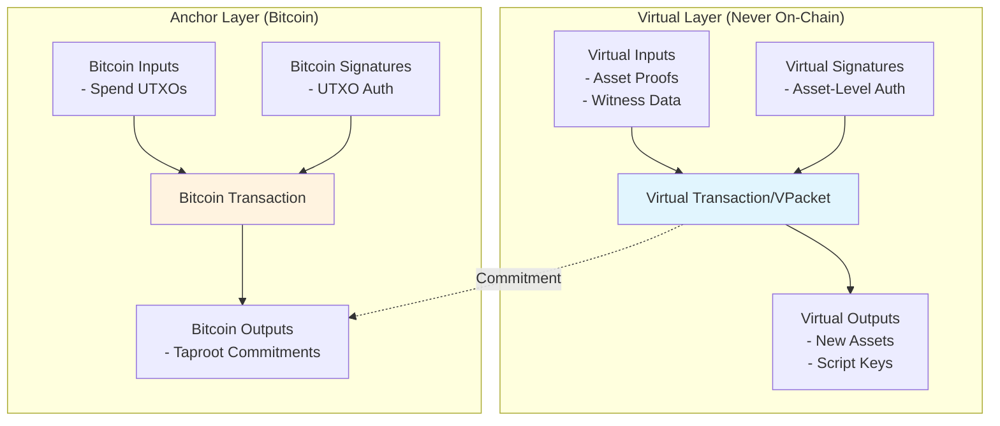
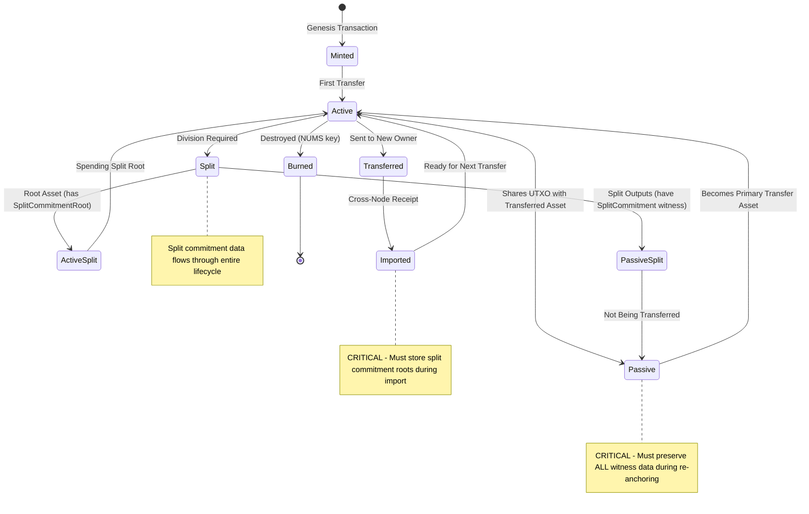
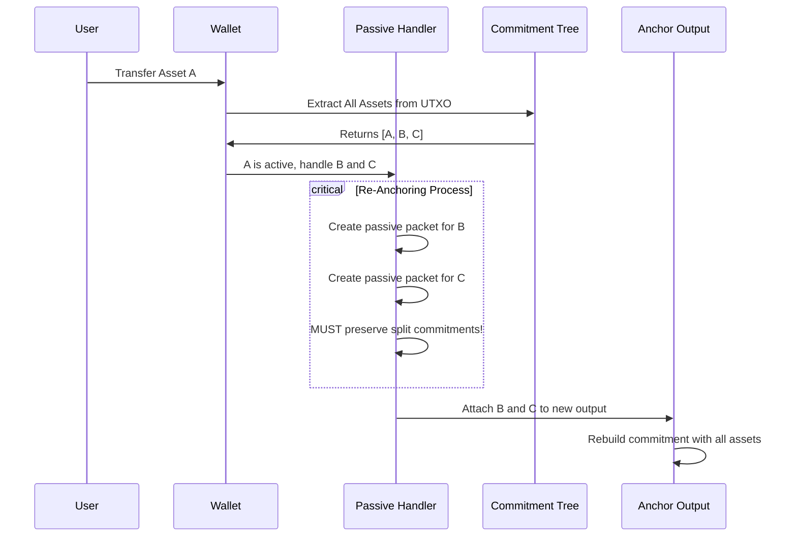
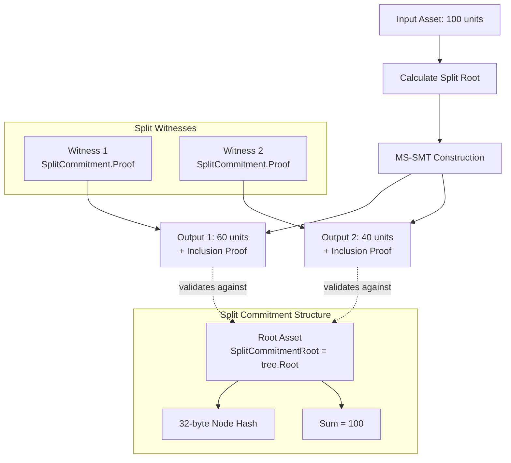
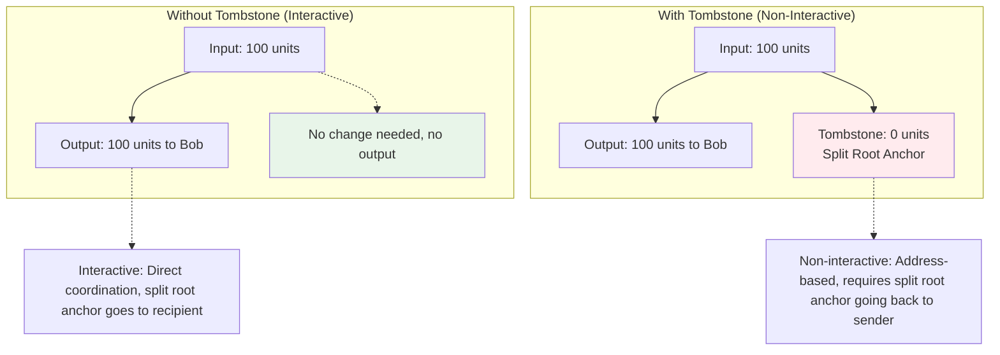
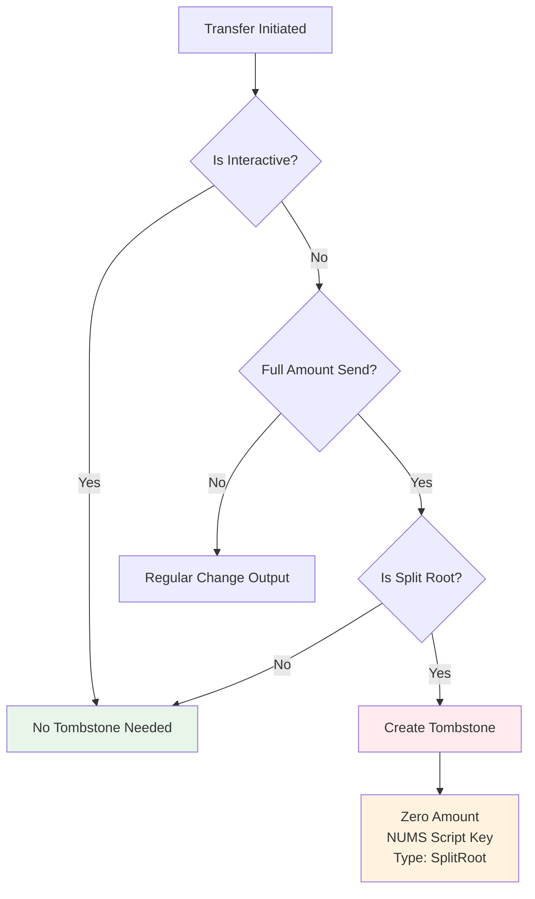
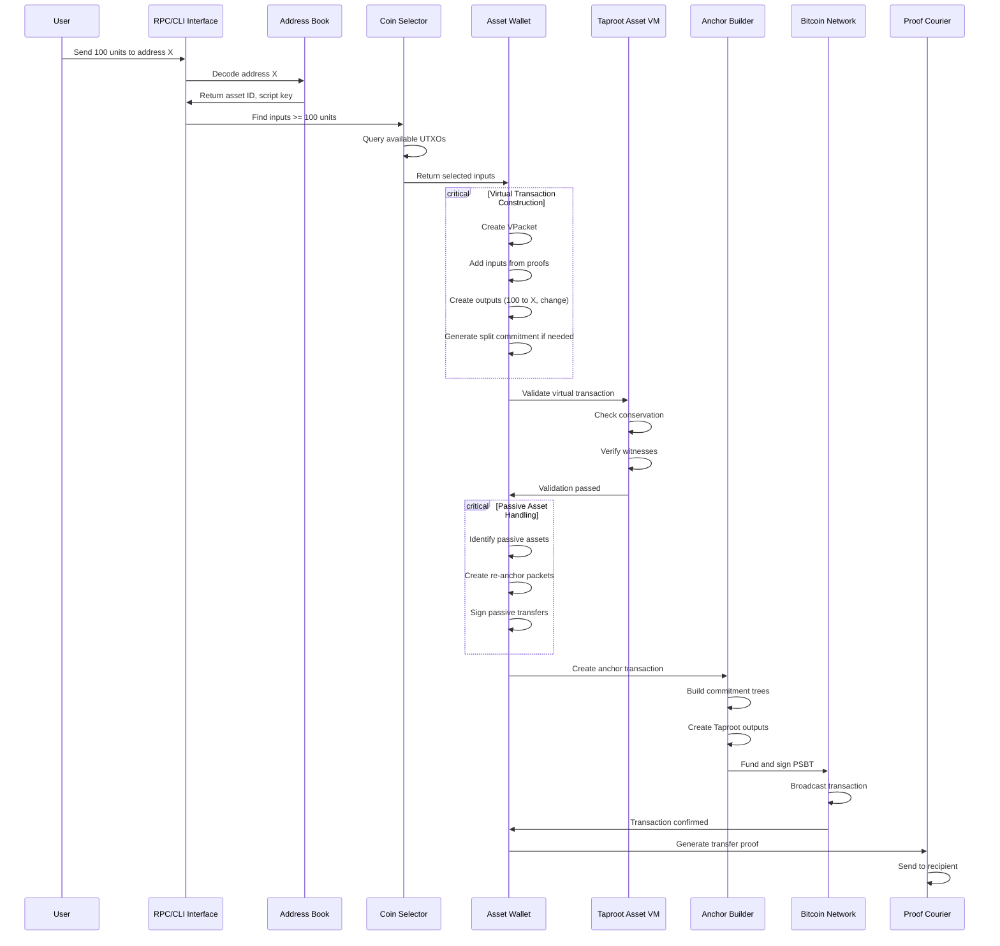

# Taproot Assets Transaction Flow: A Comprehensive Technical Guide

NOTE: This is a document initially created by an agentic LLM analyzing the code
base and then reviewed and edited by a human.
This document covers the specifics of transaction flows. Another, [similar
document covering more broad topics](./developer-deep-dive.md) exists as
well and there is some overlap between these two documents. This document's
target audience is developers working on and contributing to `tapd`'s code
itself.

This document serves as the definitive technical reference for understanding the
Taproot Assets transaction flow architecture, documenting the critical
invariants, subtle interactions, and implementation details that future
engineers must understand to maintain and extend this system safely.

All links to code are based on the commit
[`45586345`](https://github.com/lightninglabs/taproot-assets/tree/45586345).

## Table of Contents

1. [Philosophical Overview](#philosophical-overview)
2. [The Dual-Layer Architecture](#the-dual-layer-architecture)
3. [Asset Lifecycle and State Management](#asset-lifecycle-and-state-management)
4. [Passive Assets: The Hidden Complexity](#passive-assets-the-hidden-complexity)
5. [Split Commitments: Enabling Divisibility](#split-commitments-enabling-divisibility)
6. [Tombstones: The Zero-Value Anchors](#tombstones-the-zero-value-anchors)
7. [Interactive vs Non-Interactive Sends: A Deep Dive](#interactive-vs-non-interactive-sends-a-deep-dive)
8. [Address Versions: V1 vs V2 Evolution](#address-versions-v1-vs-v2-evolution)
9. [V2 Script Key Generation: The Art of Preventing Address Reuse](#v2-script-key-generation-the-art-of-preventing-address-reuse)
10. [Transaction Flow: From Intent to Settlement](#transaction-flow-from-intent-to-settlement)
11. [Critical Invariants and Common Pitfalls](#critical-invariants-and-common-pitfalls)
12. [Implementation Reference](#implementation-reference)

## Philosophical Overview

Taproot Assets represents a fundamental architectural decision: instead of
modifying Bitcoin's consensus rules to support assets, we build a parallel state
machine that commits to Bitcoin for ordering and finality. This design
philosophy permeates every aspect of the system and explains many implementation
choices that might otherwise seem arbitrary.

The protocol operates on two distinct but interconnected layers. The virtual
layer handles all asset-specific logic through virtual transactions that never
touch the blockchain directly. The anchor layer provides the bridge to Bitcoin,
embedding cryptographic commitments that prove asset state transitions without
revealing asset details to Bitcoin nodes. This separation is not merely
conceptual, it's reflected in our code structure, with distinct packages
handling virtual (`tappsbt`, `asset`) versus anchor (`tapfreighter`, `tapsend`)
operations.

## The Dual-Layer Architecture

### Virtual Transactions: The Asset Logic Layer

Virtual transactions represent the pure expression of asset transfer intent.
When you see a `VPacket` in the code (`tappsbt/interface.go`), you're looking at
a structure that exists only in memory and proof files, never on-chain. These
virtual transactions contain the complete asset transfer logic: which assets are
being spent (inputs), where they're going (outputs), and the cryptographic
witnesses that authorize these transfers.



The virtual transaction construction begins in `tappsbt/create.go` with
functions like `FromAddresses()` and `FromProofs()`. These functions don't just
create data structures, they establish the foundation for the entire transfer.
Every virtual input must reference a valid previous asset state (through
proofs), and every output must specify exactly how that asset should exist after
the transfer.

### Anchor Transactions: The Settlement Layer

Anchor transactions serve as the bridge between our virtual asset world and
Bitcoin's UTXO model. The name "anchor" is deliberate: these transactions anchor
virtual state transitions to Bitcoin's immutable ledger. The anchor transaction
creation process (`tapsend/send.go:CreateAnchorTx()`) performs a delicate
dance: it must embed Taproot Asset commitments within standard Bitcoin outputs
while maintaining compatibility with existing Bitcoin infrastructure.

The commitment structure uses Taproot's script path spending to hide our asset
commitments. When Bitcoin nodes see our anchor transactions, they see standard
Taproot outputs. Only those with the asset proofs can derive the commitment
structure and verify the assets within. This is implemented through the
`commitment` package, which builds Merkle Sum Sparse Merkle Trees (MS-SMT) that
commit to all assets in an output while preserving value conservation
properties.

## Asset Lifecycle and State Management

### The Asset State Machine

Assets in our system follow a well-defined state machine that governs their
lifecycle from creation to potential destruction. Understanding these states is
crucial for avoiding the bugs that have plagued earlier implementations.



Each state transition has specific requirements and invariants that must be
maintained. The genesis state establishes the asset's identity through the
genesis point (`tapdb/assets_store.go:upsertGenesisPoint()`).

### Active vs Passive Assets: A Critical Distinction

The distinction between active and passive assets is fundamental to
understanding the protocol's efficiency and complexity. Active assets are those
explicitly involved in the current transfer—they're the reason the transaction
exists. Passive assets, however, are innocent bystanders that happen to share
the same UTXO.

Consider a UTXO containing three different assets: Alice wants to send Asset A
to Bob, but Assets B and C also live in that UTXO. Asset A becomes the active
asset, while B and C are passive. When Alice spends the UTXO to transfer Asset
A, she must also handle Assets B and C—they need new homes (re-anchoring) or
they'd be destroyed.

The re-anchoring process occurs in 
`tapfreighter/wallet.go:createPassivePacket()`. This function creates virtual
transactions that move passive assets from their current UTXO to a new one,
preserving their exact state.

## Passive Assets: The Hidden Complexity

### The Re-Anchoring Process

When designing the passive asset system, the goal was efficiency: allow
multiple assets to coexist in a single UTXO without requiring separate
transactions for each. This decision introduced significant complexity that
manifests throughout the codebase.

The passive asset creation flow begins when we identify which assets aren't
involved in the active transfer. The `tapsend` package provides 
`RemovePacketsFromCommitment()` to extract passive assets from a commitment
after removing active transfers. These passive assets must then be re-anchored
to maintain their existence.



The critical part to understand here is that a re-anchored asset chan change its
type when being re-anchored. If a passive asset previously was a split output,
it then becomes a normal root asset output, which on the asset-level looks like
a normal interactive full-value transfer.

Also, during the re-anchoring transfer, the same script key is re-used but a new
signature is created.

This also implies that any custom-script assets can never be passive assets, as
the internal re-anchoring logic can only sign normal BIP-86 script keys.

That means for custom script assets, all assets in an UTXO that is being spent
must be signed by the external application.

### Anchor Output Selection

Choosing where to place passive assets involves a decision
implemented in `determinePassiveAssetAnchorOutput()`. The function prefers, in
order:

1. **Split root outputs**: These typically represent change and are controlled
   by the sender
2. **Outputs with new script keys**: These indicate transfers to self
3. **New anchor outputs**: Created only when necessary

This hierarchy ensures passive assets remain accessible to their owner while
minimizing on-chain footprint.

## Split Commitments: Enabling Divisibility

### The Mathematics of Asset Splits

Split commitments solve a fundamental problem: how do you prove that dividing an
asset conserves its total value? The solution employs Merkle Sum Sparse Merkle
Trees (MS-SMT), a data structure that combines the proof properties of Merkle
trees with value summation.

When an asset splits, the process creates a cryptographic proof that the sum of
outputs equals the input. This happens in 
`commitment/split.go:NewSplitCommitment()`, which constructs the MS-SMT and
generates proofs for each output.



The root asset (the one being split) receives a `SplitCommitmentRoot` containing
the tree root hash and sum. Each split output gets a `SplitCommitment` in its
witness, containing the proof that validates against this root.

### Split Commitment Validation

The validation logic in `vm/vm.go:validateSplit()` enforces several invariants:

1. **Conservation**: Sum of split outputs must equal input amount
2. **Proof Validity**: Each split's proof must validate against the root
3. **Type Consistency**: All splits must be the same asset type
4. **Script Key Rules**: Zero-value splits must use unspendable keys

These checks ensure splits maintain asset integrity while enabling flexible
division.

## Tombstones: The Zero-Value Anchors

### Understanding Tombstones

Tombstones are a critical but often misunderstood component of the Taproot
Assets protocol. They solve a fundamental problem: how to maintain valid
commitment structures in non-interactive transfers when sending entire asset
amounts without requiring unnecessary change output assets.

A tombstone is a zero-value asset output that serves as an anchor for the split
commitment root and transfer witness in full-value, non-interactive transfers.
The name "tombstone" reflects its nature—it marks the "death" of the sender's
ownership while preserving the cryptographic proof structure needed for
validation.



### Why Tombstones Are Necessary

The necessity of tombstones stems from the protocol's split commitment
architecture. In non-interactive transfers:

1. **Split Commitment Requirement**: The protocol requires a split commitment to
   prove value conservation and to achieve predictability of split outputs
   required for V0 and V1 on-chain TAP address receives
2. **Root Asset Location**: The split commitment root must live somewhere in the
   transaction outputs
4. **Zero-Value Problem**: When sending the full amount, there's no natural
   change output

The tombstone solves this by creating a zero-value output that the sender
controls, which can house the split commitment root. This is implemented in
`tapsend/allocation.go:642`:

```go
// Create a zero-amount tombstone output for the split root, if
// there is no change.
vOut.Type = tappsbt.TypeSplitRoot
vOut.Amount = 0
vOut.ScriptKey = asset.NUMSScriptKey  // Un-spendable key
```

### Tombstone Creation Logic

The decision to create a tombstone follows a specific logic tree
(`tapsend/allocation.go:634-644`):



### Tombstone Script Keys

Tombstones use a special "Nothing Up My Sleeve" (NUMS) script key that makes
them provably un-spendable. This is crucial for security—tombstones should never
hold value and should never be spendable:

```go
// From asset/asset.go
var NUMSScriptKey = ScriptKey{
    PubKey: NUMSPubKey,  // Provably un-spendable public key
    Type:   ScriptKeyTombstone,
}
```

The un-spendable nature is verified in `tapfreighter/chain_porter.go:1877-1880`:

```go
unSpendable, _ := scriptKey.IsUnSpendable()
if unSpendable {
    setScriptKeyType(vOut, asset.ScriptKeyTombstone)
}
```

### Tombstones in Different Address Versions

The tombstone requirement varies by address version:

- **V0/V1 Addresses**: Always require tombstones for full-value non-interactive
  sends
- **V2 Addresses**: Support interactive transfers through send manifests,
  avoiding tombstone requirement
- **Burns**: Never require tombstones (always interactive, as there is no
  "receiver")
- **Channel Operations**: Never require tombstones (always interactive)

### Common Tombstone Pitfalls

1. **Missing Tombstone Detection**: Failing to create tombstones in
   non-interactive full sends causes validation failures
2. **Incorrect Type Assignment**: Not marking tombstone outputs with
   `ScriptKeyTombstone` type
3. **Spendable Tombstones**: Using regular script keys instead of NUMS keys
4. **Tombstone in Interactive Transfers**: Creating unnecessary tombstones in
   interactive transfers

## Interactive vs Non-Interactive Sends: A Deep Dive

### The Fundamental Distinction

The interactive vs non-interactive distinction is one of the most important
architectural decisions in Taproot Assets. It determines transaction structure,
efficiency, and user experience.

**Interactive Sends** occur when the sender and receiver coordinate during the
transfer:
- Direct communication between parties
- Receiver provides their script key directly
- Proof delivery can happen through direct communication or using proof courier
  mechanisms
- More efficient on-chain footprint since no tombstones are required for
  full-value sends

**Non-Interactive Sends** occur when sending to a V0/V1 TAP address without
receiver coordination:
- Sender only has the receiver's TAP address
- Must use proof courier for delivery
- Requires split commitment structure
- Always creates change/tombstone outputs


### Implementation Details

#### Interactive Send Construction

Interactive sends are created via `tappsbt/create.go:ForInteractiveSend()`:

```go
func ForInteractiveSend(id asset.ID, amount uint64, scriptKey asset.ScriptKey,
    anchorOutIdx uint32) (*VPacket, error) {
    
    vPkt := &VPacket{
        Inputs: []*VInput{},
        Outputs: []*VOutput{{
            Amount:             amount,
            AssetVersion:       asset.V0,
            Type:               TypeSimple,
            Interactive:        true,  // Key distinction
            AnchorOutputIndex:  anchorOutIdx,
            ScriptKey:          scriptKey,
        }},
    }
    // No automatic change output creation
    return vPkt, nil
}
```

#### Non-Interactive Send Construction

Non-interactive sends via `tappsbt/create.go:FromAddresses()`:

```go
func FromAddresses(spendAddr []*address.Tap, changeIdx uint32) (*VPacket, error) {
    outputs := make([]*VOutput, 0, len(spendAddr)+1)
    
    // Create outputs for each address
    for idx, addr := range spendAddr {
        out := &VOutput{
            Amount:               addr.Amount,
            Interactive:          false,  // Non-interactive by definition
            AnchorOutputIndex:    uint32(idx),
            ScriptKey:           addr.ScriptKey,
            ProofDeliveryAddress: addr.ProofCourierAddr,  // Required for delivery
        }
        outputs = append(outputs, out)
    }
    
    // Always pre-allocate change/tombstone output
    outputs = append(outputs, &VOutput{
        Type:              TypeSplitRoot,
        AnchorOutputIndex: changeIdx,
        Interactive:       false,
    })
    
    return &VPacket{Outputs: outputs}, nil
}
```

### The VOutIsInteractive Predicate

The protocol uses a specific predicate to determine if an output is interactive
(`tappsbt/interface.go:130`):

```go
// VOutIsInteractive returns true if the virtual output is interactive.
VOutIsInteractive = func(o *VOutput) bool {
    switch {
    // Burns are always interactive
    case o.Type.IsBurn():
        return true
    
    // Explicitly marked interactive outputs
    case o.Interactive:
        return true
    
    // Split roots for passive assets are interactive
    case o.Type == TypePassiveSplitRoot:
        return true
    
    default:
        return false
    }
}
```

### Use Case Matrix

| Use Case | Type | Reason |
|----------|------|--------|
| Address-based payment | Non-Interactive | No receiver coordination |
| Lightning channel funding | Interactive | Both parties online |
| Asset burn | Interactive | Sender controls entire flow |
| Exchange deposit | Non-Interactive | Exchange provides address |
| P2P trade | Interactive | Direct negotiation |
| Passive asset re-anchor | Interactive | Self-transfer |
| Donation | Non-Interactive | One-way transfer |

## Address Versions: V0/V1 vs V2 Evolution

### The Journey from Fixed Keys to Reusable Addresses

The evolution of Taproot Asset addresses tells a story of learning from
real-world usage patterns and adapting to user needs. When V0/V1 addresses
launched as the first production version they embodied a
straightforward approach: one address, one script key, one asset type, no
interaction needed. This simplicity served initial adoption well, but as the
ecosystem matured, fundamental limitations emerged that threatened to constrain
the protocol's potential.

The most glaring issue with V0/V1 addresses was their handling of script keys.
Every V0/V1 address contains a fixed script key (`address/address.go`) that's
used directly for all transfers. While conceptually simple, this design created
a specific problem: Repeated transfers to the same TAP address created
identical on-chain outputs, making transactions trivially linkable and
impacting privacy.

Beyond the privacy implications V0/V1 addresses suffered from another constraint
that hampered real-world usage: they bound specific amounts to the address
itself. When generating a V0/V1 address, you had to specify exactly how many
units of an asset should be sent to that address. This meant that invoice systems
needed to generate a new address for every payment amount, donation platforms
couldn't create open-ended contribution addresses, and exchanges had to either
dictate deposit amounts or generate addresses on-demand for each user's intended
deposit. The rigid coupling between address and amount made V0/V1 addresses feel
more like single-use payment requests than true reusable destinations.

The third and most impactful limitation of V0/V1 addresses was that they could
only be used for specific asset IDs. Meaning that fungible grouped assets were
not supported.

V2 addresses emerged from recognizing that address reuse wasn't just a
nice-to-have feature—it was essential for practical adoption. And major
stablecoin issuers would issue grouped fungible assets.
So V2 addresses can be "zero-value" addresses that can receive any assets from
a specific group — the amount isn't bound to the address but instead specified
by the sender at transfer time. And any asset ID the sender owns of the asset
group specified in the address could be sent, not just a single one.
This flexibility means a charity can post a single V2 address and receive
donations of any amount, exchanges can display permanent deposit addresses
without knowing in advance how much users will send, and payment systems can use
addresses as true persistent identifiers rather than one-time payment codes.

### The Architectural Shift: From Script Keys to Internal Keys

Where V0/V1 addresses contain a script key that's used directly, V2 addresses
contain what we call an internal key—a key that serves as the seed for deriving
unique script keys for each asset type. This shift might seem subtle, but it
fundamentally changes the protocol's capabilities. The `ScriptKeyForAssetID()`
function demonstrates this:

```go
func (a *Tap) ScriptKeyForAssetID(assetID asset.ID) (*btcec.PublicKey, error) {
    if a.Version != V2 {
        return &a.ScriptKey, nil  // V1: Direct usage, no derivation
    }
    
    // V2: Each asset gets its own derived script key
    scriptKey, err := asset.DeriveUniqueScriptKey(
        a.ScriptKey,  // Now an internal key for derivation
        assetID,
        asset.ScriptKeyDerivationUniquePedersen,
    )
    return scriptKey.PubKey, nil
}
```

This derivation mechanism means that a single V2 address can safely receive any
number of different asset IDs without collision. Each asset ID produces a
unique script key through Pedersen commitments, creating isolated namespaces
within the same address.

### Send Manifests: The Missing Piece

The support for arbitrary asset IDs created a new challenge: if every transfer
produces unpredictable on-chain outputs, how does the receiver know where to
look for their assets? V0/V1's predictable outputs meant receivers could simply
scan for their calculated Taproot outputs. V2's dynamic outputs broke this model
entirely.

Enter send manifests, V2's solution to the discoverability problem. The
`UsesSendManifests()` function (`address/address.go:391-397`) signals that an
address expects to receive detailed manifests describing incoming transfers.
These manifests, transmitted through the authmailbox proof courier protocol,
contain all the information needed to locate and claim assets: the exact
on-chain location, the asset IDs and amounts and the derived script keys used.
From that, the proof data needed for validation could be fetched by the
receiver, using the same proof courier universe server.

```go
func (a *Tap) UsesSendManifests() bool {
    return a.Version == V2  // Only V2 addresses use manifests
}
```

This manifest-based approach transforms what could have been a limitation into
a powerful feature. Because receivers get explicit notification of incoming
transfers, V2 addresses enable complex multi-asset atomic operations. A single
transaction can transfer different assets to the same V2 address, with the
manifest ensuring the receiver can claim everything. This opens doors for
sophisticated DeFi protocols, atomic swaps, and batch payment systems that were
impossible with V1's constraints.

### Commitment Compatibility: The Hidden Complexity

The versioning story extends beyond addresses to the commitment structures
themselves. V0 addresses, being from the experimental era, could use either V0
or V1 commitment versions—the protocol can't determine which without examining
the actual commitment tree. V1 and V2 addresses, however, standardized on
commitment V2, providing consistency and predictability:

```go
func CommitmentVersion(vers Version) (*commitment.TapCommitmentVersion, error) {
    switch vers {
    case V0:
        return nil, nil  // Ambiguous: could be either V0 or V1 commitment
    case V1, V2:
        return fn.Ptr(commitment.TapCommitmentV2), nil  // Standardized
    default:
        return nil, ErrUnknownVersion
    }
}
```

This standardization matters because commitment versions affect how assets are
encoded in the Taproot tree structure. V2 commitments introduced optimizations
and additional metadata fields that improve verification efficiency. By tying
address versions to commitment versions, the protocol ensures that senders and
receivers have compatible expectations about data structures.

### Real-World Impact: Exchange Integration

The practical benefits of V2 addresses become clear when considering exchange
integration. With V1 addresses, an exchange needed to generate a new address for
each asset type a user might deposit, then monitor multiple addresses per user.
This created operational complexity: more addresses to track, more database
entries to maintain, and confusion for users who might send assets to the wrong
address.

V2 addresses eliminate this friction entirely. An exchange can generate a single
V2 address per user, display it prominently in the deposit interface, and accept
any supported Taproot Asset without modification. The address can be reused
indefinitely without privacy concerns thanks to the random alt leaf mechanism.
When a deposit arrives, the send manifest provides all necessary information for
crediting the user's account. This simplicity has accelerated exchange
adoption—operators appreciate the reduced complexity, and users enjoy the
familiar experience of having a stable deposit address.

### The Migration Path: Coexistence and Compatibility

The transition from V1 to V2 addresses showcases thoughtful protocol evolution.
Rather than forcing a hard migration, the protocol supports both versions
simultaneously. V2 nodes can receive from V1 addresses, ensuring backward
compatibility. When a V1 sender transfers to a V2 address, the system
automatically handles the impedance mismatch—the V1 sender creates traditional
proofs while the V2 receiver expects manifests, and the proof courier bridges
this gap.

This coexistence strategy reflects a deeper philosophy: protocol upgrades should
enhance capabilities without breaking existing deployments. Organizations that
invested in V1 infrastructure can continue operating while gradually migrating
to V2 at their own pace. New deployments can start directly with V2, benefiting
from its advanced features without dealing with legacy constraints.

### Looking Forward: The Foundation for Future Innovation

V2 addresses represent more than just an incremental improvement—they establish
a foundation for future protocol enhancements. The manifest system creates a
communication channel between senders and receivers that can carry additional
metadata. The unique script key derivation enables each asset type to have
distinct transfer rules. The separation between internal keys and derived script
keys allows for sophisticated key management schemes, including hardware wallet
integration and threshold signatures.

As the Taproot Assets ecosystem continues to evolve, V2 addresses provide the
flexibility needed for innovation while maintaining the security and simplicity
users expect. They demonstrate that thoughtful protocol design can solve
real-world problems without compromising on fundamental principles. The journey
from V1's fixed keys to V2's dynamic derivation illustrates how protocols can
learn from deployment experience and adapt to serve their users better.

## V2 Script Key Generation: The Art of Preventing Address Reuse

### The Address Reuse Problem and Its Solution

Traditional Bitcoin wallets discourage address reuse for privacy reasons—every
payment to the same address creates an obvious on-chain link. V2 Taproot Asset
addresses solve this elegantly through a sophisticated key derivation mechanism
that ensures every transfer creates a unique on-chain footprint, even when the
same address is used repeatedly.

The magic happens through a two-layer approach implemented in 
`prepareV2Outputs()` (`tapfreighter/wallet.go:300`). When a sender prepares a
transfer to a V2 address, the system doesn't simply use the address's script key
directly. Instead, it embarks on a cryptographic journey that transforms the
receiver's internal key into something unique for each asset and each transfer.

### Understanding Pedersen Commitments in Script Keys

At the heart of V2's uniqueness guarantee lies the Pedersen commitment, a
cryptographic primitive that allows us to commit to data in a way that's both
binding and hiding. The `DeriveUniqueScriptKey()` function
(`asset/asset.go:1276`) implements this through what might initially seem like
cryptographic alchemy but is actually an elegant solution to a complex problem.

When deriving a unique script key, the system starts with the receiver's
internal key from their V2 address. This internal key represents the receiver's
control, but using it directly for every asset would create collisions in the
proof universe—different assets would compete for the same script key namespace.
To prevent this, the derivation process creates a non-spendable script leaf
containing a Pedersen commitment:

```go
// The commitment point is NUMS_key + asset_id * G
commitmentPoint := TweakedNumsKey(assetID[:])
leaf := txscript.NewBaseTapLeaf(
    txscript.NewRawLeafScript(OP_CHECKSIG, commitmentPoint),
)
```

This commitment point is mathematically unique for each asset ID. The "NUMS"
(Nothing Up My Sleeve) key ensures that no one can actually spend using this
script path—it's provably unspendable. The final script key emerges from
combining the receiver's internal key with this commitment leaf:

```go
scriptPubKey := txscript.ComputeTaprootOutputKey(
    &internalKey, leaf.TapHash(),
)
```

The beauty of this approach is that the receiver maintains full control through
their internal key while each asset gets its own unique script key. Hardware
wallets that only understand miniscript policies can still sign for these
outputs because the spending path uses the internal key directly—the commitment
leaf is never actually executed.

### The Random Alt Leaf Innovation

While Pedersen commitments solve the problem of different assets colliding on
their script keys, V2 addresses go further to ensure that even repeated
transfers of the same asset amount create distinct on-chain outputs. This is
where the random alternative leaf mechanism comes into play, implemented in the
latter half of `prepareV2Outputs()`.

The process is deceptively simple yet cryptographically profound. For each V2
output, the system generates a completely random private key:

```go
randKey, err := btcec.NewPrivateKey()
randScriptKey := asset.NewScriptKey(randKey.PubKey())
randAltLeaf, err := asset.NewAltLeaf(randScriptKey, asset.ScriptV0)
vOut.AltLeaves = append(vOut.AltLeaves, randAltLeaf)
```

This random leaf becomes part of the Taproot Asset commitment tree. Since the
commitment tree's root depends on all its leaves, adding a random leaf ensures
that the final on-chain Taproot output is unique for every transfer. The elegant
aspect is that this randomness doesn't affect the recipient's ability to claim
the assets—the random leaf is an alternative that's never actually used,
existing solely to provide uniqueness.

### The Complete Picture: From Address to Output

Understanding how these pieces fit together requires following the complete flow
from a V2 address to an on-chain output. The journey begins when a sender
decodes a V2 address, extracting the receiver's internal key. This internal key
isn't used directly; instead, it serves as the foundation for a series of
transformations.

First, the `prepareV2Outputs()` function identifies outputs destined for V2
addresses by checking if they use send manifests (`UsesSendManifests()`). For
each such output, it derives a unique script key using the Pedersen commitment
method. This creates a script key that's specific to both the receiver and the
asset being sent.

Next, the random alt leaf is added to ensure transfer-level uniqueness. This
might seem like overkill—after all, the Pedersen commitment already provides
asset-level uniqueness—but it serves a crucial privacy function. Without it, an
observer could potentially link multiple transfers of the same asset to the same
V2 address by analyzing the commitment structure.

Finally, when the commitment tree is built and the Taproot output is computed,
all these elements combine. The receiver's internal key becomes the Taproot
internal key, the Pedersen commitment and random leaves form part of the script
tree, and the resulting Taproot output key is what appears on the Bitcoin
blockchain.

### Why This Complexity Matters

The sophistication of V2's script key generation might seem excessive until you
consider the alternatives. V0 and V1 addresses use fixed script keys, which
means sending different assets to the same address creates identical on-chain
outputs, destroying privacy.

V2's approach solves multiple problems simultaneously. The Pedersen commitment
ensures that each asset type gets its own namespace within a single address,
preventing collisions. The random alt leaves ensure that each transfer is unique
on-chain, preserving privacy even with address reuse. And the use of the
internal key as the Taproot key means hardware wallets can still sign
transactions without understanding the complex commitment structure.

This design also enables a crucial feature: send manifests. Because V2 addresses
generate unpredictable on-chain outputs, receivers can't simply watch the
blockchain for incoming transfers. Instead, senders create manifests
(`createSendManifests()` in `tapfreighter/wallet.go:383`) that inform receivers
about the exact location and structure of their incoming assets. This
manifest-based approach enables more complex transfer patterns, including
grouped assets and multi-asset atomic swaps.

### The Cryptographic Guarantees

The security of V2's unique script key generation rests on well-established
cryptographic foundations. The Pedersen commitment's security comes from the
discrete logarithm problem—breaking it would require solving one of
cryptography's fundamental hard problems. The randomness of alt leaves relies
on the security of Bitcoin's random number generation, which has been
battle-tested over more than a decade.

Together, these mechanisms provide strong guarantees. Two different assets sent
to the same V2 address will never collide because they'll have different
Pedersen commitments. Two identical transfers will never create the same
on-chain output because they'll have different random alt leaves. And throughout
all of this, the receiver maintains complete control through their internal key,
which can be secured in hardware wallets or complex multisig arrangements.

The implementation in `prepareV2Outputs()` carefully orchestrates these
mechanisms, ensuring that every V2 transfer benefits from these guarantees
without requiring any special action from users. From their perspective, they
simply provide an address and receive assets—the complexity remains hidden
beneath an elegant interface.

## Transaction Flow: From Intent to Settlement

### The Complete Journey

Understanding the end-to-end flow requires following an asset from user intent
through on-chain settlement. This journey touches nearly every major component
in the system.



### Phase 1: Intent and Preparation

The flow begins when a user expresses intent to transfer assets. The address
decoding (`address/address.go`) extracts the recipient's script key and asset
requirements. For V2 addresses, this includes proof courier information for
later delivery.

Coin selection (`tapfreighter/coin_select.go`) then identifies suitable inputs.
This isn't simple UTXO selection—we must consider asset types, amounts, and
whether assets are in groups. The selector returns `AnchoredCommitment`
structures containing both the assets and their Bitcoin anchor information.

### Phase 2: Virtual Transaction Construction

The virtual packet creation (`tappsbt/create.go:FromAddresses()`) establishes
the transaction structure. For address sends, we know we need change outputs
(non-interactive), so the function pre-allocates space. The funding process
(`tapfreighter/wallet.go:FundPacket()`) then populates inputs and calculates
change amounts.

If the transfer requires asset division, split commitment creation occurs here.
The split logic must carefully track which output becomes the "root" (contains
the split commitment root) versus split outputs (contain proofs).

### Phase 3: Commitment and Anchoring

With virtual transactions prepared, commitment tree construction begins
(`tapsend/send.go:CreateOutputCommitments()`). This process builds MS-SMT
structures for each anchor output, carefully avoiding key collisions and
maintaining proof structures.

The anchor transaction template (`tapsend/send.go:CreateAnchorTx()`) initially
contains dummy outputs. The real commitment data is inserted by
`UpdateTaprootOutputKeys()`, which replaces dummy values with actual Taproot
commitment scripts.

### Phase 4: Settlement and Proof Distribution

After Bitcoin confirmation, proof generation creates the evidence recipients
need to claim their assets. The proof includes the Bitcoin transaction, the
Merkle proof linking the asset to the Taproot output, and the complete history
back to genesis.

## Implementation Reference

### Critical Files and Their Responsibilities

#### Core Asset Logic
- `asset/asset.go`: Asset structure definitions, including split commitment
  fields
- `asset/witness.go`: Witness structures and validation, including
  `IsSplitCommitWitness()`
- `asset/tx.go`: Virtual transaction primitives

#### Transfer Orchestration
- `tapfreighter/wallet.go`: Main wallet operations, including
  `createPassivePacket()` (bug #1 location)
- `tapfreighter/coin_select.go`: Asset input selection
- `tapsend/send.go`: High-level transfer coordination
- `tapsend/allocation.go`: Output allocation and tombstone logic

#### Commitment Management
- `commitment/tap.go`: Taproot Asset commitment construction
- `commitment/split.go`: Split commitment creation and validation
- `mssmt/`: Merkle Sum Sparse Merkle Tree implementation

#### Storage Layer
- `tapdb/assets_common.go`: Asset storage operations, including
  `upsertAssetsWithGenesis()` (bug #2 location)
- `tapdb/assets_store.go`: Asset queries and updates
- `proof/proof.go`: Proof construction and verification

#### Virtual Transaction Layer
- `tappsbt/interface.go`: Virtual PSBT definitions
- `tappsbt/create.go`: Virtual packet construction, including V2 address
  handling
- `vm/vm.go`: Taproot Asset VM for validation

### Key Functions to Understand

1. **`FundAddressSend()`** (`tapfreighter/wallet.go:251`): Entry point for
   address-based transfers
2. **`createPassivePacket()`** (`tapfreighter/wallet.go:489`): Passive asset
   re-anchoring
3. **`NewSplitCommitment()`** (`commitment/split.go:142`): Split creation
4. **`upsertAssetsWithGenesis()`** (`tapdb/assets_common.go:209`): Asset storage
   with genesis
5. **`CreateOutputCommitments()`** (`tapsend/send.go:943`): Commitment tree
   construction
6. **`validateSplit()`** (`vm/vm.go:695`): Split commitment validation

### Testing Strategy

Comprehensive testing must cover:

1. **State Transitions**: Test assets moving through all possible states
2. **Cross-Node Scenarios**: Import/export with full state preservation
3. **Split Lifecycles**: Create, transfer, and spend split assets
4. **Passive Asset Scenarios**: Multiple assets in single UTXOs
5. **Address Versions**: V0, V1, and V2 address handling

Example test pattern:
```go
// Test split asset becoming passive then imported
func TestSplitPassiveImport(t *testing.T) {
    // 1. Create and split asset
    asset := mintAsset(t, 100)
    splits := splitAsset(t, asset, []uint64{60, 40})
    
    // 2. Transfer one split, making other passive
    transferAsset(t, splits[0])
    assertPassive(t, splits[1])
    
    // 3. Export and import on new node
    proof := exportProof(t, splits[1])
    imported := importProof(t, proof)
    
    // 4. Verify split commitment preserved
    require.NotNil(t, imported.PrevWitnesses[0].SplitCommitment)
    
    // 5. Ensure imported asset is spendable
    transferAsset(t, imported)
}
```
