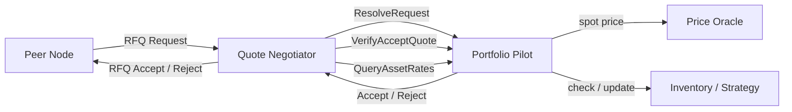

# The Portfolio Pilot: A Pluggable Decision Layer for Taproot Asset RFQs

## Table of Contents

- [Introduction](#introduction)
- [Where the Pilot Sits](#where-the-pilot-sits)
- [The PortfolioPilot Interface](#the-portfoliopilot-interface)
  - [ResolveRequest](#resolverequest)
  - [VerifyAcceptQuote](#verifyacceptquote)
  - [QueryAssetRates](#queryassetrates)
  - [Lifecycle and Concurrency](#lifecycle-and-concurrency)
- [Orders, Requests, and Accepts](#orders-requests-and-accepts)
  - [The Asset Rate Convention](#the-asset-rate-convention)
  - [Buy and Sell, From Whose Perspective?](#buy-and-sell-from-whose-perspective)
  - [RequestConstraints: One Shape for Two Sides](#requestconstraints-one-shape-for-two-sides)
- [The Limit-Order Model](#the-limit-order-model)
  - [Rate Bounds](#rate-bounds)
  - [Min Amount and Max Amount](#min-amount-and-max-amount)
  - [Execution Policy: IOC and FOK](#execution-policy-ioc-and-fok)
  - [Fill Caps](#fill-caps)
  - [The Constraint Pipeline](#the-constraint-pipeline)
  - [Status Codes and Reject Codes](#status-codes-and-reject-codes)
- [Price Query Intents](#price-query-intents)
- [The InternalPortfolioPilot](#the-internalportfoliopilot)
  - [Tolerance Checking](#tolerance-checking)
  - [Expiry Bounds](#expiry-bounds)
- [The RpcPortfolioPilot](#the-rpcportfoliopilot)
  - [Wire Format](#wire-format)
  - [Failure Semantics](#failure-semantics)
- [Building a Custom Pilot](#building-a-custom-pilot)
  - [Sketch: An Order-Book-Backed Pilot](#sketch-an-order-book-backed-pilot)
  - [Sketch: A Circular Swap Pilot](#sketch-a-circular-swap-pilot)
  - [Composition with External Hedging](#composition-with-external-hedging)
- [OTC Desks](#otc-desks)
  - [Customer Identity and Tiering](#customer-identity-and-tiering)
  - [Spreads, Skews, and Inventory](#spreads-skews-and-inventory)
  - [Last Look](#last-look)
- [Exchanges](#exchanges)
  - [Continuous Double Auctions Atop a Quote Protocol](#continuous-double-auctions-atop-a-quote-protocol)
  - [Settlement and Reconciliation](#settlement-and-reconciliation)
  - [Crash Recovery and Audit](#crash-recovery-and-audit)
- [Operational Concerns](#operational-concerns)
- [Configuration](#configuration)
- [Testing](#testing)
- [Future Directions](#future-directions)

## Introduction

The portfolio pilot is the decision layer of the RFQ subsystem. When a peer
asks tapd for a price, the negotiator does not pick one itself. It hands the
request to the pilot and asks two things in turn: *would you take this trade,
and at what rate?*, then, once the counterparty responds, *is this rate still
acceptable?* The pilot answers; the negotiator carries those answers onto the
wire.

That separation is the point. The RFQ protocol fixes the message format, the
state machine, and the routing tricks that bind a quote to its eventual HTLC.
It does not fix policy. Whether a node quotes off a single spot reference, off
a private order book, off an internal inventory model, or off something more
exotic is a question the pilot decides. Replacing the default pilot replaces
the trading strategy without touching the protocol.

This document is for the developer who plans to write such a pilot. It covers
the interface the pilot must satisfy, the limit-order semantics the protocol
already enforces, the price-query intents that distinguish hints from binding
quotes, and the things an OTC desk or an exchange operator should think about
before treating tapd as a market-making front end. The Go sketches throughout
are deliberately small. They are not production code. They show the shape of
a working pilot so you can grow your own from there.

For the RFQ protocol that sits underneath, see
[rfq_architecture.md](rfq_architecture.md). For a runnable RPC pilot
implementation, see
[docs/examples/basic-portfolio-pilot/main.go](examples/basic-portfolio-pilot/main.go).

## Where the Pilot Sits



The pilot sees three kinds of call. *ResolveRequest* is the inbound case: a
peer has asked us for a quote, and the pilot decides whether to accept it and
on what terms. *VerifyAcceptQuote* is the outbound case: we asked a peer for
a quote, the peer answered, and the pilot decides whether we can live with
the rate they came back with. *QueryAssetRates* is a pure pricing call used
to attach hints to outgoing requests and to drive higher-level pricing UIs.

The negotiator places these calls from goroutines. It expects the pilot to be
slow. The default pilot is in-process and quick, but an external pilot may
hold a connection to a market data feed, a database, or a hedging venue, and
any of those can stall. The negotiator never blocks its main loop on a pilot
response.

## The PortfolioPilot Interface

The interface is defined in
[rfq/portfolio_pilot.go](../rfq/portfolio_pilot.go).

```go
type PortfolioPilot interface {
    ResolveRequest(ctx context.Context, req rfqmsg.Request) (ResolveResp, error)
    VerifyAcceptQuote(ctx context.Context, acc rfqmsg.Accept) (QuoteRespStatus, error)
    QueryAssetRates(ctx context.Context, q AssetRateQuery) (rfqmsg.AssetRate, error)
    Close() error
}
```

Four methods, two return shapes, one operational rule.

### ResolveRequest

The negotiator calls `ResolveRequest` when a peer asks for a quote. The
return type is a tagged union:

```go
type ResolveResp struct {
    outcome    fn.Either[rfqmsg.AssetRate, rfqmsg.RejectErr]
    fillAmount fn.Option[uint64]
}
```

A pilot that wants to trade builds an `rfqmsg.AssetRate` (a fixed-point asset
rate plus an expiry) and returns it through `NewAcceptResolveResp`. If the
pilot is willing to trade only a portion of the request, it sets the optional
`fillAmount`, in asset units for a buy request and in millisatoshis for a
sell request. The negotiator carries that cap back to the peer in the
Accept's `AcceptedMaxAmount` field, and the peer's pilot then sees it during
`VerifyAcceptQuote`.

A pilot that wants to decline returns a structured rejection through
`NewRejectResolveResp`. The wire protocol surfaces a small set of reject
codes (`MinFillNotMetRejectCode`, `PriceBoundMissRejectCode`,
`FOKNotViableRejectCode`, `FillExceedsMaxRejectCode`,
`PriceOracleUnavailableRejectCode`, and the generic
`PriceOracleUnspecifiedRejectCode`). Use them. The peer's pilot reads the
code, not the message, when deciding whether to retry or escalate.

The error return is reserved for unexpected failure: a database that cannot
be reached, an oracle that returns a malformed response, a panic recovered at
a boundary. The negotiator converts an error into a generic
`ErrUnknownReject` and ships that to the peer, but the error itself flows
back into the manager's error channel and may trigger operator alerting.
*Rejecting* a quote is not an error. *Failing* to evaluate it is.

### VerifyAcceptQuote

After we send a request, the peer may respond with an Accept that carries
their committed rate and an optional fill cap. `VerifyAcceptQuote` is our
last look. It returns a `QuoteRespStatus` indicating whether the accept is
binding or, if not, why we are walking away.

The verification is more involved than the inbound case because the pilot
must consider three things together: the peer's rate, the peer's fill cap,
and our own constraints (`Constraints()` lifted from the original request).
The default `InternalPortfolioPilot` re-queries the price oracle, checks
that the peer's rate sits within `AcceptPriceDeviationPpm` of the
oracle's, validates the expiry lifetime, and runs the full constraint
pipeline a second time on whatever fill the peer proposed.

If the pilot returns `ValidAcceptQuoteRespStatus`, the negotiator finalises
the trade and the RFQ manager begins to honor HTLCs against the quote. Any
other status invalidates the quote.

### QueryAssetRates

`QueryAssetRates` is the pricing-as-a-service method. The negotiator calls
it to attach `AssetRateHint` fields to outgoing requests when `SendPriceHint`
is on, and external callers (for instance, an RPC that surfaces an indicative
exchange rate to a wallet UI) call it through the manager.

The query is intent-tagged. A hint query, a binding query, and a
qualification query for the same asset and direction may legitimately return
different prices, because the intent is a signal to the pilot about how
committed the caller is. See [Price Query Intents](#price-query-intents)
below.

### Lifecycle and Concurrency

The manager owns the pilot. It calls `Close` once during shutdown. A pilot
that holds a connection or a write-ahead log must clean up there.

Every other method is called from goroutines under `fn.ContextGuard`, with
contexts derived from the manager's lifetime context. A pilot must be safe
to call concurrently. It must also respect `ctx.Done()`. The negotiator does
not cancel calls aggressively, but the manager may, during shutdown, and a
pilot that ignores cancellation will block the daemon from exiting.

## Orders, Requests, and Accepts

Four vocabularies meet here, and confusing them is the most common source of
bugs.

- An **order** (`BuyOrder`, `SellOrder` in
  [rfq/order.go](../rfq/order.go)) is a *local* trading intent. A user
  submits an order to their own tapd through an RPC, and tapd's negotiator
  turns it into one or more requests.
- A **request** (`rfqmsg.BuyRequest`, `rfqmsg.SellRequest`) is the wire-level
  RFQ message that travels to a peer.
- An **accept** (`rfqmsg.BuyAccept`, `rfqmsg.SellAccept`) is the wire-level
  response carrying a rate.
- An **asset rate** (`rfqmsg.AssetRate`) is the value the two sides agree on.

The pilot mostly sees requests and accepts.

### The Asset Rate Convention

Every rate in the system is expressed as **asset units per BTC**, encoded as
a `rfqmath.BigIntFixedPoint`. The fixed-point representation is a coefficient
and a base-10 scale; the rate is `coefficient / 10^scale`. The asset rate is
*not* msat per asset unit and is *not* asset units per satoshi. Conversions
between the asset side and the msat side run through
`rfqmath.UnitsToMilliSatoshi` and `rfqmath.MilliSatoshiToUnits`. If your pilot
needs to think in any other denomination, do the conversion at the boundary
and store the rate in canonical form.

The scale is meaningful. A USD-pegged stablecoin with two decimal display
might use a coefficient like 42_000_160_000 with scale 0, meaning roughly
42,000.16 cents per BTC. A higher-precision asset would use a larger scale.
The negotiator scales rates before comparing them, so equality of rates is
equality of values, not of representation.

### Buy and Sell, From Whose Perspective?

Direction is named from the requester's view. A `BuyRequest` says *the peer
who sent this wants to receive the asset*. A `SellRequest` says *the peer who
sent this wants to send the asset*. When such a request lands at our
negotiator and the negotiator calls `ResolveRequest`, our pilot is on the
opposite side: a `BuyRequest` from a peer is a sell opportunity for us, and a
`SellRequest` from a peer is a buy opportunity. The protocol does not
rename anything. The pilot must remember whose perspective each field is in.

When *we* originate, our `BuyOrder` becomes the outgoing `BuyRequest` and
mirrors our own intent. There is no perspective flip on the outgoing path
because the pilot is the requester.

### RequestConstraints: One Shape for Two Sides

Buy and sell requests carry different fields. A buy request bounds the asset
side (`AssetMaxAmt`, `AssetMinAmt`, an optional `AssetRateLimit` interpreted
as a floor). A sell request bounds the payment side (`PaymentMaxAmt`,
`PaymentMinAmt`, an `AssetRateLimit` interpreted as a ceiling). The
`Request.Constraints()` method normalises them into a single shape:

```go
type RequestConstraints struct {
    MaxAmount       uint64
    MinAmount       fn.Option[uint64]
    RateLimit       fn.Option[rfqmath.BigIntFixedPoint]
    RateBoundCmp    int // -1 for buy floor, +1 for sell ceiling
    ExecutionPolicy fn.Option[ExecutionPolicy]
}
```

The `RateBoundCmp` field is the trick. A buy request needs the accepted rate
to be greater than or equal to the floor, so a miss is when the accepted
rate compares less than the limit (`Cmp` returns -1). A sell request needs
the accepted rate to be less than or equal to the ceiling, so a miss is
when `Cmp` returns +1. Storing the direction as a number lets the
constraint code be polymorphic over request type without a switch.

The pilot should use `Constraints()` whenever it can. Custom logic that
type-switches between buy and sell will accumulate two copies of every check,
and the two copies will eventually drift.

## The Limit-Order Model

The protocol does not just shuttle prices. It enforces a small but real
limit-order model on every accept, both at the responder when it accepts and
at the requester when it verifies. Five primitives compose it.

### Rate Bounds

`AssetRateLimit` on the request is a hard limit. The requester says *I will
not trade worse than this*. The responder cannot improve the requester's lot
by ignoring it; if the responder quotes a rate that violates the limit, the
requester will reject the accept and the trade does not happen.

Worth restating in plain terms: the rate is asset-per-BTC. A buyer wants
*more* asset per BTC, so their `AssetRateLimit` is a floor. A seller wants
*fewer* asset per BTC (the asset is cheap in BTC terms, meaning each BTC of
the buyer's money buys lots of asset, which is bad for the seller), so their
`AssetRateLimit` is a ceiling. The `RateBoundCmp` field encodes which.

### Min Amount and Max Amount

Every request carries a maximum. A buy request's `AssetMaxAmt` is the most
asset the requester wants to receive; a sell request's `PaymentMaxAmt` is
the most the requester is willing to pay. The responder may not commit
beyond this.

The optional `MinAmount` is the requester's minimum acceptable fill. It is
not a minimum *rate*; it is a minimum *quantity*. If the rate the responder
offers is so unfavourable that the smallest fill the requester would accept
would not even convert to one unit on the other side, the trade is dead and
the protocol calls that out as `MinFillNotMet` rather than letting the trade
go through and dust the requester.

The protocol checks `MinAmount` via `amountIsTransportable`: it converts the
min amount across the rate (asset units to msat for buys, msat to asset
units for sells) and verifies that the result is not zero. This is the same
check that protects against pathological pricing.

### Execution Policy: IOC and FOK

A request's `ExecutionPolicy` controls whether partial fills are acceptable.

- `ExecutionPolicyIOC` (Immediate-Or-Cancel) is the default. The responder
  may fill any amount between `MinAmount` and `MaxAmount`.
- `ExecutionPolicyFOK` (Fill-Or-Kill) demands the full max. If the
  responder cannot trade the entire requested quantity at a viable rate,
  the trade is rejected.

The FOK check is also a transportability check on the *max*. A responder
who accepts a FOK request at a rate that would not convert the whole max
amount cleanly is offering a quote the requester will reject.

### Fill Caps

When the responder is willing to trade but only a portion of the request,
they encode that in `AcceptedMaxAmount`. The unit is asset units for a buy
request and msat for a sell request. A value of zero means *no cap; the full
max is implied*.

A fill cap interacts with the other constraints. It must not exceed the
request max (`FillExceedsMax`). It must not undercut the request min
(`MinFillNotMet`). And under FOK it must equal the full max (any partial
fill kills the trade).

### The Constraint Pipeline

The `checkAllConstraints` function chains the four checks in order:

```go
func checkAllConstraints(req rfqmsg.Request,
    rate rfqmath.BigIntFixedPoint,
    fill fn.Option[uint64]) QuoteRespStatus {

    for _, check := range []func() QuoteRespStatus{
        func() QuoteRespStatus { return checkRateBound(req, rate) },
        func() QuoteRespStatus { return checkMinFill(req, rate) },
        func() QuoteRespStatus { return checkFOK(req, rate) },
        func() QuoteRespStatus { return checkFillConstraints(req, fill) },
    } {
        if s := check(); s != ValidAcceptQuoteRespStatus {
            return s
        }
    }
    return ValidAcceptQuoteRespStatus
}
```

Both sides of the negotiation run this. The responder's pilot runs it during
`ResolveRequest` to avoid offering a quote the requester will reject. The
requester's pilot runs it during `VerifyAcceptQuote` to avoid honoring an
accept that does not match what was asked. Running both keeps a misbehaving
or buggy counterparty from getting away with a rate that violates a limit
the protocol promised to enforce.

The check helpers are currently unexported in the `rfq` package; an
external pilot has to re-implement the equivalent logic. The example in
[docs/examples/basic-portfolio-pilot/main.go](examples/basic-portfolio-pilot/main.go)
inlines its own copy of these checks rather than chaining helpers. The
logic is small and the test coverage at
[rfq/portfolio_pilot_test.go](../rfq/portfolio_pilot_test.go) doubles as a
specification. Aligning a custom pilot's behavior with these tests is the
safest way to keep its reject codes consistent with what the rest of the
network expects.

### Status Codes and Reject Codes

Two enums describe failure: `QuoteRespStatus` (used internally and over the
pilot RPC for accept verification) and `RejectCode` (used in the wire-level
`Reject` message that goes to the peer). They overlap but are not the same
set.

A quick lookup table. The proto enum prefixes (`REJECT_CODE_` on the
wire-reject side) are elided for readability; the actual proto values
are `REJECT_CODE_PRICE_BOUND_MISS` and so on.

| Failure                       | QuoteRespStatus              | Wire RejectCode                  |
|------------------------------|------------------------------|----------------------------------|
| Rate violates limit          | `RATE_BOUND_MISS`            | `PRICE_BOUND_MISS`               |
| Min fill not transportable   | `MIN_FILL_NOT_MET`           | `MIN_FILL_NOT_MET`               |
| FOK cannot be filled         | `FOK_NOT_VIABLE`             | `FOK_NOT_VIABLE`                 |
| Fill cap exceeds max         | `FILL_EXCEEDS_MAX`           | `FILL_EXCEEDS_MAX`               |
| Oracle gone                  | `PRICE_ORACLE_QUERY_ERR`     | `PRICE_ORACLE_UNAVAILABLE`       |
| Internal pilot error         | `PORTFOLIO_PILOT_ERR`        | `UNSPECIFIED`                    |
| Expiry too soon              | `INVALID_EXPIRY`             | (peer's quote: drop)             |
| Rate outside tolerance       | `INVALID_ASSET_RATES`        | (peer's quote: drop)             |
| All checks pass              | `VALID_ACCEPT_QUOTE`         | -                                |

`rejectForStatus` does the mapping from status to reject code so the
constraint pipeline's output can flow into a `Reject` message without a
manual switch.

## Price Query Intents

The same asset, the same direction, the same notional. Why might a pilot
want to return a different price across calls?

Because not every query is a commitment. The protocol distinguishes hints
from binding quotes from after-the-fact qualifications, and a sophisticated
pilot will use the distinction to manage risk.

The `PriceQueryIntent` enum:

| Intent                       | Meaning                                                   |
|------------------------------|-----------------------------------------------------------|
| `IntentUnspecified`          | Legacy; do not rely on.                                   |
| `IntentPayInvoiceHint`       | Payer is asking what to quote in the request.             |
| `IntentPayInvoice`           | Edge node is binding a rate to pay an invoice.            |
| `IntentPayInvoiceQualify`    | Payer is asking whether the edge node's quote is OK.      |
| `IntentRecvPaymentHint`      | Receiver is asking what to quote in the request.          |
| `IntentRecvPayment`          | Edge node is binding a rate for invoice creation.         |
| `IntentRecvPaymentQualify`   | Receiver is asking whether the edge node's quote is OK.   |

The flow is *hint, then bind, then qualify*. A hint can be optimistic; a
bind must be backed by inventory or hedging capacity; a qualify is a tighter
filter applied to the counterparty's bind. A pilot at an OTC desk might
quote a tight indicative rate on a hint to win the lookup, a wider rate on a
bind to leave room for adverse selection, and a strict tolerance on a
qualify to refuse rates the desk did not actually issue.

The `InternalPortfolioPilot` passes the intent through to the price oracle
unchanged, so an oracle that wants to differentiate already has the signal.

## The InternalPortfolioPilot

The default pilot. It owns no state of its own and delegates pricing to a
configured `PriceOracle`.

```go
type InternalPortfolioPilotConfig struct {
    PriceOracle                 PriceOracle
    ForwardPeerIDToOracle       bool
    AcceptPriceDeviationPpm     uint64
    MinAssetRatesExpiryLifetime uint64
}
```

If `PriceOracle` is nil, the pilot rejects every request with
`ErrPriceOracleUnavailable` and answers every `VerifyAcceptQuote` with
`PriceOracleQueryErrQuoteRespStatus`. This is the safe default for a node
that has not been configured to trade.

`ForwardPeerIDToOracle` controls whether the requesting peer's pubkey is
sent to the oracle. Disable it if your oracle is third-party and you do not
want to leak which of your peers is asking for what.

### Tolerance Checking

During `VerifyAcceptQuote` the internal pilot recomputes the rate by
querying the oracle, then compares the peer's rate to the oracle's via
`BigIntFixedPoint.WithinTolerance`. The tolerance is given in parts per
million.

A high tolerance is a loose filter: the pilot will accept rates that drift
materially from the oracle's, useful when the oracle and the peer's pricing
both follow a volatile market and a strict tolerance would reject everything.
A low tolerance is a strict filter: it catches stale quotes, malformed
peers, and adversarial counterparties who try to back into a worse rate.
Below ~10 PPM the system starts to bite into legitimate market noise; above
~10,000 PPM there is barely a check at all.

### Expiry Bounds

`MinAssetRatesExpiryLifetime` enforces a floor on the time-to-live of the
accepted rate. A peer that accepts at a rate that expires in two seconds
has effectively unaccepted: by the time the HTLC arrives the rate is gone.
The default lifetime is set by the negotiator at construction; custom pilots
should pick a value that comfortably exceeds the round-trip a payment will
take through the network.

## The RpcPortfolioPilot

For pilots that must run out of process, `RpcPortfolioPilot` is a thin
gRPC client. It uses URIs of the form `portfoliopilotrpc://host:port` and
dials with self-signed TLS (or insecure if explicitly requested).

```go
pilot, err := rfq.NewRpcPortfolioPilot(
    "portfoliopilotrpc://127.0.0.1:8096", false,
)
```

Three gRPC methods correspond one-to-one with the interface methods:

- `ResolveRequest(ResolveRequestRequest) ResolveRequestResponse`
- `VerifyAcceptQuote(VerifyAcceptQuoteRequest) VerifyAcceptQuoteResponse`
- `QueryAssetRates(QueryAssetRatesRequest) QueryAssetRatesResponse`

The proto definition lives in
[taprpc/portfoliopilotrpc/portfolio_pilot.proto](../taprpc/portfoliopilotrpc/portfolio_pilot.proto).
The marshalling helpers used by both client and server are in
[rpcutils/portfolio_pilot_marshal.go](../rpcutils/portfolio_pilot_marshal.go).

### Wire Format

Two things are worth noting about the wire format.

First, the `FixedPoint.coefficient` field is a *string*. Rates routinely
exceed uint64, particularly at large scales, so the proto serialises the
coefficient as decimal text. A pilot implementation must not assume the
coefficient fits in any native integer width.

Second, the `AcceptedQuote` carries the original request alongside the
accepted rate. A pilot implementing `VerifyAcceptQuote` does not need to
remember outgoing requests; the negotiator supplies the full context.

### Failure Semantics

A gRPC call can fail at three levels, and the pilot's interpretation
differs at each.

| Failure level             | Negotiator interpretation                                  |
|---------------------------|------------------------------------------------------------|
| gRPC error (timeout, EOF) | Returns generic reject; logs and reports to error channel. |
| Pilot returns reject      | Sends typed `Reject` to peer.                              |
| Pilot returns accept      | Sends `Accept` to peer; trade proceeds.                    |

A pilot that intends to refuse a trade should *always* return a structured
reject, never an error. Errors are noise. Rejects are policy.

## Building a Custom Pilot

A real pilot needs three things the defaults do not provide: persistent
state, an opinion about its own pricing rather than the oracle's, and a way
to react to events outside the RFQ flow. The two sketches below illustrate
how to graft those onto the interface.

Both are illustrative. Neither is production-grade. A real implementation
needs persistence, retry, observability, and considerably more care around
concurrency. Treat the code as a starting shape.

### Sketch: An Order-Book-Backed Pilot

This pilot holds a one-sided book of resting limit orders keyed by asset.
When a peer asks for a quote, the pilot matches against the book; when it
matches, it removes the consumed liquidity.

```go
package examplepilot

import (
    "context"
    "fmt"
    "sync"
    "time"

    "github.com/lightninglabs/taproot-assets/asset"
    "github.com/lightninglabs/taproot-assets/fn"
    "github.com/lightninglabs/taproot-assets/rfq"
    "github.com/lightninglabs/taproot-assets/rfqmath"
    "github.com/lightninglabs/taproot-assets/rfqmsg"
)

// restingOrder is one side of a quote we are willing to trade at. The
// 'side' here is from the *book's* perspective: a Bid sits on the buy
// side of the book, an Ask sits on the sell side.
type restingOrder struct {
    Side      bookSide
    AssetID   asset.ID
    Rate      rfqmath.BigIntFixedPoint
    Available uint64
    Expires   time.Time
}

type bookSide uint8

const (
    bookBid bookSide = iota
    bookAsk
)

// OrderBookPilot is a minimal portfolio pilot that satisfies requests
// out of an in-memory order book. Production callers must add
// persistence, replication, and cross-pilot coordination.
type OrderBookPilot struct {
    mu    sync.Mutex
    book  map[asset.ID][]*restingOrder
    quoteLifetime time.Duration
}

func NewOrderBookPilot() *OrderBookPilot {
    return &OrderBookPilot{
        book:          make(map[asset.ID][]*restingOrder),
        quoteLifetime: 5 * time.Minute,
    }
}

// AddOrder inserts a new resting order into the book.
func (p *OrderBookPilot) AddOrder(o *restingOrder) {
    p.mu.Lock()
    defer p.mu.Unlock()
    p.book[o.AssetID] = append(p.book[o.AssetID], o)
}
```

Resolving a request is a single best-match pass. For each candidate order on
the appropriate side, we check that it is alive, that it has inventory, and
that the rate clears whatever limit the requester set.

```go
// ResolveRequest matches an incoming RFQ against the book.
func (p *OrderBookPilot) ResolveRequest(_ context.Context,
    request rfqmsg.Request) (rfq.ResolveResp, error) {

    p.mu.Lock()
    defer p.mu.Unlock()

    var zero rfq.ResolveResp

    // A peer's BuyRequest is a sell opportunity for us, so we match
    // against our Bid side. A SellRequest matches our Ask side. The
    // book key is the asset ID; group-keyed requests would need a
    // second index, omitted for brevity.
    var (
        spec asset.Specifier
        side bookSide
    )
    switch r := request.(type) {
    case *rfqmsg.BuyRequest:
        spec, side = r.AssetSpecifier, bookBid
    case *rfqmsg.SellRequest:
        spec, side = r.AssetSpecifier, bookAsk
    default:
        return zero, fmt.Errorf("unknown request type %T", request)
    }
    assetID, err := spec.UnwrapIdOrErr()
    if err != nil {
        return zero, fmt.Errorf("group-key requests not supported: %w", err)
    }

    cons := request.Constraints()
    best := p.bestOrderLocked(assetID, side, cons.RateBoundCmp)
    if best == nil {
        return rfq.NewRejectResolveResp(rfqmsg.ErrUnknownReject), nil
    }

    if !p.rateClearsLimit(best.Rate, cons) {
        return rfq.NewRejectResolveResp(rfqmsg.ErrPriceBoundMiss), nil
    }

    // Cap the fill at our available inventory. The unit depends on the
    // request type: asset units for buy, msat for sell.
    fillAmt := best.Available
    if fillAmt > cons.MaxAmount {
        fillAmt = cons.MaxAmount
    }

    // checkAllConstraints / rejectForStatus are unexported in the rfq
    // package today, so a custom pilot reproduces them. See the basic
    // example for a self-contained copy.
    status := checkAllConstraints(request, best.Rate, fn.Some(fillAmt))
    if status != rfq.ValidAcceptQuoteRespStatus {
        return rfq.NewRejectResolveResp(rejectForStatus(status)), nil
    }

    // Commit the inventory. A real implementation defers the commit
    // until VerifyAcceptQuote is observed; we cut the corner here.
    best.Available -= fillAmt

    rate := rfqmsg.NewAssetRate(
        best.Rate, time.Now().Add(p.quoteLifetime).UTC(),
    )
    return rfq.NewAcceptResolveResp(rate, fn.Some(fillAmt)), nil
}
```

Two helpers, both unsurprising:

```go
// bestOrderLocked returns the most aggressive live order on the given
// side that the caller can match against. Caller must hold p.mu.
func (p *OrderBookPilot) bestOrderLocked(id asset.ID, side bookSide,
    rateBoundCmp int) *restingOrder {

    var best *restingOrder
    now := time.Now()
    for _, o := range p.book[id] {
        if o.Side != side || o.Available == 0 || o.Expires.Before(now) {
            continue
        }
        if best == nil {
            best = o
            continue
        }
        // A bid (peer is buying from us) is better when the rate is
        // lower; an ask (peer is selling to us) is better when the
        // rate is higher. RateBoundCmp tells us which way to lean.
        if rateBoundCmp < 0 && o.Rate.Cmp(best.Rate) < 0 {
            best = o
        } else if rateBoundCmp > 0 && o.Rate.Cmp(best.Rate) > 0 {
            best = o
        }
    }
    return best
}

// rateClearsLimit returns true if the resting rate honors the
// requester's rate limit. With no limit set, every rate clears.
func (p *OrderBookPilot) rateClearsLimit(rate rfqmath.BigIntFixedPoint,
    cons rfqmsg.RequestConstraints) bool {

    cleared := true
    cons.RateLimit.WhenSome(func(lim rfqmath.BigIntFixedPoint) {
        // The requester's limit is on their side of the trade; we
        // match against it the same way the constraint pipeline does.
        if rate.Cmp(lim) == cons.RateBoundCmp {
            cleared = false
        }
    })
    return cleared
}
```

Verifying an accept is a symmetric problem. The peer has come back with a
rate. We check that our book still supports it, that the rate is within
our tolerance, and that the fill the peer proposed is something we will
honor.

```go
func (p *OrderBookPilot) VerifyAcceptQuote(_ context.Context,
    accept rfqmsg.Accept) (rfq.QuoteRespStatus, error) {

    rate := accept.AcceptedRate()
    if time.Until(rate.Expiry) < time.Minute {
        return rfq.InvalidExpiryQuoteRespStatus, nil
    }

    req := accept.OriginalRequest()
    status := checkAllConstraints(
        req, rate.Rate, accept.AcceptedFillAmount(),
    )
    return status, nil
}

func (p *OrderBookPilot) QueryAssetRates(_ context.Context,
    q rfq.AssetRateQuery) (rfqmsg.AssetRate, error) {

    p.mu.Lock()
    defer p.mu.Unlock()

    assetID, err := q.AssetSpecifier.UnwrapIdOrErr()
    if err != nil {
        return rfqmsg.AssetRate{}, err
    }

    side := bookAsk
    if q.Direction == rfq.AssetTransferSell {
        side = bookBid
    }

    best := p.bestOrderLocked(assetID, side, 0)
    if best == nil {
        return rfqmsg.AssetRate{}, fmt.Errorf("no liquidity")
    }
    return rfqmsg.NewAssetRate(
        best.Rate, time.Now().Add(p.quoteLifetime).UTC(),
    ), nil
}

func (p *OrderBookPilot) Close() error { return nil }
```

This pilot fits in roughly two hundred lines. A real one will be longer
because it has to persist its book, deal with reservations that may or may
not be confirmed, and arbitrate between many concurrent matches. But the
shape does not change.

### Sketch: A Circular Swap Pilot

A circular swap is a trade where the same node is both the payer and the
receiver. The user holds asset A, wants to end up holding asset B, and is
willing to pay a spread to get there. The pilot's job is to convert this
into two coordinated RFQ trades — sell A for sats, buy B with sats — at a
combined rate that respects the user's overall limit.

The wrinkle is that the two trades are not independent. If the sell leg
succeeds but the buy leg fails, the user is now holding sats they did not
ask for. A circular swap pilot has to coordinate the legs.

A skeleton:

```go
// SwapPlan describes the two legs of a circular swap and the
// combined limit the user is willing to accept.
type SwapPlan struct {
    Sell     asset.Specifier
    Buy      asset.Specifier
    Amount   uint64
    MaxSlip  uint64 // ppm tolerance on the round trip
}

// CircularSwapPilot wraps an inner pilot and refuses to commit either
// leg until both can be quoted.
type CircularSwapPilot struct {
    inner rfq.PortfolioPilot
    plans sync.Map // rfqmsg.ID -> *SwapPlan
}

func (p *CircularSwapPilot) ResolveRequest(ctx context.Context,
    request rfqmsg.Request) (rfq.ResolveResp, error) {

    // If we have no plan for this request, defer to the inner pilot.
    plan, ok := p.plans.Load(request.MsgID())
    if !ok {
        return p.inner.ResolveRequest(ctx, request)
    }

    // Ask the inner pilot to quote both legs at once. If either leg
    // is unwilling, reject the round trip; if both are, commit only
    // when the combined rate stays inside the user's MaxSlip.
    sellQ, err := p.inner.QueryAssetRates(ctx, rfq.AssetRateQuery{
        AssetSpecifier: plan.(*SwapPlan).Sell,
        Direction:      rfq.AssetTransferSell,
        Intent:         rfq.IntentPayInvoice,
    })
    if err != nil {
        return rfq.NewRejectResolveResp(rfqmsg.ErrUnknownReject), nil
    }
    buyQ, err := p.inner.QueryAssetRates(ctx, rfq.AssetRateQuery{
        AssetSpecifier: plan.(*SwapPlan).Buy,
        Direction:      rfq.AssetTransferBuy,
        Intent:         rfq.IntentRecvPayment,
    })
    if err != nil {
        return rfq.NewRejectResolveResp(rfqmsg.ErrUnknownReject), nil
    }

    if !withinSlippage(sellQ.Rate, buyQ.Rate, plan.(*SwapPlan).MaxSlip) {
        return rfq.NewRejectResolveResp(rfqmsg.ErrPriceBoundMiss), nil
    }

    // Inner pilot decides the rate; we only veto.
    return p.inner.ResolveRequest(ctx, request)
}
```

A real circular swap pilot owns more than this: it tracks both legs in a
journal, holds reservations until both legs commit, and unwinds gracefully
when one leg fails. The point of the sketch is the wrapping pattern.
Pilots compose. The negotiator does not care whether the pilot it is
calling is a leaf or a composite.

### Composition with External Hedging

A market-making pilot will often want to hedge a position as soon as it
accepts a trade. The pilot is the natural place for that hook because
`ResolveRequest` is the moment of commitment.

```go
func (p *HedgingPilot) ResolveRequest(ctx context.Context,
    request rfqmsg.Request) (rfq.ResolveResp, error) {

    resp, err := p.inner.ResolveRequest(ctx, request)
    if err != nil || resp.IsReject() {
        return resp, err
    }

    // We're about to commit. Reserve hedging capacity before
    // returning the accept. If reservation fails, kill the trade.
    resp.WhenAccept(func(rate rfqmsg.AssetRate) {
        if !p.hedger.Reserve(request, rate, resp.FillAmount()) {
            resp = rfq.NewRejectResolveResp(rfqmsg.ErrUnknownReject)
        }
    })
    return resp, nil
}
```

The hedger here can be anything: a connection to an external venue, a
position tracker over an internal book, a flat-file ledger. The pilot is
the contract; what the pilot wraps is your business.

## OTC Desks

A pilot built for an OTC desk has different priorities than one built for
self-trading. Three deserve specific mention.

### Customer Identity and Tiering

`PriceOracleMetadata` on every request is a free-form string up to about
32 KiB. Tapd treats it as opaque and passes it through to the oracle and
the pilot. An OTC desk can use it to carry signed customer credentials, a
session token, a tier identifier, or a quote request ID from an upstream
booking system. The desk's pilot uses that information to decide whom to
quote, how aggressively to skew, and which spreads to apply.

A wallet end-user does not see this field. The desk's onboarding flow
populates it before the order leaves the user's tapd.

If the metadata carries sensitive information, the desk should also set
`ForwardPeerIDToOracle` to false in the internal pilot configuration so
the desk's oracle does not see the requesting Lightning pubkey alongside
the customer identifier. The two together are enough to deanonymise a
trader; the pilot should not leak them by default.

### Spreads, Skews, and Inventory

The desk does not quote the oracle's mid. It quotes a price that depends on
the direction, the size, the customer tier, the desk's current inventory
in the asset, and the desk's view of where the market is going. The pilot
is where all of that lives.

A clean way to structure the calculation (`Mid`, `AdjustBps`, and the inner
helpers below are illustrative names, not actual methods on the codebase's
types — wire them to your own pricing primitives):

```go
func (p *DeskPilot) priceFor(
    direction rfq.AssetTransferDirection,
    size uint64, tier customerTier,
    inv inventory) rfqmath.BigIntFixedPoint {

    mid := p.oracle.Mid()                      // composite mid from oracle.
    spread := p.spreads[tier][direction]       // bps for this customer side.
    skew := p.inventorySkew(direction, inv)    // bps to lean against position.
    sizeAdj := p.sizeAdjustment(size)          // bps for adverse selection.

    return mid.AdjustBps(spread + skew + sizeAdj)
}
```

This is what every market maker does on every venue. The pilot is just the
glue that hands a rate back to the protocol.

### Last Look

Some OTC operators want a last-look right: they want to be able to refuse a
trade after the customer has committed but before they themselves have
committed inventory. The protocol gives them most of that for free.

When a customer's tapd receives the desk's accept, the customer's pilot
calls `VerifyAcceptQuote`. The desk has not yet committed to settle; the
HTLC is not yet honored. If the desk's own pilot, watching the same accept
flow back through its observation channel, decides to revoke, it can
arrange for its own verifier to return a non-valid status and the trade
dies cleanly. This is asymmetric — the customer can withdraw via their
verifier, the desk cannot block its own accept from the wire — but with a
short expiry on the quote, the same effect is achievable: the desk lets
the quote expire before it can be honored.

Be careful here. Last-look practices are widely criticised in spot FX. If
the desk uses last-look to refuse losing trades while honoring winning
ones, customers will notice and route around the desk. The mechanism
exists; whether to use it is a business decision.

## Exchanges

A continuous double auction is not the natural shape of a quote protocol,
but the two are not incompatible. An exchange operator who wants to use
tapd as a settlement front-end can layer their existing matching engine on
top of the pilot.

### Continuous Double Auctions Atop a Quote Protocol

The order book lives in the exchange. The pilot is a thin shim that
translates a `BuyRequest` or `SellRequest` into a marketable order against
the book, executes it (or doesn't), and returns the resulting fill.

```go
func (p *ExchangePilot) ResolveRequest(_ context.Context,
    req rfqmsg.Request) (rfq.ResolveResp, error) {

    // Translate the RFQ into an exchange-internal order.
    order, err := p.translator.FromRequest(req)
    if err != nil {
        return rfq.NewRejectResolveResp(rfqmsg.ErrUnknownReject), nil
    }

    fill, err := p.engine.Match(order)
    if err != nil || fill.Amount == 0 {
        return rfq.NewRejectResolveResp(rfqmsg.ErrMinFillNotMet), nil
    }

    // Stamp the fill onto the protocol's expectations and return.
    return rfq.NewAcceptResolveResp(
        rfqmsg.NewAssetRate(
            fill.Rate, time.Now().Add(p.expiry).UTC(),
        ),
        fn.Some(fill.Amount),
    ), nil
}
```

The exchange operator gets, in exchange for the wrapping, an entire payment
rail: fills land in Lightning channels with the counterparty rather than in
an off-chain ledger that has to be reconciled later. The customer gets
RFQ-shaped guarantees the exchange does not normally provide:
cryptographically bound rates, deterministic settlement, and freedom from
the exchange's own custody risk on the settled side.

### Settlement and Reconciliation

Every accept the pilot issues commits the exchange to settle a Lightning
HTLC at the agreed rate. The exchange must therefore reconcile its
internal trade ledger against the HTLC outcomes tapd reports. The natural
join key is the RFQ ID, which is present on the request, the accept, and
the eventual HTLC custom record.

A reconciliation worker that polls tapd's RFQ event stream and updates the
exchange's ledger is non-negotiable for any production deployment. Tapd
will surface mismatches (an accept the peer never settled, a settlement
against an unknown quote) but it will not resolve them. That is the
exchange's job.

### Crash Recovery and Audit

A pilot that crashes mid-quote leaves the exchange in an ambiguous state:
did the accept reach the peer, or not? The negotiator will retry-on-error
where it can, but the pilot must be idempotent.

Concrete recommendations:

- Persist every accept *before* returning from `ResolveRequest`. The
  natural unit is the RFQ ID; persist it together with the committed
  rate, the fill amount, and the inventory delta.
- On restart, replay the persisted log to restore in-memory state.
- For audit purposes, retain rejected requests too. Regulators care about
  the trades you didn't take.
- The Lightning settlement layer does not give you full deterministic
  delivery semantics on its own. Treat the pilot as the system of record
  and the HTLC as the eventual confirmation.

## Operational Concerns

A few topics that do not fit neatly elsewhere.

**Privacy of peer identity.** Tapd reveals the peer pubkey to the pilot by
default. A pilot that only needs to price by asset can ignore the field; a
pilot that wants to discriminate per peer needs to be careful about how it
uses that information, especially if it logs.

**Rate limiting.** The protocol does not rate-limit RFQs. A pilot that
pulls from a paid market data feed needs its own rate limiter, ideally
keyed on the peer or on the customer identifier in
`PriceOracleMetadata`.

**Backpressure.** If the pilot is slow, requests queue inside the
negotiator's goroutines. There is no built-in bound. A pilot deployed in
production should expose latency metrics and the negotiator should be
configured to time out calls that exceed a reasonable budget. The
`context.Context` passed to every pilot method carries the deadline.

**Versioning.** The proto definition will gain fields. Marshal helpers in
`rpcutils` are intentionally tolerant — extra fields are ignored, missing
optional fields are zero. A pilot implementation should be written the
same way: tolerate unknown fields, do not depend on field ordering, and
prefer enum values over their numeric encodings.

**Quote freezing.** A pilot may be tempted to reserve inventory for the
duration of a quote. The default expiry is short (minutes), but the pilot
can extend it. A long freeze invites adverse selection: counterparties
will pick off stale quotes. A short freeze invites rejection: the network
hop alone may exceed it. Pick a value that fits the asset's volatility.

## Configuration

Two flags wire the pilot into tapd:

```
--experimental.rfq.priceoracleaddress=rfqrpc://...
--experimental.rfq.portfoliopilotaddress=portfoliopilotrpc://...
--experimental.rfq.acceptpricedeviationppm=...
```

The matrix:

| Oracle set?   | Pilot set?      | Result                                                |
|---------------|-----------------|-------------------------------------------------------|
| No            | No              | All inbound RFQs rejected; no outbound hints.         |
| Yes           | No              | Internal pilot driving the configured oracle.         |
| No            | Yes             | External pilot, no internal oracle (pilot drives its own pricing). |
| Yes           | Yes             | External pilot; oracle is unused by the manager but may be reused by the pilot through its own client. |

The mock oracle (`use_mock_price_oracle_service_promise_to_not_use_on_mainnet`)
is appropriate for itests only. The naming is deliberate.

## Testing

Three layers of test infrastructure exist.

The `rfq` package has comprehensive unit tests for the internal pilot at
[rfq/portfolio_pilot_test.go](../rfq/portfolio_pilot_test.go) and for the
RPC marshalling at [rfq/portfolio_pilot_rpc_test.go](../rfq/portfolio_pilot_rpc_test.go).
A custom pilot can reuse the constraint-check unit tests directly: build a
fake `Request`, run the pilot, check the response. The constraint pipeline
is deterministic.

The `itest` package has an end-to-end test
([itest/portfolio_pilot_harness.go](../itest/portfolio_pilot_harness.go))
that brings up a tapd with an external RPC pilot and exercises the full
RFQ flow. The harness is the template to follow when integration-testing
a custom pilot.

The `docs/examples/basic-portfolio-pilot` directory contains a runnable
external pilot. Build it, point a tapd at it with
`--experimental.rfq.portfoliopilotaddress=portfoliopilotrpc://localhost:8096`,
and use the harness to drive traffic. The example is not production code,
but it is the shortest path from interface to running daemon.

## Future Directions

Some natural extensions that have been discussed but are not yet built:

- **Streaming quotes.** A pilot that could push price updates rather than
  answering one query at a time would let market makers maintain
  continuous quotes without the round-trip cost of `QueryAssetRates`.
- **Multi-leg trades.** The circular swap pilot above hand-rolls a
  two-leg trade. A first-class multi-leg primitive in the protocol would
  let the pilot describe atomic execution constraints rather than
  emulating them.
- **Reservation and release.** A pilot that wants to commit inventory at
  `ResolveRequest` and release it on timeout has to manage that
  bookkeeping itself. A protocol-level reservation lifecycle (commit,
  confirm, release) would simplify the common case.
- **Pilot-to-pilot discovery.** Today a node's pilot does not know
  anything about the peer's pilot beyond what the wire carries. A
  capability exchange would let pilots negotiate over things like
  acceptable tolerances before each quote, rather than discovering
  incompatibility through rejected accepts.

These are not commitments. They are the natural shape of the conversation
that has formed around the pilot as it has shipped. A pilot author who
wants to influence that shape should propose changes against the proto
definition and the interface in [rfq/portfolio_pilot.go](../rfq/portfolio_pilot.go).
