# The RFQ Protocol: Last-Mile Routing for Taproot Asset Channels

## Table of Contents

- [Introduction](#introduction)
- [System Architecture and Design Philosophy](#system-architecture-and-design-philosophy)
- [Wire Protocol: The Communication Foundation](#wire-protocol-the-communication-foundation)
  - [Message Type Architecture](#message-type-architecture)
  - [Message Flow Sequence](#message-flow-sequence)
  - [Message Architecture and Encoding](#message-architecture-and-encoding)
  - [Buy vs Sell Request Encoding](#buy-vs-sell-request-encoding)
  - [Protocol State Machine](#protocol-state-machine)
  - [Message Validation Rules](#message-validation-rules)
  - [RFQ ID and SCID Alias Generation](#rfq-id-and-scid-alias-generation)
  - [SCID Alias and Routing Integration](#scid-alias-and-routing-integration)
- [The RFQ Manager: Orchestrating Complexity](#the-rfq-manager-orchestrating-complexity)
  - [Subsystem Coordination](#subsystem-coordination)
  - [Event Propagation and Error Handling](#event-propagation-and-error-handling)
  - [Main Event Loop Processing](#main-event-loop-processing)
  - [SCID Alias Management](#scid-alias-management)
  - [Buy Order Processing](#buy-order-processing)
  - [Sell Order Processing](#sell-order-processing)
  - [Quote Storage and Lifecycle](#quote-storage-and-lifecycle)
- [Auxiliary Interfaces](#auxiliary-interfaces)
  - [AuxTrafficShaper: Routing Control](#auxtrafficshaper-routing-control)
    - [Traffic Shaper Decision Flow](#traffic-shaper-decision-flow)
    - [Asset Unit Bandwidth Calculation](#asset-unit-bandwidth-calculation)
    - [RFQ-Based Bandwidth Calculation](#rfq-based-bandwidth-calculation)
  - [AuxHTLCModifier: Payment Transformation Engine](#auxhtlcmodifier-payment-transformation-engine)
    - [HTLC Modification Flow](#htlc-modification-flow)
  - [Data Flow Integration](#data-flow-integration)
- [Fixed-Point Arithmetic](#fixed-point-arithmetic)
  - [The FixedPoint Type](#the-fixedpoint-type)
  - [Precision and Scale Management](#precision-and-scale-management)
  - [Scale Alignment and Conversion](#scale-alignment-and-conversion)
  - [MilliSatoshi Conversion Operations](#millisatoshi-conversion-operations)
    - [Converting MilliSatoshi to Asset Units](#converting-millisatoshi-to-asset-units)
    - [Converting Asset Units to MilliSatoshi](#converting-asset-units-to-millisatoshi)
  - [Rate Quote Lifecycle](#rate-quote-lifecycle)
  - [Rate Conversion and Tolerance Mechanics](#rate-conversion-and-tolerance-mechanics)
- [HTLC Transformation](#htlc-transformation)
  - [Policy-Driven Interception](#policy-driven-interception)
  - [The NoOp Settlement Pattern](#the-noop-settlement-pattern)
  - [HTLC Interception Flow](#htlc-interception-flow)
  - [Asset Sale Policy Transformation](#asset-sale-policy-transformation)
  - [Asset Purchase Policy Transformation](#asset-purchase-policy-transformation)
  - [TLV Record Structure for Asset HTLCs](#tlv-record-structure-for-asset-htlcs)
  - [NoOp Implementation Details](#noop-implementation-details)
  - [Multi-Hop Coordination](#multi-hop-coordination)
- [Asset Invoice Flows](#asset-invoice-flows)
  - [Creating an Asset Invoice](#creating-an-asset-invoice)
  - [Paying an Asset Invoice](#paying-an-asset-invoice)
  - [Handling Disconnected Parties](#handling-disconnected-parties)
  - [Rate Arbitrage and Market Making](#rate-arbitrage-and-market-making)
- [Security Architecture](#security-architecture)
  - [Cryptographic Integrity](#cryptographic-integrity)
  - [Rate Manipulation Prevention](#rate-manipulation-prevention)
  - [Temporal Security and Expiry Management](#temporal-security-and-expiry-management)
- [Operational Considerations](#operational-considerations)
  - [Price Oracle Integration](#price-oracle-integration)
  - [Liquidity Management](#liquidity-management)
  - [Monitoring and Observability](#monitoring-and-observability)
- [Integration Patterns and Best Practices](#integration-patterns-and-best-practices)
  - [Quote Lifecycle Management](#quote-lifecycle-management)
  - [Error Handling and Recovery](#error-handling-and-recovery)
  - [Performance Optimization](#performance-optimization)
- [Future Evolution and Extension Points](#future-evolution-and-extension-points)
  - [Protocol Versioning and Evolution](#protocol-versioning-and-evolution)
  - [Multi-Asset and Cross-Chain Integration](#multi-asset-and-cross-chain-integration)
  - [Advanced Market Making](#advanced-market-making)

## Introduction

The Request for Quote (RFQ) protocol enables multi-hop multi-asset payments
across the Lightning Network. This system addresses the challenge of integrating
arbitrary asset transfers with Bitcoin's payment infrastructure while maintaining
Lightning's security guarantees and performance characteristics.

The RFQ protocol coordinates multiple systems to negotiate exchange rates
between trading partners, transform payment flows to carry asset information,
and ensure trustless trade execution without requiring on-chain transactions for
each exchange. The architecture integrates with lnd's auxiliary interface
system, allowing taproot-assets to extend Lightning's capabilities without
modifying the core protocol.

This document serves as the definitive technical reference for developers
working with or extending the RFQ protocol. It covers the complete system from
wire-level message encoding through high-level orchestration patterns, providing
the depth necessary to understand not just what the system does, but why each
architectural decision was made and how the components work together to create a
robust trading platform.

## System Architecture and Design Philosophy

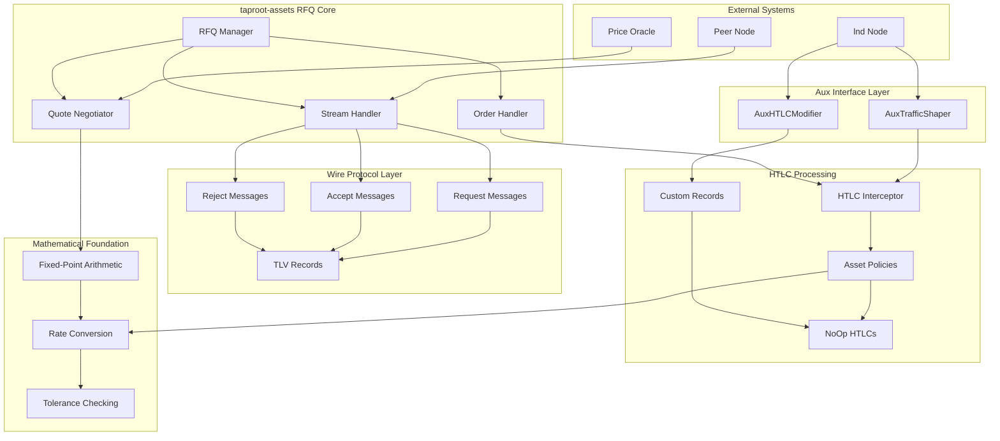
```mermaid
graph TB
    subgraph "External Systems"
        PriceOracle[Price Oracle]
        LNDNode[lnd Node]
        Peer[Peer Node]
    end
    
    subgraph "taproot-assets RFQ Core"
        RFQManager[RFQ Manager]
        Negotiator[Quote Negotiator]  
        OrderHandler[Order Handler]
        StreamHandler[Stream Handler]
    end
    
    subgraph "Wire Protocol Layer"
        RequestMsg[Request Messages]
        AcceptMsg[Accept Messages] 
        RejectMsg[Reject Messages]
        TLVRecords[TLV Records]
    end
    
    subgraph "Aux Interface Layer"
        TrafficShaper[AuxTrafficShaper]
        HTLCModifier[AuxHTLCModifier]
    end
    
    subgraph "HTLC Processing"
        HTLCInterceptor[HTLC Interceptor]
        AssetPolicies[Asset Policies]
        CustomRecords[Custom Records]
        NoOpHTLCs[NoOp HTLCs]
    end
    
    subgraph "Mathematical Foundation"
        FixedPointArith[Fixed-Point Arithmetic]
        RateConversion[Rate Conversion]
        ToleranceChecking[Tolerance Checking]
    end
    
    PriceOracle --> Negotiator
    Peer --> StreamHandler
    LNDNode --> TrafficShaper
    LNDNode --> HTLCModifier
    
    RFQManager --> Negotiator
    RFQManager --> OrderHandler
    RFQManager --> StreamHandler
    
    StreamHandler --> RequestMsg
    StreamHandler --> AcceptMsg
    StreamHandler --> RejectMsg
    RequestMsg --> TLVRecords
    AcceptMsg --> TLVRecords
    RejectMsg --> TLVRecords
    
    TrafficShaper --> HTLCInterceptor
    HTLCModifier --> CustomRecords
    
    OrderHandler --> HTLCInterceptor
    HTLCInterceptor --> AssetPolicies
    AssetPolicies --> NoOpHTLCs
    CustomRecords --> NoOpHTLCs
    
    Negotiator --> FixedPointArith
    AssetPolicies --> RateConversion
    FixedPointArith --> RateConversion
    RateConversion --> ToleranceChecking
```

The RFQ protocol embodies several key architectural principles that guide its
design and implementation. Understanding these principles is essential for
grasping why the system works the way it does.

The first principle is **non-invasive integration**. Rather than requiring
modifications to the Lightning protocol or lnd's core implementation, RFQ
operates through auxiliary interfaces. These
interfaces act as extension points, allowing taproot-assets to inject custom
behavior into Lightning's payment flow without breaking compatibility with the
broader network. This approach ensures that nodes running RFQ can interact with
standard Lightning nodes, maintaining the network effect that makes Lightning
valuable.

The second principle is **cryptographic rate binding**. In any trading system,
ensuring that agreed-upon rates cannot be manipulated between negotiation and
execution. RFQ achieves this through cryptographic
signatures on rate quotes and deterministic derivation of routing identifiers
from quote IDs. When a trader accepts a quote, they receive a cryptographically
signed commitment that binds the counterparty to a specific exchange rate. This
signature, combined with the quote ID that gets embedded in the payment path,
creates an unforgeable link between negotiation and settlement.

The third principle is **precise financial computation**. Financial systems
cannot tolerate rounding errors or precision loss. RFQ implements a
fixed-point arithmetic system that performs all calculations using
integer operations with configurable decimal scaling. This approach eliminates
the floating-point errors that plague many financial systems while maintaining
the precision necessary for forex-style rate calculations. The system further
implements tolerance-based comparisons using parts-per-million measurements,
allowing for controlled slippage in rate matching while preventing exploitation.

## Wire Protocol: The Communication Foundation

The wire protocol provides the communication layer for nodes to exchange their
trading intentions and capabilities. The protocol operates
above Lightning's custom message range, using message type offset 20116 to
ensure no conflicts with current or future Lightning protocol messages.

### Message Type Architecture

The protocol defines its message types using a base offset derived from the
concatenation of alphabet positions: "t"(20) + "a"(1) + "p"(16) = 20116. This
base is then added to Lightning's custom type start range:

```
TapMessageTypeBaseOffset = 20116 + lnwire.CustomTypeStart
```

The three core message types are:
- `MsgTypeRequest`: Base + 0 (quote request)
- `MsgTypeAccept`: Base + 1 (quote acceptance)
- `MsgTypeReject`: Base + 2 (quote rejection)

### Message Flow Sequence

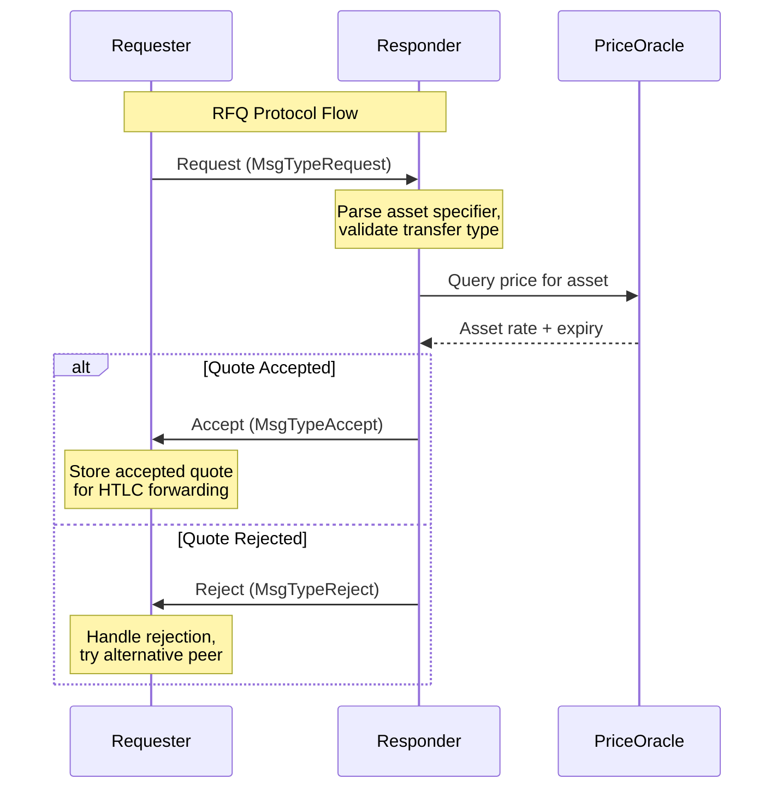
```mermaid
sequenceDiagram
    participant Requester
    participant Responder
    participant PriceOracle

    Note over Requester, Responder: RFQ Protocol Flow

    Requester->>Responder: Request (MsgTypeRequest)
    Note over Responder: Parse asset specifier,<br/>validate transfer type
    
    Responder->>PriceOracle: Query price for asset
    PriceOracle-->>Responder: Asset rate + expiry
    
    alt Quote Accepted
        Responder->>Requester: Accept (MsgTypeAccept)
        Note over Requester: Store accepted quote<br/>for HTLC forwarding
    else Quote Rejected  
        Responder->>Requester: Reject (MsgTypeReject)
        Note over Requester: Handle rejection,<br/>try alternative peer
    end
```

### Message Architecture and Encoding

Every RFQ message follows a strict TLV (Type-Length-Value) encoding pattern that
ensures both forward and backward compatibility. The protocol defines three
primary message types that form the basis of all quote negotiations.

The **Request** message initiates a quote negotiation. When a node wants to
trade assets, it constructs a Request containing the asset details, desired
amount, and transfer type. The message includes an optional rate hint obtained
from price oracles, allowing the receiving node to quickly assess whether the
request falls within acceptable parameters. The Request contains a unique ID
that serves as the basis for SCID alias generation, linking the quote to
subsequent payment routing.

The **Accept** message represents a binding commitment to trade at specific
terms. When a node receives a Request and decides to trade, it responds with an
Accept message containing the exact exchange rate, quote expiry timestamp, and a
cryptographic signature over these terms. This signature prevents the accepting
party from denying the agreed rate and provides the requesting party with
cryptographic proof of the agreement. The Accept message may also include
minimum and maximum HTLC amounts, allowing for partial fills of large orders
through multiple smaller payments.

The **Reject** message communicates why a quote request cannot be fulfilled.
Rather than silently dropping unacceptable requests, nodes send explicit
rejections with structured error codes. This allows requesting nodes to
understand whether the rejection was due to temporary conditions (like
insufficient liquidity) or permanent incompatibilities (like unsupported
assets).

### Buy vs Sell Request Encoding

The protocol distinguishes between buy and sell operations through transfer type
flags and asset field encoding patterns:

**Buy Request** (RecvPaymentTransferType):
- `InAssetID`: Target asset to purchase
- `OutAssetID`: Zero (indicating BTC payment)
- `InAssetRateHint`: Proposed asset-to-BTC rate
- Direction: Peer sells asset, requester receives asset

**Sell Request** (PayInvoiceTransferType):
- `InAssetID`: Zero (indicating BTC receipt)
- `OutAssetID`: Asset to sell
- `OutAssetRateHint`: Proposed asset-to-BTC rate
- Direction: Requester sells asset, peer receives asset

This encoding pattern ensures that the zero asset ID always represents BTC,
while non-zero values identify specific taproot assets. The rate hints allow
nodes to quickly determine if a quote request is viable before querying price
oracles.

### Protocol State Machine

The request processing flow follows a deterministic state machine that ensures
consistent behavior across implementations:

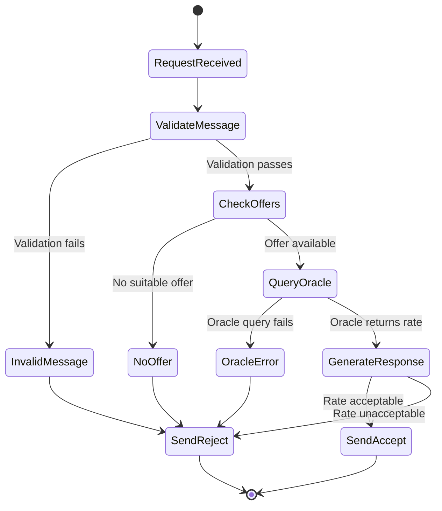
```mermaid
stateDiagram-v2
    [*] --> RequestReceived
    RequestReceived --> ValidateMessage
    ValidateMessage --> InvalidMessage: Validation fails
    ValidateMessage --> CheckOffers: Validation passes
    
    CheckOffers --> NoOffer: No suitable offer
    CheckOffers --> QueryOracle: Offer available
    
    QueryOracle --> OracleError: Oracle query fails
    QueryOracle --> GenerateResponse: Oracle returns rate
    
    GenerateResponse --> SendAccept: Rate acceptable
    GenerateResponse --> SendReject: Rate unacceptable
    
    InvalidMessage --> SendReject
    NoOffer --> SendReject
    OracleError --> SendReject
    
    SendAccept --> [*]
    SendReject --> [*]
```

### Message Validation Rules

**Request Validation**:
1. Version must match the latest supported version (V1)
2. Expiry must be a future timestamp
3. Asset specifier validation:
   - Either AssetID OR AssetGroupKey must be specified (not both)
   - Both InAsset and OutAsset cannot be BTC (zero AssetID)
4. Oracle metadata must not exceed 32,768 bytes

**Accept Validation**:
1. Version must match the latest version
2. Expiry must be a future timestamp
3. Both asset rates must be non-zero
4. Signature must be a valid 64-byte signature

**Reject Validation**:
1. Must include a valid error code
2. May optionally include human-readable error details

### RFQ ID and SCID Alias Generation

Each RFQ message contains a unique 32-byte identifier that serves multiple
purposes:

```go
type ID [32]byte
```

The RFQ ID provides:
1. Unique identification for quote tracking
2. Source for SCID alias derivation
3. Linkage between quotes and HTLC forwarding

The SCID alias is derived from the last 8 bytes of the RFQ ID, converted to
uint64. The system validates that the generated SCID falls within lnd's allowed
alias range, ensuring compatibility with Lightning's routing infrastructure.

### SCID Alias and Routing Integration

The wire protocol integrates with Lightning's routing system through Short
Channel ID (SCID) aliases. When a quote is accepted, both parties derive a
deterministic SCID alias from the quote ID. This alias gets registered with
lnd's alias manager, creating a virtual channel edge that Lightning's routing
algorithm can discover and use.

The derivation process ensures that the SCID alias is unique to each quote while
being reproducible by both parties without additional communication. The system
uses the quote ID as a seed for a cryptographic derivation function that
produces a valid SCID format while ensuring no collisions with real channel IDs.
This approach allows standard Lightning nodes to route payments through asset
channels without any awareness that asset conversion is occurring.

## The RFQ Manager: Orchestrating Complexity

The RFQ Manager coordinates interactions between subsystems and maintains
system-wide consistency. Its event-driven architecture ensures that each
component can operate independently while maintaining synchronized state.

### Subsystem Coordination

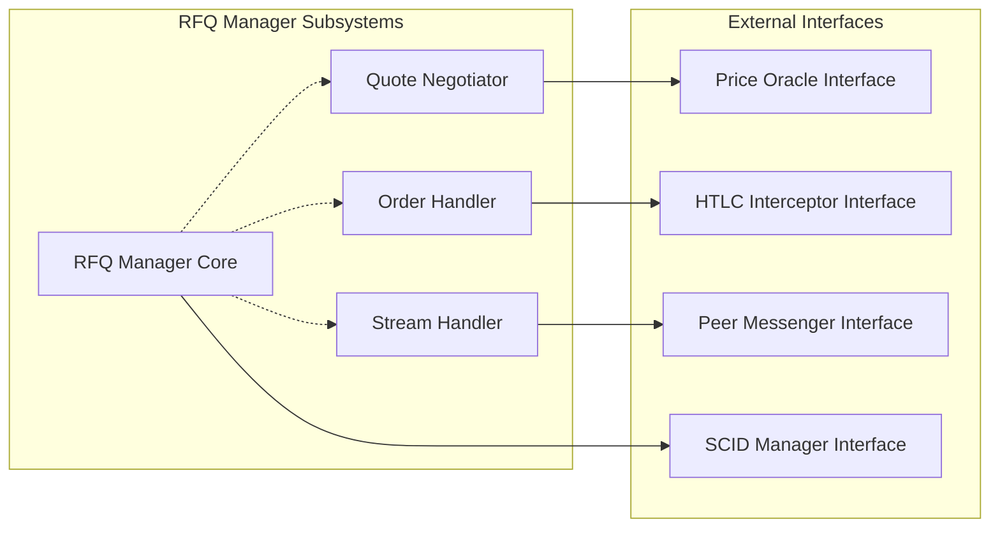
```mermaid
graph LR
    subgraph "RFQ Manager Subsystems"
        Manager[RFQ Manager Core]
        Negotiator[Quote Negotiator]
        OrderHandler[Order Handler]
        StreamHandler[Stream Handler]
    end
    
    subgraph "External Interfaces"
        PriceOracleInt[Price Oracle Interface]
        HTLCInterceptorInt[HTLC Interceptor Interface]
        PeerMessengerInt[Peer Messenger Interface]
        SCIDManagerInt[SCID Manager Interface]
    end
    
    Manager -.-> Negotiator
    Manager -.-> OrderHandler
    Manager -.-> StreamHandler
    
    Negotiator --> PriceOracleInt
    OrderHandler --> HTLCInterceptorInt
    StreamHandler --> PeerMessengerInt
    Manager --> SCIDManagerInt
```

The Manager oversees three primary subsystems, each responsible for a distinct
aspect of the protocol's operation. These subsystems communicate through Go
channels, providing non-blocking message passing that prevents any single
operation from stalling the entire system.

The **Quote Negotiator** handles the business logic of price discovery and quote
generation. When a quote request arrives, the Negotiator queries external price
oracles to determine current market rates. It applies configurable spreads and
adjustments based on factors like order size, asset volatility, and available
liquidity. The Negotiator maintains awareness of all outstanding quotes,
ensuring that the system doesn't overcommit available assets. It implements rate
limiting to prevent abuse while allowing high-frequency trading operations.

The **Order Handler** manages the execution side of accepted quotes. Once a
quote is accepted, the Order Handler registers it as an active policy with the
HTLC interceptor. This policy defines the conditions under which an incoming
HTLC should be transformed into an asset transfer. The Order Handler tracks
cumulative volumes against each policy, ensuring that partial fills don't exceed
the originally quoted amount. It also manages policy expiration, automatically
removing stale quotes to prevent execution at outdated rates.

The **Stream Handler** manages the persistent connections with peer nodes and
handles message serialization. It implements reconnection logic to ensure that
quote negotiations can survive temporary network disruptions. The Stream Handler
also provides message deduplication, preventing replay attacks where malicious
peers might try to resubmit old quote acceptances.

### Event Propagation and Error Handling

The Manager implements an event propagation system that ensures all subsystems
remain synchronized. When significant events occur - such as quote
acceptance, HTLC interception, or error conditions - the Manager publishes these
events to registered subscribers. This pub-sub pattern allows external systems
to monitor RFQ activity without tight coupling to the internal implementation.

Error handling in the Manager follows a hierarchical approach. Transient errors,
such as temporary oracle unavailability, trigger retry logic with exponential
backoff. Persistent errors escalate through the system, potentially triggering
circuit breakers that prevent cascading failures. Errors that could
compromise system integrity cause controlled shutdowns, ensuring that
inconsistent state is never persisted.

### Main Event Loop Processing

The RFQ Manager's main event loop coordinates all message processing and
subsystem interactions through a centralized routing mechanism:

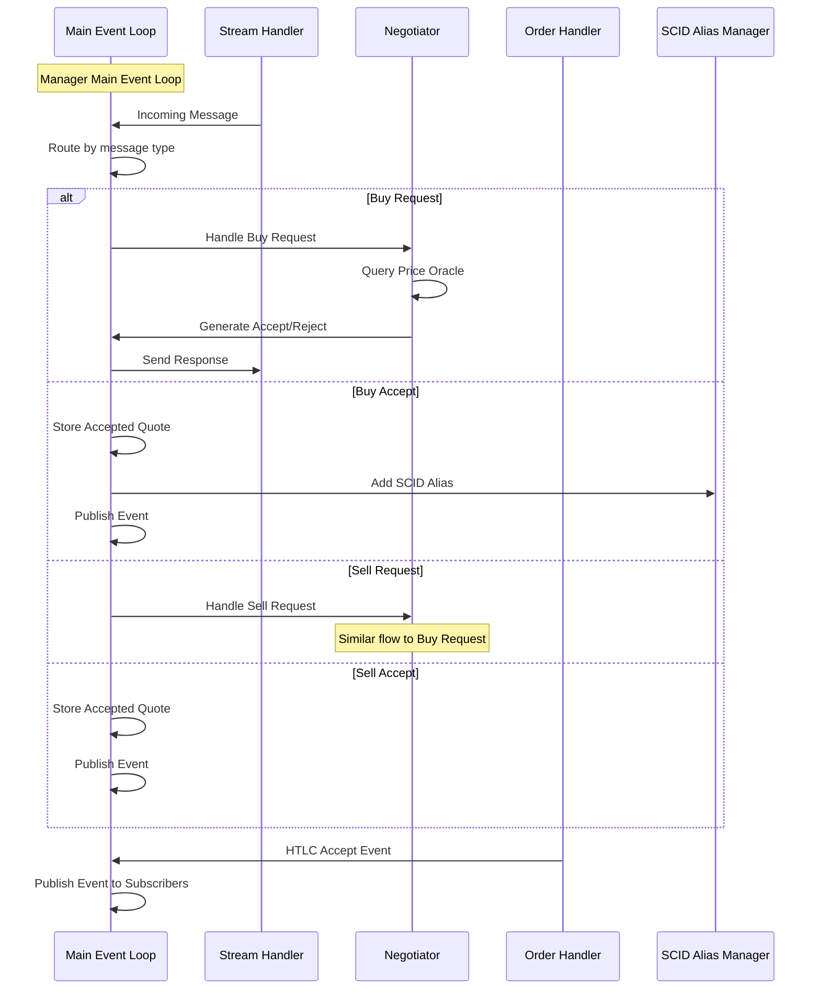
```mermaid
sequenceDiagram
    participant MainLoop as Main Event Loop
    participant StreamHandler as Stream Handler
    participant Negotiator as Negotiator
    participant OrderHandler as Order Handler
    participant AliasManager as SCID Alias Manager

    Note over MainLoop: Manager Main Event Loop

    StreamHandler->>MainLoop: Incoming Message
    MainLoop->>MainLoop: Route by message type
    
    alt Buy Request
        MainLoop->>Negotiator: Handle Buy Request
        Negotiator->>Negotiator: Query Price Oracle
        Negotiator->>MainLoop: Generate Accept/Reject
        MainLoop->>StreamHandler: Send Response
    
    else Buy Accept
        MainLoop->>MainLoop: Store Accepted Quote
        MainLoop->>AliasManager: Add SCID Alias
        MainLoop->>MainLoop: Publish Event
    
    else Sell Request
        MainLoop->>Negotiator: Handle Sell Request
        Note over Negotiator: Similar flow to Buy Request
    
    else Sell Accept
        MainLoop->>MainLoop: Store Accepted Quote
        MainLoop->>MainLoop: Publish Event
    end
    
    OrderHandler->>MainLoop: HTLC Accept Event
    MainLoop->>MainLoop: Publish Event to Subscribers
```

The event loop processes messages asynchronously, ensuring that no single
operation blocks the system. Each message type triggers specific workflows that
may involve oracle queries, quote storage, SCID alias registration, or event
publication to subscribers.

### SCID Alias Management

The Manager implements SCID alias management to integrate quotes with Lightning's
routing infrastructure:

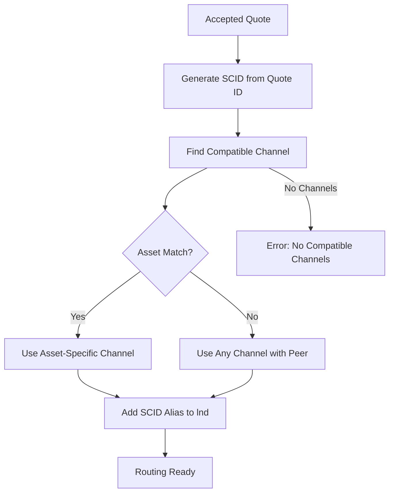
```mermaid
graph TB
    AcceptedQuote[Accepted Quote] --> GenerateSCID[Generate SCID from Quote ID]
    GenerateSCID --> FindChannel[Find Compatible Channel]
    FindChannel --> AssetMatch{Asset Match?}
    
    AssetMatch -->|Yes| UseAssetChannel[Use Asset-Specific Channel]
    AssetMatch -->|No| FallbackChannel[Use Any Channel with Peer]
    
    UseAssetChannel --> AddAlias[Add SCID Alias to lnd]
    FallbackChannel --> AddAlias
    AddAlias --> Success[Routing Ready]
    
    FindChannel -->|No Channels| Error[Error: No Compatible Channels]
```

When a quote is accepted, the Manager generates a deterministic SCID alias from
the quote ID. It then searches for a compatible channel with the peer, preferring
channels that already carry the specific asset type. If no asset-specific channel
exists, it falls back to any available channel with the peer. The alias is then
registered with lnd's alias manager, creating a virtual routing edge that can be
used in Lightning invoices and payment paths.

The channel selection logic ensures optimal routing by matching assets to their
appropriate channels while maintaining flexibility when exact matches aren't
available. This approach allows the RFQ system to work with both dedicated asset
channels and mixed-use channels.

### Buy Order Processing

The buy order workflow coordinates quote requests when a node wants to purchase
assets:

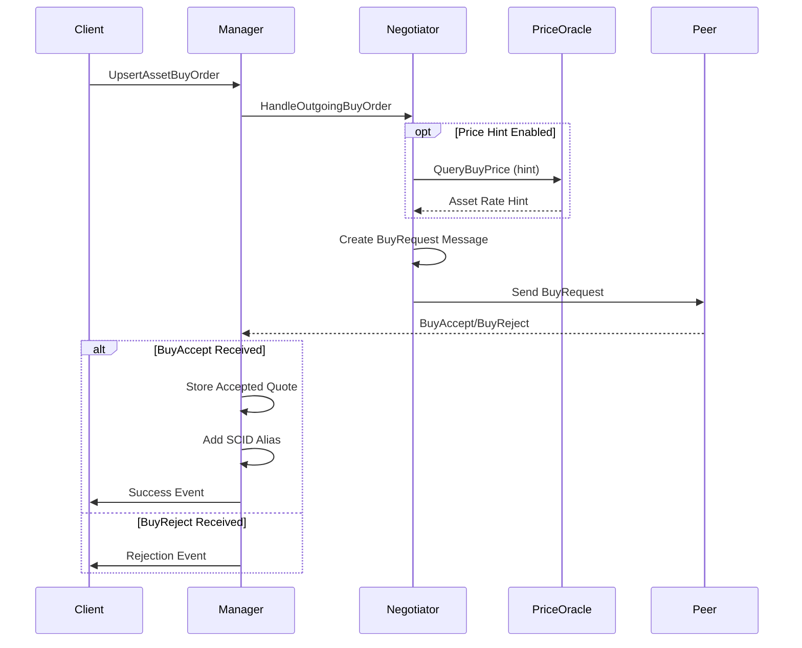
```mermaid
sequenceDiagram
    participant Client
    participant Manager
    participant Negotiator
    participant PriceOracle
    participant Peer

    Client->>Manager: UpsertAssetBuyOrder
    Manager->>Negotiator: HandleOutgoingBuyOrder
    
    opt Price Hint Enabled
        Negotiator->>PriceOracle: QueryBuyPrice (hint)
        PriceOracle-->>Negotiator: Asset Rate Hint
    end
    
    Negotiator->>Negotiator: Create BuyRequest Message
    Negotiator->>Peer: Send BuyRequest
    
    Peer-->>Manager: BuyAccept/BuyReject
    
    alt BuyAccept Received
        Manager->>Manager: Store Accepted Quote
        Manager->>Manager: Add SCID Alias
        Manager->>Client: Success Event
    else BuyReject Received
        Manager->>Client: Rejection Event  
    end
```

The buy order process begins when a client requests to purchase assets. The
Manager delegates to the Negotiator, which may query the price oracle for a rate
hint if configured. The Negotiator constructs a BuyRequest message with the asset
details and sends it to the peer. Upon receiving a response, the Manager stores
accepted quotes and registers SCID aliases for routing, or publishes rejection
events for client notification.

### Sell Order Processing

The sell order workflow handles quote requests when a node wants to sell assets:

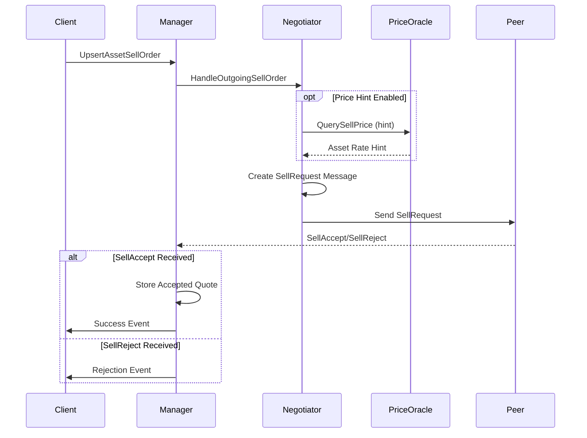
```mermaid
sequenceDiagram
    participant Client
    participant Manager
    participant Negotiator
    participant PriceOracle
    participant Peer

    Client->>Manager: UpsertAssetSellOrder
    Manager->>Negotiator: HandleOutgoingSellOrder
    
    opt Price Hint Enabled
        Negotiator->>PriceOracle: QuerySellPrice (hint)
        PriceOracle-->>Negotiator: Asset Rate Hint
    end
    
    Negotiator->>Negotiator: Create SellRequest Message
    Negotiator->>Peer: Send SellRequest
    
    Peer-->>Manager: SellAccept/SellReject
    
    alt SellAccept Received
        Manager->>Manager: Store Accepted Quote
        Manager->>Client: Success Event
    else SellReject Received
        Manager->>Client: Rejection Event
    end
```

Sell orders follow a similar pattern to buy orders but with inverted semantics.
The node offers to sell assets in exchange for Bitcoin. The Negotiator may include
rate hints from the price oracle to signal acceptable pricing. Accepted quotes are
stored for future HTLC processing, while rejections trigger appropriate event
notifications.

### Quote Storage and Lifecycle

The Manager maintains four distinct quote storage categories:

1. **Peer Accepted Buy Quotes**: Quotes where peers agreed to sell assets to us
2. **Peer Accepted Sell Quotes**: Quotes where peers agreed to buy assets from us
3. **Local Accepted Buy Quotes**: Quotes where we agreed to buy assets from peers
4. **Local Accepted Sell Quotes**: Quotes where we agreed to sell assets to peers

Each quote category serves different purposes in the payment flow. Peer accepted
quotes are used when initiating payments, while local accepted quotes govern
incoming HTLC acceptance. The Manager implements automatic expiry management,
removing stale quotes during access to prevent execution at outdated rates.

## Auxiliary Interfaces

The auxiliary interface system enables taproot-assets to extend lnd's behavior
without requiring modifications to Lightning's core protocol. Each interface
serves a specific purpose in the payment flow, and together they
create an integration layer between taproot-assets and lnd.

### AuxTrafficShaper: Routing Control

The AuxTrafficShaper acts as a gatekeeper for HTLC routing decisions. When lnd's
routing algorithm considers forwarding an HTLC through a channel, it consults
the TrafficShaper to determine whether the operation should proceed. For asset
channels, the TrafficShaper performs several functions.

First, it validates that the channel actually has sufficient asset balance to
handle the payment. Unlike Bitcoin channels where balance is simply a satoshi
amount, asset channels must consider the current exchange rate between the asset
and Bitcoin. The TrafficShaper queries the RFQ system for active quotes and
calculates whether the available asset balance, when converted at the quoted
rate, provides sufficient value to forward the HTLC.

Second, it implements bandwidth calculations that account for rate conversions.
When lnd queries for available bandwidth, the TrafficShaper translates asset
amounts into Bitcoin equivalents using current exchange rates. This ensures that
routing algorithms make appropriate decisions even when mixing Bitcoin and asset
channels in a single route.

Third, it prevents incompatible routing scenarios. If an HTLC intended for asset
transfer attempts to route through a Bitcoin-only channel, the TrafficShaper
blocks the operation. Similarly, it prevents HTLCs carrying one asset type from
routing through channels of a different asset type, maintaining type safety
throughout the payment path.

#### Traffic Shaper Decision Flow

The TrafficShaper implementation follows a structured decision flow to determine
whether and how to handle each HTLC:

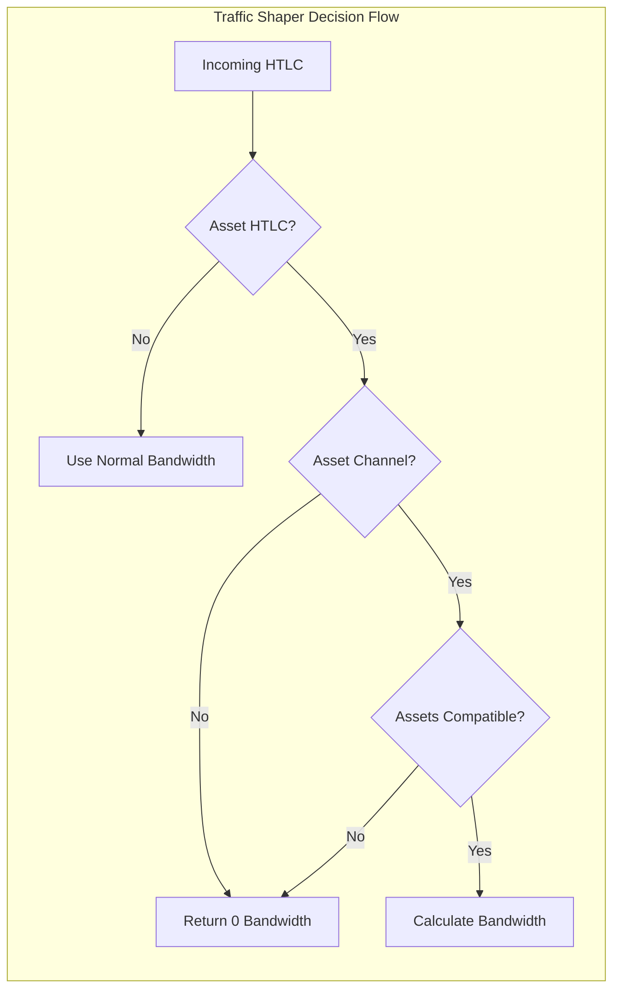
```mermaid
graph LR
    subgraph "Traffic Shaper Decision Flow"
        HTLC[Incoming HTLC]
        CheckAsset{Asset HTLC?}
        CheckChannel{Asset Channel?}
        CheckCompatibility{Assets Compatible?}
        CalcBandwidth[Calculate Bandwidth]
        
        HTLC --> CheckAsset
        CheckAsset -->|No| UseNormal[Use Normal Bandwidth]
        CheckAsset -->|Yes| CheckChannel
        CheckChannel -->|No| Block[Return 0 Bandwidth]
        CheckChannel -->|Yes| CheckCompatibility
        CheckCompatibility -->|No| Block
        CheckCompatibility -->|Yes| CalcBandwidth
    end
```

The decision flow ensures that asset HTLCs are only forwarded through compatible
channels. When an HTLC arrives, the TrafficShaper first checks if it contains
asset records. If not, it allows normal Bitcoin bandwidth calculations. For asset
HTLCs, it verifies the channel can handle the specific asset types before
proceeding with bandwidth calculations.

#### Asset Unit Bandwidth Calculation

For HTLCs carrying direct asset units (such as keysend or direct transfers), the
bandwidth calculation follows this logic:

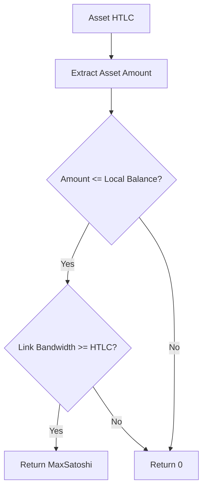
```mermaid
graph TB
    AssetHTLC[Asset HTLC]
    ExtractAmount[Extract Asset Amount]
    CheckBalance{Amount <= Local Balance?}
    CheckReserve{Link Bandwidth >= HTLC?}
    ZeroBandwidth[Return 0]
    ReturnMax[Return MaxSatoshi]
    
    AssetHTLC --> ExtractAmount
    ExtractAmount --> CheckBalance
    CheckBalance -->|Yes| CheckReserve
    CheckBalance -->|No| ZeroBandwidth
    CheckReserve -->|Yes| ReturnMax
    CheckReserve -->|No| ZeroBandwidth
```

The system extracts the asset amount from the HTLC custom records and compares it
against the local asset balance. If sufficient balance exists and the link has
bandwidth for the HTLC size, it returns maximum satoshi value to indicate the
channel can handle the payment. This approach ensures asset HTLCs are treated as
having effectively infinite bandwidth when asset balance is available.

#### RFQ-Based Bandwidth Calculation

For payment HTLCs using RFQ rates, the bandwidth calculation incorporates rate
conversion:

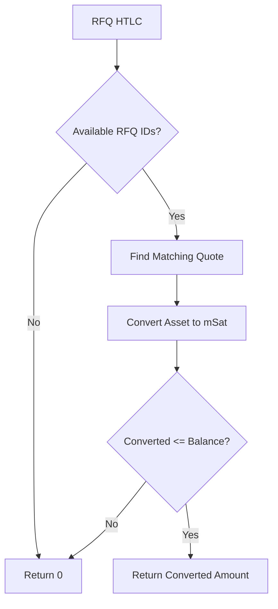
```mermaid
graph TB
    RFQHTLC[RFQ HTLC]
    CheckRFQIDs{Available RFQ IDs?}
    FindMatchingQuote[Find Matching Quote]
    ConvertToMsat[Convert Asset to mSat]
    CheckBalance{Converted <= Balance?}
    ZeroBW[Return 0]
    ReturnConverted[Return Converted Amount]
    
    RFQHTLC --> CheckRFQIDs
    CheckRFQIDs -->|No| ZeroBW
    CheckRFQIDs -->|Yes| FindMatchingQuote
    FindMatchingQuote --> ConvertToMsat
    ConvertToMsat --> CheckBalance
    CheckBalance -->|Yes| ReturnConverted
    CheckBalance -->|No| ZeroBW
```

When an HTLC includes RFQ IDs, the TrafficShaper looks up the corresponding
quotes to determine exchange rates. It converts the asset amount to millisatoshi
equivalents using the locked-in rate, then checks if the channel has sufficient
balance for the converted amount. This ensures accurate bandwidth calculations
that account for current exchange rates.

### AuxHTLCModifier: Payment Transformation Engine

The AuxHTLCModifier provides the mechanism for injecting custom data into HTLC
messages. When lnd prepares to send an HTLC, it calls the Modifier to add any
auxiliary information needed for the payment. For asset payments, this involves
several transformations.

The Modifier adds custom TLV records that specify the asset type and amount
being transferred. These records use an encoding that maintains compatibility
with nodes that don't understand asset transfers - such nodes simply forward the
unknown TLV records without processing them. The records include not just the
asset information but also the RFQ ID that links the payment to its governing
quote.

For multi-hop payments, the Modifier implements a record injection pattern. Each
hop in the path may require different custom records depending on whether it's
an asset channel or a standard Bitcoin channel. The Modifier analyzes the
complete route and generates the appropriate auxiliary blobs for each hop,
ensuring that asset information is preserved across the entire payment path
while maintaining privacy about the ultimate destination.

The Modifier also implements the NoOp HTLC pattern for pure asset transfers. In
cases where assets are being transferred but no Bitcoin value needs to move, the
Modifier sets special flags that inform receiving nodes to settle the HTLC
without actually transferring satoshis. This pattern enables efficient
asset-only transfers while maintaining compatibility with Lightning's HTLC state
machine.

#### HTLC Modification Flow

The modification process follows a structured sequence when processing outgoing
HTLCs:

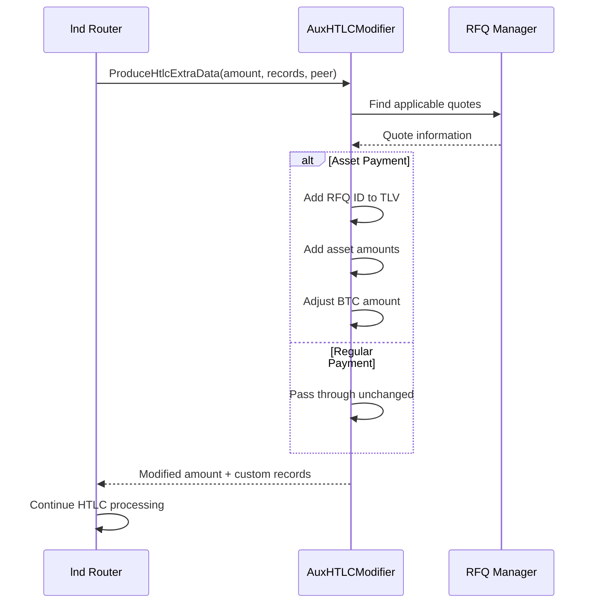
```mermaid
sequenceDiagram
    participant Router as lnd Router
    participant Modifier as AuxHTLCModifier
    participant RFQManager as RFQ Manager
    
    Router->>Modifier: ProduceHtlcExtraData(amount, records, peer)
    Modifier->>RFQManager: Find applicable quotes
    RFQManager-->>Modifier: Quote information
    
    alt Asset Payment
        Modifier->>Modifier: Add RFQ ID to TLV
        Modifier->>Modifier: Add asset amounts
        Modifier->>Modifier: Adjust BTC amount
    else Regular Payment
        Modifier->>Modifier: Pass through unchanged
    end
    
    Modifier-->>Router: Modified amount + custom records
    Router->>Router: Continue HTLC processing
```

When lnd's router prepares an HTLC, it calls the AuxHTLCModifier to add any
necessary auxiliary data. The Modifier checks if this is an asset payment by
looking for asset-related custom records. For asset payments, it queries the RFQ
Manager for applicable quotes, adds the RFQ ID to the TLV records for rate
locking, includes asset amount information, and potentially adjusts the Bitcoin
amount for NoOp settlements. Regular Bitcoin payments pass through unchanged.

### Data Flow Integration

The auxiliary interfaces integrate with lnd's HTLC processing pipeline at
critical control points, creating a comprehensive data flow that ensures proper
handling of asset HTLCs:

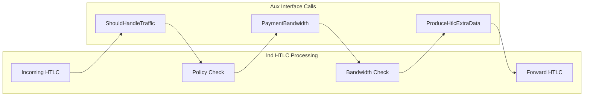
```mermaid
graph LR
    subgraph "lnd HTLC Processing"
        IncomingHTLC[Incoming HTLC]
        PolicyCheck[Policy Check]
        BandwidthCheck[Bandwidth Check]
        ForwardHTLC[Forward HTLC]
    end
    
    subgraph "Aux Interface Calls"
        ShouldHandle[ShouldHandleTraffic]
        CalcBandwidth[PaymentBandwidth] 
        ModifyHTLC[ProduceHtlcExtraData]
    end
    
    IncomingHTLC --> ShouldHandle
    ShouldHandle --> PolicyCheck
    PolicyCheck --> CalcBandwidth
    CalcBandwidth --> BandwidthCheck
    BandwidthCheck --> ModifyHTLC
    ModifyHTLC --> ForwardHTLC
```

This integration represents a critical control flow where taproot-assets can
influence Lightning's HTLC forwarding decisions at multiple points:

1. **Traffic Detection** (`ShouldHandleTraffic`): When an HTLC arrives, lnd first
   consults the TrafficShaper to determine if auxiliary handling is needed. This
   check examines the HTLC's custom TLV records for asset-related entries. If
   detected, the auxiliary system takes control of bandwidth and routing decisions.

2. **Policy Enforcement**: After traffic detection, standard Lightning policy
   checks occur (fee validation, CLTV checks). The auxiliary system doesn't
   override these fundamental Lightning protocol requirements.

3. **Bandwidth Calculation** (`PaymentBandwidth`): The TrafficShaper calculates
   available bandwidth based on asset balances and RFQ rates. This is where asset
   compatibility checks occur - if the channel cannot handle the specific assets
   in the HTLC, the bandwidth returns as zero, effectively blocking the forward.

4. **HTLC Modification** (`ProduceHtlcExtraData`): Before forwarding, the
   Modifier injects necessary TLV records for the next hop. This includes RFQ IDs
   for rate locking, asset amounts for balance tracking, and NoOp flags for
   settlement control.

The integration is designed to be non-invasive - if any auxiliary interface is
not present or returns an error, lnd falls back to standard Lightning behavior.
This ensures that the system degrades gracefully and maintains compatibility with
the broader Lightning Network.

Each interface call is synchronous and occurs in lnd's critical path, making
performance crucial. The implementations use caching and pre-computation where
possible to minimize latency impact. For example, asset compatibility matrices
are pre-computed when channels are opened rather than checked for each HTLC.

## Fixed-Point Arithmetic

The fixed-point arithmetic system ensures precise financial calculations
throughout the RFQ protocol. This system maintains exact precision while
performing rate calculations and conversions.

### The FixedPoint Type

At the heart of the system lies the `FixedPoint` type, a generic structure that
encapsulates an integer coefficient and a scale factor. The coefficient
represents the actual value as an integer, while the scale indicates how many
decimal places to shift when interpreting the value. For example, a FixedPoint
value with coefficient 12345 and scale 2 represents the decimal value 123.45.

This approach is important for financial calculations. Traditional
floating-point arithmetic suffers from representation errors - the value 0.1
cannot be exactly represented in binary floating-point, leading to accumulating
errors in financial calculations. By using integer arithmetic with explicit
scaling, the FixedPoint system maintains perfect precision for decimal values.

The system supports arbitrary precision through Go's `big.Int` type for
large-scale calculations. When multiplying exchange rates or converting between
currencies with different decimal places, intermediate calculations may produce
values that exceed the range of standard integer types. The FixedPoint system
handles these cases, ensuring that precision is not lost due to overflow.

### Precision and Scale Management

The FixedPoint system uses scale to represent decimal precision, where scale
indicates the power of 10 by which to divide the coefficient:

```
Scale 0: Integer values (1, 2, 3)
Scale 1: One decimal place (1.0, 2.5, 3.7)
Scale 2: Two decimal places (1.00, 2.50, 3.14)
Scale 8: Eight decimal places (Bitcoin precision)
```

For a concrete example, the value 3.14 with scale 2 is stored as:
- Coefficient: 314
- Scale: 2
- Reconstructed value: 314 ÷ 10² = 3.14

This representation allows the system to handle different asset precisions
seamlessly. Bitcoin uses 8 decimal places (satoshis), while other assets may use
anywhere from 0 to 8 decimal places. The scale mechanism ensures accurate
conversion between these different precision levels without loss of information.

### Scale Alignment and Conversion

When performing arithmetic operations between FixedPoint values with different
scales, the system must align them to a common scale. This process follows a
deterministic algorithm:

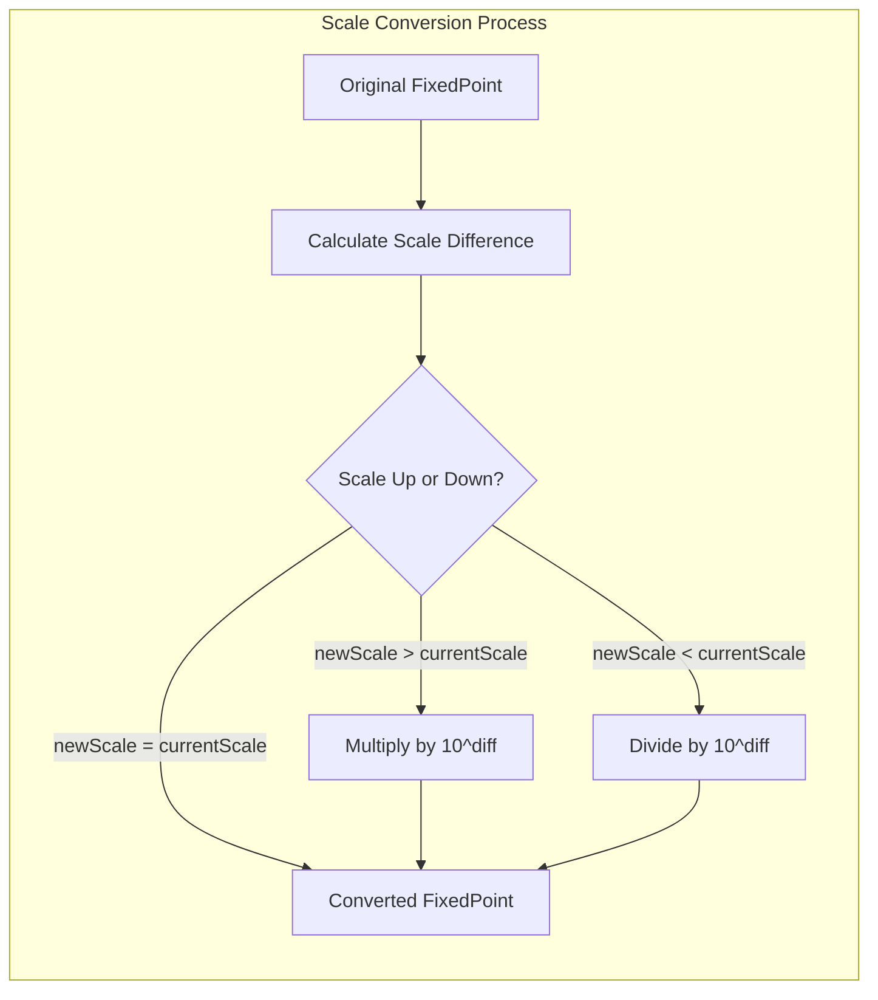
```mermaid
graph LR
    subgraph "Scale Conversion Process"
        OriginalFP[Original FixedPoint]
        CalculateDiff[Calculate Scale Difference]
        DetermineOp{Scale Up or Down?}
        ScaleUp[Multiply by 10^diff]
        ScaleDown[Divide by 10^diff]
        NewFP[Converted FixedPoint]
    end
    
    OriginalFP --> CalculateDiff
    CalculateDiff --> DetermineOp
    DetermineOp -->|newScale > currentScale| ScaleUp
    DetermineOp -->|newScale < currentScale| ScaleDown
    DetermineOp -->|newScale = currentScale| NewFP
    ScaleUp --> NewFP
    ScaleDown --> NewFP
```

The `ScaleTo` function implements this conversion:

```go
func (f FixedPoint[T]) ScaleTo(newScale uint8) FixedPoint[T] {
    scaleDiff := int32(newScale) - int32(f.Scale)
    absoluteScale := int(math.Abs(float64(scaleDiff)))
    scaleMultiplier := NewInt[T]().FromFloat(math.Pow10(absoluteScale))
    
    var newCoefficient T
    switch {
    case scaleDiff == 0:
        newCoefficient = f.Coefficient
    case scaleDiff > 0:
        // Scale up: multiply coefficient
        newCoefficient = f.Coefficient.Mul(scaleMultiplier)
    case scaleDiff < 0:
        // Scale down: divide coefficient
        newCoefficient = f.Coefficient.Div(scaleMultiplier)
    }
    
    return FixedPoint[T]{
        Coefficient: newCoefficient,
        Scale:       newScale,
    }
}
```

This conversion is lossless when scaling up but may involve rounding when scaling
down. The system ensures consistent rounding behavior across all nodes to
maintain consensus on calculated values.

### MilliSatoshi Conversion Operations

The protocol requires frequent conversion between asset units and Bitcoin's
millisatoshi denomination. These conversions form the foundation of cross-asset
payments:

#### Converting MilliSatoshi to Asset Units

```go
func MilliSatoshiToUnits(msat lnwire.MilliSatoshi, 
    rate rfqmath.BigIntFixedPoint) rfqmath.BigInt {
    
    msatBigInt := rfqmath.NewBigIntFromUint64(uint64(msat))
    
    // Convert millisatoshi to BTC fixed-point (scale 8)
    btcFixedPoint := rfqmath.FixedPoint[rfqmath.BigInt]{
        Coefficient: msatBigInt,
        Scale:       8,
    }
    
    // Multiply by exchange rate to get asset units
    assetUnits := btcFixedPoint.Mul(rate)
    return assetUnits.Coefficient
}
```

This function takes a millisatoshi amount and an exchange rate, then calculates
the equivalent asset units. The conversion maintains full precision by using
BigInt arithmetic throughout.

#### Converting Asset Units to MilliSatoshi

```go
func UnitsToMilliSatoshi(units rfqmath.BigInt,
    rate rfqmath.BigIntFixedPoint) lnwire.MilliSatoshi {
    
    // Create fixed-point representation of asset units
    unitsFixedPoint := rfqmath.FixedPoint[rfqmath.BigInt]{
        Coefficient: units,
        Scale:       rate.Scale,
    }
    
    // Divide by rate to get BTC amount
    btcAmount := unitsFixedPoint.Div(rate)
    
    // Convert to millisatoshis with proper scaling
    return lnwire.MilliSatoshi(btcAmount.ScaleTo(8).ToUint64())
}
```

The reverse conversion divides asset units by the exchange rate to determine the
Bitcoin equivalent. The result is scaled to 8 decimal places to match Bitcoin's
precision requirements.

### Rate Quote Lifecycle

The fixed-point system integrates with the broader RFQ protocol through a
structured lifecycle that ensures rate precision from oracle query to HTLC
settlement:

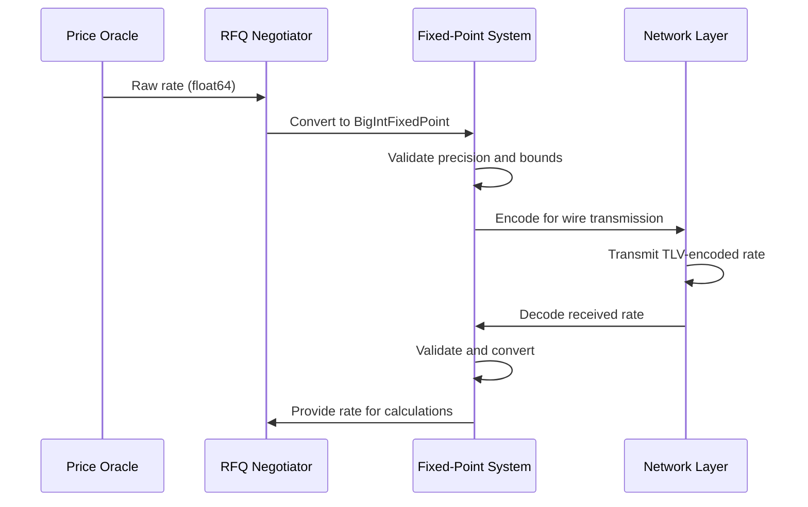
```mermaid
sequenceDiagram
    participant Oracle as Price Oracle
    participant RFQ as RFQ Negotiator  
    participant FixedPoint as Fixed-Point System
    participant Network as Network Layer

    Oracle->>RFQ: Raw rate (float64)
    RFQ->>FixedPoint: Convert to BigIntFixedPoint
    FixedPoint->>FixedPoint: Validate precision and bounds
    FixedPoint->>Network: Encode for wire transmission
    
    Network->>Network: Transmit TLV-encoded rate
    Network->>FixedPoint: Decode received rate
    FixedPoint->>FixedPoint: Validate and convert
    FixedPoint->>RFQ: Provide rate for calculations
```

The lifecycle begins when the price oracle provides a raw exchange rate, typically
as a floating-point number. The RFQ system immediately converts this to a
FixedPoint representation, preserving the intended precision while eliminating
floating-point errors. The rate undergoes validation to ensure it falls within
acceptable bounds and maintains the required decimal precision.

For network transmission, the FixedPoint value is encoded using TLV format, with
the scale as a single byte followed by the coefficient as variable-length bytes.
This encoding is compact yet preserves full precision. Upon receipt, the remote
node decodes the TLV data back into a FixedPoint structure, validates it, and
uses it for subsequent calculations.

### Rate Conversion and Tolerance Mechanics

Exchange rate calculations require special consideration for tolerance and
rounding. The system implements a tolerance mechanism based on parts-per-million
(PPM) measurements. When comparing rates or validating price agreements, the
system allows for controlled deviation within specified PPM bounds.

This tolerance mechanism serves multiple purposes. First, it accounts for
natural rate fluctuations that may occur between quote generation and execution.
Second, it provides flexibility for market makers who may need to adjust rates
slightly based on liquidity conditions. Third, it prevents rejection of valid
payments due to insignificant rounding differences that may occur during
multi-hop calculations.

The system also implements rounding logic that ensures consistency across the
network. When converting between assets with different decimal precisions, the
system follows deterministic rounding rules that all nodes can reproduce. This
prevents discrepancies where different nodes might calculate slightly different
values for the same conversion.

## HTLC Transformation

The HTLC transformation pipeline intercepts standard Lightning HTLCs and
transforms them to carry asset transfer semantics while maintaining
compatibility with the Lightning protocol.

### Policy-Driven Interception

When an HTLC arrives at a node running the RFQ protocol, it first passes through
the policy evaluation engine. This engine maintains a registry of active
policies derived from accepted quotes. Each policy encodes the complete terms of
a trading agreement: the assets involved, the exchange rate, the allowable
amount range, and the expiration time.

The interception process begins with policy matching. The system extracts the
RFQ ID from the HTLC's custom records and looks up the corresponding policy. If
no policy exists, the HTLC is processed as a standard Lightning payment. If a
policy is found, the system validates that all policy constraints are satisfied.
This includes checking that the HTLC amount falls within the agreed range, the
policy hasn't expired, and the cumulative amount across all HTLCs for this
policy doesn't exceed the agreed total.

For asset sale policies, the transformation process converts the incoming
Bitcoin amount to the equivalent asset amount using the policy's exchange rate.
The system then constructs custom TLV records containing the asset details and
amount. These records get injected into the outgoing HTLC, informing the next
hop that this is an asset transfer rather than a standard Bitcoin payment.

### The NoOp Settlement Pattern

The NoOp (No Operation) settlement pattern enables asset transfers through
Lightning channels without moving the equivalent Bitcoin value.

In a traditional Lightning HTLC, settlement involves updating channel balances
to reflect the transferred satoshis. With NoOp HTLCs, the settlement process is
bifurcated. The asset portion of the transfer updates asset balances according
to the HTLC amount and exchange rate. However, the Bitcoin portion of the
channel balance remains unchanged - hence "No Operation" on the Bitcoin side.

This pattern enables pure asset transfers where the Bitcoin value is merely a
routing denomination. The sending node includes Bitcoin value in the HTLC to
satisfy Lightning's routing requirements, but upon settlement, this Bitcoin
value returns to the sender while only assets actually move. This improves
capital efficiency, as nodes don't need to lock up Bitcoin liquidity for asset
transfers.

### HTLC Interception Flow

The HTLC interception system operates through a sophisticated pipeline that
evaluates each incoming HTLC against registered policies and transforms it
accordingly:

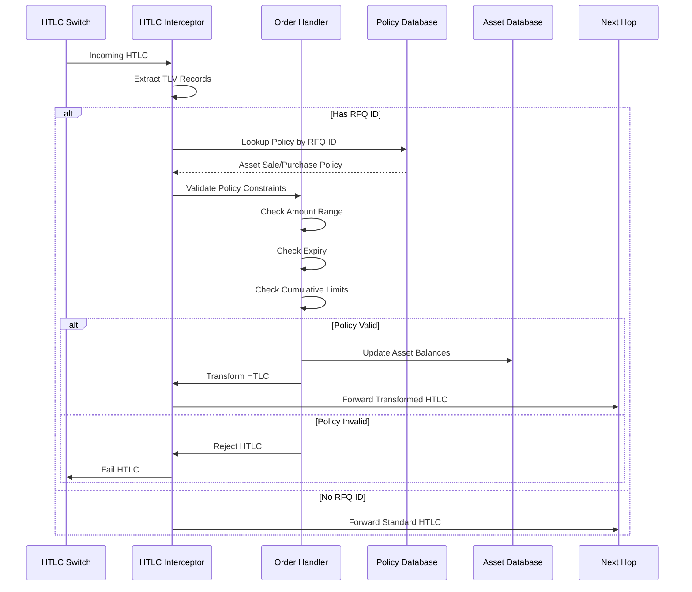
```mermaid
sequenceDiagram
    participant HtlcSwitch as HTLC Switch
    participant Interceptor as HTLC Interceptor
    participant OrderHandler as Order Handler
    participant PolicyDB as Policy Database
    participant AssetDB as Asset Database
    participant NextHop as Next Hop

    HtlcSwitch->>Interceptor: Incoming HTLC
    Interceptor->>Interceptor: Extract TLV Records
    
    alt Has RFQ ID
        Interceptor->>PolicyDB: Lookup Policy by RFQ ID
        PolicyDB-->>Interceptor: Asset Sale/Purchase Policy
        
        Interceptor->>OrderHandler: Validate Policy Constraints
        OrderHandler->>OrderHandler: Check Amount Range
        OrderHandler->>OrderHandler: Check Expiry
        OrderHandler->>OrderHandler: Check Cumulative Limits
        
        alt Policy Valid
            OrderHandler->>AssetDB: Update Asset Balances
            OrderHandler->>Interceptor: Transform HTLC
            Interceptor->>NextHop: Forward Transformed HTLC
        else Policy Invalid
            OrderHandler->>Interceptor: Reject HTLC
            Interceptor->>HtlcSwitch: Fail HTLC
        end
    else No RFQ ID
        Interceptor->>NextHop: Forward Standard HTLC
    end
```

The interception flow begins when an HTLC arrives at the HTLC switch. The
interceptor examines the HTLC's custom TLV records, looking for RFQ-specific
fields that indicate this is an asset transfer. If no RFQ ID is present, the
HTLC is forwarded normally as a standard Lightning payment.

When an RFQ ID is found, the interceptor queries the policy database to retrieve
the associated trading policy. This policy contains all the negotiated terms
from the original RFQ exchange: the asset type, exchange rate, minimum and
maximum amounts, and validity period. The order handler then performs a series
of validation checks to ensure the HTLC complies with the policy constraints.

Amount validation ensures the HTLC value falls within the agreed range. Expiry
checking verifies the policy is still valid. Cumulative limit enforcement
prevents a single quote from being used beyond its intended scope. If any
validation fails, the HTLC is rejected with an appropriate error code.

For valid HTLCs, the system updates the internal asset balance tracking and
transforms the HTLC for the next hop. This transformation involves modifying
the TLV records to include asset-specific information while maintaining the
core HTLC structure that Lightning nodes expect.

### Asset Sale Policy Transformation

When a node agrees to sell assets for Bitcoin, it creates a sale policy that
governs how incoming Bitcoin HTLCs are transformed into asset transfers:


```mermaid
graph TB
    subgraph "Asset Sale Policy Transformation"
        BtcHTLC[Bitcoin HTLC Arrives]
        ExtractID[Extract RFQ ID]
        LookupPolicy[Lookup Sale Policy]
        
        PolicyFound{Policy Found?}
        ValidateAmount[Validate BTC Amount]
        CalcAssetAmount[Calculate Asset Amount]
        
        subgraph "Policy Validation"
            CheckRange[Check Amount Range]
            CheckExpiry[Check Expiry]
            CheckCumulative[Check Cumulative Sold]
        end
        
        TransformHTLC[Transform to Asset HTLC]
        InjectTLV[Inject Asset TLV Records]
        UpdateTracking[Update Sale Tracking]
        ForwardAsset[Forward Asset HTLC]
        
        RejectHTLC[Reject HTLC]
    end
    
    BtcHTLC --> ExtractID
    ExtractID --> LookupPolicy
    LookupPolicy --> PolicyFound
    
    PolicyFound -->|No| RejectHTLC
    PolicyFound -->|Yes| ValidateAmount
    
    ValidateAmount --> CheckRange
    CheckRange --> CheckExpiry
    CheckExpiry --> CheckCumulative
    
    CheckCumulative -->|Pass| CalcAssetAmount
    CheckCumulative -->|Fail| RejectHTLC
    
    CalcAssetAmount --> TransformHTLC
    TransformHTLC --> InjectTLV
    InjectTLV --> UpdateTracking
    UpdateTracking --> ForwardAsset
```

The sale policy transformation converts incoming Bitcoin payments into outgoing
asset transfers. When a Bitcoin HTLC arrives with an RFQ ID, the system looks
up the corresponding sale policy. This policy was created when the node accepted
a buy request from a peer, agreeing to sell a specific asset at a negotiated
rate.

The transformation process begins by validating the Bitcoin amount against the
policy constraints. The system checks that the amount falls within the agreed
range and that the cumulative amount sold under this policy doesn't exceed the
total agreed quantity. If validation passes, the Bitcoin amount is converted to
the equivalent asset amount using the policy's exchange rate.

The HTLC is then transformed by injecting TLV records that specify the asset
type and amount. The original Bitcoin amount is preserved in the HTLC for
routing purposes, but the custom records indicate this is now an asset transfer.
The system updates its internal tracking to record the sale, ensuring the policy
limits are enforced across multiple HTLCs.

### Asset Purchase Policy Transformation

Purchase policies govern the opposite flow, where a node buys assets by sending
Bitcoin:


```mermaid
graph TB
    subgraph "Asset Purchase Policy Transformation"
        AssetHTLC[Asset HTLC Request]
        CreatePolicy[Create Purchase Policy]
        
        subgraph "Policy Creation"
            NegotiateRate[Negotiate Exchange Rate]
            SetLimits[Set Amount Limits]
            SetExpiry[Set Expiry Time]
            StorePolicy[Store Policy with RFQ ID]
        end
        
        OutgoingHTLC[Construct Outgoing HTLC]
        CalcBtcAmount[Calculate BTC Amount]
        AddRfqID[Add RFQ ID to TLV]
        AddAssetInfo[Add Asset Information]
        
        SendHTLC[Send Transformed HTLC]
        TrackPurchase[Track Purchase Amount]
        
        subgraph "Settlement Handling"
            ReceivePreimage[Receive Preimage]
            UpdateAssetBalance[Update Asset Balance]
            NoOpBtcBalance[NoOp BTC Balance]
        end
    end
    
    AssetHTLC --> CreatePolicy
    CreatePolicy --> NegotiateRate
    NegotiateRate --> SetLimits
    SetLimits --> SetExpiry
    SetExpiry --> StorePolicy
    
    StorePolicy --> OutgoingHTLC
    OutgoingHTLC --> CalcBtcAmount
    CalcBtcAmount --> AddRfqID
    AddRfqID --> AddAssetInfo
    AddAssetInfo --> SendHTLC
    
    SendHTLC --> TrackPurchase
    TrackPurchase --> ReceivePreimage
    ReceivePreimage --> UpdateAssetBalance
    UpdateAssetBalance --> NoOpBtcBalance
```

Purchase policy transformation handles the case where a node wants to acquire
assets by sending Bitcoin. The process begins during the RFQ negotiation phase,
where the node sends a sell request indicating it wants to sell Bitcoin for
assets. When the peer accepts, a purchase policy is created encoding the agreed
terms.

When the node later wants to execute a purchase, it constructs an HTLC with
the Bitcoin amount calculated from the desired asset quantity and the policy's
exchange rate. The RFQ ID and asset information are added to the HTLC's custom
TLV records, signaling to the receiving node that this Bitcoin payment should
trigger an asset transfer.

The settlement phase is where the NoOp pattern becomes crucial. When the HTLC
settles successfully, the node receives the assets as specified in the policy,
but the Bitcoin balance update is marked as a NoOp. This means the Bitcoin
value effectively returns to the sender while the assets are transferred,
enabling efficient asset-only transfers without tying up Bitcoin liquidity.

### TLV Record Structure for Asset HTLCs

Asset HTLCs use custom TLV records to carry asset-specific information alongside
the standard Lightning HTLC fields:

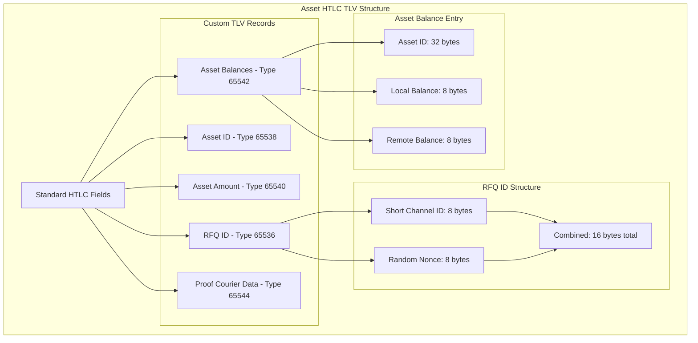
```mermaid
graph TB
    subgraph "Asset HTLC TLV Structure"
        HTLCBase[Standard HTLC Fields]
        
        subgraph "Custom TLV Records"
            RfqID[RFQ ID - Type 65536]
            AssetID[Asset ID - Type 65538]
            AssetAmount[Asset Amount - Type 65540]
            AssetBalance[Asset Balances - Type 65542]
            ProofData[Proof Courier Data - Type 65544]
        end
        
        subgraph "RFQ ID Structure"
            SCID[Short Channel ID: 8 bytes]
            Nonce[Random Nonce: 8 bytes]
            Combined[Combined: 16 bytes total]
        end
        
        subgraph "Asset Balance Entry"
            EntryAssetID[Asset ID: 32 bytes]
            LocalBalance[Local Balance: 8 bytes]
            RemoteBalance[Remote Balance: 8 bytes]
        end
        
        HTLCBase --> RfqID
        HTLCBase --> AssetID
        HTLCBase --> AssetAmount
        HTLCBase --> AssetBalance
        HTLCBase --> ProofData
        
        RfqID --> SCID
        RfqID --> Nonce
        SCID --> Combined
        Nonce --> Combined
        
        AssetBalance --> EntryAssetID
        AssetBalance --> LocalBalance
        AssetBalance --> RemoteBalance
    end
```

The TLV record structure extends standard Lightning HTLCs with asset-specific
fields while maintaining backward compatibility. Nodes that don't understand
these custom records simply forward them unchanged, allowing asset HTLCs to
traverse mixed paths containing both asset-aware and regular Lightning nodes.

The RFQ ID field (type 65536) carries the unique identifier linking this HTLC
to a specific RFQ quote. This 16-byte value combines a short channel ID with a
random nonce, providing both routing hints and uniqueness guarantees.

Asset identification uses type 65538 to specify which asset is being
transferred. The 32-byte asset ID uniquely identifies the Taproot asset across
the network. The asset amount field (type 65540) specifies the quantity being
transferred, using the asset's native unit of account.

Balance information (type 65542) provides a snapshot of asset balances after
this HTLC is applied. This helps nodes verify the transfer doesn't exceed
available balances and provides an audit trail for reconciliation.

The proof courier data field (type 65544) contains information needed to
retrieve the asset transfer proof after settlement. This enables the receiving
party to obtain cryptographic proof of the asset transfer, which can be
verified independently of the Lightning channel state.

### NoOp Implementation Details

The NoOp implementation is handled through a simple flag on the HTLC structure
that signals to lnd's channel state machine to skip Bitcoin balance updates
while still processing asset transfers:

```go
// From rfqmsg/records.go - the actual HTLC structure with NoOp support
type Htlc struct {
    // Amounts is a list of asset balances that are changed by the HTLC.
    Amounts tlv.RecordT[HtlcAmountRecordType, AssetBalanceListRecord]
    
    // RfqID is the RFQ ID that corresponds to the HTLC.
    RfqID tlv.OptionalRecordT[HtlcRfqIDType, ID]
    
    // NoopAdd is a flag that indicates whether this HTLC should be marked
    // as a noop_add for LND. A noop_add HTLC behaves identically to a
    // normal HTLC except for the settlement step, where the satoshi amount
    // is returned back to the sender, but the commitment blob is still
    // updated to reflect the asset balance changes.
    NoopAdd bool
}

// SetNoopAdd flags the HTLC as a noop_add.
func (h *Htlc) SetNoopAdd(noopActive bool) {
    h.NoopAdd = noopActive
}
```

The NoOp flag is set when processing HTLCs that should transfer only assets
without moving Bitcoin value:

```go
// From rfq/order.go - setting the NoOp flag during HTLC processing
if c.NoOpHTLCs {
    htlcRecord.SetNoopAdd(rfqmsg.UseNoOpHTLCs)
}
```

The NoOp pattern implementation coordinates between the taproot-assets layer
and lnd's channel state machine. When the NoopAdd flag is set, lnd's channel
state machine recognizes this special HTLC type and skips the normal Bitcoin
balance update while still allowing the auxiliary data (asset balances) to be
updated.

Asset balance updates happen in a separate accounting layer that tracks asset
positions independently of the Lightning channel balance. When a NoOp HTLC
settles, this layer updates the asset balances according to the transferred
amount and exchange rate from the RFQ quote.

The proof generation system must handle NoOp HTLCs specially, generating proofs
that show asset movement without corresponding Bitcoin movement. These proofs
are essential for audit trails and dispute resolution, as they provide
cryptographic evidence of the asset transfer even though the Lightning channel
state doesn't reflect a Bitcoin transfer.

Error handling in NoOp settlements requires careful consideration. If the asset
balance update fails, the entire HTLC must be failed to maintain consistency.
The system must ensure atomicity between the Lightning HTLC settlement and the
asset balance update to prevent states where one succeeds but the other fails.

### Multi-Hop Coordination

Multi-hop asset payments require the transformation pipeline to coordinate
transformations across multiple hops. Each hop in a payment path may involve
different types of channels - some carrying assets, others carrying only
Bitcoin. The transformation pipeline must ensure that the correct
transformations occur at each hop while maintaining payment atomicity.

The system analyzes the payment route during HTLC construction. The
AuxHTLCModifier examines each hop and generates appropriate auxiliary blobs that
encode the necessary transformations. For hops through asset channels, these
blobs contain asset amounts and RFQ IDs. For Bitcoin-only hops, the blobs may be
empty or contain only routing hints.

At each hop, the HTLC interceptor examines both the incoming HTLC and the next
hop's requirements. If transitioning from a Bitcoin channel to an asset channel,
it performs rate conversion and record injection. If transitioning from an asset
channel to a Bitcoin channel, it extracts the asset information and ensures
proper settlement of the asset portion while forwarding the Bitcoin value.

## Asset Invoice Flows

The RFQ protocol enables two invoice flows that allow users to send and receive
asset payments even when they're not directly connected. These flows coordinate
multi-party interactions for asset payments.

### Creating an Asset Invoice

When a user wants to receive assets through Lightning, they create an asset
invoice that encodes all the information necessary for a payer to route assets
to them. This process involves coordination between the receiver's node, their
asset channel peer, and the RFQ system.

The journey begins when the receiver decides to create an invoice for a specific
asset amount. Unlike Bitcoin invoices where the amount is straightforward, asset
invoices must handle exchange rate discovery and quote negotiation before the
invoice can even be generated. The receiver's node initiates a quote request to
their asset channel peer, seeking to establish the terms under which they'll
accept incoming assets.

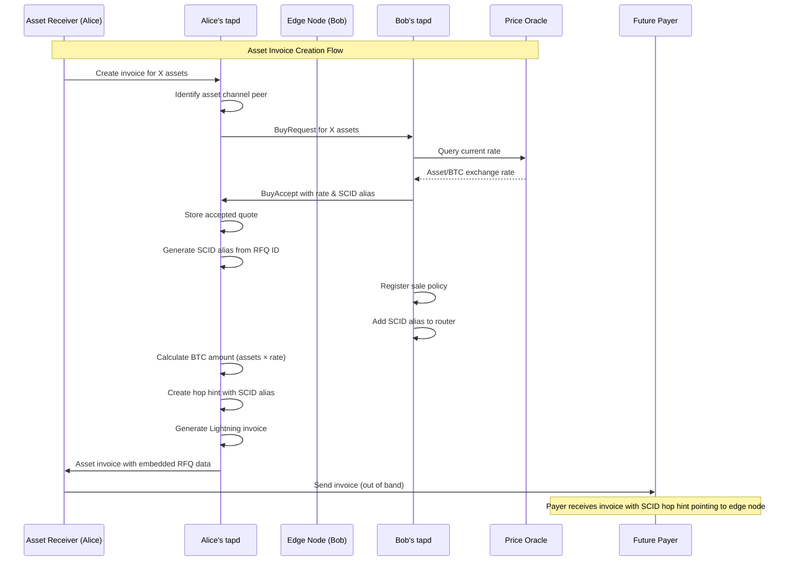
```mermaid
sequenceDiagram
    participant Receiver as Asset Receiver (Alice)
    participant ReceiverTapd as Alice's tapd
    participant EdgeNode as Edge Node (Bob)
    participant EdgeTapd as Bob's tapd
    participant PriceOracle as Price Oracle
    participant Payer as Future Payer

    Note over Receiver, PriceOracle: Asset Invoice Creation Flow

    %% 1. Invoice Creation Request
    Receiver->>ReceiverTapd: Create invoice for X assets
    ReceiverTapd->>ReceiverTapd: Identify asset channel peer
    
    %% 2. RFQ Negotiation
    ReceiverTapd->>EdgeTapd: BuyRequest for X assets
    EdgeTapd->>PriceOracle: Query current rate
    PriceOracle-->>EdgeTapd: Asset/BTC exchange rate
    EdgeTapd->>ReceiverTapd: BuyAccept with rate & SCID alias
    
    %% 3. Quote Storage and SCID Setup
    ReceiverTapd->>ReceiverTapd: Store accepted quote
    ReceiverTapd->>ReceiverTapd: Generate SCID alias from RFQ ID
    EdgeTapd->>EdgeTapd: Register sale policy
    EdgeTapd->>EdgeTapd: Add SCID alias to router
    
    %% 4. Invoice Generation
    ReceiverTapd->>ReceiverTapd: Calculate BTC amount (assets × rate)
    ReceiverTapd->>ReceiverTapd: Create hop hint with SCID alias
    ReceiverTapd->>ReceiverTapd: Generate Lightning invoice
    ReceiverTapd->>Receiver: Asset invoice with embedded RFQ data
    
    %% 5. Invoice Distribution
    Receiver->>Payer: Send invoice (out of band)
    
    Note over Payer: Payer receives invoice with SCID hop hint pointing to edge node
```

During the quote negotiation phase, the receiver's node sends a BuyRequest to
their asset channel peer. The receiver's node sends a BuyRequest to their asset
channel peer, indicating they want to purchase assets in exchange for incoming
Bitcoin payments. The peer consults their price oracle to determine the current
exchange rate, potentially adding their own spread or fees. Once terms are
agreed, the peer responds with a BuyAccept message that includes the exchange
rate and a cryptographic signature binding them to these terms.

With the quote accepted, both nodes perform setup operations. The receiver
stores the quote details, which will later be used to validate incoming
payments. The edge node registers a sale policy with their HTLC interceptor,
instructing it to transform incoming Bitcoin HTLCs into asset transfers at the
agreed rate. Both nodes derive an SCID alias from the RFQ ID, creating a virtual
channel identifier that will appear in the invoice's routing hints.

The invoice generation itself involves calculating the Bitcoin equivalent of the
requested asset amount using the agreed exchange rate. The system adds a hop
hint containing the SCID alias, which tells potential payers that they should
route through the edge node to reach the receiver. This hop hint provides the
bridge between the standard Lightning Network and the asset channel, even though
the payer may have no awareness that assets are involved.

### Paying an Asset Invoice

When a user wants to pay an asset invoice, they need to send assets to a
receiver who may be multiple hops away, potentially through nodes they've never
interacted with before. The RFQ protocol coordinates this through a sequence of
operations.

```mermaid
sequenceDiagram
    participant Sender as Asset Sender (Charlie)
    participant SenderTapd as Charlie's tapd
    participant SenderEdge as Charlie's Edge (Dan)
    participant SenderEdgeTapd as Dan's tapd
    participant ReceiverEdge as Receiver's Edge (Bob)
    participant ReceiverEdgeTapd as Bob's tapd
    participant ReceiverTapd as Alice's tapd
    participant Receiver as Asset Receiver (Alice)
    participant Oracle as Price Oracle

    Note over Sender, Receiver: Asset Invoice Payment Flow

    %% 1. Invoice Parsing
    Sender->>SenderTapd: Pay asset invoice
    SenderTapd->>SenderTapd: Parse invoice & extract SCID hint
    SenderTapd->>SenderTapd: Identify receiver expects assets
    
    %% 2. Sender's RFQ Negotiation
    SenderTapd->>SenderEdgeTapd: SellRequest for Y assets
    SenderEdgeTapd->>Oracle: Query current rate
    Oracle-->>SenderEdgeTapd: Asset/BTC rate
    SenderEdgeTapd->>SenderTapd: SellAccept with rate
    
    %% 3. Sender's Setup
    SenderTapd->>SenderTapd: Store sale quote
    SenderEdgeTapd->>SenderEdgeTapd: Register purchase policy
    
    %% 4. Payment Initiation
    SenderTapd->>SenderTapd: Inject asset records & RFQ ID
    SenderTapd->>SenderEdgeTapd: Send asset HTLC
    
    %% 5. First Edge Processing
    SenderEdgeTapd->>SenderEdgeTapd: Intercept HTLC
    SenderEdgeTapd->>SenderEdgeTapd: Validate against policy
    SenderEdgeTapd->>SenderEdgeTapd: Convert assets to BTC
    SenderEdgeTapd->>ReceiverEdgeTapd: Forward BTC HTLC
    
    %% 6. Lightning Network Routing
    Note over SenderEdgeTapd, ReceiverEdgeTapd: Standard Lightning routing (may be multiple hops)
    
    %% 7. Receiver's Edge Processing
    ReceiverEdgeTapd->>ReceiverEdgeTapd: Intercept HTLC
    ReceiverEdgeTapd->>ReceiverEdgeTapd: Match SCID to sale policy
    ReceiverEdgeTapd->>ReceiverEdgeTapd: Convert BTC to assets
    ReceiverEdgeTapd->>ReceiverTapd: Forward asset HTLC
    
    %% 8. Final Settlement
    ReceiverTapd->>ReceiverTapd: Validate asset HTLC
    ReceiverTapd->>Receiver: Notify payment received
    Receiver->>ReceiverTapd: Accept payment
    ReceiverTapd->>ReceiverEdgeTapd: Release preimage
    
    %% 9. Settlement Chain
    ReceiverEdgeTapd->>SenderEdgeTapd: Propagate preimage
    SenderEdgeTapd->>SenderTapd: Complete settlement
    SenderTapd->>Sender: Payment successful
```

The payment flow begins when the sender's node parses the invoice and identifies
that it contains an SCID hop hint. This hint indicates that the payment should
route through a specific edge node. However, the sender may not have a direct
channel to this edge node. Instead, they need to use their own asset channel
peer as an intermediary.

The sender initiates their own RFQ negotiation with their asset channel peer,
requesting to sell assets in exchange for Bitcoin that can be routed through the
Lightning Network. This creates a mirror image of the receiver's quote - where
the receiver negotiated to buy assets with incoming Bitcoin, the sender
negotiates to sell assets for outgoing Bitcoin. The rates in these two
independent negotiations may differ, creating an arbitrage opportunity for the
edge nodes.

Once the sender's quote is accepted, their edge node registers a purchase
policy, preparing to accept incoming asset HTLCs and convert them to Bitcoin.
The sender's node then constructs an HTLC that includes custom records
identifying the assets being transferred and the RFQ ID governing the
transaction.

The conversion happens at the edge nodes. The sender's edge node intercepts the
incoming asset HTLC, validates it against the purchase policy, and converts the
asset amount to Bitcoin using the agreed rate. It then forwards a standard
Bitcoin HTLC through the Lightning Network. This HTLC routes through the network
using standard Lightning protocols, potentially traversing multiple nodes that
have no awareness of the underlying asset transfer.

When the HTLC reaches the receiver's edge node, identified by the SCID alias in
the routing hint, the reverse transformation occurs. The edge node intercepts
the Bitcoin HTLC, recognizes the SCID alias as corresponding to a registered
sale policy, and converts the Bitcoin back to assets at the rate agreed with the
receiver. The final asset HTLC is then forwarded to the receiver.

### Handling Disconnected Parties

In both invoice flows, the sender and receiver don't need to be directly
connected or even aware of each other's asset channel arrangements. The RFQ
protocol creates a marketplace where edge nodes act as liquidity providers and
exchange facilitators.

This disconnection is handled through several mechanisms. First, the SCID alias
system allows invoices to reference virtual channels that only exist in the
context of specific quotes. Second, the independent quote negotiations at each
end allow for different rates and terms, with edge nodes absorbing the
differences. Third, the standard Lightning routing in the middle ensures
compatibility with the existing network infrastructure.

The protocol also handles various failure scenarios that can occur with
disconnected parties. If the receiver's quote expires before payment arrives,
the edge node will reject the HTLC, causing the payment to fail cleanly. If the
sender's edge node cannot route to the receiver's edge node, the payment fails
before any assets are committed. These failure modes ensure that assets and
Bitcoin are never lost, even when complex multi-hop routing fails.

### Rate Arbitrage and Market Making

The disconnection between sender and receiver creates natural opportunities for
market making. Edge nodes can profit from the spread between the rates they
offer to buyers and sellers. For example, an edge node might offer to buy assets
at 0.95 BTC per asset from receivers while selling assets at 1.05 BTC per asset
to senders, capturing the 0.10 BTC spread.

This market-making function provides important liquidity to the asset ecosystem.
Edge nodes are incentivized to maintain both Bitcoin and asset liquidity,
monitor market rates, and offer competitive pricing. The competition between
edge nodes naturally drives spreads down, benefiting end users while still
providing sufficient profit to maintain liquidity.

The protocol's architecture ensures that this market making happens
transparently and securely. The cryptographic binding of rates through signed
quotes prevents edge nodes from changing terms after acceptance. The atomic
nature of HTLCs ensures that edge nodes cannot steal funds during conversion.
The automatic expiry of quotes limits the risk exposure from rate fluctuations.

## Security Architecture

The RFQ protocol implements multiple layers of security controls that protect
against both technical attacks and economic manipulation. This defense-in-depth
approach ensures that even if one security layer is compromised, others continue
to protect the system.

### Cryptographic Integrity

The security model is based on cryptographic verification of protocol messages.
Quote acceptances include signatures that bind the accepting party to specific
terms. These signatures use the same key material as Lightning node identities,
leveraging the existing web of trust in the Lightning Network.

The signature scheme covers not just the exchange rate but also temporal bounds
and amount limits. This prevents an attacker from taking an old signature and
applying it to different terms. The inclusion of expiry timestamps in signed
data ensures that quotes naturally become invalid after their intended lifetime,
preventing replay attacks where an attacker might try to execute trades at
outdated rates.

### Rate Manipulation Prevention

The protocol implements several mechanisms to prevent exchange rate
manipulation. First, the binding between RFQ IDs and exchange rates is
cryptographically enforced. An attacker cannot substitute a different rate for
an accepted quote because the HTLC carries the RFQ ID that uniquely identifies
the agreed terms.

Second, the tolerance checking mechanism prevents exploiting small rate
discrepancies. While the system allows for minor deviations within PPM bounds to
account for legitimate rounding, any attempt to deviate beyond these bounds
results in rejection. The PPM thresholds are configurable but default to values
that prevent economically meaningful manipulation while allowing for operational
flexibility.

Third, the system implements rate limiting and velocity controls. A single peer
cannot flood the system with quote requests, and executed volumes are tracked to
prevent wash trading or other manipulative behaviors. These controls operate at
multiple levels - per peer, per asset, and system-wide - providing comprehensive
protection against various attack vectors.

### Temporal Security and Expiry Management

Time is an important component of the security model. Every quote includes an
expiry timestamp that limits its validity period. This serves multiple security
purposes beyond just preventing stale rate execution.

The expiry mechanism prevents resource exhaustion attacks where an attacker
might accept numerous quotes without intending to execute them, tying up
liquidity. As quotes expire, the system automatically releases any reserved
resources, ensuring that legitimate trades aren't blocked by malicious quote
accumulation.

The system also implements clock synchronization checks to prevent temporal
manipulation attacks. If a peer's messages indicate a clock skew beyond
acceptable bounds, the system may reject their quotes or require additional
verification. This prevents attacks where manipulating timestamps might be used
to extend quote validity or execute expired quotes.


## Operational Considerations

Running an RFQ-enabled node requires understanding several operational aspects
that affect reliability, profitability, and user experience.

### Price Oracle Integration

The price oracle is a dependency for the RFQ system. Oracle selection impacts
trading profitability and risk. The system supports multiple oracle backends,
from simple fixed-rate configurations for testing to real-time market data feeds
for production trading.

If the oracle becomes unavailable, the node cannot generate new quotes. The
system implements circuit breakers that prevent quote generation when oracle
connectivity is uncertain, protecting against accidentally quoting incorrect
rates. Operators should implement oracle redundancy, either through multiple
oracle sources or fallback mechanisms.

The oracle interface includes metadata support, allowing oracles to provide
additional context about rates. This might include confidence intervals,
liquidity indicators, or market volatility measures. Advanced implementations
can use this metadata to adjust spreads dynamically or refuse quotes during
extreme market conditions.

### Liquidity Management

Operating an RFQ node requires liquidity management across both Bitcoin and
asset channels. Unlike traditional Lightning nodes that only manage Bitcoin
liquidity, RFQ operators must balance multiple asset types and consider exchange
rate fluctuations.

The system provides liquidity reservation mechanisms to prevent overcommitment.
When a quote is generated, the system can optionally reserve the quoted amount,
preventing other quotes from committing the same liquidity. This reservation
system handles partial reservations and releases as HTLCs are settled.

Operators must also consider the capital efficiency implications of the NoOp
pattern. While this pattern reduces Bitcoin liquidity requirements for pure
asset transfers, it requires sufficient asset liquidity to handle the expected
volume. The system provides detailed metrics about liquidity utilization across
different asset types, helping operators optimize their capital allocation.

### Monitoring and Observability

The protocol provides comprehensive monitoring capabilities through event
streams and metrics exporters. Every significant operation generates events that
can be consumed by monitoring systems. These events include structured data
about quote negotiations, HTLC transformations, settlement operations, and error
conditions.

The metrics interface exposes both counter and gauge metrics compatible with
standard monitoring systems like Prometheus. Key metrics include quote request
rates, acceptance ratios, settlement volumes, and error frequencies. The system
also provides histogram metrics for latency measurements, allowing operators to
track performance degradation over time.

Log output is structured to support automated analysis while remaining
human-readable. Each log entry includes correlation IDs that allow tracing a
single payment or quote negotiation across all subsystems. The logging level can
be dynamically adjusted without restart, allowing detailed debugging when issues
occur without impacting normal operation performance.

## Integration Patterns and Best Practices

Developers building applications on top of the RFQ protocol should understand
several key integration patterns that ensure robust and efficient operation.

### Quote Lifecycle Management

Applications should implement quote lifecycle management, treating quotes as
time-bound resources. When requesting quotes, applications should specify
appropriate expiry times based on their use case. High-frequency trading
applications might use short expiries of 30 seconds or less, while retail
applications might use several minutes.

The application should track quote state transitions and handle all possible
outcomes. A quote might be explicitly rejected, expire without response, or be
accepted but never executed. Each scenario requires appropriate handling,
whether that's requesting a new quote, notifying the user, or falling back to
alternative strategies.

Applications should also implement quote caching when appropriate. If multiple
users might request similar quotes within a short timeframe, caching recent
quotes can reduce latency and oracle load. The cache implementation must respect
expiry times and invalidate stale quotes to prevent execution at outdated rates.

### Error Handling and Recovery

The protocol provides detailed error information that applications should use to
implement intelligent retry logic. Not all errors are equal - a rejection due to
insufficient liquidity might resolve itself quickly, while a rejection due to
unsupported assets is permanent.

Applications should implement exponential backoff for transient errors,
preventing retry storms that could overwhelm the system. The protocol includes
rate limiting that will eventually block overly aggressive clients, so proper
backoff is essential for maintaining service availability.

For trading applications, implementing circuit breakers can prevent cascading
failures. If error rates exceed acceptable thresholds, the application should
stop attempting new operations and alert operators. The circuit breaker should
include gradual recovery mechanisms that slowly restore functionality as the
system stabilizes.

## Future Evolution and Extension Points

The RFQ protocol has been designed with extensibility in mind, providing clear
paths for future enhancements while maintaining backward compatibility.

### Protocol Versioning and Evolution

The wire protocol includes mandatory version fields that enable gradual
evolution. New message types can be added without breaking existing
implementations, and optional TLV fields allow for incremental feature addition.
The protocol reserves ranges for experimental features, allowing innovation
without requiring formal specification updates.

Future versions might introduce advanced trading features like option contracts,
futures, or complex multi-asset swaps. The existing message structure can
accommodate these through new TLV types while maintaining compatibility with
nodes that only support basic spot trading.

### Multi-Asset and Cross-Chain Integration

While the current implementation focuses on single-asset transfers, the
architecture supports future multi-asset HTLCs where a single payment might
carry multiple asset types. The custom record structure can encode arbitrary
asset combinations, and the transformation pipeline can handle complex
multi-asset calculations.

Cross-chain integration represents another evolution path. The protocol could be
extended to support assets on other chains, with the RFQ system coordinating
cross-chain atomic swaps. The existing quote negotiation mechanism could handle
the additional complexity of cross-chain timing and fee considerations.

### Advanced Market Making

The protocol provides foundations for market-making strategies. Future
enhancements might include support for streaming quotes that update in real-time
based on market conditions. The event system could be extended to provide market
data feeds that allow algorithmic trading strategies.

Integration with decentralized price oracles and automated market makers could
eliminate the dependency on centralized price feeds. The oracle interface is
abstract enough to support various price discovery mechanisms, from simple APIs
to complex on-chain oracles.
