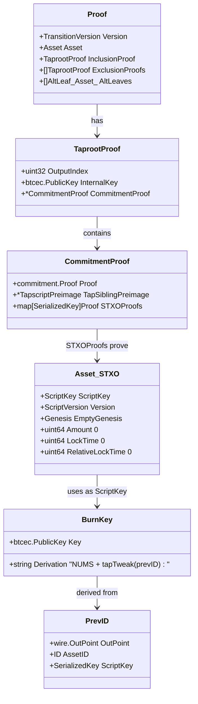
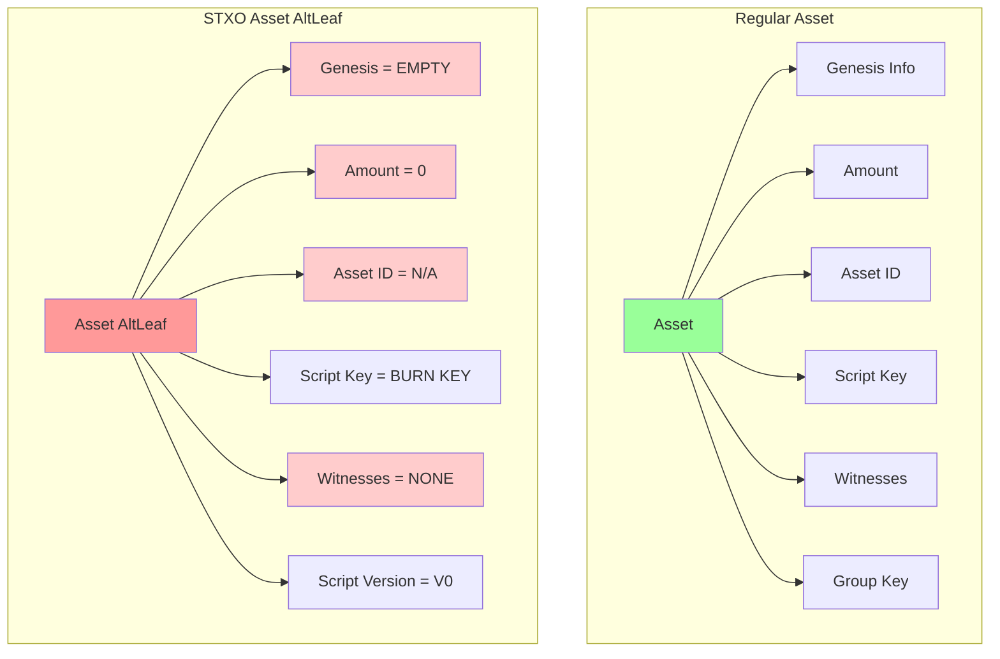
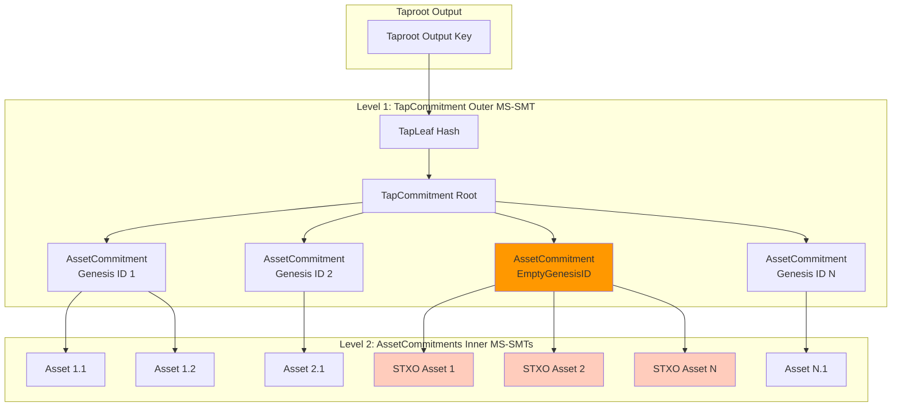
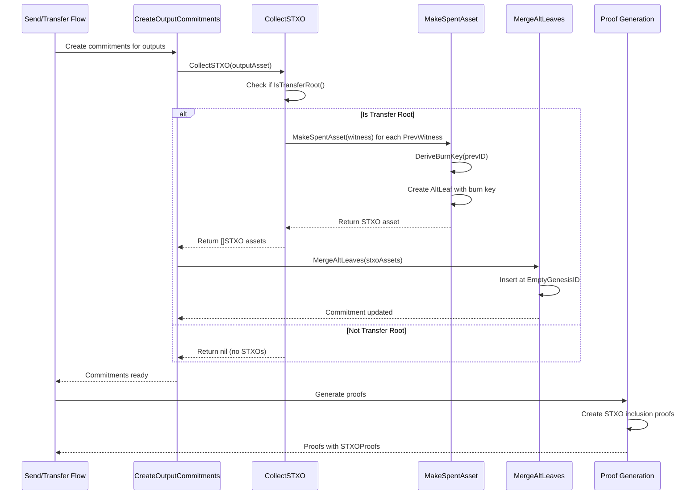
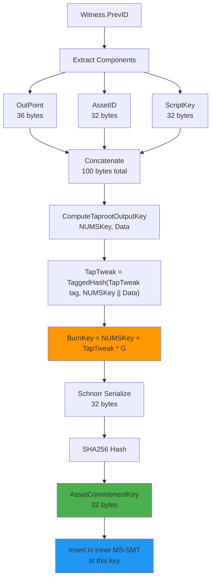
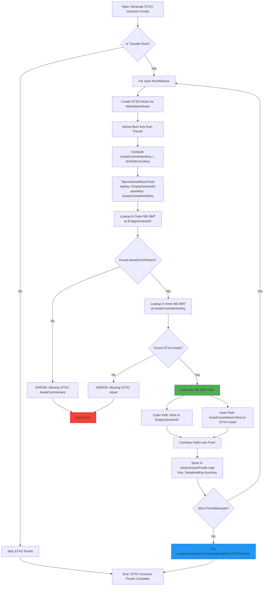
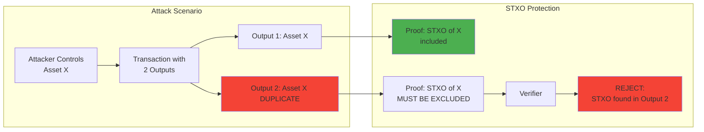
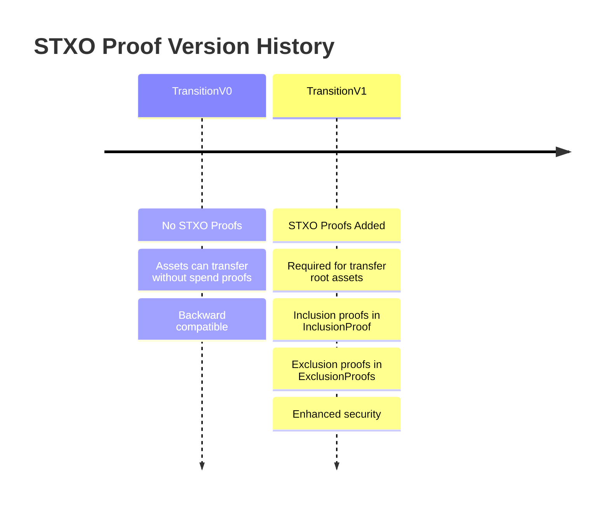
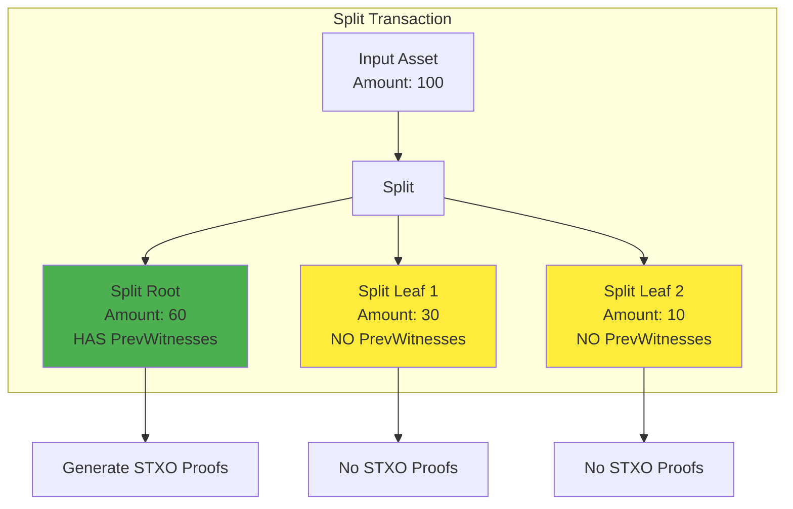

# STXO Proof Design

## Table of Contents

1. [Introduction](#introduction)
2. [The STXO Proof Concept](#the-stxo-proof-concept)
3. [Data Structures and Representation](#data-structures-and-representation)
   - [The Proof Structure](#the-proof-structure)
   - [STXO Asset Representation](#stxo-asset-representation)
   - [The PrevID Structure](#the-previd-structure)
4. [Commitment Tree Integration](#commitment-tree-integration)
   - [Two-Level Tree Architecture](#two-level-tree-architecture)
   - [The EmptyGenesisID Namespace](#the-emptygenesisid-namespace)
   - [Insertion via MergeAltLeaves](#insertion-via-mergealtleaves)
   - [Retrieval and Proof Generation](#retrieval-and-proof-generation)
5. [Lifecycle and Creation](#lifecycle-and-creation)
   - [Transfer Initiation](#transfer-initiation)
   - [The IsTransferRoot Decision](#the-istransferroot-decision)
   - [Burn Key Derivation](#burn-key-derivation)
   - [Commitment Construction Timing](#commitment-construction-timing)
6. [Proof Generation and Verification](#proof-generation-and-verification)
   - [Inclusion Proof Generation](#inclusion-proof-generation)
   - [Exclusion Proof Generation](#exclusion-proof-generation)
   - [Verification Process](#verification-process)
   - [Completeness Checks](#completeness-checks)
7. [Security Properties and Attack Prevention](#security-properties-and-attack-prevention)
   - [Double-Spend Prevention](#double-spend-prevention)
   - [Replay Attack Protection](#replay-attack-protection)
   - [Burn Key Unspendability](#burn-key-unspendability)
   - [Collision Resistance](#collision-resistance)
8. [Versioning and Backward Compatibility](#versioning-and-backward-compatibility)
   - [TransitionV0 and TransitionV1](#transitionv0-and-transitionv1)
   - [Asset Channel Opt-Out](#asset-channel-opt-out)
   - [Downgrade Mechanism](#downgrade-mechanism)
9. [Special Cases and Edge Conditions](#special-cases-and-edge-conditions)
   - [Genesis Asset Minting](#genesis-asset-minting)
   - [Split Transactions](#split-transactions)
   - [Consolidation Transfers](#consolidation-transfers)
   - [Burn Transactions](#burn-transactions)
10. [Conclusion](#conclusion)

## Introduction

In the Taproot Assets protocol, transfers must provide cryptographic proof that
input assets are validly consumed and not double-spent. The Spent Transaction
Output (STXO) proof system addresses this requirement by integrating with the
protocol's existing commitment tree structure. Unlike traditional blockchains
that track spent outputs in a global UTXO set, Taproot Assets anchors multiple
asset transfers to single Bitcoin transactions, requiring a sophisticated
approach to proving asset consumption.

STXO proofs demonstrate two critical properties. First, inclusion: assets
consumed as inputs are properly recorded in the sender's output commitment.
Second, exclusion: these spent assets do not appear in other outputs of the same
transaction, preventing double-spends. This dual-proof mechanism enables
receivers to verify the complete lineage of transferred assets without trusted
third parties or comprehensive chain state.

The implementation leverages the protocol's Merkle-Sum Sparse Merkle Tree
(MS-SMT) commitment structure, introducing STXO assets as "alternative leaves"
stored at a designated tree location. These STXO assets contain only provably
unspendable "burn keys" derived deterministically from spent asset metadata.
This ensures STXO proofs integrate naturally with existing proof verification
infrastructure while maintaining separation from regular asset commitments.

STXO proofs were introduced in `TransitionV1` and are required for all transfer
root assets using this version. The system maintains backward compatibility with
`TransitionV0` proofs while establishing a path toward universal enforcement in
future versions.

## The STXO Proof Concept

An STXO proof is a pair of cryptographic proofs demonstrating the state of spent
assets within a transfer. When Alice transfers an asset to Bob, she must prove
Bob receives a valid asset and that she properly consumed her inputs without
spending them to multiple parties.

The key insight is that spent assets can be represented as entries in the same
MS-SMT structure used for active assets, but stored at a special reserved
location. Rather than designing a separate proof system, the implementation
creates minimal `Asset` structures containing only a script key and version,
with all other fields set to zero. This script key is a provably unspendable
public key—a burn key—computed deterministically from the spent asset's unique
identifier.

Each asset input is identified by its `PrevID`, which combines the Bitcoin UTXO
outpoint where it was anchored, the asset's ID, and its script key. This
three-part identifier ensures global uniqueness: no two assets can have
identical `PrevID`s because each Bitcoin UTXO can only be spent once, and within
that UTXO, each asset instance has a unique script key. The STXO proof system
derives a burn key through a taproot-style tweak of a Nothing-Up-My-Sleeve
(NUMS) point using the `PrevID` as tweak data.

The burn key derivation follows: `burnKey = NUMSKey + H(NUMSKey || OutPoint ||
AssetID || ScriptKey) × G`, where H is the tagged hash function used in taproot
key tweaking and G is the secp256k1 generator point. This ensures the key is
provably unspendable, deterministically derived from the `PrevID`, and unique
per spent asset, preventing collisions.

These minimal STXO assets are inserted into a dedicated `AssetCommitment` at
`EmptyGenesisID`, the hash of a zero-valued `Genesis` structure. This location
serves as a namespace for all STXO assets, separate from commitments keyed by
actual genesis IDs. Within this commitment, each STXO asset is keyed by the hash
of its burn key, enabling inclusion or exclusion proofs for specific spent
assets.

The proof mechanism operates at two levels. For the output receiving the
transfer, inclusion proofs demonstrate that STXO assets for each input exist at
`EmptyGenesisID`. For other outputs, exclusion proofs demonstrate either that
the `EmptyGenesisID` commitment does not exist or that specific STXO assets are
not present. These leverage the sparse merkle tree property allowing
non-membership proofs by showing paths leading to empty nodes.

## Data Structures and Representation

The STXO proof system integrates with existing `Proof` and `TaprootProof`
structures in `github.com/lightninglabs/taproot-assets/proof/proof.go`, using
minimal asset representations stored as alternative leaves.

### The Proof Structure

The `Proof` structure contains a `Version` field that determines whether STXO
proofs are required. For `TransitionV0`, they are optional; for `TransitionV1`,
they are mandatory for transfer root assets. The `AltLeaves` field holds STXO
assets when included.



`TaprootProof` represents a proof that an asset is committed to a specific
taproot output. It contains an `OutputIndex`, an `InternalKey`, and a
`CommitmentProof` providing the path through the commitment tree. The
`CommitmentProof`, defined in
`github.com/lightninglabs/taproot-assets/proof/taproot.go`, critically contains
a `STXOProofs` map from `asset.SerializedKey` to `commitment.Proof`.

This map holds actual STXO inclusion or exclusion proofs. Keys are 33-byte
serialized burn keys; values are MS-SMT proofs demonstrating presence or absence
of the corresponding STXO asset. Verifiers extract `PrevWitnesses`, derive
expected burn keys, and look up proofs in this map for efficient verification.

### STXO Asset Representation

STXO assets, while technically `Asset` structures from
`github.com/lightninglabs/taproot-assets/asset/asset.go`, contain minimal data.
The `NewAltLeaf` function constructs these representations:

```go
// NewAltLeaf instantiates a new valid AltLeaf.
func NewAltLeaf(key ScriptKey, keyVersion ScriptVersion) (*Asset, error) {
    if key.PubKey == nil {
        return nil, fmt.Errorf("script key must be non-nil")
    }

    return &Asset{
        Version:             V0,
        Genesis:             EmptyGenesis,
        Amount:              0,
        LockTime:            0,
        RelativeLockTime:    0,
        PrevWitnesses:       nil,
        SplitCommitmentRoot: nil,
        GroupKey:            nil,
        ScriptKey:           key,
        ScriptVersion:       keyVersion,
    }, nil
}
```

This creates an asset with all fields zero or empty except `ScriptKey` (holding
the burn key) and `ScriptVersion`:



`MakeSpentAsset` creates STXO assets from witness data:

```go
// MakeSpentAsset creates an Alt Leaf with the minimal asset based on the
// PrevID of the witness.
func MakeSpentAsset(witness Witness) (*Asset, error) {
    if witness.PrevID == nil {
        return nil, fmt.Errorf("witness has no prevID")
    }

    prevIdKey := DeriveBurnKey(*witness.PrevID)
    scriptKey := NewScriptKey(prevIdKey)

    spentAsset, err := NewAltLeaf(scriptKey, ScriptV0)
    if err != nil {
        return nil, fmt.Errorf("error creating altLeaf: %w", err)
    }

    return spentAsset, nil
}
```

This extracts the `PrevID` from the witness, derives a burn key, wraps it in a
`ScriptKey`, and constructs the STXO asset via `NewAltLeaf`.

### The PrevID Structure

`PrevID` is the foundation for burn key derivation. It contains an `OutPoint`
identifying the Bitcoin transaction output where the asset was anchored, an `ID`
representing the asset's unique identifier, and a `ScriptKey` field with the
33-byte serialized public key. Together, these provide a globally unique
identifier for any asset at any point in its history.

## Commitment Tree Integration

The Taproot Assets protocol uses a two-level Merkle-Sum Sparse Merkle Tree to
commit assets within a taproot output, providing efficient proofs and namespace
separation.

### Two-Level Tree Architecture

The outer `TapCommitment` (in
`github.com/lightninglabs/taproot-assets/commitment/tap.go`) is an MS-SMT keyed
by asset genesis IDs. Each value is the root of an inner `AssetCommitment`,
itself an MS-SMT keyed by individual asset identifiers. This enables efficient
proofs while maintaining separate namespaces for different asset types.



### The EmptyGenesisID Namespace

STXO assets occupy a dedicated entry at `EmptyGenesisID`, the `ID` of a
zero-valued `Genesis` structure. This reserved namespace never collides with
actual asset genesis IDs, since valid assets always have non-empty genesis
information.

Within the `AssetCommitment` at `EmptyGenesisID`, individual STXO assets are
keyed by the SHA256 hash of their burn key's compressed serialization. The
`AssetCommitmentKey` method returns the asset ID for genesis assets, and the
hash of the script key for non-genesis assets. Since STXO assets use unique burn
keys as script keys, each STXO asset has a unique location.

### Insertion via MergeAltLeaves

STXO assets are inserted via `MergeAltLeaves` on `TapCommitment`. This function
validates that all provided STXO assets have unique `AssetCommitmentKey`s, looks
up or creates the `AssetCommitment` at `EmptyGenesisID`, inserts each STXO asset
via `Upsert` into the inner MS-SMT, and updates the outer MS-SMT with the new
root.

Collision detection is critical for security. The function compares new STXO
asset keys against existing ones, returning `ErrDuplicateAltLeafKey` if any key
appears in both sets. This prevents inserting the same STXO proof multiple
times.

### Retrieval and Proof Generation

`FetchAltLeaves` retrieves STXO assets by looking up the `AssetCommitment` at
`EmptyGenesisID` and returning all contained assets.

The `Proof` generation function creates both inclusion and exclusion proofs for
STXO assets. For STXO proofs, the `tapCommitmentKey` is always `EmptyGenesisID`,
and the `assetCommitmentKey` is the hash of the specific burn key. It generates
an MS-SMT proof from the outer tree to the `AssetCommitment`, then from the
inner tree to the specific asset (inclusion) or empty leaf (exclusion).

Separating STXO assets at `EmptyGenesisID` allows efficient enumeration via
`FetchAltLeaves`, prevents interference with regular asset lookups, and enables
bulk operations like `Downgrade`, which removes the entire STXO commitment.

## Lifecycle and Creation

STXO proof creation begins with transfer initiation and proceeds through
commitment construction, proof generation, and verification.

### Transfer Initiation

STXO proofs are created during output commitment construction. When a sender
initiates a transfer, the system constructs virtual packets (vPackets)
representing asset movements. For each output, `CreateOutputCommitments` in
`github.com/lightninglabs/taproot-assets/tapsend/send.go` builds the commitments
to be anchored to the Bitcoin transaction.



### The IsTransferRoot Decision

The critical decision is the `IsTransferRoot` check. An asset is a transfer root
if it has at least one `PrevWitness` with a non-nil `PrevID`. This distinguishes
transfer roots from genesis assets (no previous witnesses) and split leaves
(created from a split commitment, do not reference inputs directly). Only
transfer root assets generate STXO proofs.

For each transfer root asset, `CollectSTXO` in
`github.com/lightninglabs/taproot-assets/asset/asset.go` is called:

```go
// CollectSTXO returns the assets spent by the given output asset in the form
// of minimal assets that can be used to create an STXO commitment.
func CollectSTXO(outAsset *Asset) ([]AltLeaf[Asset], error) {
    // Genesis assets have no input asset, so they should have an empty
    // STXO tree. Split leaves will also have a zero PrevID; we will use
    // an empty STXO tree for them as well.
    if !outAsset.IsTransferRoot() {
        return nil, nil
    }

    // At this point, the asset must have at least one witness.
    if len(outAsset.PrevWitnesses) == 0 {
        return nil, fmt.Errorf("asset has no witnesses")
    }

    // We'll convert the PrevID of each witness into a minimal Asset, where
    // the PrevID is the tweak for an un-spendable script key.
    altLeaves := make([]*Asset, len(outAsset.PrevWitnesses))
    for idx, wit := range outAsset.PrevWitnesses {
        altLeaf, err := MakeSpentAsset(wit)
        if err != nil {
            return nil, fmt.Errorf("error collecting stxo for "+
                "witness %d: %w", idx, err)
        }

        altLeaves[idx] = altLeaf
    }

    return ToAltLeaves(altLeaves), nil
}
```

This iterates over `PrevWitnesses`, calling `MakeSpentAsset` for each to create
a minimal STXO asset. `MakeSpentAsset` extracts the `PrevID`, calls
`DeriveBurnKey` to compute the burn key, wraps it in a `ScriptKey`, and calls
`NewAltLeaf` to create the STXO asset containing only the burn key and script
version.

### Burn Key Derivation

`DeriveBurnKey` in `github.com/lightninglabs/taproot-assets/asset/burn.go`
implements the cryptographic derivation:

```go
// DeriveBurnKey derives a provably un-spendable but unique key by tweaking
// the public NUMS key with a tap tweak:
//
//   burnTweak = h_tapTweak(NUMSKey || outPoint || assetID || scriptKey)
//   burnKey = NUMSKey + burnTweak*G
//
// The prevID must be the PrevID from an input that is being spent
// by the virtual transaction that contains the burn.
func DeriveBurnKey(prevID PrevID) *btcec.PublicKey {
    var b bytes.Buffer

    // The data we use in the tap tweak of the NUMS point is the serialized
    // PrevID, which consists of an outpoint, the asset ID and the script
    // key. Because these three values combined are larger than 32 bytes, we
    // explicitly make the script spend path invalid because a merkle root
    // hash would be exactly 32 bytes.
    //
    // NOTE: All errors here are ignored, since they can only be returned
    // from a Write() call, which on the bytes.Buffer will _never_ fail.
    _ = wire.WriteOutPoint(&b, 0, 0, &prevID.OutPoint)
    _, _ = b.Write(prevID.ID[:])
    _, _ = b.Write(prevID.ScriptKey.SchnorrSerialized())

    // Since we'll never query lnd for a burn key, it doesn't matter if we
    // lose the parity information here. And this will only ever be
    // serialized on chain in a 32-bit representation as well, as this is
    // always a script key.
    burnKey := txscript.ComputeTaprootOutputKey(NUMSPubKey, b.Bytes())
    burnKey, _ = schnorr.ParsePubKey(schnorr.SerializePubKey(burnKey))
    return burnKey
}
```

This creates a provably unspendable but deterministic public key. The formula
ensures the key is provably unspendable, deterministically derived from the
`PrevID`, and unique per spent asset, preventing collisions.



### Commitment Construction Timing

After `CollectSTXO` returns STXO assets, they are appended to `vOut.AltLeaves`.
Later, `MergeAltLeaves` inserts them into the `TapCommitment` at
`EmptyGenesisID` before the final commitment root is computed, binding the STXO
proofs to the anchor transaction.

STXO assets are created during commitment construction, not proof generation.
This ensures STXO commitments are included in the taproot output anchored to the
blockchain. The MS-SMT proof paths are generated later during
`CreateProofSuffix`, proving statements about on-chain commitments. The
blockchain serves as the source of truth, and proofs demonstrate that truth to
receivers.

STXO creation can be disabled via `WithNoSTXOProofs`, primarily for asset
channels where both parties maintain full state. This option also supports
backward compatibility.

In split transactions, only the split root generates STXO proofs. Split leaves
are validated through the split commitment in the root, avoiding redundant
proofs.

When consolidating multiple inputs, the output asset has multiple `PrevWitness`
entries. `CollectSTXO` produces multiple STXO assets, all inserted at
`EmptyGenesisID` with unique keys determined by their burn keys. The resulting
proof contains multiple `STXOProofs` map entries, one per input.

## Proof Generation and Verification

STXO proof generation occurs in `CreateProofSuffix` in
`github.com/lightninglabs/taproot-assets/proof/append.go`, divided into
inclusion proofs, exclusion proofs, and verification.

### Inclusion Proof Generation

After constructing base `TaprootProof` structures, the function checks if the
asset is a transfer root and STXO proofs are enabled. If so, it generates STXO
inclusion proofs.



The function creates a map for STXO proofs and iterates over each witness in
`PrevWitnesses`. For each, it calls `MakeSpentAsset` to reconstruct the STXO
asset, then calls `Proof` on the `TaprootAssetRoot` commitment with
`EmptyGenesisID` as the `tapCommitmentKey` and the STXO asset's
`AssetCommitmentKey` as the `assetCommitmentKey`. This returns the MS-SMT proof
path from the STXO leaf to the commitment root.

The returned `commitment.Proof` contains the merkle path with sibling hashes at
each tree level. The function serializes the burn key, stores the proof in
`stxoInclusionProofs`, and assigns this map to
`InclusionProof.CommitmentProof.STXOProofs`, ensuring all inputs are proven
spent.

### Exclusion Proof Generation

Exclusion proof generation follows the same pattern for outputs not receiving
the asset. Each exclusion `TaprootProof` includes STXO exclusion proofs
demonstrating spent assets are not present in other outputs. The `Proof`
function returns paths leading to empty nodes rather than inclusion proofs.

### Verification Process

Verification begins in `Verify` in
`github.com/lightninglabs/taproot-assets/proof/verifier.go`. The verifier
determines if STXO proofs are required (proof version V1+ and asset is transfer
root). If required but missing, verification fails with `ErrProofInvalid`.

If present, the verifier calls `CollectSTXO` to determine expected STXO assets
based on `PrevWitnesses`, builds a map keyed by serialized burn keys, and passes
it to `verifySTXOProofSet`.

`verifySTXOProofSet` iterates over each `STXOProofs` entry, looks up the
corresponding expected STXO asset, and calls `Verify` on the MS-SMT proof with
the expected asset and commitment root. This verifies the merkle path is valid.

### Completeness Checks

For inclusion proofs, `Verify` ensures the leaf node contains the expected STXO
asset by recomputing the merkle path and confirming it matches the committed
root. For exclusion proofs, it ensures the leaf is empty or nonexistent.

Verification checks completeness: all expected STXO assets must have
corresponding proofs. Missing proofs cause failure, preventing selective
omission of STXO proofs. All inputs must be proven spent.

Exclusion proofs verify that either the `EmptyGenesisID` `AssetCommitment` does
not exist or specific STXO assets are not present, preventing double-spend
attacks.

## Security Properties and Attack Prevention

The STXO proof system provides cryptographic protection through inclusion and
exclusion proofs, burn key cryptography, and blockchain anchoring.

### Double-Spend Prevention

Double-spend prevention is achieved through exclusion proofs. When a sender
attempts to spend the same input to two outputs, exclusion proofs fail. The
first output may have valid inclusion proofs, but the second must have exclusion
proofs. If STXO assets are present in the second output's commitment,
verification detects this and rejects the proof, providing protection equivalent
to Bitcoin's UTXO model.



### Replay Attack Protection

STXO proofs are bound to specific on-chain transactions. Each burn key is
derived from a `PrevID` including the `OutPoint` of the previous anchor
transaction. This `OutPoint` uniquely identifies a Bitcoin UTXO. Once spent
on-chain, it cannot be spent again. The STXO proof is cryptographically bound to
this UTXO. Reusing an STXO proof from a previous transaction causes verification
to fail because the burn key doesn't match the expected value.

### Burn Key Unspendability

Burn keys are provably unspendable, ensuring STXO assets cannot be confused with
real assets. The burn key is derived by tweaking a NUMS point with over 32 bytes
of data. The taproot key derivation interprets this as a script path, but
because it exceeds 32 bytes, it cannot represent a valid merkle root, making the
key unspendable via the script path. The NUMS point has no known private key,
making it unspendable via the key path. Any attempt to spend an STXO asset
on-chain fails because the necessary private key does not exist.

### Collision Resistance

Burn key uniqueness prevents collision attacks. The `PrevID` provides global
uniqueness through three components: `OutPoint` (unique Bitcoin UTXO), `AssetID`
(unique asset type), and `ScriptKey` (unique asset instance). No two legitimate
assets have the same `PrevID`. Deterministic derivation preserves this
uniqueness. Collision would require finding two `PrevID`s that hash to the same
burn key, requiring breaking SHA256.

MS-SMT proofs provide non-repudiation. Once an STXO proof is generated and the
anchor transaction is confirmed, the sender cannot deny the transfer. The
blockchain serves as an immutable ledger of commitments.

Input verification protects receivers from invalid transfers. Without STXO
proofs, a malicious sender could claim to transfer an asset without controlling
valid inputs. With STXO inclusion proofs, the receiver verifies each claimed
input exists as an STXO in the sender's commitment, enabling trustless
verification of asset lineage.

## Versioning and Backward Compatibility

STXO proofs were introduced in `TransitionV1`, establishing an evolution path
while maintaining backward compatibility.

### TransitionV0 and TransitionV1

`TransitionVersion` in `github.com/lightninglabs/taproot-assets/proof/proof.go`
is a uint32 enumeration. `TransitionV0` is the original format without STXO
proofs. `TransitionV1` made STXO proofs mandatory for transfer root assets. The
`Version` field determines which validation rules apply.



For `TransitionV0`, STXO proofs are optional and typically absent. The verifier
checks the version using `IsVersionV1` and skips STXO verification if V0. This
maintains backward compatibility, allowing gradual ecosystem migration.

For `TransitionV1`, STXO proofs are required for transfer root assets. The
verification logic computes `needStxoProofs` as `IsVersionV1 && IsTransferRoot`.
If true, the verifier expects a non-empty
`InclusionProof.CommitmentProof.STXOProofs` map. Missing proofs result in
`ErrProofInvalid`.

The `IsTransferRoot` check exempts certain asset types from STXO requirements in
V1. Genesis assets have no input assets to prove spent. Split leaves are
validated through the split commitment in the split root, not STXO proofs. This
avoids redundant proofs while maintaining security.

### Downgrade Mechanism

The `Downgrade` function on `TapCommitment` provides a migration path from V1 to
V0. It creates a copy with the `EmptyGenesisID` `AssetCommitment` removed,
enabling interoperation with legacy systems at the cost of reduced security.

The default configuration in `DefaultGenConfig` sets `TransitionVersion` to
`TransitionV1` and `NoSTXOProofs` to false. All new transfers generate V1 proofs
with STXO proofs enabled unless explicitly configured otherwise, reflecting the
protocol's security priorities.

## Special Cases and Edge Conditions

The STXO proof system handles special transaction types through exemptions and
alternative verification paths.

### Genesis Asset Minting

Genesis assets have no STXO proofs. When initially created, there are no
previous assets to prove spent. The `PrevWitnesses` slice is empty.
`IsTransferRoot` returns false, causing `CollectSTXO` to return nil. No STXO
assets or proofs are created. Security for genesis assets relies on verifying
the issuer's signature and genesis parameter uniqueness.

### Split Transactions

Split transactions exhibit nuanced STXO behavior. One input asset is divided
into multiple outputs. The split root contains a `SplitCommitmentRoot`, a Merkle
tree proving the existence and amounts of all split leaves. The split root has a
`PrevWitness` referencing the input asset, so `IsTransferRoot` returns true and
STXO proofs are generated. Split leaves do not have `PrevWitnesses` and are
created from the split commitment. For split leaves, `IsTransferRoot` returns
false and no STXO proofs are generated. Verification relies on validating the
split commitment proof in the root.



### Consolidation Transfers

Consolidation transfers combining multiple input assets produce multiple STXO
proofs. If three asset UTXOs are consumed to create one output, the output asset
has three `PrevWitness` entries. `CollectSTXO` iterates over all three,
producing three STXO assets with different burn keys from different `PrevID`s.
All three are inserted at `EmptyGenesisID` with unique keys. The resulting proof
contains three `STXOProofs` map entries, and verification confirms all three
inputs were properly committed as spent.

### Burn Transactions

Burn transactions sending assets to provably unspendable keys still generate
STXO proofs. The burn mechanism sets the output asset's script key to a burn key
derived from the asset's metadata, making the output unspendable. The STXO burn
key is derived from the input's `PrevID`, a separate computation from the output
burn key. Input STXO proofs demonstrate the sender consumed specific inputs. The
output burn key demonstrates the resulting asset cannot be spent. These are
orthogonal mechanisms.

Multi-output transfers require STXO exclusion proofs for all outputs except the
one receiving the assets. Bob's proof includes STXO inclusion proofs showing
Alice's inputs were spent and STXO exclusion proofs for other outputs,
preventing double-spends.

Change outputs in splits follow the split leaf pattern. When Alice sends 60
units to Bob but her input contains 100 units, Bob receives a split root with 60
units and STXO proofs. Alice receives a change output with 40 units as a split
leaf without STXO proofs, validated through the split commitment in Bob's
output.

Asset group reissuance creates new assets within an existing group. The new
assets are genesis assets for their lineages and do not have `PrevWitnesses` or
generate STXO proofs. Security comes from verifying the group key signature
proving the issuer authorized creation.

## Conclusion

The STXO proof system integrates cryptographic proof techniques with the Taproot
Assets commitment structure. By leveraging provably unspendable burn keys
derived deterministically from spent asset identifiers, the system creates
minimal asset representations that fit naturally into the existing MS-SMT
framework. The dual-level proof mechanism—inclusion proofs demonstrating inputs
were spent, exclusion proofs demonstrating inputs were not double-spent—provides
security guarantees equivalent to Bitcoin's UTXO model.

Placement of STXO assets at `EmptyGenesisID` ensures clean separation from
regular assets while enabling efficient proof generation and verification. The
lifecycle from creation during commitment construction through proof generation
and verification establishes a clear chain of cryptographic evidence linking
inputs to outputs. Integration with `TransitionV1` provides a migration path
from legacy proofs while establishing STXO proofs as the standard.

Security properties emerge from careful cryptographic construction. Burn key
derivation from NUMS points with over 32 bytes of tweak data ensures provable
unspendability. Uniqueness guarantees from the `PrevID` structure prevent
collisions. MS-SMT proof verification provides cryptographic binding to on-chain
commitments. The result enables trustless verification of asset lineage without
requiring global state or trusted third parties.

Special cases are handled through the `IsTransferRoot` check and explicit
opt-out mechanisms. Genesis assets, split leaves, and asset channels have valid
reasons for not including STXO proofs, and the verification logic accommodates
these cases without compromising security for standard transfers. The versioning
mechanism provides backward compatibility while establishing a path toward
universal STXO enforcement.
