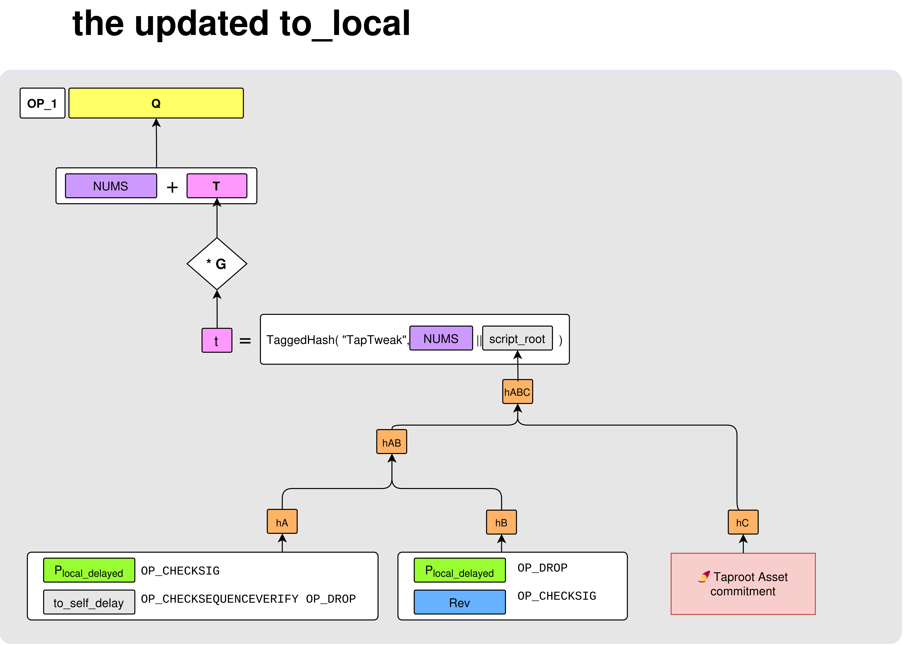
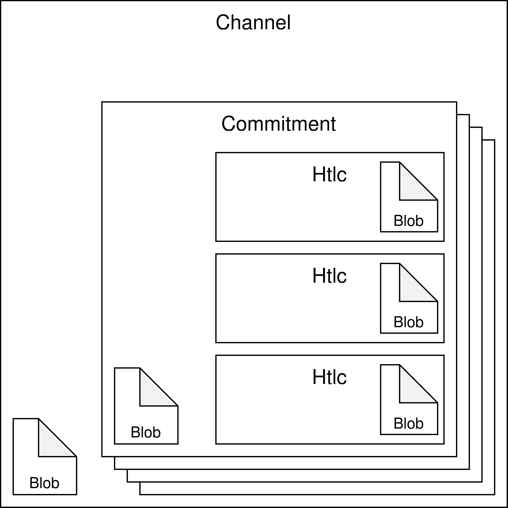
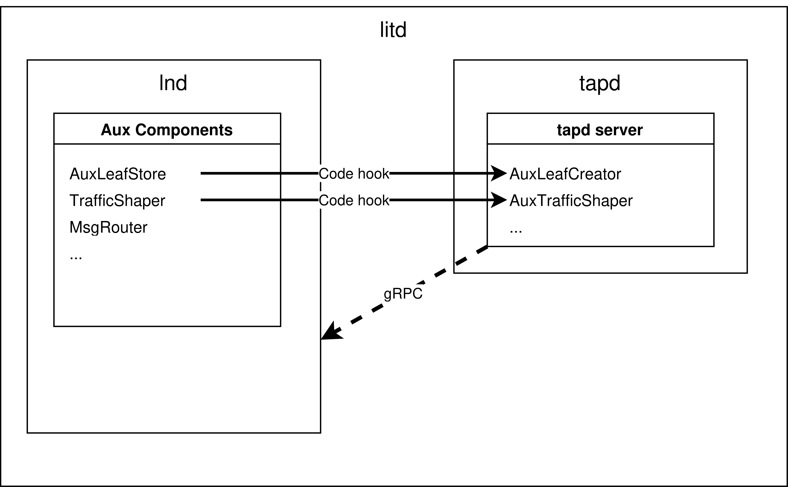
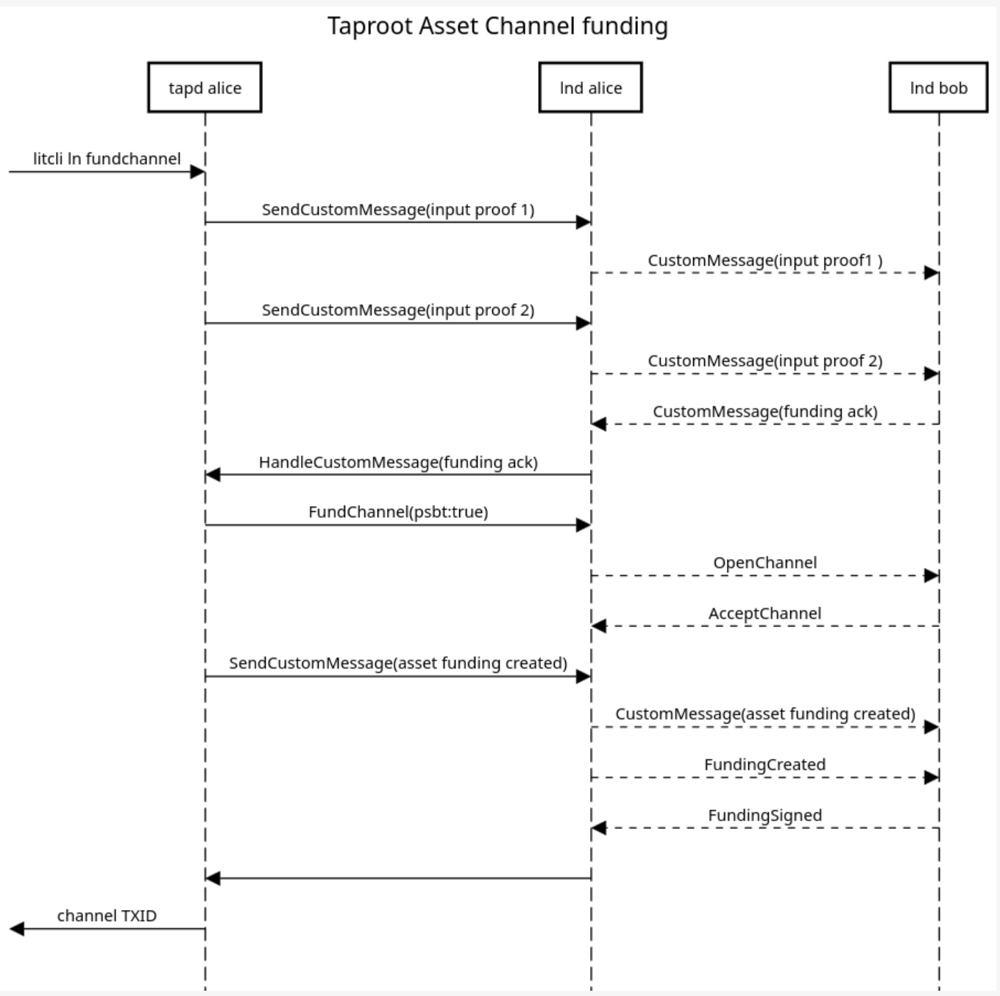
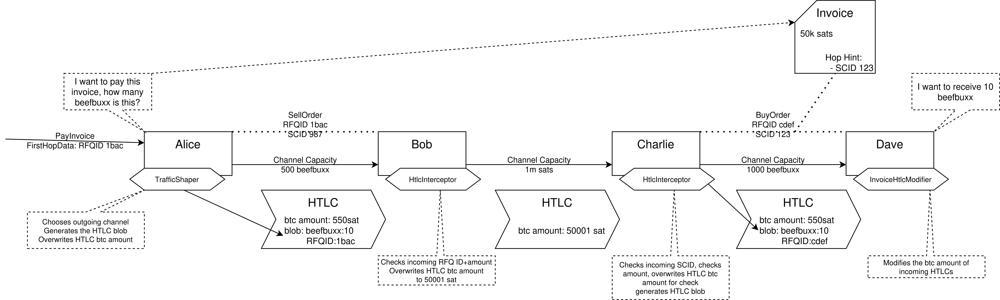

# Taproot Asset Channels

This document provides a technical overview of how Taproot Asset Channels are implemented, leveraging LND's extensibility features to support asset transfers within Lightning Channels without requiring LND to have native knowledge of Taproot Assets.

## How LND Handles Custom Channels

The core principle behind Taproot Asset Channels is LND's ability to manage "custom channels." LND itself does not understand the concept of Taproot Assets. Instead, it provides a set of hooks and delegates the logic for handling custom channel types to an external process. In this case, that external process is `tapd`.

LND manages the BTC layer of the channel (funding, commitments, HTLCs) as it normally would. However, for channels that are designated as "custom," LND will:
1.  Store opaque data blobs associated with the channel, commitments, and HTLCs.
2.  Call out to the external process (`tapd`) at critical stages of the channel lifecycle (funding, state updates, closing, etc.) via a set of gRPC-based hooks.

`tapd` is responsible for managing the asset layer, providing LND with the necessary information to correctly construct and sign transactions that also commit to the state of the assets in the channel.

## On-Chain Footprint

A Taproot Asset Channel modifies the standard Lightning channel structure by adding an additional leaf to the tapscript tree of the funding output.

A standard Taproot channel's funding output is a 2-of-2 multisig key, represented as a Taproot output. The script path for this output might contain scripts for revocation and CSV-delayed spends.

For a Taproot Asset Channel, an additional leaf is added to this tree: the **Taproot Asset Commitment**.



This new leaf (`hC` in the diagram) contains a commitment to the assets held within the channel, effectively anchoring the asset state to the on-chain funding transaction.

## Off-Chain Data: The "Blob" Architecture

To manage the state of assets off-chain, `tapd` provides LND with opaque data blobs that are stored at different levels of the channel structure. LND does not interpret these blobs; it simply stores them and provides them back to `tapd` when invoking the hooks.



There are three main types of blobs:

### 1. `OpenChannel` Blob (Channel Level)

This blob is associated with the channel as a whole and is created during the funding process. It contains the initial state of the assets in the channel.

```go
// OpenChannel is a record that represents the capacity information related to
// a commitment. This entails all the (asset_id, amount, proof) tuples and other
// information that we may need to be able to sign the TAP portion of the
// commitment transaction.
type OpenChannel struct {
	// FundedAssets is a list of asset outputs that was committed to the
	// funding output of a commitment.
	FundedAssets tlv.RecordT[tlv.TlvType0, AssetOutputListRecord]

	// DecimalDisplay is the asset's unit precision.
	DecimalDisplay tlv.RecordT[tlv.TlvType1, uint8]

	// GroupKey is the optional group key used to fund this channel.
	GroupKey tlv.OptionalRecordT[tlv.TlvType2, *btcec.PublicKey]
}
```

### 2. `Commitment` Blob (Commitment Level)

For each commitment transaction in the channel, a `Commitment` blob is stored. This blob represents the state of the assets for that specific commitment.

```go
// Commitment is a record that represents the current state of a commitment.
// This entails all the (asset_id, amount, proof) tuples and other information
// that we may need to be able to sign the TAP portion of the commitment
// transaction.
type Commitment struct {
	// LocalAssets is a list of all asset outputs that represent the current
	// local asset balance of the commitment.
	LocalAssets tlv.RecordT[tlv.TlvType0, AssetOutputListRecord]

	// RemoteAssets is a list of all asset outputs that represents the
	// current remote asset balance of the commitment.
	RemoteAssets tlv.RecordT[tlv.TlvType1, AssetOutputListRecord]

	// OutgoingHtlcAssets is a list of all outgoing in-flight HTLCs and the
	// asset balance change that they represent.
	OutgoingHtlcAssets tlv.RecordT[tlv.TlvType2, HtlcAssetOutput]

	// IncomingHtlcAssets is a list of all incoming in-flight HTLCs and the
	// asset balance change that they represent.
	IncomingHtlcAssets tlv.RecordT[tlv.TlvType3, HtlcAssetOutput]

	// AuxLeaves are the auxiliary leaves that correspond to the commitment.
	AuxLeaves tlv.RecordT[tlv.TlvType4, AuxLeaves]
}
```

### 3. `Htlc` Blob (HTLC Level)

Each HTLC within a commitment can have its own blob. For Taproot Asset Channels, this is used to carry the asset information for that specific HTLC.

```go
// Htlc is a record that represents the capacity change related to an in-flight
// HTLC. This entails all the (asset_id, amount) tuples and other information
// that we may need to be able to update the TAP portion of a commitment
// balance.
type Htlc struct {
	// Amounts is a list of asset balances that are changed by the HTLC.
	Amounts tlv.RecordT[HtlcAmountRecordType, AssetBalanceListRecord]

	// RfqID is the RFQ ID that corresponds to the HTLC.
	RfqID tlv.OptionalRecordT[HtlcRfqIDType, ID]
}
```

## LND Hooks for Custom Logic

`tapd` implements a series of interfaces defined by LND to inject asset-specific logic into the channel management process. These hooks are collectively managed through a set of "Auxiliary" components.

Here is a summary of the key hooks and their functions:

-   **`AuxFundingController`**: Manages the asset-specific parts of the channel funding process. It handles custom messages exchanged between peers to agree on the assets being committed to the channel.
-   **`AuxLeafCreator`**: Responsible for creating the auxiliary tapscript leaves that commit to the asset state. When LND builds a commitment transaction, it calls this hook to get the asset commitment leaf.
-   **`AuxLeafSigner`**: Signs the asset-related parts of the commitment transaction. For HTLCs, this involves signing second-level transactions that are part of the HTLC scripts.
-   **`AuxTrafficShaper`**: Controls how payments are routed. For asset channels, it ensures that an HTLC carrying assets is only forwarded over channels that also contain assets. It also calculates the available asset bandwidth.
-   **`InvoiceHtlcModifier`**: Intercepts incoming HTLCs for an invoice. For asset invoices, it verifies the incoming asset amount and modifies the BTC amount of the HTLC to reflect the agreed-upon exchange rate.
-   **`AuxChanCloser`**: Handles the cooperative closure of a channel, ensuring that the assets are correctly distributed in the closing transaction.
-   **`AuxSweeper` / `AuxContractResolver`**: Manages the process of sweeping on-chain funds from a force-closed channel. This includes handling the outputs from commitment transactions and second-level HTLC transactions to recover assets.

Anything `lnd` needs from an aux component it will get through a call through
the code hooks. Anything `tapd` needs from `lnd`, it gets normally through a
gRPC call:



## Channel Funding Sequence

The funding of a Taproot Asset Channel involves a custom message flow between the two `tapd` instances, orchestrated by LND.



1.  **Initiation**: The process starts with a `fundchannel` command.
2.  **Proof Exchange**: The initiator's `tapd` sends `SendCustomMessage` calls to its LND node, containing proofs of the assets to be funded. LND forwards these as `CustomMessage`s to the peer.
3.  **Funding Ack**: The responder's `tapd` verifies the proofs and sends back a funding acknowledgment, again via custom messages.
4.  **LND Funding Flow**: Once the asset states are agreed upon, the standard LND channel funding flow (`OpenChannel`, `AcceptChannel`, etc.) proceeds. `tapd`'s `AuxFundingController` provides LND with the necessary asset commitment information.
5.  **Asset Funding Created**: After the BTC funding transaction is created, the initiator's `tapd` sends a final custom message with the proofs of the assets in their final state within the channel.
6.  **Finalization**: The channel is finalized with `FundingCreated` and `FundingSigned` messages, and the funding transaction is broadcast.

## Asset Payment Flow

Sending an asset payment across the network also involves the LND hooks. The following diagram illustrates a multi-hop payment from Alice to Dave, through Bob and Charlie.



Here's a step-by-step breakdown:

1.  **Alice (Payer)**:
    *   Alice wants to pay an invoice from Dave. The invoice is for a certain amount of "beefbuxx".
    *   Her `tapd`'s **`TrafficShaper`** is invoked. It determines the outgoing channel, generates the HTLC blob containing the asset information (`beefbuxx: 10`), and overwrites the BTC amount of the HTLC to a minimal on-chain value (e.g., 550 sat).

2.  **Bob (Hop)**:
    *   Bob's LND node receives the HTLC. Since it has custom records, it invokes the hooks.
    *   The **`HtlcInterceptor`** (a general LND concept, implemented by `tapd` for assets) is triggered.
    *   Bob's `tapd` inspects the incoming HTLC blob. In this example, it checks an RFQ ID and amount, and then overwrites the outgoing HTLC's BTC amount to a new value (e.g., 50001 sat) for the next hop. The asset blob is forwarded.

3.  **Charlie (Hop)**:
    *   Charlie's LND node also invokes the **`HtlcInterceptor`**.
    *   His `tapd` checks the incoming short channel ID (SCID) and amount, generates a new HTLC blob for the next hop, and again overwrites the BTC amount.

4.  **Dave (Payee)**:
    *   Dave's LND node receives the final HTLC.
    *   The **`InvoiceHtlcModifier`** hook is called.
    *   Dave's `tapd` inspects the HTLC blob, verifies that it contains the correct asset and amount (`beefbuxx: 10`), and then modifies the BTC amount of the HTLC to match the full value of the invoice (e.g., 50k sats). This allows the invoice to be settled in LND's accounting system.

This flow allows assets to be tunneled through the Lightning Network, with `tapd` instances at each hop managing the asset state transitions, while LND handles the underlying BTC-level HTLC mechanics.
