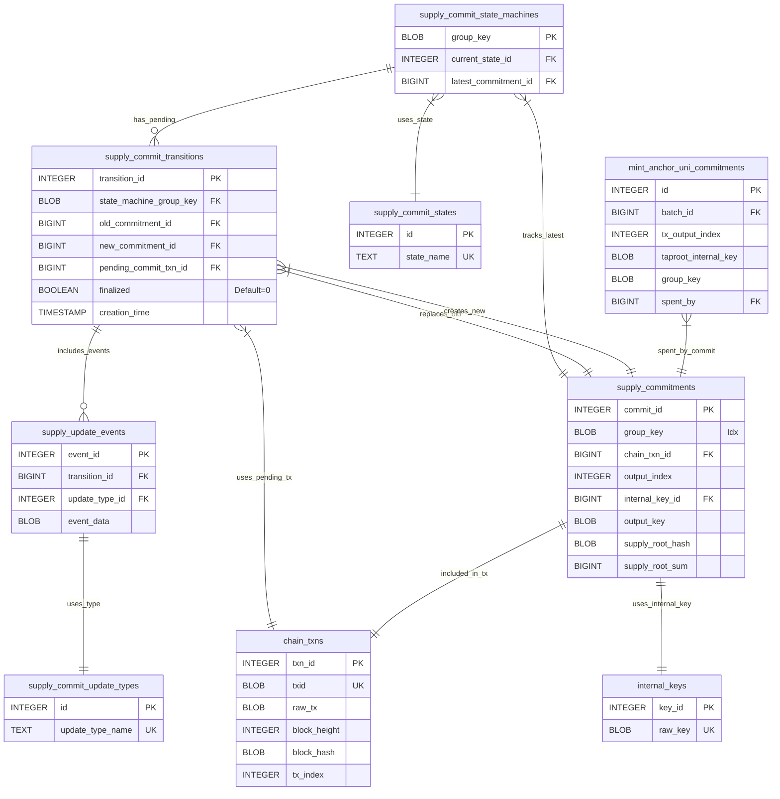

# Taproot Asset Supply Commitment Persistence

This document details the database schema and Go implementation (`tapdb/supply_commit.go`) that provides persistent storage for the Taproot Asset Supply Commitment State Machine (`universe/supplycommit`). This layer ensures the state machine's progress is durable across restarts and provides mechanisms for tracking historical and pending supply commitments.

## Purpose

The primary function of this persistence layer is to reliably store the state and associated data for the `universe/supplycommit` state machine. This state machine manages the process of creating and anchoring cryptographic commitments to the supply changes (mints, burns, ignores) of a specific asset group onto the Bitcoin blockchain.

This involves storing:

1.  The current operational state of the state machine for each asset group.
2.  Details of past, successfully confirmed supply commitments.
3.  Information about pending state transitions, including the specific supply update events being processed.
4.  Details of the Bitcoin transactions used to anchor commitments.

## Schema Overview

Migration `000036_asset_commit.up.sql` introduces several tables to manage the state machine's lifecycle and data.

1.  **`supply_commit_states`**: An enum-like table defining the possible states of the state machine (e.g., `DefaultState`, `UpdatesPendingState`, `CommitTxCreateState`).
    *   `id` (INTEGER PK): Numeric ID for the state.
    *   `state_name` (TEXT UNIQUE): Human-readable name of the state.

2.  **`supply_commit_update_types`**: An enum-like table defining the types of supply updates (e.g., `mint`, `burn`, `ignore`).
    *   `id` (INTEGER PK): Numeric ID for the update type.
    *   `update_type_name` (TEXT UNIQUE): Human-readable name of the update type.

3.  **`supply_commitments`**: Stores the details of a specific, potentially confirmed, supply commitment anchored on-chain.
    *   `commit_id` (INTEGER PK): Unique identifier for this commitment instance.
    *   `group_key` (BLOB): The tweaked group key identifying the asset group.
    *   `chain_txn_id` (BIGINT FK -> `chain_txns.txn_id`): Reference to the Bitcoin transaction containing this commitment.
    *   `output_index` (INTEGER): The output index within the `chain_txn_id` transaction.
    *   `internal_key_id` (BIGINT FK -> `internal_keys.key_id`): The internal key used for the commitment output's Taproot derivation.
    *   `output_key` (BLOB): The final tweaked Taproot output key.
    *   `block_header` (BLOB): Header of the block confirming the commitment (NULL if unconfirmed).
    *   `block_height` (INTEGER): Height of the confirming block (NULL if unconfirmed).
    *   `merkle_proof` (BLOB): Merkle proof of the transaction's inclusion in the block (NULL if unconfirmed).
    *   `supply_root_hash` (BLOB): The MS-SMT root hash of the supply tree at this commitment (NULL until finalized).
    *   `supply_root_sum` (BIGINT): The MS-SMT root sum (total supply value) at this commitment (NULL until finalized).

4.  **`supply_commit_state_machines`**: Tracks the current state for each asset group's state machine instance.
    *   `group_key` (BLOB PK): The tweaked group key, uniquely identifying the state machine instance.
    *   `current_state_id` (INTEGER FK -> `supply_commit_states.id`): The current operational state.
    *   `latest_commitment_id` (BIGINT FK -> `supply_commitments.commit_id`): Reference to the most recently *finalized* and confirmed commitment (NULL if none).

5.  **`supply_commit_transitions`**: Records an active attempt to transition the supply state. Acts like a Write-Ahead Log (WAL) entry for the state machine.
    *   `transition_id` (INTEGER PK): Unique identifier for this transition attempt.
    *   `state_machine_group_key` (BLOB FK -> `supply_commit_state_machines.group_key`): Links back to the state machine instance.
    *   `old_commitment_id` (BIGINT FK -> `supply_commitments.commit_id`): The commitment being replaced (NULL for the first commitment).
    *   `new_commitment_id` (BIGINT FK -> `supply_commitments.commit_id`): The new commitment being created by this transition (NULL initially).
    *   `pending_commit_txn_id` (BIGINT FK -> `chain_txns.txn_id`): The Bitcoin transaction intended to confirm this transition (NULL until created/signed).
    *   `finalized` (BOOLEAN): Indicates if the transition completed successfully and was applied. Defaults to `FALSE`.
    *   `creation_time` (TIMESTAMP): When the transition was initiated.
    *   `UNIQUE INDEX ... WHERE finalized = 0`: Crucially ensures only *one* non-finalized (pending) transition can exist per `state_machine_group_key` at any time.

6.  **`supply_update_events`**: Stores the individual mint, burn, or ignore events associated with a *pending* transition.
    *   `event_id` (INTEGER PK): Unique identifier for the event record.
    *   `transition_id` (BIGINT FK -> `supply_commit_transitions.transition_id` ON DELETE CASCADE): Links to the parent transition. Cascade delete ensures events are cleaned up if a transition is aborted/deleted.
    *   `update_type_id` (INTEGER FK -> `supply_commit_update_types.id`): Type of the update event.
    *   `event_data` (BLOB): Serialized data specific to the event type (e.g., `NewMintEvent`, `NewBurnEvent`).

7.  **`ALTER TABLE mint_anchor_uni_commitments`**: Adds a `spent_by` column (FK -> `supply_commitments.commit_id`) to track which supply commitment transaction spent a given minting pre-commitment output.

### Schema Relationships (Mermaid Diagram)

## State Machine Persistence Logic

The database tables work together to provide durable storage and a recovery mechanism for the supply commitment state machine.

*   **Current State:** The `supply_commit_state_machines` table acts as the primary indicator of the current operational state (`current_state_id`) for a given asset group (`group_key`). It also points to the `latest_commitment_id` that has been successfully processed and confirmed.

*   **Pending Transitions (WAL):** The `supply_commit_transitions` table is key to the persistence strategy. Due to the unique index `supply_commit_transitions_single_pending_idx` (on `state_machine_group_key` WHERE `finalized = 0`), only one *active* transition can exist per asset group. This record acts like a Write-Ahead Log (WAL) entry:
    *   It captures the *intent* to move from `old_commitment_id` to `new_commitment_id`.
    *   It aggregates all necessary information for the transition *before* it's fully finalized.
    *   The `supply_update_events` associated with this transition (linked via `transition_id`) store the specific data (mints, burns, ignores) driving the change.
    *   References to the `new_commitment_id` (in `supply_commitments`) and `pending_commit_txn_id` (in `chain_txns`) are added as the state machine progresses through transaction creation and signing.

*   **Commitment Data:** The `supply_commitments` table stores the immutable details of *each* commitment attempt once it reaches the stage of having a potential on-chain transaction. Initially, confirmation details (`block_height`, `merkle_proof`, etc.) and the final SMT root (`supply_root_hash`, `supply_root_sum`) are NULL.

*   **Lifecycle & Recovery:**
    1.  **Initiation (`InsertPendingUpdate`):** When the first `SupplyUpdateEvent` arrives for an idle state machine, a new row is inserted into `supply_commit_transitions` (`finalized=0`), and the event is stored in `supply_update_events`. The state machine's state in `supply_commit_state_machines` is set to `UpdatesPendingState`. Subsequent events for this group add more rows to `supply_update_events` linked to the *same* pending transition.
    2.  **Transaction Creation/Signing (`InsertSignedCommitTx`):** When the state machine creates and signs the commitment transaction, a new row is added to `chain_txns`, a new row is added to `supply_commitments` (with NULL confirmation/root details), and the *pending* `supply_commit_transitions` row is updated with `new_commitment_id` and `pending_commit_txn_id`. The state machine's state moves to `CommitBroadcastState`.
    3.  **Confirmation & Finalization (`ApplyStateTransition`):** Once the transaction (`pending_commit_txn_id`) confirms:
        *   The corresponding `supply_commitments` row (`new_commitment_id`) is updated with block details, merkle proof, and the final calculated `supply_root_hash` and `supply_root_sum` (derived by applying the `supply_update_events` to the SMTs via `applySupplyUpdatesInternal`).
        *   The corresponding `chain_txns` row is updated with block hash/height/index.
        *   The `supply_commit_transitions` row is marked `finalized = 1`.
        *   The `supply_commit_state_machines` row is updated: `current_state_id` becomes `DefaultState`, and `latest_commitment_id` is set to the `new_commitment_id` of the just-finalized transition.
    4.  **Restart:** Upon restart, the system queries `supply_commit_state_machines` for the current state. If it's not `DefaultState`, it queries `supply_commit_transitions` for the single pending (`finalized=0`) transition and reconstructs the `SupplyStateTransition` object (including fetching associated `supply_update_events` and commitment details) to resume operation from the correct point (e.g., re-broadcasting, waiting for confirmation, or finalizing).

## Implementation (`tapdb/SupplyCommitMachine`)

The `tapdb.SupplyCommitMachine` struct implements the `supplycommit.CommitmentTracker` and `supplycommit.StateMachineStore` interfaces, bridging the gap between the abstract state machine logic and the SQL database.

*   **Core:** It embeds a `BatchedSupplyCommitStore`, which provides access to the necessary SQLc queries and transaction management (`ExecTx`).
*   **Interface Mapping:**
    *   `UnspentPrecommits`: Queries `mint_anchor_uni_commitments` filtering by `group_key` and `spent_by IS NULL`.
    *   `SupplyCommit`: Queries `supply_commit_state_machines` to get `latest_commitment_id` for the group, then queries `supply_commitments` using that ID.
    *   `InsertPendingUpdate`: Manages the logic described in "Lifecycle & Recovery - Initiation", using `UpsertSupplyCommitStateMachine`, `QueryExistingPendingTransition`, `InsertSupplyCommitTransition`, `InsertSupplyUpdateEvent`.
    *   `InsertSignedCommitTx`: Implements the logic from "Lifecycle & Recovery - Transaction Creation/Signing", using `QueryPendingSupplyCommitTransition`, `UpsertChainTx`, `UpsertInternalKey`, `InsertSupplyCommitment`, `UpdateSupplyCommitTransitionCommitment`, `UpsertSupplyCommitStateMachine`.
    *   `CommitState`: Updates `current_state_id` in `supply_commit_state_machines` via `UpsertSupplyCommitStateMachine`.
    *   `FetchState`: Reconstructs the current state and the pending `SupplyStateTransition` (if any) by querying `supply_commit_state_machines`, `supply_commit_transitions`, `supply_update_events`, `supply_commitments`, `chain_txns`, and `internal_keys`. It handles deserializing event data and reconstructing commitment objects.
    *   `ApplyStateTransition`: Executes the finalization logic ("Lifecycle & Recovery - Confirmation & Finalization"). It calls `applySupplyUpdatesInternal` (from `supply_tree.go`) to persist SMT changes, then uses `UpdateSupplyCommitmentRoot`, `UpdateSupplyCommitmentChainDetails`, `UpsertChainTx`, `FinalizeSupplyCommitTransition`, and `UpsertSupplyCommitStateMachine` to update the database records accordingly.

## Atomicity and Recovery

All multi-step database modifications within `SupplyCommitMachine` methods are wrapped in database transactions using `db.ExecTx`. This ensures that operations like inserting a transition and its first event, or updating commitment details and finalizing the transition, are atomic.

The persistence of the current state in `supply_commit_state_machines` and the detailed logging of the single pending transition in `supply_commit_transitions` (acting as a WAL) allow the state machine to reliably recover and resume its operation after restarts, preventing duplicate commitments or loss of pending updates.
