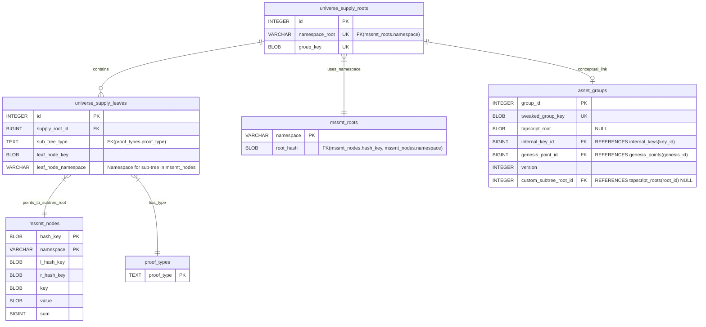

# Taproot Asset Supply Tree Persistence

This document describes the database schema and Go implementation (`tapdb/supply_tree.go`) responsible for persistently storing and managing Taproot Asset Supply Trees within the Universe.

## Purpose

The primary goal of the supply tree system is to create a verifiable, on-chain commitment to the total supply changes (mints, burns, ignores) for a specific asset group. While individual asset states are tracked elsewhere, the supply tree provides a consolidated, aggregatable view anchored to the Bitcoin blockchain. This allows anyone to verify the net issuance changes for an asset group over time by inspecting the sequence of on-chain supply root commitments.

## Schema Overview

The persistence layer utilizes two main tables, introduced in migration `000035_supply_tree.up.sql`, in conjunction with the existing `mssmt_roots` and `mssmt_nodes` tables which store the actual Merkle Sum Sparse Tree (MS-SMT) data.

1.  **`universe_supply_roots`**:
    *   Stores the root entry point for the supply tree of a specific asset group.
    *   `id`: Primary key.
    *   `namespace_root` (UNIQUE, FK -> `mssmt_roots.namespace`): The unique namespace identifier used in `mssmt_nodes` and `mssmt_roots` for this specific root supply tree. The format is `supply-root-<group_key_hex>`.
    *   `group_key` (UNIQUE, BLOB): The compressed public key identifying the asset group this supply tree belongs to.

2.  **`universe_supply_leaves`**:
    *   Represents the leaves within a specific root supply tree. Each leaf points to the root of a *sub-tree* (Mint, Burn, or Ignore).
    *   `id`: Primary key.
    *   `supply_root_id` (FK -> `universe_supply_roots.id`): References the parent root supply tree.
    *   `sub_tree_type` (TEXT, FK -> `proof_types.proof_type`): The type of sub-tree this leaf represents ('mint_supply', 'burn', 'ignore').
    *   `leaf_node_key` (BLOB): The specific key used for this leaf within the *root* supply tree's MS-SMT. This key is derived deterministically from the `sub_tree_type`.
    *   `leaf_node_namespace` (VARCHAR): The namespace identifier for the *sub-tree* itself within `mssmt_nodes`. The format is `supply-sub-<type>-<group_key_hex>`.
    *   `UNIQUE(supply_root_id, sub_tree_type)`: Ensures a root tree has only one leaf per sub-tree type.

### Schema Relationships (Mermaid Diagram)

*Note: The link between `universe_supply_leaves` and `mssmt_nodes` is indirect. The `leaf_node_namespace` identifies the sub-tree, and the actual sub-tree root node's hash and sum are stored as the `value` and `sum` of the leaf node identified by `leaf_node_key` within the *root* tree's namespace (`universe_supply_roots.namespace_root`).*

## Tree Structure

The system employs a two-tiered tree structure for each asset group: a single **Root Supply Tree** whose leaves point to three distinct **Sub-Trees** (Mint, Burn, Ignore).

### Root Supply Tree

*   **Purpose:** Aggregates the state of all supply changes (mints, burns, ignores) for a single asset group into one verifiable root hash and sum. This root is what gets committed on-chain.
*   **Identifier:** `universe_supply_roots.namespace_root` (`supply-root-<group_key_hex>`).
*   **Storage:** Managed by `universe_supply_roots` and stored within `mssmt_nodes` under the root namespace.
*   **Leaves:**
    *   There are exactly three potential leaves in the root tree, one for each sub-tree type.
    *   **Key:** Determined by the sub-tree type using `supplycommit.SupplySubTree.UniverseKey()`. This provides a stable key for each sub-tree type (e.g., `sha256("mint_supply")`, `sha256("burn")`, `sha256("ignore")`).
    *   **Value:** The `NodeHash()` of the root node of the corresponding sub-tree.
    *   **Sum:** The `NodeSum()` (total aggregated amount/value) of the root node of the corresponding sub-tree.
*   **Linkage:** The `universe_supply_leaves` table links the `supply_root_id`, the `sub_tree_type`, the `leaf_node_key` used in the root tree, and the `leaf_node_namespace` where the sub-tree resides.

### Sub-Trees

Each asset group has three independent sub-trees, each tracking a specific type of supply event. They are stored as separate MS-SMTs within `mssmt_nodes` using distinct namespaces.

*   **Identifier:** `universe_supply_leaves.leaf_node_namespace` (`supply-sub-<type>-<group_key_hex>`).
*   **Storage:** Stored within `mssmt_nodes` under their respective namespaces. The roots of these trees are referenced by the leaves of the main Root Supply Tree.

1.  **Mint Sub-Tree (`supplycommit.MintTreeType`)**
    *   **Namespace:** `supply-sub-mint_supply-<group_key_hex>`
    *   **Purpose:** Tracks all successful asset minting events for the group.
    *   **Leaves:**
        *   **Key:** `universe.LeafKey` derived from the minting outpoint and the asset's script key.
        *   **Value:** The serialized issuance `proof.Proof`.
        *   **Sum:** The amount of the asset minted in that event.
    *   **Root:** The root hash represents the commitment to all minting proofs, and the root sum represents the total amount minted for the group.

2.  **Burn Sub-Tree (`supplycommit.BurnTreeType`)**
    *   **Namespace:** `supply-sub-burn-<group_key_hex>`
    *   **Purpose:** Tracks all confirmed asset burn events for the group.
    *   **Leaves:**
        *   **Key:** `universe.LeafKey` derived from the burn outpoint and the asset's script key.
        *   **Value:** The serialized burn `proof.Proof`.
        *   **Sum:** The amount of the asset burned in that event.
    *   **Root:** The root hash represents the commitment to all burn proofs, and the root sum represents the total amount burned for the group.

3.  **Ignore Sub-Tree (`supplycommit.IgnoreTreeType`)**
    *   **Namespace:** `supply-sub-ignore-<group_key_hex>`
    *   **Purpose:** Tracks outputs associated with the asset group that are provably unspendable or should otherwise be ignored for supply calculation (e.g., due to script conditions, explicit ignore proofs).
    *   **Leaves:**
        *   **Key:** The hash of the `universe.IgnoreTuple` value (`IgnoreTuple.Val.Hash()`).
        *   **Value:** The serialized `universe.SignedIgnoreTuple`.
        *   **Sum:** The amount associated with the ignored output.
    *   **Root:** The root hash represents the commitment to all ignored tuples, and the root sum represents the total amount ignored for the group.

## Implementation (`tapdb/supply_tree.go`)

The `tapdb.SupplyTreeStore` provides the Go interface for interacting with the persisted supply trees.

*   **Core Logic:** The `upsertSupplyTreeLeaf` function is central. When a sub-tree (e.g., Mint) is updated, its new root node (hash and sum) is computed. `upsertSupplyTreeLeaf` then takes this new sub-tree root and inserts/updates the corresponding leaf in the *main* Root Supply Tree. It handles creating/updating entries in `universe_supply_roots` and `universe_supply_leaves` as needed.
*   **Atomicity:** All updates are performed within database transactions managed by the `BatchedUniverseTree` interface (`ExecTx`), ensuring that updates to sub-trees and the corresponding root tree leaf are atomic.
*   **Batching:** `applySupplyUpdatesInternal` processes a batch of `supplycommit.SupplyUpdateEvent`s. It groups them by type, updates the relevant sub-trees (calling helpers like `registerMintSupplyInternal`, `insertBurnsInternal`, `addTuplesInternal`), and then calls `upsertSupplyTreeLeaf` for each modified sub-tree to update the main Root Supply Tree.
*   **Initialization:** `initEmptySupplyTrees` sets up the initial database state for a new asset group, creating the root tree entry and the three leaf entries pointing to canonical empty sub-tree roots.
*   **Fetching:** Functions like `FetchSubTree`, `FetchSubTrees`, and `FetchRootSupplyTree` allow retrieving copies of the persisted trees for inspection or use elsewhere. They read the data from the database and reconstruct the MS-SMT in memory.
*   **Namespacing:** The `rootSupplyNamespace` and `subTreeNamespace` functions generate the unique string identifiers used to partition the different trees within the shared `mssmt_nodes` table.

## Conclusion

The supply tree persistence layer provides a robust and verifiable mechanism for tracking and committing to the supply dynamics of Taproot Asset groups. By leveraging MS-SMTs and a two-tiered structure recorded in dedicated SQL tables, it allows for efficient updates and provides the foundation for on-chain supply commitments managed by the `universe/supplycommit` state machine.
