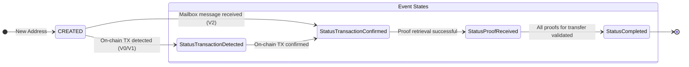
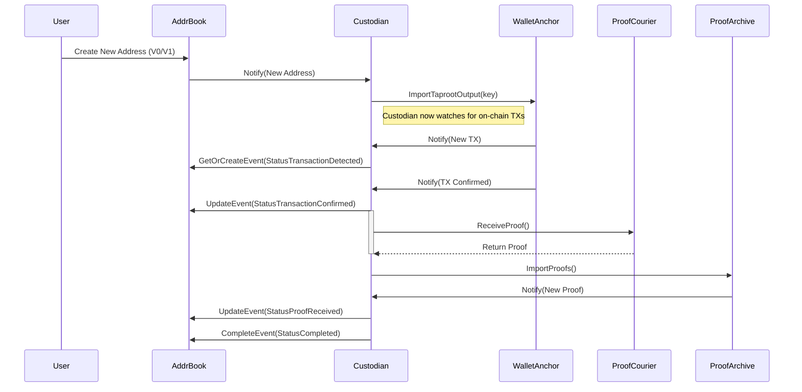
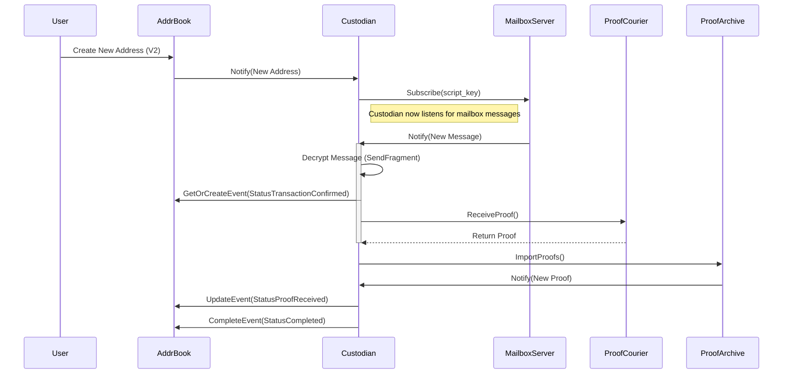

# Asset Custodian

The `Custodian` is a core component within the `tapgarden` package responsible
for managing the lifecycle of incoming Taproot Assets. It operates as an
event-driven system that listens for various triggers, tracks the state of each
incoming asset transfer, and ensures that assets are securely and verifiably
received into the wallet.

## Core Responsibilities

- **Address Management**: Imports new addresses into the underlying `lnd`
  wallet for on-chain detection (for V0/V1 addresses) or subscribes to an
  authentication mailbox for message-based notifications from the sender (for
  V2+ addresses).
- **On-Chain Event Monitoring**: Watches for new transactions that match managed
  Taproot output keys.
- **Proof Retrieval**: Coordinates with `ProofCourier` services to fetch asset
  provenance proofs from senders.
- **Proof Validation & Storage**: Verifies the integrity and validity of
  incoming proofs and stores them in the `ProofArchive`.
- **State Management**: Tracks the status of each inbound asset transfer through
  a series of states, from detection to final completion.

## Event Triggers and State Flow

The Custodian's logic is driven by four primary event triggers. Each trigger
initiates a series of actions that advance an asset transfer through its
lifecycle.

### Asset State Transitions

The lifecycle of an incoming asset transfer is tracked by the `address.Status`
field of an `address.Event`. The diagram below illustrates the possible state
transitions.

---

### Trigger 1: New Address Creation

When a new Taproot Asset address is created and added to the `AddrBook`, the
Custodian is notified. Its behavior depends on the address version.

- **V0/V1 Addresses**: The Custodian takes the `TaprootOutputKey` from the
  address and imports it into the `lnd` wallet. This allows the wallet to scan
  the blockchain for transactions paying to this specific key.
- **V2+ Addresses**: The Custodian subscribes to a `ProofCourier` of type
  `AuthMailbox` using the address's unique script key. It does not import any
  keys into the on-chain wallet, as V2 transfers are communicated as separate
  messages sent through the authenticated mailbox system.

### Trigger 2: New Wallet Transaction (V0/V1 Addresses)

When the `WalletAnchor` detects a new transaction, the Custodian inspects it.

1. It checks if the transaction has a Taproot output that belongs to the
   internal wallet.
2. If a match is found, it queries the `AddrBook` to see if this output key
   corresponds to a known Taproot Asset address.
3. If it's a match, a new `address.Event` is created with the status
   `StatusTransactionDetected`.
4. When the transaction receives its first confirmation, the event's status is
   updated to `StatusTransactionConfirmed`. This triggers the proof retrieval
   process.

### Trigger 3: New Mailbox Message (V2+ Addresses)

For V2 addresses, the process is initiated by an incoming authenticated mailbox
message.

1. The Custodian receives an encrypted message from the `AuthMailbox` server
   it's subscribed to.
2. It decrypts the message using the address's script key to reveal a
   `SendFragment`. This fragment contains the outpoint of the on-chain anchor
   transaction.
3. Using the information from the fragment, the Custodian creates a new
   `address.Event` directly with the status `StatusTransactionConfirmed`, as the
   fragment is only sent after the transaction is confirmed.
4. This immediately triggers the proof retrieval process.

### Trigger 4: New Proof Received

This trigger is the final step in the process, common to all address versions.

1. After a transaction is confirmed (either on-chain or via mailbox), the
   `receiveProofs` function is called. It uses the `ProofCourier` specified in
   the address to fetch the asset proof.
2. The fetched proof is sent to the `ProofArchive` for validation and storage.
3. Importing a proof into the `ProofArchive` will make sure it is imported into
   both the file-based local proof archive and the database-backed proof store.
   Both those stores will trigger a notification (via the `ProofNotifier`) for
   received proofs, so the below might be invoked multiple times
4. The Custodian finds the corresponding `address.Event` and updates its status
   to `StatusProofReceived`.
5. It then calls `setReceiveCompleted`, which verifies that all required proofs
   for the transfer have been received.
6. Finally, the event status is set to `StatusCompleted`, marking the end of the
   asset custody process. The asset is now considered fully received and
   settled.
