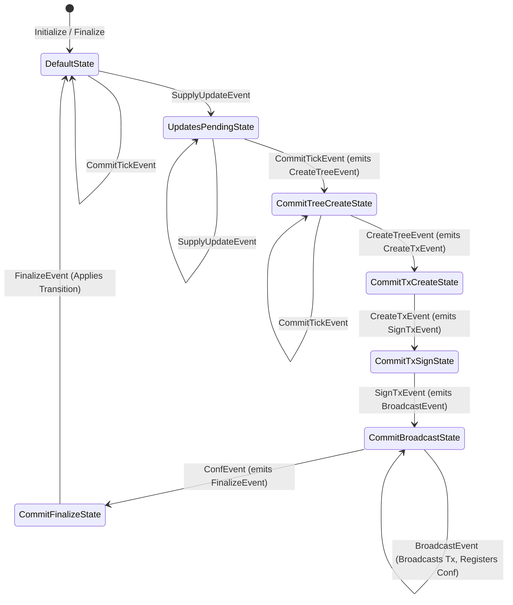

# Universe Supply Commitment State Machine

This package implements a state machine responsible for managing the on-chain
commitment to the supply of a specific Taproot Asset (identified by its
`asset.Specifier`, namely the group key).

## Rationale and Purpose

Taproot Assets allow for issuance and transfer off-chain, but maintaining a
verifiable, global view of the *total supply* requires an on-chain commitment
mechanism. This state machine addresses that need.

Its primary purpose is to:

1.  **Track Supply Changes:** Receive events representing new asset mints
    (`NewMintEvent`), asset burns (`NewBurnEvent`), and ignored outputs
    (`NewIgnoreEvent`).

2.  **Batch Updates:** Collect these supply-altering events over time.

3.  **Commit Periodically:** On a regular trigger (`CommitTickEvent`), create a
    new cryptographic commitment (an MS-SMT root) representing the current state
    of the asset's supply. This involves separate sub-trees for mints, burns, and
    ignores, which are then committed into a single root supply tree.

4.  **Anchor On-Chain:** Construct, fund, sign, and broadcast a Bitcoin
    transaction that anchors this new supply root commitment into the
    blockchain. This transaction spends the previous commitment output (if one
    exists) and any relevant pre-commitment outputs (from minting transactions).

5.  **Finalize State:** Wait for the commitment transaction to confirm on-chain
    and then finalize the state update, making the new commitment the canonical
    one for the asset.

This ensures that there is a publicly verifiable, tamper-proof record reflecting
the known supply changes for an asset within the Universe.

## Scope

The state machine handles the lifecycle of a single supply commitment update
cycle for a *specific asset specifier*. It manages:

*   Receiving and staging supply update events.
*   Calculating the new supply root based on staged updates and previous state.
*   Interacting with the `Wallet` interface to:
    *   Derive keys for commitment outputs.
    *   Fund the commitment transaction.
    *   Sign the commitment transaction.
*   Interacting with the `ChainBridge` to broadcast the transaction and monitor
    for confirmation.

*   Persisting its state and pending updates via the `StateMachineStore` to
    ensure resilience across restarts.

It does *not* handle:

*   Discovering supply update events (this is done by other parts of the system
    feeding events into the state machine).

*   Serving supply proofs to external requesters (this is handled by the broader
    Universe server components).

*   Managing commitments for multiple different assets simultaneously (each
    asset group typically gets its own state machine instance).

## State Machine Overview

The state machine transitions through several states to process supply updates
and create a new on-chain commitment. It starts in an idle `DefaultState`. When
new supply updates arrive, it moves to `UpdatesPendingState`. A periodic
`CommitTickEvent` triggers the commitment process, moving through states for
tree creation (`CommitTreeCreateState`), transaction creation
(`CommitTxCreateState`), signing (`CommitTxSignState`), broadcasting
(`CommitBroadcastState`), and finally finalization (`CommitFinalizeState`) upon
confirmation, before returning to the `DefaultState`.

### States and Transitions

*   **DefaultState:** The idle state. Awaiting new supply updates.

*   **UpdatesPendingState:** One or more supply updates have been received and
    are staged, waiting for the next commit trigger.

*   **CommitTreeCreateState:** Triggered by `CommitTickEvent`. Fetches existing
    sub-trees, applies pending updates, calculates the new sub-tree roots, and
    calculates the new root supply tree.

*   **CommitTxCreateState:** Triggered by `CreateTreeEvent`. Fetches the
    previous commitment (if any) and unspent pre-commitments. Constructs the new
    commitment transaction (PSBT) spending these inputs and creating the new
    commitment output. Funds the PSBT using the wallet.

*   **CommitTxSignState:** Triggered by `CreateTxEvent`. Signs the funded
    commitment PSBT using the wallet. Persists the signed transaction details and
    state before broadcasting.

*   **CommitBroadcastState:** Triggered by `SignTxEvent`. Broadcasts the signed
    transaction and registers for its confirmation. Waits for the `ConfEvent`.

*   **CommitFinalizeState:** Triggered by `ConfEvent`. The commitment
    transaction is confirmed. Finalizes the state transition by updating the
    canonical supply trees and commitment details in persistent storage.
    Transitions back to `DefaultState`.

## Environment and Persistence

The state machine operates within an `Environment` that provides necessary
dependencies like the `Wallet`, `ChainBridge`, `CommitmentTracker`,
`SupplyTreeView`, and `StateMachineStore`. The `StateMachineStore` is crucial
for persisting the current state and any pending updates or intermediate
transaction data, allowing the machine to resume correctly after restarts.
