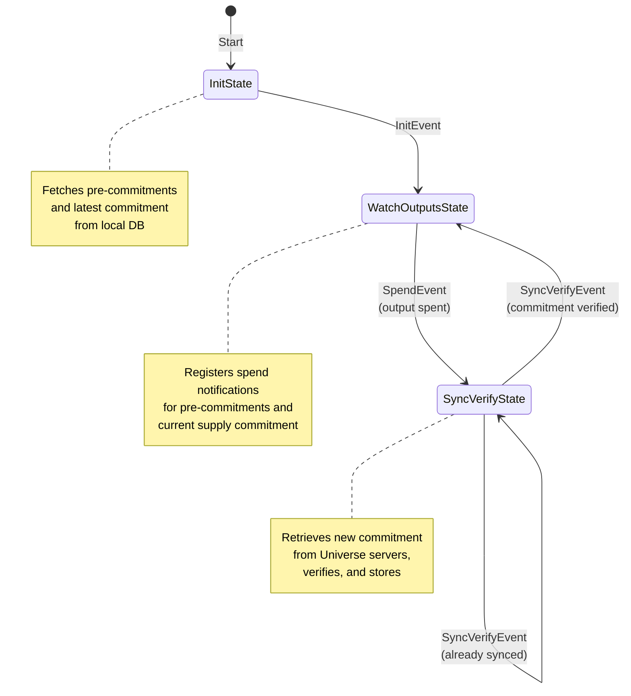

# Universe Supply Verifier State Machine

This package implements a state machine responsible for verifying and tracking
on-chain supply commitments for Taproot Assets created by other nodes in the
network. It acts as the counterpart to the supply commitment state machine,
ensuring the integrity and consistency of supply data across the distributed
Universe network.

## Rationale and Purpose

While the supply commitment state machine creates and publishes supply commitments
for assets where a node owns the delegation key, the supply verifier ensures that
commitments created by other nodes are properly validated and tracked. This
creates a trustless, verifiable system for tracking asset supply across the
entire network.

The verifier's primary objectives are:

1. **Monitor Pre-commitments and Supply Commitments:** Track unspent outputs that
   represent either initial pre-commitment outputs from asset issuance or existing
   supply commitment outputs, watching for when they are spent.

2. **Detect Supply Updates:** When a watched output is spent, recognize this as a
   signal that a new supply commitment has been created and needs to be retrieved.

3. **Retrieve and Verify:** Pull the new supply commitment from Universe servers,
   including all associated supply leaves (mints, burns, ignores) and cryptographic
   proofs.

4. **Validate Chain Integrity:** Ensure each new commitment properly spends the
   previous commitment (or pre-commitments for initial commitments), maintaining
   an unbroken chain of commitments anchored to the blockchain.

5. **Persist Verified State:** Store verified commitments and their associated
   supply trees locally, enabling future verification of incremental updates and
   serving as a foundation for the next verification cycle.

## Scope

The verifier manages the complete lifecycle of supply commitment verification for
assets where the local node does not control the delegation key. Each asset group
has its own dedicated state machine instance that handles:

* Monitoring blockchain outputs for spend notifications
* Coordinating with Universe servers to retrieve new commitments
* Verifying the cryptographic integrity of supply commitments and leaves
* Validating the chain of commitments back to asset issuance
* Managing the transition between monitoring and syncing states
* Persisting verified commitment data and supply trees

The verifier does *not* handle:

* Creating new supply commitments (handled by the supply commitment state machine)
* Managing assets where the local node owns the delegation key
* Direct interaction with asset issuance or transfer operations
* Serving supply proofs to external clients (handled by Universe server components)

## Architecture Overview

The supply verifier consists of several cooperating components:

### Core Components

**Verifier (`verifier.go`):** The core verification engine that validates supply
commitments against cryptographic proofs, ensures proper spending of previous
commitments, and verifies individual supply leaves (mints, burns, ignores).

**State Machine (`states.go`, `transitions.go`):** Implements the verification
lifecycle through a series of well-defined states, managing the flow from output
monitoring through commitment retrieval to verification and persistence.

**Manager (`manager.go`):** Orchestrates multiple state machine instances, one per
asset group, handling initialization, lifecycle management, and coordination with
Universe sync events.

**Syncer (`syncer.go`):** Manages communication with remote Universe servers to
retrieve supply commitments, handling parallel fetches and error recovery across
multiple servers.

### Supporting Components

**Environment (`env.go`):** Encapsulates all dependencies required by the state
machine, including chain access, supply commitment storage, tree management, and
Universe server communication.

**Events (`events.go`):** Defines the event types that drive state transitions,
including initialization, output spend notifications, and sync triggers.

## State Machine Overview

The verifier state machine manages the verification lifecycle through three primary
states, transitioning based on blockchain events and sync operations. Unlike the
commitment state machine which operates on a timer, the verifier is entirely
event-driven, responding to on-chain activity.

### States and Transitions

### State Descriptions

**InitState:** The entry point for each state machine instance. Queries the local
database for any unspent pre-commitment outputs (from asset issuance transactions)
and the latest verified supply commitment for the asset group. This state ensures
the verifier has the necessary starting context before beginning active monitoring.
If neither pre-commitments nor an existing commitment are found, the state machine
cannot proceed, as there would be nothing to watch.

**WatchOutputsState:** The primary monitoring state where the verifier spends most
of its time. Registers with the chain notification system to watch for spends of
specific outputs: all known pre-commitment outputs and the current supply commitment
output (if one exists). When any watched output is spent, this indicates a new
supply commitment transaction has been broadcast. The state machine captures the
spend details, including the spending transaction and block height, then transitions
to retrieve and verify the new commitment.

**SyncVerifyState:** The active verification state triggered by output spend
detection. First checks if the commitment has already been processed (avoiding
duplicate work), then retrieves the commitment from configured Universe servers.
The retrieval includes the full commitment transaction, all supply leaves (mints,
burns, ignores), and the cryptographic proofs linking them. Once retrieved, the
verifier validates the entire structure: checking that previous outputs were properly
spent, verifying leaf signatures and proofs, and ensuring the merkle tree roots
match. Successfully verified commitments are stored in the database along with their
supply trees, becoming the new "latest commitment" for future monitoring cycles.

### Timing and Synchronization

The verifier implements intelligent timing to handle the inherent race condition
between commitment creation and Universe server availability. When a spend is
detected, the verifier waits a configurable delay (default 5 seconds) before
attempting to sync, giving the commitment creator time to publish to Universe
servers. This delay is optimized based on how long the output was watched,
reducing unnecessary waiting when possible.

## Database Persistence

The verifier relies on several database interfaces for persistence and state
management:

### SupplyCommitView

Provides access to supply commitments and pre-commitments:
- `FetchLatestCommitment`: Retrieves the most recent verified commitment
- `FetchCommitmentByOutpoint`: Checks for existing commitments at specific outpoints
- `FetchCommitmentBySpentOutpoint`: Finds commitments that spend specific outputs
- `UnspentPrecommits`: Lists all unspent pre-commitment outputs for monitoring
- `InsertSupplyCommit`: Stores newly verified commitments

### SupplyTreeView

Manages the merkle tree structures that represent supply state:
- `FetchSupplyTrees`: Retrieves the current root tree and subtrees
- Tree updates are performed during commitment verification to maintain consistency

### Persistence Strategy

The verifier maintains minimal persistent state, as most information can be
reconstructed from the blockchain and stored commitments. The key persisted
elements are:

1. **Verified Commitments:** Each successfully verified commitment is stored with
   its transaction details, merkle root, and relationship to previous commitments.

2. **Supply Trees:** The merkle tree structures representing the supply state at
   each commitment point, enabling efficient incremental verification.

3. **Pre-commitment Tracking:** Records of which pre-commitment outputs have been
   spent, preventing double-spending in the commitment chain.

Unlike the commitment creator, the verifier does not need to persist state machine
state itself, as it can always reconstruct its position from the latest verified
commitment.

## Integration and Dependencies

The supply verifier integrates with several system components:

### Chain Bridge

Provides blockchain access for:
- Header verification for proof-of-work validation
- Transaction confirmation monitoring
- Block height tracking for spend notifications

### Universe Federation

Coordinates with Universe servers to:
- Retrieve supply commitments from multiple sources
- Handle server failures gracefully with parallel fetching
- Maintain consistency across the distributed network

### Asset Management

Interfaces with asset tracking systems to:
- Determine which assets require verification (those without local delegation keys)
- Access asset metadata including delegation keys for signature verification
- Validate asset group membership for supply leaves

### Event System

Responds to system events including:
- Asset issuance notifications to begin tracking new assets
- Universe sync events that may indicate new commitments
- Chain notifications for output spend detection

## Error Handling and Recovery

The verifier implements robust error handling to ensure verification integrity:

**Verification Failures:** If a commitment fails verification, it is rejected and
not stored. The verifier continues watching the previously verified commitment,
ensuring only valid commitments enter the local database.

**Network Failures:** When Universe servers are unreachable, the verifier retries
with exponential backoff. Multiple servers are queried in parallel, requiring only
one successful response to proceed.

**State Recovery:** After system restarts, each state machine reconstructs its
state from the latest verified commitment in the database, automatically resuming
monitoring without loss of data.

**Chain Reorganizations:** The verifier handles blockchain reorganizations by
re-verifying commitments when their confirming blocks are reorganized away,
maintaining consistency with the canonical chain.

## Security Considerations

The supply verifier enforces several security properties:

1. **Cryptographic Verification:** All supply leaves must have valid signatures
   from the delegation key holder, preventing unauthorized supply manipulation.

2. **Chain Integrity:** Each commitment must properly spend previous commitments
   or pre-commitments, creating an immutable audit trail.

3. **Proof Validation:** All merkle proofs are verified against their claimed roots,
   ensuring data integrity.

4. **Byzantine Fault Tolerance:** By querying multiple Universe servers and requiring
   only one valid response, the system tolerates malicious or faulty servers.

5. **No Trust Required:** The verifier independently validates all data against
   on-chain anchors, requiring no trust in Universe servers or other nodes.